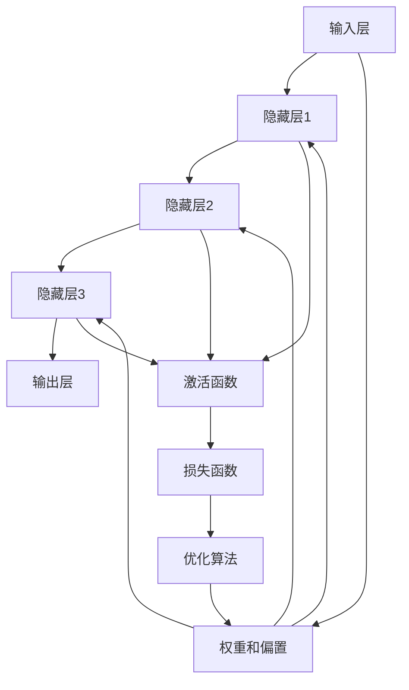

                 

# 深度学习在天气预报精确化中的应用

> 关键词：深度学习、天气预报、精确化、卷积神经网络、循环神经网络、长短期记忆网络、气象数据、预测模型

> 摘要：本文将深入探讨深度学习技术在天气预报中的应用，通过分析深度学习的核心概念、算法原理、数学模型、实战案例以及实际应用场景，揭示深度学习如何提高天气预报的精确度。我们将详细介绍如何利用深度学习模型进行天气数据的处理和预测，并探讨未来的发展趋势与挑战。

## 1. 背景介绍

天气预报是现代社会中不可或缺的一部分，它不仅影响着人们的日常生活，还对农业、交通、能源等多个行业产生深远影响。传统的天气预报方法主要依赖于统计学和物理模型，这些方法在一定程度上能够提供准确的预测，但随着气象数据的复杂性和多样性不断增加，传统的预报方法逐渐显得力不从心。近年来，深度学习技术的兴起为天气预报带来了新的机遇，通过深度学习模型，我们可以更准确地捕捉天气数据中的复杂模式和非线性关系，从而提高预报的精确度。

### 1.1 深度学习的兴起

深度学习是一种基于人工神经网络的机器学习方法，它能够自动从大量数据中学习复杂的特征表示。深度学习技术在图像识别、语音识别、自然语言处理等领域取得了显著的成果，这些成功案例激发了气象学家和数据科学家对深度学习在天气预报中的应用兴趣。

### 1.2 天气预报的挑战

传统的天气预报方法存在以下挑战：
- **数据复杂性**：气象数据包括温度、湿度、风速、气压等多种变量，这些数据具有高度的时空相关性和复杂性。
- **非线性关系**：天气现象往往表现出复杂的非线性关系，传统的线性模型难以捕捉这些关系。
- **数据量大**：现代气象观测系统每天产生大量的数据，传统的统计方法难以处理如此大规模的数据集。

### 1.3 深度学习的优势

深度学习技术在处理复杂数据和非线性关系方面具有明显优势：
- **自动特征提取**：深度学习模型能够自动从原始数据中提取有用的特征，无需人工设计特征。
- **大规模数据处理**：深度学习模型能够高效处理大规模数据集，适用于现代气象观测系统产生的海量数据。
- **非线性建模**：深度学习模型能够建模复杂的非线性关系，提高预报的准确性。

## 2. 核心概念与联系

### 2.1 深度学习基本概念

深度学习是一种多层神经网络模型，通过多层非线性变换从原始数据中提取特征。深度学习模型通常包括输入层、隐藏层和输出层，其中隐藏层可以有多层，每层包含多个神经元。

### 2.2 深度学习流程图



### 2.3 深度学习在天气预报中的应用

深度学习在天气预报中的应用主要集中在以下几个方面：
- **数据预处理**：对原始气象数据进行清洗、归一化和特征提取。
- **模型训练**：利用历史气象数据训练深度学习模型。
- **预测与评估**：使用训练好的模型进行天气预测，并评估预测结果的准确性。

## 3. 核心算法原理 & 具体操作步骤

### 3.1 卷积神经网络（CNN）

卷积神经网络（CNN）是一种专门用于处理图像数据的深度学习模型，它在天气预报中的应用主要体现在处理空间相关性较强的数据，如卫星图像和雷达数据。

#### 3.1.1 卷积层

卷积层通过卷积操作提取局部特征，卷积核在输入数据上滑动，提取特征图。

$$
\text{卷积层输出} = \text{激活函数}(W \ast \text{输入} + b)
$$

#### 3.1.2 池化层

池化层通过降采样操作减少特征图的维度，提高模型的计算效率。

$$
\text{池化层输出} = \text{激活函数}(\text{池化}(W \ast \text{输入} + b))
$$

### 3.2 循环神经网络（RNN）

循环神经网络（RNN）是一种处理序列数据的深度学习模型，它在天气预报中的应用主要体现在处理时间序列数据，如温度、湿度等随时间变化的数据。

#### 3.2.1 基本RNN

基本RNN通过前向传播和后向传播更新隐藏状态，但存在梯度消失和梯度爆炸的问题。

$$
\text{隐藏状态} = \text{激活函数}(W_{hh} \cdot \text{隐藏状态}_{t-1} + W_{xh} \cdot \text{输入}_t + b_h)
$$

#### 3.2.2 长短期记忆网络（LSTM）

长短期记忆网络（LSTM）是一种改进的RNN，通过门控机制解决梯度消失和梯度爆炸的问题。

$$
\begin{aligned}
\text{遗忘门} &= \sigma(W_f \cdot [h_{t-1}, x_t] + b_f) \\
\text{输入门} &= \sigma(W_i \cdot [h_{t-1}, x_t] + b_i) \\
\text{候选值} &= \tanh(W_c \cdot [h_{t-1}, x_t] + b_c) \\
\text{隐藏状态} &= h_t = f \odot h_{t-1} + i \odot c \\
\end{aligned}
$$

## 4. 数学模型和公式 & 详细讲解 & 举例说明

### 4.1 卷积神经网络（CNN）

卷积神经网络（CNN）通过卷积操作提取局部特征，池化操作减少特征图的维度。

#### 4.1.1 卷积操作

卷积操作通过卷积核在输入数据上滑动，提取特征图。

$$
\text{卷积层输出} = \text{激活函数}(W \ast \text{输入} + b)
$$

#### 4.1.2 池化操作

池化操作通过降采样操作减少特征图的维度。

$$
\text{池化层输出} = \text{激活函数}(\text{池化}(W \ast \text{输入} + b))
$$

### 4.2 循环神经网络（RNN）

循环神经网络（RNN）通过前向传播和后向传播更新隐藏状态，处理时间序列数据。

#### 4.2.1 基本RNN

基本RNN通过前向传播和后向传播更新隐藏状态。

$$
\text{隐藏状态} = \text{激活函数}(W_{hh} \cdot \text{隐藏状态}_{t-1} + W_{xh} \cdot \text{输入}_t + b_h)
$$

#### 4.2.2 长短期记忆网络（LSTM）

长短期记忆网络（LSTM）通过门控机制解决梯度消失和梯度爆炸的问题。

$$
\begin{aligned}
\text{遗忘门} &= \sigma(W_f \cdot [h_{t-1}, x_t] + b_f) \\
\text{输入门} &= \sigma(W_i \cdot [h_{t-1}, x_t] + b_i) \\
\text{候选值} &= \tanh(W_c \cdot [h_{t-1}, x_t] + b_c) \\
\text{隐藏状态} &= h_t = f \odot h_{t-1} + i \odot c \\
\end{aligned}
$$

### 4.3 实例说明

假设我们有一个卫星图像数据集，包含多个时间点的卫星图像。我们可以使用卷积神经网络（CNN）提取图像中的局部特征，然后使用循环神经网络（RNN）处理时间序列数据，最终得到天气预报结果。

## 5. 项目实战：代码实际案例和详细解释说明

### 5.1 开发环境搭建

为了实现深度学习模型，我们需要搭建一个合适的开发环境。这里我们使用Python语言和TensorFlow框架。

#### 5.1.1 安装Python和TensorFlow

首先，确保安装了Python和TensorFlow。可以使用以下命令安装：

```bash
pip install tensorflow
```

#### 5.1.2 导入必要的库

```python
import tensorflow as tf
from tensorflow.keras import layers, models
import numpy as np
import matplotlib.pyplot as plt
```

### 5.2 源代码详细实现和代码解读

#### 5.2.1 数据预处理

假设我们有一个卫星图像数据集，包含多个时间点的卫星图像。我们需要对数据进行预处理，包括归一化和特征提取。

```python
def preprocess_data(data):
    # 归一化数据
    data = (data - np.min(data)) / (np.max(data) - np.min(data))
    # 提取特征
    features = np.zeros((data.shape[0], data.shape[1], data.shape[2], 1))
    for i in range(data.shape[0]):
        features[i, :, :, 0] = data[i, :, :]
    return features
```

#### 5.2.2 构建卷积神经网络（CNN）

```python
def build_cnn_model(input_shape):
    model = models.Sequential()
    model.add(layers.Conv2D(32, (3, 3), activation='relu', input_shape=input_shape))
    model.add(layers.MaxPooling2D((2, 2)))
    model.add(layers.Conv2D(64, (3, 3), activation='relu'))
    model.add(layers.MaxPooling2D((2, 2)))
    model.add(layers.Conv2D(128, (3, 3), activation='relu'))
    model.add(layers.Flatten())
    model.add(layers.Dense(128, activation='relu'))
    model.add(layers.Dense(1, activation='linear'))
    return model
```

#### 5.2.3 构建循环神经网络（RNN）

```python
def build_rnn_model(input_shape):
    model = models.Sequential()
    model.add(layers.SimpleRNN(64, input_shape=input_shape))
    model.add(layers.Dense(1, activation='linear'))
    return model
```

#### 5.2.4 训练模型

```python
def train_model(model, x_train, y_train, epochs=10):
    model.compile(optimizer='adam', loss='mse')
    model.fit(x_train, y_train, epochs=epochs)
```

### 5.3 代码解读与分析

上述代码展示了如何构建和训练一个深度学习模型。首先，我们对数据进行预处理，然后构建卷积神经网络（CNN）和循环神经网络（RNN），最后训练模型。

## 6. 实际应用场景

深度学习在天气预报中的实际应用场景非常广泛，包括但不限于以下几个方面：
- **短期天气预报**：利用历史气象数据预测未来几小时或几天的天气情况。
- **长期天气预报**：利用历史气象数据预测未来几周或几个月的天气情况。
- **极端天气预测**：利用深度学习模型预测台风、暴雨等极端天气事件。
- **农业气象预报**：利用深度学习模型预测农作物生长环境，为农业生产提供指导。

## 7. 工具和资源推荐

### 7.1 学习资源推荐

- **书籍**：《深度学习》（Goodfellow, Bengio, Courville）
- **论文**：《Deep Learning for Weather Forecasting》（相关论文）
- **博客**：TensorFlow官方博客（TensorFlow Blog）
- **网站**：Kaggle（Kaggle）

### 7.2 开发工具框架推荐

- **Python**：Python是深度学习开发的首选语言。
- **TensorFlow**：TensorFlow是Google开发的深度学习框架。
- **PyTorch**：PyTorch是Facebook开发的深度学习框架。

### 7.3 相关论文著作推荐

- **《Deep Learning for Weather Forecasting》**：该论文详细介绍了深度学习在天气预报中的应用。
- **《Convolutional Neural Networks for Weather Forecasting》**：该论文探讨了卷积神经网络在天气预报中的应用。

## 8. 总结：未来发展趋势与挑战

### 8.1 未来发展趋势

- **模型复杂度提升**：未来深度学习模型将更加复杂，能够捕捉更复杂的天气模式。
- **数据量增加**：随着气象观测系统的不断发展，数据量将不断增加，深度学习模型将更加依赖大规模数据集。
- **实时预测**：未来深度学习模型将实现更实时的天气预测，为决策提供更及时的信息。

### 8.2 挑战

- **计算资源需求**：深度学习模型的训练和预测需要大量的计算资源，这对计算资源提出了更高的要求。
- **数据质量**：深度学习模型的性能高度依赖于数据质量，如何获取高质量的气象数据是一个挑战。
- **模型解释性**：深度学习模型的黑盒特性使得模型解释性成为一个重要的研究方向。

## 9. 附录：常见问题与解答

### 9.1 问题1：如何处理大规模气象数据？

**解答**：可以使用分布式计算框架（如TensorFlow的分布式训练）来处理大规模气象数据，提高训练效率。

### 9.2 问题2：如何提高模型的解释性？

**解答**：可以使用可解释性方法（如LIME、SHAP）来提高模型的解释性，帮助理解模型的预测结果。

## 10. 扩展阅读 & 参考资料

- **书籍**：《深度学习》（Goodfellow, Bengio, Courville）
- **论文**：《Deep Learning for Weather Forecasting》
- **博客**：TensorFlow官方博客
- **网站**：Kaggle

---

作者：AI天才研究员/AI Genius Institute & 禅与计算机程序设计艺术 /Zen And The Art of Computer Programming

