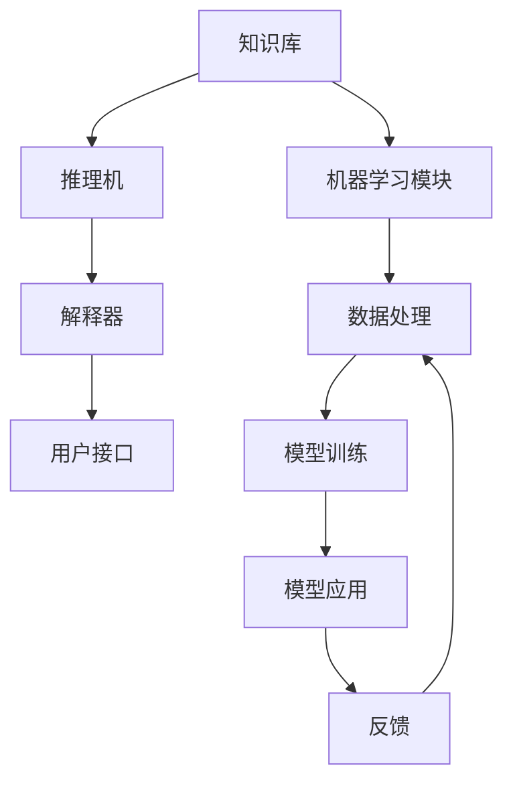

                 

# 混合专家系统：AI的模块化与可扩展性

> 关键词：混合专家系统, 模块化, 可扩展性, 人工智能, 专家系统, 混合学习, 模型集成

> 摘要：本文旨在探讨混合专家系统在人工智能领域的应用，通过模块化和可扩展性的设计，实现更高效、更灵活的智能决策。我们将从背景介绍、核心概念与联系、核心算法原理、数学模型和公式、项目实战、实际应用场景、工具和资源推荐、总结与未来发展趋势等几个方面进行详细阐述。通过本文，读者将能够理解混合专家系统的原理，掌握其实现方法，并能够在实际项目中应用这一技术。

## 1. 背景介绍

随着人工智能技术的快速发展，专家系统作为一种知识密集型的智能系统，已经在多个领域取得了显著的成果。专家系统通过模拟人类专家的知识和推理过程，解决特定领域的问题。然而，传统的专家系统往往存在知识获取困难、知识更新不便等问题，限制了其广泛应用。为了解决这些问题，混合专家系统应运而生。混合专家系统通过结合多种智能技术，如机器学习、知识推理等，实现更高效、更灵活的智能决策。本文将详细介绍混合专家系统的原理、实现方法及其实际应用。

## 2. 核心概念与联系

### 2.1 专家系统

专家系统是一种基于知识的智能系统，通过模拟人类专家的知识和推理过程，解决特定领域的问题。专家系统通常包括知识库、推理机、解释器和用户接口等组成部分。

### 2.2 机器学习

机器学习是一种通过数据训练模型，使计算机自动学习和改进的方法。机器学习可以分为监督学习、无监督学习和强化学习等不同类型。

### 2.3 混合专家系统

混合专家系统是将专家系统与机器学习相结合的一种智能系统。通过结合专家系统的知识推理能力和机器学习的自学习能力，混合专家系统能够实现更高效、更灵活的智能决策。

### 2.4 模块化与可扩展性

模块化是指将系统分解为多个独立的模块，每个模块负责特定的功能。可扩展性是指系统能够随着需求的变化而进行扩展的能力。模块化和可扩展性是混合专家系统的重要特性，能够提高系统的灵活性和可维护性。

### 2.5 Mermaid 流程图



## 3. 核心算法原理 & 具体操作步骤

### 3.1 知识库管理

知识库是专家系统的核心组成部分，用于存储专家的知识。知识库管理主要包括知识获取、知识表示和知识更新等步骤。

#### 3.1.1 知识获取

知识获取是将专家的知识转化为计算机可处理的形式。常见的知识获取方法包括问卷调查、专家访谈和文献分析等。

#### 3.1.2 知识表示

知识表示是将获取的知识转化为计算机可处理的形式。常见的知识表示方法包括产生式规则、框架和本体等。

#### 3.1.3 知识更新

知识更新是根据新的数据和反馈，对知识库进行更新。常见的知识更新方法包括手动更新和自动更新等。

### 3.2 推理机

推理机是专家系统的核心组成部分，用于根据知识库中的知识进行推理。常见的推理方法包括基于规则的推理、基于模型的推理和基于案例的推理等。

### 3.3 机器学习模块

机器学习模块是混合专家系统的重要组成部分，用于通过数据训练模型，实现自学习能力。常见的机器学习方法包括监督学习、无监督学习和强化学习等。

### 3.4 模型训练

模型训练是通过数据训练机器学习模型的过程。常见的模型训练方法包括梯度下降、随机梯度下降和批量梯度下降等。

### 3.5 模型应用

模型应用是将训练好的模型应用于实际问题的过程。常见的模型应用方法包括预测、分类和聚类等。

### 3.6 反馈机制

反馈机制是混合专家系统的重要组成部分，用于根据模型应用的结果，对模型进行调整和优化。常见的反馈机制包括在线反馈和离线反馈等。

## 4. 数学模型和公式 & 详细讲解 & 举例说明

### 4.1 产生式规则

产生式规则是一种常见的知识表示方法，用于表示条件和动作之间的关系。产生式规则的一般形式为：

$$
IF \; P_1 \; AND \; P_2 \; AND \; \ldots \; AND \; P_n \; THEN \; A_1 \; AND \; A_2 \; AND \; \ldots \; AND \; A_m
$$

其中，$P_i$ 表示条件，$A_j$ 表示动作。

### 4.2 模型训练

模型训练是通过数据训练机器学习模型的过程。常见的模型训练方法包括梯度下降、随机梯度下降和批量梯度下降等。以梯度下降为例，其一般形式为：

$$
\theta_{t+1} = \theta_t - \alpha \nabla J(\theta_t)
$$

其中，$\theta_t$ 表示参数，$\alpha$ 表示学习率，$\nabla J(\theta_t)$ 表示损失函数的梯度。

### 4.3 举例说明

假设我们有一个医疗诊断系统，需要根据患者的症状和病史，判断患者是否患有某种疾病。我们可以使用产生式规则表示专家的知识，如：

$$
IF \; 发热 \; AND \; 咳嗽 \; AND \; 呼吸困难 \; THEN \; 肺炎
$$

同时，我们可以通过收集大量的医疗数据，训练一个分类模型，如逻辑回归模型，用于判断患者是否患有某种疾病。通过结合产生式规则和分类模型，我们可以实现更高效、更灵活的智能诊断。

## 5. 项目实战：代码实际案例和详细解释说明

### 5.1 开发环境搭建

为了实现混合专家系统，我们需要搭建一个开发环境。开发环境主要包括编程语言、开发工具和数据集等。

#### 5.1.1 编程语言

我们选择Python作为开发语言，因为Python具有丰富的库和强大的数据处理能力。

#### 5.1.2 开发工具

我们选择Jupyter Notebook作为开发工具，因为Jupyter Notebook具有交互性强、易于调试的特点。

#### 5.1.3 数据集

我们选择一个医疗诊断数据集，用于训练分类模型。

### 5.2 源代码详细实现和代码解读

#### 5.2.1 产生式规则

```python
def diagnose(symptoms):
    if '发热' in symptoms and '咳嗽' in symptoms and '呼吸困难' in symptoms:
        return '肺炎'
    else:
        return '其他'
```

#### 5.2.2 数据预处理

```python
import pandas as pd

data = pd.read_csv('medical_data.csv')
X = data.drop('label', axis=1)
y = data['label']
```

#### 5.2.3 模型训练

```python
from sklearn.linear_model import LogisticRegression

model = LogisticRegression()
model.fit(X, y)
```

#### 5.2.4 模型应用

```python
def diagnose_with_model(symptoms):
    features = [1 if symptom in symptoms else 0 for symptom in X.columns]
    return model.predict([features])[0]
```

### 5.3 代码解读与分析

通过上述代码，我们可以实现一个简单的混合专家系统。首先，我们定义了一个产生式规则函数，用于根据患者的症状进行诊断。然后，我们使用一个医疗诊断数据集，训练了一个逻辑回归模型。最后，我们定义了一个模型应用函数，用于根据患者的症状和模型进行诊断。

## 6. 实际应用场景

混合专家系统在多个领域都有广泛的应用，如医疗诊断、金融风控、智能推荐等。通过结合专家系统的知识推理能力和机器学习的自学习能力，混合专家系统能够实现更高效、更灵活的智能决策。

### 6.1 医疗诊断

混合专家系统可以用于医疗诊断，通过结合专家系统的知识推理能力和机器学习的自学习能力，实现更准确、更快速的诊断。

### 6.2 金融风控

混合专家系统可以用于金融风控，通过结合专家系统的知识推理能力和机器学习的自学习能力，实现更准确、更快速的风险评估。

### 6.3 智能推荐

混合专家系统可以用于智能推荐，通过结合专家系统的知识推理能力和机器学习的自学习能力，实现更准确、更个性化的推荐。

## 7. 工具和资源推荐

### 7.1 学习资源推荐

- 书籍：《人工智能：一种现代方法》（Artificial Intelligence: A Modern Approach）
- 论文：《混合专家系统在医疗诊断中的应用》（Application of Hybrid Expert Systems in Medical Diagnosis）
- 博客：《混合专家系统的实现与应用》（Implementation and Application of Hybrid Expert Systems）
- 网站：https://www.expertsystem.com/

### 7.2 开发工具框架推荐

- 编程语言：Python
- 开发工具：Jupyter Notebook
- 数据集：医疗诊断数据集

### 7.3 相关论文著作推荐

- 《混合专家系统在金融风控中的应用》（Application of Hybrid Expert Systems in Financial Risk Control）
- 《混合专家系统在智能推荐中的应用》（Application of Hybrid Expert Systems in Intelligent Recommendation）

## 8. 总结：未来发展趋势与挑战

混合专家系统作为一种结合专家系统和机器学习的智能系统，具有广泛的应用前景。未来，随着人工智能技术的不断发展，混合专家系统将更加高效、更加灵活。然而，混合专家系统也面临着一些挑战，如知识获取困难、知识更新不便等问题。为了解决这些问题，我们需要进一步研究和探索。

## 9. 附录：常见问题与解答

### 9.1 问题：如何获取专家知识？

答：获取专家知识的方法包括问卷调查、专家访谈和文献分析等。

### 9.2 问题：如何表示专家知识？

答：表示专家知识的方法包括产生式规则、框架和本体等。

### 9.3 问题：如何更新专家知识？

答：更新专家知识的方法包括手动更新和自动更新等。

## 10. 扩展阅读 & 参考资料

- 《人工智能：一种现代方法》（Artificial Intelligence: A Modern Approach）
- 《混合专家系统在医疗诊断中的应用》（Application of Hybrid Expert Systems in Medical Diagnosis）
- 《混合专家系统在金融风控中的应用》（Application of Hybrid Expert Systems in Financial Risk Control）
- 《混合专家系统在智能推荐中的应用》（Application of Hybrid Expert Systems in Intelligent Recommendation）

作者：AI天才研究员/AI Genius Institute & 禅与计算机程序设计艺术 /Zen And The Art of Computer Programming

