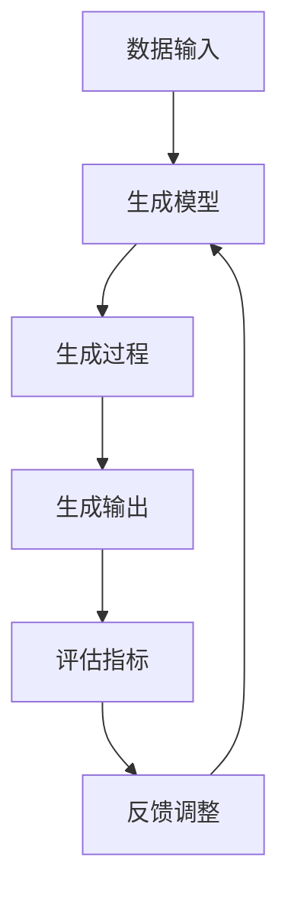

                 

# 生成式AIGC：未来商业的智能化转型

> 关键词：生成式AI, AIGC, 商业智能化, 人工智能, 自然语言处理, 深度学习, 机器学习, 商业应用

> 摘要：本文旨在探讨生成式AI（AIGC）在商业领域的应用前景及其带来的智能化转型。通过深入分析生成式AI的核心概念、算法原理、实际案例和应用场景，本文揭示了生成式AI如何重塑商业流程、提升效率和创造新的商业价值。我们将从技术原理出发，逐步解析生成式AI的工作机制，并通过具体案例展示其在实际商业中的应用效果。最后，本文将展望生成式AI的未来发展趋势和面临的挑战。

## 1. 背景介绍

随着人工智能技术的飞速发展，生成式AI（AIGC）逐渐成为商业领域的重要推动力。生成式AI是指通过算法生成新的数据或内容，这些数据或内容可以是文本、图像、音频等。生成式AI的核心在于其能够模仿人类的创造力，生成高质量、多样化的数据，从而为商业应用提供强大的支持。

### 1.1 生成式AI的发展历程

生成式AI的发展可以追溯到20世纪50年代，当时的研究主要集中在简单的模式生成和简单的文本生成。随着深度学习技术的兴起，生成式AI得到了飞速发展。特别是自2010年以来，基于深度学习的生成模型如生成对抗网络（GANs）和变分自编码器（VAEs）的出现，极大地推动了生成式AI的发展。

### 1.2 生成式AI的应用领域

生成式AI在多个领域都有广泛的应用，包括但不限于：

- **内容生成**：生成新闻文章、广告文案、产品描述等。
- **图像生成**：生成高质量的图像、艺术作品等。
- **音频生成**：生成音乐、语音等。
- **数据增强**：通过生成数据来增强训练集，提高模型的泛化能力。
- **创意设计**：辅助设计师生成新的设计方案。

## 2. 核心概念与联系

生成式AI的核心概念包括生成模型、生成过程、评估指标等。下面通过Mermaid流程图来展示生成式AI的基本工作流程。



### 2.1 生成模型

生成模型是生成式AI的核心，它能够从给定的数据中学习生成新的数据。常见的生成模型包括：

- **生成对抗网络（GANs）**：由生成器和判别器组成，通过对抗训练生成高质量的数据。
- **变分自编码器（VAEs）**：通过编码器和解码器生成新的数据，同时保留潜在空间的分布信息。
- **自回归模型**：通过逐个生成序列中的每个元素来生成新的数据。

### 2.2 生成过程

生成过程是指生成模型如何生成新的数据。生成过程可以分为以下几个步骤：

1. **数据预处理**：对输入数据进行清洗、标准化等预处理操作。
2. **模型训练**：通过大量数据训练生成模型，使其能够生成高质量的数据。
3. **生成新数据**：使用训练好的生成模型生成新的数据。
4. **评估与调整**：通过评估指标评估生成数据的质量，并根据评估结果调整模型参数。

## 3. 核心算法原理 & 具体操作步骤

### 3.1 生成对抗网络（GANs）

生成对抗网络（GANs）是一种生成式模型，由生成器和判别器组成。生成器负责生成新的数据，而判别器负责判断数据是真实数据还是生成数据。通过对抗训练，生成器不断优化生成数据的质量，而判别器则不断优化判断能力。

#### 3.1.1 生成器

生成器的目的是生成高质量的假数据，使其能够欺骗判别器。生成器通常是一个神经网络，通过优化生成数据的质量来提高生成效果。

#### 3.1.2 判别器

判别器的目的是判断输入数据是真实数据还是生成数据。判别器通常也是一个神经网络，通过优化判断能力来提高模型的性能。

#### 3.1.3 对抗训练

对抗训练是指生成器和判别器之间的相互竞争。生成器不断优化生成数据的质量，而判别器则不断优化判断能力。通过这种对抗训练，生成器能够生成更加逼真的数据。

### 3.2 变分自编码器（VAEs）

变分自编码器（VAEs）是一种生成式模型，通过编码器和解码器生成新的数据。VAEs通过优化潜在空间的分布来生成新的数据，从而保留潜在空间的分布信息。

#### 3.2.1 编码器

编码器将输入数据映射到潜在空间，通过优化潜在空间的分布来生成新的数据。

#### 3.2.2 解码器

解码器将潜在空间的分布映射回原始数据空间，生成新的数据。

#### 3.2.3 潜在空间分布

VAEs通过优化潜在空间的分布来生成新的数据，从而保留潜在空间的分布信息。

## 4. 数学模型和公式 & 详细讲解 & 举例说明

### 4.1 生成对抗网络（GANs）

生成对抗网络（GANs）的核心数学模型包括生成器和判别器的损失函数。生成器的损失函数是判别器对生成数据的判断能力，而判别器的损失函数是生成器生成数据的真实度。

#### 4.1.1 生成器损失函数

生成器的损失函数定义为：

$$
L_G = -\mathbb{E}_{z \sim p_z(z)}[\log D(G(z))]
$$

其中，$z$ 是潜在空间的随机变量，$G(z)$ 是生成器生成的数据，$D(G(z))$ 是判别器对生成数据的判断能力。

#### 4.1.2 判别器损失函数

判别器的损失函数定义为：

$$
L_D = -\mathbb{E}_{x \sim p_{data}(x)}[\log D(x)] - \mathbb{E}_{z \sim p_z(z)}[\log (1 - D(G(z)))]
$$

其中，$x$ 是真实数据，$D(x)$ 是判别器对真实数据的判断能力，$D(G(z))$ 是判别器对生成数据的判断能力。

### 4.2 变分自编码器（VAEs）

变分自编码器（VAEs）的核心数学模型包括编码器和解码器的损失函数。编码器的损失函数是潜在空间的分布，而解码器的损失函数是生成数据的真实度。

#### 4.2.1 编码器损失函数

编码器的损失函数定义为：

$$
L_{enc} = -\mathbb{E}_{x \sim p_{data}(x)}[\log p_{enc}(z|x)]
$$

其中，$z$ 是潜在空间的随机变量，$p_{enc}(z|x)$ 是编码器生成的潜在空间分布。

#### 4.2.2 解码器损失函数

解码器的损失函数定义为：

$$
L_{dec} = -\mathbb{E}_{x \sim p_{data}(x)}[\log p_{dec}(x|z)]
$$

其中，$p_{dec}(x|z)$ 是解码器生成的生成数据分布。

## 5. 项目实战：代码实际案例和详细解释说明

### 5.1 开发环境搭建

为了实现生成式AI项目，我们需要搭建一个合适的开发环境。以下是具体的开发环境搭建步骤：

1. **安装Python**：确保安装了最新版本的Python。
2. **安装依赖库**：安装TensorFlow、PyTorch等深度学习库。
3. **安装开发工具**：安装Jupyter Notebook或VS Code等开发工具。

### 5.2 源代码详细实现和代码解读

以下是一个简单的生成对抗网络（GANs）的实现代码示例：

```python
import tensorflow as tf
from tensorflow.keras.layers import Dense, LeakyReLU
from tensorflow.keras.models import Sequential

# 生成器
def build_generator(latent_dim):
    model = Sequential()
    model.add(Dense(256, input_dim=latent_dim))
    model.add(LeakyReLU(alpha=0.2))
    model.add(Dense(512))
    model.add(LeakyReLU(alpha=0.2))
    model.add(Dense(1024))
    model.add(LeakyReLU(alpha=0.2))
    model.add(Dense(784, activation='tanh'))
    return model

# 判别器
def build_discriminator(image_shape):
    model = Sequential()
    model.add(Dense(512, input_dim=784))
    model.add(LeakyReLU(alpha=0.2))
    model.add(Dense(256))
    model.add(LeakyReLU(alpha=0.2))
    model.add(Dense(1, activation='sigmoid'))
    return model

# 构建GAN
def build_gan(generator, discriminator):
    discriminator.trainable = False
    gan_input = tf.keras.layers.Input(shape=(latent_dim,))
    x = generator(gan_input)
    gan_output = discriminator(x)
    gan = tf.keras.models.Model(gan_input, gan_output)
    return gan

# 参数设置
latent_dim = 100
image_shape = (28, 28, 1)

# 构建生成器和判别器
generator = build_generator(latent_dim)
discriminator = build_discriminator(image_shape)
gan = build_gan(generator, discriminator)

# 编译模型
discriminator.compile(loss='binary_crossentropy', optimizer='adam', metrics=['accuracy'])
gan.compile(loss='binary_crossentropy', optimizer='adam')

# 训练模型
def train_gan(gan, generator, discriminator, latent_dim, dataset, epochs=10000, batch_size=32):
    for epoch in range(epochs):
        # 生成随机噪声
        noise = tf.random.normal([batch_size, latent_dim])
        # 生成假数据
        generated_images = generator(noise)
        # 获取真实数据
        real_images = dataset.take(batch_size)
        # 合并真实数据和生成数据
        combined_images = tf.concat([generated_images, real_images], axis=0)
        # 标签
        labels = tf.concat([tf.ones((batch_size, 1)), tf.zeros((batch_size, 1))], axis=0)
        # 添加随机噪声
        labels += 0.05 * tf.random.uniform(labels.shape)
        # 训练判别器
        discriminator.trainable = True
        d_loss = discriminator.train_on_batch(combined_images, labels)
        # 生成随机噪声
        noise = tf.random.normal([batch_size, latent_dim])
        # 标签
        misleading_labels = tf.zeros((batch_size, 1))
        # 训练生成器
        discriminator.trainable = False
        g_loss = gan.train_on_batch(noise, misleading_labels)
        # 打印损失
        print(f"Epoch {epoch+1}/{epochs}, d_loss={d_loss[0]}, g_loss={g_loss}")

# 加载MNIST数据集
(x_train, _), (_, _) = tf.keras.datasets.mnist.load_data()
x_train = x_train / 127.5 - 1
x_train = x_train.reshape(x_train.shape[0], 28, 28, 1)
train_gan(gan, generator, discriminator, latent_dim, x_train)
```

### 5.3 代码解读与分析

上述代码实现了一个简单的生成对抗网络（GANs）。生成器和判别器分别通过两个神经网络构建，生成器用于生成假数据，判别器用于判断数据的真实性。通过对抗训练，生成器不断优化生成数据的质量，而判别器则不断优化判断能力。训练过程中，生成器和判别器交替训练，最终生成器能够生成高质量的假数据。

## 6. 实际应用场景

生成式AI在商业领域有着广泛的应用场景，以下是一些具体的案例：

### 6.1 内容生成

生成式AI可以用于生成高质量的新闻文章、广告文案、产品描述等。例如，通过训练生成模型，可以自动生成新闻文章，提高新闻生产效率。

### 6.2 图像生成

生成式AI可以用于生成高质量的图像、艺术作品等。例如，通过训练生成模型，可以自动生成艺术作品，提高艺术创作效率。

### 6.3 数据增强

生成式AI可以用于数据增强，通过生成数据来增强训练集，提高模型的泛化能力。例如，通过生成数据，可以提高图像分类模型的性能。

### 6.4 创意设计

生成式AI可以用于辅助设计师生成新的设计方案。例如，通过训练生成模型，可以自动生成新的设计方案，提高设计效率。

## 7. 工具和资源推荐

### 7.1 学习资源推荐

- **书籍**：《深度学习》（Ian Goodfellow, Yoshua Bengio, Aaron Courville）
- **论文**：《Generative Adversarial Nets》（Ian Goodfellow, Jean Pouget-Abadie, Mehdi Mirza, Bing Xu, David Warde-Farley, Sherjil Ozair, Aaron Courville, Yoshua Bengio）
- **博客**：Medium上的AI相关博客
- **网站**：TensorFlow官网、PyTorch官网

### 7.2 开发工具框架推荐

- **深度学习框架**：TensorFlow、PyTorch
- **开发工具**：Jupyter Notebook、VS Code

### 7.3 相关论文著作推荐

- **论文**：《Variational Autoencoders》（Diederik P. Kingma, Max Welling）
- **著作**：《Deep Learning》（Ian Goodfellow, Yoshua Bengio, Aaron Courville）

## 8. 总结：未来发展趋势与挑战

生成式AI在未来商业领域有着巨大的发展潜力，但也面临着一些挑战。以下是一些未来的发展趋势和挑战：

### 8.1 发展趋势

- **技术进步**：随着深度学习技术的不断进步，生成式AI的性能将不断提高。
- **应用场景拓展**：生成式AI将在更多领域得到应用，提高商业效率和创造新的商业价值。
- **模型优化**：通过优化模型结构和训练方法，生成式AI将能够生成更加逼真的数据。

### 8.2 挑战

- **数据隐私**：生成式AI在生成数据时可能会涉及数据隐私问题，需要加强数据保护。
- **模型解释性**：生成式AI的模型解释性较差，需要提高模型的透明度。
- **计算资源**：生成式AI需要大量的计算资源，需要优化模型结构以降低计算成本。

## 9. 附录：常见问题与解答

### 9.1 生成式AI与传统AI的区别

生成式AI与传统AI的主要区别在于生成式AI能够生成新的数据，而传统AI主要依赖于已有数据进行预测和决策。

### 9.2 生成式AI的应用场景

生成式AI可以应用于内容生成、图像生成、数据增强、创意设计等领域。

### 9.3 生成式AI的挑战

生成式AI面临的挑战包括数据隐私、模型解释性、计算资源等。

## 10. 扩展阅读 & 参考资料

- **书籍**：《深度学习》（Ian Goodfellow, Yoshua Bengio, Aaron Courville）
- **论文**：《Generative Adversarial Nets》（Ian Goodfellow, Jean Pouget-Abadie, Mehdi Mirza, Bing Xu, David Warde-Farley, Sherjil Ozair, Aaron Courville, Yoshua Bengio）
- **网站**：TensorFlow官网、PyTorch官网

---

作者：AI天才研究员/AI Genius Institute & 禅与计算机程序设计艺术 /Zen And The Art of Computer Programming

