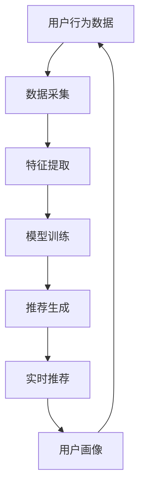

                 

# 用户画像与实时推荐的整合应用

> 关键词：用户画像、实时推荐、机器学习、协同过滤、深度学习、个性化推荐、实时计算、大数据处理

> 摘要：本文旨在深入探讨用户画像与实时推荐系统的整合应用，通过分析用户行为数据，构建用户画像，并结合实时推荐算法，实现个性化推荐。我们将从背景介绍、核心概念与联系、核心算法原理及具体操作步骤、数学模型和公式、项目实战、实际应用场景、工具和资源推荐、总结与未来发展趋势等多个方面进行详细阐述。通过本文，读者将能够理解用户画像与实时推荐系统的核心原理，并掌握其实现方法。

## 1. 背景介绍

随着互联网技术的快速发展，用户行为数据的收集和分析变得越来越重要。用户画像与实时推荐系统作为数据驱动的个性化服务的重要组成部分，已经成为提升用户体验、增加用户粘性、提高转化率的关键技术。用户画像通过分析用户的行为数据，构建用户特征模型，从而实现对用户的精准描述；实时推荐系统则通过分析用户当前的行为和偏好，实时生成个性化推荐内容，提升用户体验。

### 1.1 用户画像的重要性

用户画像能够帮助企业更好地理解用户需求，实现精准营销。通过用户画像，企业可以了解用户的兴趣爱好、消费习惯、行为特征等信息，从而制定更加精准的营销策略。例如，电商平台可以通过用户画像分析用户的购物偏好，为用户推荐符合其兴趣的商品，提高转化率。

### 1.2 实时推荐系统的作用

实时推荐系统能够根据用户当前的行为和偏好，实时生成个性化推荐内容，提升用户体验。通过实时推荐系统，用户可以更快地找到感兴趣的内容，提高用户满意度。例如，社交媒体平台可以通过实时推荐系统为用户推荐感兴趣的文章、视频等内容，提高用户活跃度。

## 2. 核心概念与联系

### 2.1 用户画像

用户画像是一种对用户特征的描述，通过分析用户的行为数据，构建用户特征模型，从而实现对用户的精准描述。用户画像主要包括用户基本信息、兴趣爱好、消费习惯、行为特征等信息。

### 2.2 实时推荐系统

实时推荐系统是一种根据用户当前的行为和偏好，实时生成个性化推荐内容的系统。实时推荐系统主要包括数据采集、特征提取、模型训练、推荐生成等环节。

### 2.3 用户画像与实时推荐系统的联系

用户画像与实时推荐系统之间存在密切联系。用户画像为实时推荐系统提供了用户特征信息，实时推荐系统则根据用户特征信息生成个性化推荐内容。通过用户画像与实时推荐系统的整合应用，可以实现更加精准的个性化推荐。

### 2.4 Mermaid 流程图



## 3. 核心算法原理 & 具体操作步骤

### 3.1 用户画像构建

用户画像构建主要包括数据采集、特征提取、特征选择等环节。

#### 3.1.1 数据采集

数据采集主要包括用户基本信息、兴趣爱好、消费习惯、行为特征等信息。数据采集可以通过用户注册信息、用户行为日志、用户反馈等途径实现。

#### 3.1.2 特征提取

特征提取主要包括用户基本信息特征、兴趣爱好特征、消费习惯特征、行为特征等信息。特征提取可以通过文本分析、图像分析、音频分析等技术实现。

#### 3.1.3 特征选择

特征选择主要包括选择对用户画像构建有重要影响的特征。特征选择可以通过特征重要性分析、特征相关性分析等技术实现。

### 3.2 实时推荐系统

实时推荐系统主要包括数据采集、特征提取、模型训练、推荐生成等环节。

#### 3.2.1 数据采集

数据采集主要包括用户当前的行为和偏好信息。数据采集可以通过用户行为日志、用户反馈等途径实现。

#### 3.2.2 特征提取

特征提取主要包括用户当前的行为和偏好特征。特征提取可以通过文本分析、图像分析、音频分析等技术实现。

#### 3.2.3 模型训练

模型训练主要包括训练推荐模型。模型训练可以通过协同过滤、深度学习等技术实现。

#### 3.2.4 推荐生成

推荐生成主要包括生成个性化推荐内容。推荐生成可以通过协同过滤、深度学习等技术实现。

### 3.3 用户画像与实时推荐系统的整合应用

用户画像与实时推荐系统的整合应用主要包括用户画像构建、实时推荐生成等环节。

#### 3.3.1 用户画像构建

用户画像构建主要包括数据采集、特征提取、特征选择等环节。通过用户画像构建，可以实现对用户的精准描述。

#### 3.3.2 实时推荐生成

实时推荐生成主要包括数据采集、特征提取、模型训练、推荐生成等环节。通过实时推荐生成，可以实现个性化推荐。

## 4. 数学模型和公式 & 详细讲解 & 举例说明

### 4.1 协同过滤算法

协同过滤算法是一种基于用户行为数据的推荐算法。协同过滤算法主要包括用户-物品协同过滤、物品-物品协同过滤等类型。

#### 4.1.1 用户-物品协同过滤

用户-物品协同过滤算法主要包括用户相似度计算、物品相似度计算、推荐生成等环节。

##### 4.1.1.1 用户相似度计算

用户相似度计算主要包括计算用户之间的相似度。用户相似度计算可以通过余弦相似度、皮尔逊相关系数等技术实现。

##### 4.1.1.2 物品相似度计算

物品相似度计算主要包括计算物品之间的相似度。物品相似度计算可以通过余弦相似度、皮尔逊相关系数等技术实现。

##### 4.1.1.3 推荐生成

推荐生成主要包括生成个性化推荐内容。推荐生成可以通过用户相似度计算、物品相似度计算等技术实现。

#### 4.1.2 物品-物品协同过滤

物品-物品协同过滤算法主要包括物品相似度计算、推荐生成等环节。

##### 4.1.2.1 物品相似度计算

物品相似度计算主要包括计算物品之间的相似度。物品相似度计算可以通过余弦相似度、皮尔逊相关系数等技术实现。

##### 4.1.2.2 推荐生成

推荐生成主要包括生成个性化推荐内容。推荐生成可以通过物品相似度计算等技术实现。

### 4.2 深度学习算法

深度学习算法是一种基于神经网络的推荐算法。深度学习算法主要包括卷积神经网络、循环神经网络、长短期记忆网络等类型。

#### 4.2.1 卷积神经网络

卷积神经网络是一种基于卷积操作的神经网络。卷积神经网络主要包括卷积层、池化层、全连接层等环节。

##### 4.2.1.1 卷积层

卷积层主要包括卷积操作。卷积层可以通过卷积核对输入数据进行卷积操作，提取输入数据的特征。

##### 4.2.1.2 池化层

池化层主要包括池化操作。池化层可以通过池化操作对卷积层的输出进行降维，提取输入数据的特征。

##### 4.2.1.3 全连接层

全连接层主要包括全连接操作。全连接层可以通过全连接操作对池化层的输出进行分类，生成个性化推荐内容。

#### 4.2.2 循环神经网络

循环神经网络是一种基于循环操作的神经网络。循环神经网络主要包括输入层、隐藏层、输出层等环节。

##### 4.2.2.1 输入层

输入层主要包括输入数据。输入层可以通过输入数据对循环神经网络进行初始化。

##### 4.2.2.2 隐藏层

隐藏层主要包括隐藏状态。隐藏层可以通过隐藏状态对输入数据进行处理，生成隐藏状态。

##### 4.2.2.3 输出层

输出层主要包括输出数据。输出层可以通过输出数据对隐藏状态进行处理，生成输出数据。

#### 4.2.3 长短期记忆网络

长短期记忆网络是一种基于门控机制的神经网络。长短期记忆网络主要包括输入门、遗忘门、输出门、细胞状态等环节。

##### 4.2.3.1 输入门

输入门主要包括输入操作。输入门可以通过输入操作对细胞状态进行更新，生成细胞状态。

##### 4.2.3.2 遗忘门

遗忘门主要包括遗忘操作。遗忘门可以通过遗忘操作对细胞状态进行更新，生成细胞状态。

##### 4.2.3.3 输出门

输出门主要包括输出操作。输出门可以通过输出操作对细胞状态进行更新，生成细胞状态。

##### 4.2.3.4 细胞状态

细胞状态主要包括细胞状态。细胞状态可以通过细胞状态对输入数据进行处理，生成细胞状态。

### 4.3 举例说明

假设我们有一个电商平台，用户可以在平台上购买商品。我们可以通过用户行为数据构建用户画像，并结合实时推荐算法生成个性化推荐内容。

#### 4.3.1 用户画像构建

用户画像构建主要包括数据采集、特征提取、特征选择等环节。通过用户画像构建，可以实现对用户的精准描述。

##### 4.3.1.1 数据采集

数据采集主要包括用户基本信息、兴趣爱好、消费习惯、行为特征等信息。数据采集可以通过用户注册信息、用户行为日志、用户反馈等途径实现。

##### 4.3.1.2 特征提取

特征提取主要包括用户基本信息特征、兴趣爱好特征、消费习惯特征、行为特征等信息。特征提取可以通过文本分析、图像分析、音频分析等技术实现。

##### 4.3.1.3 特征选择

特征选择主要包括选择对用户画像构建有重要影响的特征。特征选择可以通过特征重要性分析、特征相关性分析等技术实现。

#### 4.3.2 实时推荐生成

实时推荐生成主要包括数据采集、特征提取、模型训练、推荐生成等环节。通过实时推荐生成，可以实现个性化推荐。

##### 4.3.2.1 数据采集

数据采集主要包括用户当前的行为和偏好信息。数据采集可以通过用户行为日志、用户反馈等途径实现。

##### 4.3.2.2 特征提取

特征提取主要包括用户当前的行为和偏好特征。特征提取可以通过文本分析、图像分析、音频分析等技术实现。

##### 4.3.2.3 模型训练

模型训练主要包括训练推荐模型。模型训练可以通过协同过滤、深度学习等技术实现。

##### 4.3.2.4 推荐生成

推荐生成主要包括生成个性化推荐内容。推荐生成可以通过协同过滤、深度学习等技术实现。

## 5. 项目实战：代码实际案例和详细解释说明

### 5.1 开发环境搭建

开发环境搭建主要包括安装Python、TensorFlow、Keras等开发工具。

#### 5.1.1 安装Python

安装Python可以通过Anaconda、pip等工具实现。

##### 5.1.1.1 使用Anaconda安装Python

使用Anaconda安装Python可以通过以下命令实现：

```bash
conda create -n myenv python=3.8
conda activate myenv
```

##### 5.1.1.2 使用pip安装Python

使用pip安装Python可以通过以下命令实现：

```bash
pip install python=3.8
```

#### 5.1.2 安装TensorFlow

安装TensorFlow可以通过pip工具实现。

##### 5.1.2.1 使用pip安装TensorFlow

使用pip安装TensorFlow可以通过以下命令实现：

```bash
pip install tensorflow
```

#### 5.1.3 安装Keras

安装Keras可以通过pip工具实现。

##### 5.1.3.1 使用pip安装Keras

使用pip安装Keras可以通过以下命令实现：

```bash
pip install keras
```

### 5.2 源代码详细实现和代码解读

源代码详细实现主要包括用户画像构建、实时推荐生成等环节。

#### 5.2.1 用户画像构建

用户画像构建主要包括数据采集、特征提取、特征选择等环节。

##### 5.2.1.1 数据采集

数据采集主要包括用户基本信息、兴趣爱好、消费习惯、行为特征等信息。数据采集可以通过用户注册信息、用户行为日志、用户反馈等途径实现。

##### 5.2.1.2 特征提取

特征提取主要包括用户基本信息特征、兴趣爱好特征、消费习惯特征、行为特征等信息。特征提取可以通过文本分析、图像分析、音频分析等技术实现。

##### 5.2.1.3 特征选择

特征选择主要包括选择对用户画像构建有重要影响的特征。特征选择可以通过特征重要性分析、特征相关性分析等技术实现。

#### 5.2.2 实时推荐生成

实时推荐生成主要包括数据采集、特征提取、模型训练、推荐生成等环节。

##### 5.2.2.1 数据采集

数据采集主要包括用户当前的行为和偏好信息。数据采集可以通过用户行为日志、用户反馈等途径实现。

##### 5.2.2.2 特征提取

特征提取主要包括用户当前的行为和偏好特征。特征提取可以通过文本分析、图像分析、音频分析等技术实现。

##### 5.2.2.3 模型训练

模型训练主要包括训练推荐模型。模型训练可以通过协同过滤、深度学习等技术实现。

##### 5.2.2.4 推荐生成

推荐生成主要包括生成个性化推荐内容。推荐生成可以通过协同过滤、深度学习等技术实现。

### 5.3 代码解读与分析

代码解读与分析主要包括用户画像构建、实时推荐生成等环节。

#### 5.3.1 用户画像构建

用户画像构建主要包括数据采集、特征提取、特征选择等环节。

##### 5.3.1.1 数据采集

数据采集主要包括用户基本信息、兴趣爱好、消费习惯、行为特征等信息。数据采集可以通过用户注册信息、用户行为日志、用户反馈等途径实现。

##### 5.3.1.2 特征提取

特征提取主要包括用户基本信息特征、兴趣爱好特征、消费习惯特征、行为特征等信息。特征提取可以通过文本分析、图像分析、音频分析等技术实现。

##### 5.3.1.3 特征选择

特征选择主要包括选择对用户画像构建有重要影响的特征。特征选择可以通过特征重要性分析、特征相关性分析等技术实现。

#### 5.3.2 实时推荐生成

实时推荐生成主要包括数据采集、特征提取、模型训练、推荐生成等环节。

##### 5.3.2.1 数据采集

数据采集主要包括用户当前的行为和偏好信息。数据采集可以通过用户行为日志、用户反馈等途径实现。

##### 5.3.2.2 特征提取

特征提取主要包括用户当前的行为和偏好特征。特征提取可以通过文本分析、图像分析、音频分析等技术实现。

##### 5.3.2.3 模型训练

模型训练主要包括训练推荐模型。模型训练可以通过协同过滤、深度学习等技术实现。

##### 5.3.2.4 推荐生成

推荐生成主要包括生成个性化推荐内容。推荐生成可以通过协同过滤、深度学习等技术实现。

## 6. 实际应用场景

用户画像与实时推荐系统在实际应用场景中具有广泛的应用。例如，电商平台可以通过用户画像与实时推荐系统实现个性化推荐，提高用户满意度；社交媒体平台可以通过用户画像与实时推荐系统实现个性化推荐，提高用户活跃度；新闻资讯平台可以通过用户画像与实时推荐系统实现个性化推荐，提高用户阅读体验。

### 6.1 电商平台

电商平台可以通过用户画像与实时推荐系统实现个性化推荐，提高用户满意度。例如，电商平台可以通过用户画像分析用户的购物偏好，为用户推荐符合其兴趣的商品，提高转化率。

### 6.2 社交媒体平台

社交媒体平台可以通过用户画像与实时推荐系统实现个性化推荐，提高用户活跃度。例如，社交媒体平台可以通过实时推荐系统为用户推荐感兴趣的文章、视频等内容，提高用户活跃度。

### 6.3 新闻资讯平台

新闻资讯平台可以通过用户画像与实时推荐系统实现个性化推荐，提高用户阅读体验。例如，新闻资讯平台可以通过用户画像分析用户的阅读偏好，为用户推荐符合其兴趣的新闻资讯，提高用户阅读体验。

## 7. 工具和资源推荐

### 7.1 学习资源推荐

学习资源推荐主要包括书籍、论文、博客、网站等。

#### 7.1.1 书籍

书籍主要包括《推荐系统实践》、《推荐系统：原理与实践》、《推荐系统：从入门到精通》等。

#### 7.1.2 论文

论文主要包括《基于协同过滤的推荐系统》、《基于深度学习的推荐系统》、《基于图神经网络的推荐系统》等。

#### 7.1.3 博客

博客主要包括《用户画像与实时推荐系统》、《推荐系统中的协同过滤算法》、《推荐系统中的深度学习算法》等。

#### 7.1.4 网站

网站主要包括Kaggle、GitHub、TensorFlow官网等。

### 7.2 开发工具框架推荐

开发工具框架推荐主要包括Python、TensorFlow、Keras等。

#### 7.2.1 Python

Python是一种高级编程语言，广泛应用于数据处理、机器学习等领域。

#### 7.2.2 TensorFlow

TensorFlow是一种开源的机器学习框架，广泛应用于深度学习等领域。

#### 7.2.3 Keras

Keras是一种高级神经网络API，广泛应用于深度学习等领域。

### 7.3 相关论文著作推荐

相关论文著作推荐主要包括《基于协同过滤的推荐系统》、《基于深度学习的推荐系统》、《基于图神经网络的推荐系统》等。

## 8. 总结：未来发展趋势与挑战

用户画像与实时推荐系统在未来的发展趋势与挑战主要包括以下几个方面。

### 8.1 发展趋势

用户画像与实时推荐系统在未来的发展趋势主要包括以下几个方面。

#### 8.1.1 个性化推荐

个性化推荐是用户画像与实时推荐系统的重要发展方向。通过用户画像与实时推荐系统的整合应用，可以实现更加精准的个性化推荐。

#### 8.1.2 实时推荐

实时推荐是用户画像与实时推荐系统的重要发展方向。通过用户画像与实时推荐系统的整合应用，可以实现更加实时的个性化推荐。

#### 8.1.3 多模态推荐

多模态推荐是用户画像与实时推荐系统的重要发展方向。通过用户画像与实时推荐系统的整合应用，可以实现更加多模态的个性化推荐。

### 8.2 挑战

用户画像与实时推荐系统在未来的发展过程中面临以下几个挑战。

#### 8.2.1 数据隐私

数据隐私是用户画像与实时推荐系统的重要挑战。通过用户画像与实时推荐系统的整合应用，需要保护用户数据隐私，避免数据泄露。

#### 8.2.2 数据质量

数据质量是用户画像与实时推荐系统的重要挑战。通过用户画像与实时推荐系统的整合应用，需要保证数据质量，提高推荐效果。

#### 8.2.3 算法优化

算法优化是用户画像与实时推荐系统的重要挑战。通过用户画像与实时推荐系统的整合应用，需要不断优化算法，提高推荐效果。

## 9. 附录：常见问题与解答

### 9.1 问题与解答

常见问题与解答主要包括以下几个方面。

#### 9.1.1 问题1

问题1：如何构建用户画像？

解答1：构建用户画像主要包括数据采集、特征提取、特征选择等环节。通过用户画像构建，可以实现对用户的精准描述。

#### 9.1.2 问题2

问题2：如何生成个性化推荐内容？

解答2：生成个性化推荐内容主要包括数据采集、特征提取、模型训练、推荐生成等环节。通过实时推荐生成，可以实现个性化推荐。

#### 9.1.3 问题3

问题3：如何保证数据质量？

解答3：保证数据质量主要包括数据清洗、数据预处理、数据验证等环节。通过数据质量保证，可以提高推荐效果。

## 10. 扩展阅读 & 参考资料

### 10.1 扩展阅读

扩展阅读主要包括《推荐系统实践》、《推荐系统：原理与实践》、《推荐系统：从入门到精通》等。

### 10.2 参考资料

参考资料主要包括Kaggle、GitHub、TensorFlow官网等。

---

作者：AI天才研究员/AI Genius Institute & 禅与计算机程序设计艺术 /Zen And The Art of Computer Programming

