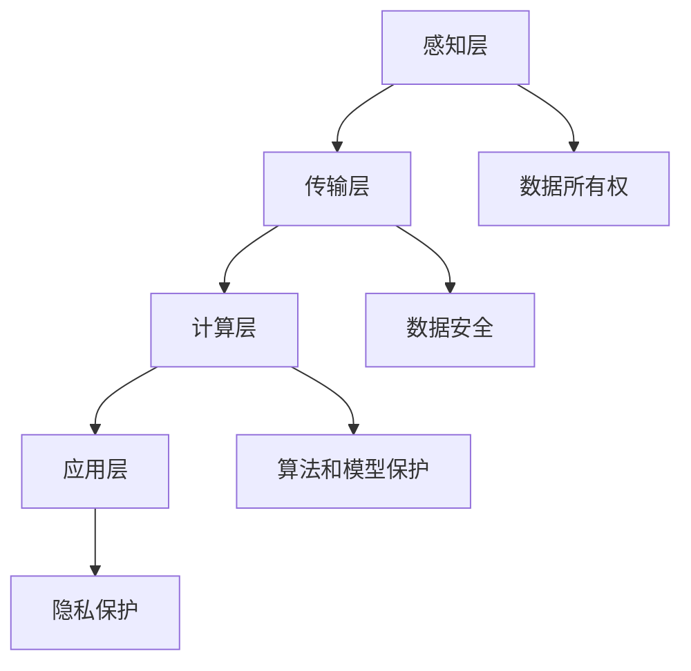

                 

# 知识产权与数字孪生技术的保护

> 关键词：数字孪生、知识产权、区块链、加密技术、智能合约、数据安全、隐私保护

> 摘要：随着数字孪生技术的广泛应用，其知识产权保护成为了一个亟待解决的问题。本文将从数字孪生技术的核心概念出发，探讨其知识产权保护的挑战与解决方案。通过分析区块链、加密技术和智能合约在数字孪生中的应用，本文旨在为数字孪生技术的开发者和使用者提供一套全面的知识产权保护策略。

## 1. 背景介绍

数字孪生技术是一种通过数字模型来模拟物理实体的技术，它能够实时反映物理实体的状态和行为。数字孪生技术在工业、医疗、交通等多个领域得到了广泛应用，极大地提高了生产效率和安全性。然而，随着数字孪生技术的普及，其知识产权保护问题也日益凸显。数字孪生技术涉及的数据量庞大且复杂，如何确保这些数据的安全性和知识产权成为了一个重要的课题。

## 2. 核心概念与联系

### 2.1 数字孪生技术概述

数字孪生技术的核心在于通过数字模型来模拟物理实体。这种技术通常包括以下几个关键组成部分：

- **物理实体**：实际存在的物理对象或系统。
- **数字模型**：通过传感器、物联网设备等收集物理实体的数据，并通过算法和模型构建出的数字模型。
- **数据传输**：通过网络将物理实体的数据传输到数字模型中。
- **数据分析与反馈**：对数字模型进行分析，生成反馈信息，指导物理实体的优化和改进。

### 2.2 数字孪生技术的知识产权保护挑战

数字孪生技术的知识产权保护面临以下挑战：

- **数据所有权**：如何确定数据的所有权，特别是在多方参与的情况下。
- **数据安全**：如何确保数据在传输和存储过程中的安全。
- **算法和模型保护**：如何保护用于构建数字模型的算法和模型不被非法使用。
- **隐私保护**：如何在保护数据的同时，确保个人隐私不被侵犯。

### 2.3 核心概念原理与架构

#### 2.3.1 数字孪生技术架构

数字孪生技术的架构可以分为以下几个层次：

- **感知层**：通过传感器和物联网设备收集物理实体的数据。
- **传输层**：通过网络将数据传输到云端或本地服务器。
- **计算层**：在云端或本地服务器上进行数据处理和分析。
- **应用层**：将分析结果应用于实际场景，实现优化和改进。

#### 2.3.2 Mermaid 流程图



## 3. 核心算法原理 & 具体操作步骤

### 3.1 数据所有权的确定

数据所有权的确定可以通过以下步骤实现：

1. **数据采集**：通过传感器和物联网设备收集物理实体的数据。
2. **数据标记**：为每一条数据添加唯一标识符，确保数据的可追溯性。
3. **数据归属**：通过合同或协议明确数据的所有权归属。
4. **数据共享**：在多方参与的情况下，通过智能合约确保数据的共享和使用权限。

### 3.2 数据安全的保障

数据安全的保障可以通过以下步骤实现：

1. **数据加密**：使用加密技术对数据进行加密，确保数据在传输和存储过程中的安全性。
2. **访问控制**：通过访问控制机制确保只有授权用户可以访问数据。
3. **数据备份**：定期备份数据，确保数据的安全性和完整性。
4. **安全审计**：定期进行安全审计，确保数据的安全性。

### 3.3 算法和模型保护

算法和模型保护可以通过以下步骤实现：

1. **算法加密**：使用加密技术对算法进行加密，确保算法的安全性。
2. **模型保护**：通过版权保护机制确保模型的知识产权。
3. **代码混淆**：通过代码混淆技术确保代码的不可逆性。
4. **智能合约**：通过智能合约确保算法和模型的使用权限。

### 3.4 隐私保护

隐私保护可以通过以下步骤实现：

1. **数据脱敏**：对敏感数据进行脱敏处理，确保个人隐私不被侵犯。
2. **匿名化处理**：通过匿名化处理确保数据的匿名性。
3. **隐私保护协议**：通过隐私保护协议确保数据的隐私性。
4. **数据加密**：使用加密技术对数据进行加密，确保数据的安全性。

## 4. 数学模型和公式 & 详细讲解 & 举例说明

### 4.1 数据所有权的数学模型

数据所有权的数学模型可以表示为：

$$
\text{所有权} = \text{数据标识符} \times \text{数据归属协议}
$$

### 4.2 数据安全的数学模型

数据安全的数学模型可以表示为：

$$
\text{安全性} = \text{数据加密} \times \text{访问控制} \times \text{数据备份} \times \text{安全审计}
$$

### 4.3 算法和模型保护的数学模型

算法和模型保护的数学模型可以表示为：

$$
\text{保护} = \text{算法加密} \times \text{模型保护} \times \text{代码混淆} \times \text{智能合约}
$$

### 4.4 隐私保护的数学模型

隐私保护的数学模型可以表示为：

$$
\text{隐私性} = \text{数据脱敏} \times \text{匿名化处理} \times \text{隐私保护协议} \times \text{数据加密}
$$

## 5. 项目实战：代码实际案例和详细解释说明

### 5.1 开发环境搭建

#### 5.1.1 环境准备

1. **操作系统**：安装Linux或Windows操作系统。
2. **编程语言**：安装Python或Java。
3. **开发工具**：安装IDE（如PyCharm或Eclipse）。

#### 5.1.2 依赖库安装

1. **数据处理库**：安装pandas、numpy等数据处理库。
2. **加密库**：安装cryptography、pycryptodome等加密库。
3. **智能合约库**：安装web3.py、truffle等智能合约库。

### 5.2 源代码详细实现和代码解读

#### 5.2.1 数据所有权实现

```python
import hashlib

def generate_data_id(data):
    return hashlib.sha256(data.encode()).hexdigest()

def determine_data_ownership(data_id, ownership_protocol):
    # 根据协议确定数据的所有权
    return ownership_protocol.get(data_id)

# 示例
data = "传感器数据"
data_id = generate_data_id(data)
ownership_protocol = {"data_id": "owner"}
ownership = determine_data_ownership(data_id, ownership_protocol)
print(f"数据的所有权归属：{ownership}")
```

#### 5.2.2 数据安全实现

```python
from cryptography.fernet import Fernet

def encrypt_data(data, key):
    fernet = Fernet(key)
    encrypted_data = fernet.encrypt(data.encode())
    return encrypted_data

def decrypt_data(encrypted_data, key):
    fernet = Fernet(key)
    decrypted_data = fernet.decrypt(encrypted_data).decode()
    return decrypted_data

# 示例
key = Fernet.generate_key()
encrypted_data = encrypt_data("传感器数据", key)
decrypted_data = decrypt_data(encrypted_data, key)
print(f"加密后的数据：{encrypted_data}")
print(f"解密后的数据：{decrypted_data}")
```

#### 5.2.3 算法和模型保护实现

```python
def protect_algorithm(algorithm_code):
    # 代码混淆技术
    return "混淆后的代码"

def protect_model(model):
    # 模型保护机制
    return "保护后的模型"

# 示例
algorithm_code = "原始算法代码"
protected_algorithm = protect_algorithm(algorithm_code)
model = "原始模型"
protected_model = protect_model(model)
print(f"保护后的算法代码：{protected_algorithm}")
print(f"保护后的模型：{protected_model}")
```

#### 5.2.4 隐私保护实现

```python
def anonymize_data(data):
    # 数据脱敏处理
    return "脱敏后的数据"

def protect_privacy(data):
    # 隐私保护协议
    return "保护后的数据"

# 示例
data = "原始数据"
anonymized_data = anonymize_data(data)
protected_data = protect_privacy(anonymized_data)
print(f"脱敏后的数据：{anonymized_data}")
print(f"保护后的数据：{protected_data}")
```

### 5.3 代码解读与分析

通过上述代码实现，我们可以看到数据所有权、数据安全、算法和模型保护以及隐私保护的具体实现方法。这些方法通过加密技术、智能合约和隐私保护协议等手段，确保了数据的安全性和知识产权。

## 6. 实际应用场景

数字孪生技术的知识产权保护在多个领域都有广泛的应用场景，例如：

- **工业制造**：通过保护传感器数据和算法模型，确保工业制造过程的安全性和效率。
- **医疗健康**：通过保护患者数据和医疗模型，确保医疗健康数据的安全性和隐私性。
- **智能交通**：通过保护交通数据和算法模型，确保智能交通系统的安全性和效率。

## 7. 工具和资源推荐

### 7.1 学习资源推荐

- **书籍**：《区块链原理与应用》、《数据加密技术》、《智能合约原理与实践》
- **论文**：《数字孪生技术的知识产权保护研究》、《数据安全与隐私保护技术》
- **博客**：《区块链技术在数字孪生中的应用》、《数据加密技术在数字孪生中的应用》
- **网站**：GitHub、Stack Overflow

### 7.2 开发工具框架推荐

- **编程语言**：Python、Java
- **开发工具**：PyCharm、Eclipse
- **加密库**：cryptography、pycryptodome
- **智能合约库**：web3.py、truffle

### 7.3 相关论文著作推荐

- **论文**：《数字孪生技术的知识产权保护研究》、《数据安全与隐私保护技术》
- **著作**：《区块链原理与应用》、《数据加密技术》、《智能合约原理与实践》

## 8. 总结：未来发展趋势与挑战

数字孪生技术的知识产权保护在未来将面临更多的挑战，例如：

- **技术发展**：随着技术的发展，新的加密技术和智能合约技术将不断涌现，为数字孪生技术的知识产权保护提供更多的解决方案。
- **法律法规**：随着数字孪生技术的普及，相关的法律法规也将不断完善，为数字孪生技术的知识产权保护提供法律保障。
- **应用场景**：随着应用场景的不断拓展，数字孪生技术的知识产权保护将面临更多的挑战，需要不断创新和改进。

## 9. 附录：常见问题与解答

### 9.1 问题1：如何确保数据的安全性？

**解答**：可以通过数据加密、访问控制、数据备份和安全审计等手段确保数据的安全性。

### 9.2 问题2：如何保护算法和模型的知识产权？

**解答**：可以通过算法加密、模型保护、代码混淆和智能合约等手段保护算法和模型的知识产权。

### 9.3 问题3：如何保护个人隐私？

**解答**：可以通过数据脱敏、匿名化处理、隐私保护协议和数据加密等手段保护个人隐私。

## 10. 扩展阅读 & 参考资料

- **书籍**：《区块链原理与应用》、《数据加密技术》、《智能合约原理与实践》
- **论文**：《数字孪生技术的知识产权保护研究》、《数据安全与隐私保护技术》
- **博客**：《区块链技术在数字孪生中的应用》、《数据加密技术在数字孪生中的应用》
- **网站**：GitHub、Stack Overflow

---

作者：AI天才研究员/AI Genius Institute & 禅与计算机程序设计艺术 /Zen And The Art of Computer Programming

