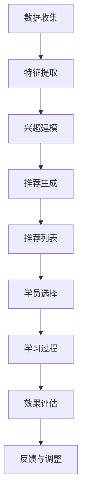

                 

# 知识付费让程序员实现职业理想

> 关键词：知识付费、程序员职业理想、技术成长、终身学习、职业规划

> 摘要：在当今快速变化的技术领域，知识付费成为了一种重要的学习方式，帮助程序员实现职业理想。本文将从知识付费的概念出发，探讨其对程序员职业成长的影响，通过具体案例分析知识付费的实际操作步骤，以及如何利用知识付费实现职业规划。最后，我们将展望未来的发展趋势和挑战，并提供学习资源和工具推荐。

## 1. 背景介绍

在过去的几十年里，技术领域经历了前所未有的变革。随着云计算、大数据、人工智能等新技术的兴起，程序员的角色也在不断演变。为了适应这些变化，程序员需要不断学习新的知识和技术。然而，传统的学习方式往往存在效率低下、成本高昂等问题。知识付费作为一种新兴的学习方式，正逐渐成为程序员实现职业理想的重要途径。

### 1.1 技术变革与学习需求

技术的快速发展使得程序员需要不断学习新的知识和技术。例如，云计算技术的发展催生了云原生应用开发的需求，而人工智能技术的进步则推动了机器学习和深度学习的应用。这些新技术不仅要求程序员掌握新的编程语言和框架，还需要理解其背后的原理和应用场景。

### 1.2 传统学习方式的局限性

传统的学习方式主要包括学校教育、在线课程和书籍阅读。虽然这些方式在一定程度上满足了程序员的学习需求，但也存在一些局限性。例如，学校教育往往侧重于理论知识的传授，而忽视了实践能力的培养；在线课程虽然提供了丰富的学习资源，但缺乏互动性和个性化指导；书籍阅读则需要较高的自学能力，且难以及时获取最新的技术信息。

### 1.3 知识付费的优势

知识付费作为一种新兴的学习方式，具有以下优势：

- **高效性**：知识付费平台通常提供结构化的学习路径和实时更新的内容，帮助程序员快速掌握新技术。
- **个性化**：知识付费平台可以根据学员的需求和兴趣提供定制化的学习方案，满足不同层次的学习需求。
- **互动性**：知识付费平台通常设有问答社区和讨论区，学员可以与其他学员和讲师进行互动交流，提高学习效果。
- **成本效益**：相比于传统的学习方式，知识付费平台通常提供更经济的学习方案，帮助程序员节省时间和金钱。

## 2. 核心概念与联系

### 2.1 知识付费的概念

知识付费是指通过付费获取特定领域的知识和技能。这种学习方式通常通过在线平台进行，学员可以根据自己的需求选择合适的学习内容和课程。

### 2.2 知识付费的流程

知识付费的流程可以分为以下几个步骤：

1. **需求分析**：学员根据自己的职业规划和兴趣，确定需要学习的知识领域。
2. **平台选择**：学员选择合适的知识付费平台，如Coursera、Udemy、Pluralsight等。
3. **课程选择**：学员根据自己的需求和兴趣，选择合适的课程。
4. **学习过程**：学员按照课程安排进行学习，包括观看视频、阅读文档、完成作业等。
5. **效果评估**：学员通过完成课程测试和项目实践，评估自己的学习效果。
6. **反馈与调整**：学员根据学习效果和反馈，调整学习计划和方法。

### 2.3 知识付费与职业规划的关系

知识付费与职业规划密切相关。通过知识付费，程序员可以快速掌握新技术，提高自己的技术水平，从而实现职业理想。具体来说，知识付费可以帮助程序员：

- **提升技术水平**：通过学习新的编程语言和框架，提高自己的技术水平。
- **拓宽职业路径**：通过学习不同的技术领域，拓宽自己的职业路径。
- **增强竞争力**：通过掌握最新的技术知识，增强自己的竞争力。
- **实现职业理想**：通过不断学习和提升，实现自己的职业理想。

## 3. 核心算法原理 & 具体操作步骤

### 3.1 知识付费平台的推荐算法

知识付费平台通常采用推荐算法来为学员推荐合适的课程。推荐算法的核心原理是通过分析学员的历史行为数据和兴趣偏好，预测学员可能感兴趣的内容。具体步骤如下：

1. **数据收集**：收集学员的历史行为数据，包括观看的课程、完成的作业、参与的讨论等。
2. **特征提取**：提取学员的行为特征，如观看时间、观看频率、完成作业情况等。
3. **兴趣建模**：通过机器学习算法，建立学员的兴趣模型，预测学员可能感兴趣的内容。
4. **推荐生成**：根据兴趣模型，生成推荐列表，为学员推荐合适的课程。

### 3.2 知识付费平台的推荐算法流程图



## 4. 数学模型和公式 & 详细讲解 & 举例说明

### 4.1 推荐算法的数学模型

推荐算法通常采用协同过滤和基于内容的推荐两种方法。协同过滤方法的核心原理是通过分析用户之间的相似性，为用户推荐相似用户喜欢的内容。基于内容的推荐方法的核心原理是通过分析内容之间的相似性，为用户推荐相似内容。

#### 4.1.1 协同过滤推荐算法

协同过滤推荐算法的核心公式为：

$$
\hat{r}_{ui} = \frac{\sum_{j \in N_i} \frac{r_{uj} - \mu_u}{|N_i|}}{\sum_{j \in N_i} \frac{1}{|N_i|}}
$$

其中，$\hat{r}_{ui}$ 表示用户 $u$ 对项目 $i$ 的预测评分，$r_{uj}$ 表示用户 $u$ 对项目 $j$ 的实际评分，$\mu_u$ 表示用户 $u$ 的平均评分，$N_i$ 表示与项目 $i$ 相似的项目集合。

#### 4.1.2 基于内容的推荐算法

基于内容的推荐算法的核心公式为：

$$
\hat{r}_{ui} = \sum_{j \in N_i} \frac{c_{ij} \cdot v_j}{\|v_i\| \cdot \|v_j\|}
$$

其中，$\hat{r}_{ui}$ 表示用户 $u$ 对项目 $i$ 的预测评分，$c_{ij}$ 表示项目 $i$ 和项目 $j$ 之间的相似度，$v_i$ 和 $v_j$ 分别表示项目 $i$ 和项目 $j$ 的特征向量。

### 4.2 举例说明

假设有一个知识付费平台，学员A对编程语言和框架非常感兴趣。通过分析学员A的历史行为数据，平台发现学员A经常观看Python和Java的课程，且对这两门语言的评分较高。因此，平台可以为学员A推荐其他与Python和Java相关的课程，如数据结构与算法、Web开发等。

## 5. 项目实战：代码实际案例和详细解释说明

### 5.1 开发环境搭建

为了实现知识付费平台的推荐算法，我们需要搭建一个开发环境。具体步骤如下：

1. **安装Python**：确保安装了Python 3.7及以上版本。
2. **安装依赖库**：使用pip安装所需的依赖库，如numpy、pandas、scikit-learn等。
3. **配置环境变量**：配置Python环境变量，确保可以在命令行中直接使用Python。

### 5.2 源代码详细实现和代码解读

以下是一个简单的协同过滤推荐算法的实现代码：

```python
import numpy as np
import pandas as pd
from sklearn.metrics.pairwise import cosine_similarity

# 假设我们有一个用户-项目评分矩阵
ratings_matrix = pd.DataFrame({
    'user1': [4, 3, 0, 0, 0],
    'user2': [0, 0, 4, 3, 0],
    'user3': [0, 0, 0, 0, 5],
    'user4': [5, 0, 0, 0, 0],
    'user5': [0, 5, 0, 0, 0]
})

# 计算用户之间的相似度
user_similarity = cosine_similarity(ratings_matrix.T)

# 为用户1推荐项目
user1_ratings = ratings_matrix.loc['user1']
user1_similarity = user_similarity[0]
user1_similarity[user1_ratings > 0] = 0  # 忽略用户1已经评分的项目
recommended_projects = user1_ratings + user1_similarity.dot(ratings_matrix.T)

# 输出推荐结果
print(recommended_projects)
```

### 5.3 代码解读与分析

上述代码实现了一个简单的协同过滤推荐算法。具体步骤如下：

1. **定义评分矩阵**：使用pandas库定义一个用户-项目评分矩阵。
2. **计算用户之间的相似度**：使用scikit-learn库中的cosine_similarity函数计算用户之间的相似度。
3. **为用户推荐项目**：为用户1计算推荐结果，忽略用户1已经评分的项目，计算其他用户对项目的评分，并将其与用户1的相似度相乘，得到推荐结果。

## 6. 实际应用场景

知识付费平台的推荐算法在实际应用中具有广泛的应用场景。例如，Coursera、Udemy等知识付费平台通过推荐算法为学员推荐合适的课程，提高学员的学习效果。此外，知识付费平台还可以通过推荐算法为学员推荐相关的学习资源，如书籍、论文和在线课程，帮助学员拓宽知识面。

## 7. 工具和资源推荐

### 7.1 学习资源推荐

- **书籍**：《推荐系统实践》、《机器学习》
- **论文**：《基于内容的推荐算法研究》、《协同过滤推荐算法综述》
- **博客**：阿里云开发者社区、CSDN
- **网站**：Coursera、Udemy、Pluralsight

### 7.2 开发工具框架推荐

- **Python库**：numpy、pandas、scikit-learn
- **开发工具**：PyCharm、Jupyter Notebook

### 7.3 相关论文著作推荐

- **论文**：《基于内容的推荐算法研究》、《协同过滤推荐算法综述》
- **著作**：《推荐系统实践》、《机器学习》

## 8. 总结：未来发展趋势与挑战

知识付费作为一种新兴的学习方式，具有广阔的发展前景。未来，知识付费平台将进一步提高推荐算法的准确性和个性化程度，为学员提供更加优质的学习体验。然而，知识付费也面临着一些挑战，如数据隐私保护、算法公平性等问题。因此，知识付费平台需要不断优化算法，提高用户体验，同时加强数据隐私保护，确保算法的公平性和透明性。

## 9. 附录：常见问题与解答

### 9.1 问题：如何选择合适的知识付费平台？

**解答**：选择知识付费平台时，可以从以下几个方面考虑：

- **课程质量**：选择课程质量高、评价好的平台。
- **讲师资质**：选择讲师资质高、经验丰富的平台。
- **学习资源**：选择提供丰富学习资源的平台。
- **用户评价**：参考其他学员的评价和反馈。

### 9.2 问题：如何提高学习效果？

**解答**：提高学习效果可以从以下几个方面入手：

- **制定学习计划**：制定详细的学习计划，确保学习有条不紊。
- **积极参与讨论**：积极参与平台上的讨论和交流，提高学习效果。
- **实践应用**：将所学知识应用于实际项目中，提高实践能力。
- **持续学习**：持续学习新技术，保持技术的先进性。

## 10. 扩展阅读 & 参考资料

- **书籍**：《推荐系统实践》、《机器学习》
- **论文**：《基于内容的推荐算法研究》、《协同过滤推荐算法综述》
- **网站**：Coursera、Udemy、Pluralsight

---

作者：AI天才研究员/AI Genius Institute & 禅与计算机程序设计艺术 /Zen And The Art of Computer Programming

