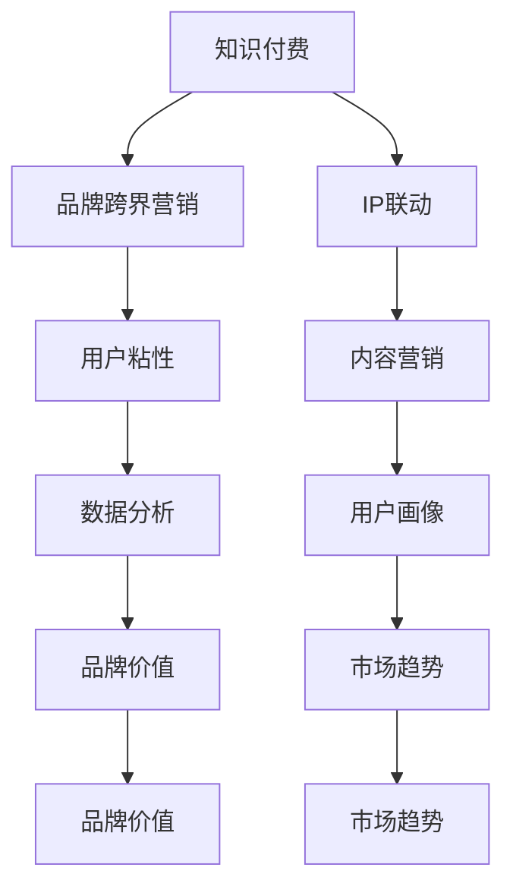

                 

# 知识付费赚钱的品牌跨界营销与IP联动策略

> 关键词：知识付费、品牌跨界营销、IP联动、用户粘性、内容营销、数据分析、用户画像、品牌价值、市场趋势

> 摘要：本文旨在探讨如何通过知识付费的方式，结合品牌跨界营销和IP联动策略，构建一个高效的内容营销体系，以提升品牌价值和用户粘性。我们将从背景介绍、核心概念与联系、核心算法原理与具体操作步骤、数学模型和公式、项目实战、实际应用场景、工具和资源推荐、总结与未来发展趋势等方面进行详细分析。

## 1. 背景介绍

随着互联网技术的快速发展，知识付费已经成为一种新兴的商业模式。用户愿意为高质量的内容付费，而内容创作者和品牌方则可以通过知识付费获得收益。品牌跨界营销和IP联动策略是提升品牌价值和用户粘性的有效手段。本文将探讨如何通过知识付费的方式，结合品牌跨界营销和IP联动策略，构建一个高效的内容营销体系。

## 2. 核心概念与联系

### 2.1 知识付费

知识付费是指用户为获取高质量的内容而支付费用的一种商业模式。它包括但不限于在线课程、电子书、音频课程、视频课程等形式。

### 2.2 品牌跨界营销

品牌跨界营销是指不同品牌之间通过合作，共同推广产品或服务，以达到提升品牌知名度和用户粘性的目的。

### 2.3 IP联动

IP联动是指通过不同平台和渠道，将同一IP（知识产权）进行多维度、多形式的开发和推广，以提升IP的影响力和商业价值。

### 2.4 用户粘性

用户粘性是指用户对某个品牌或产品的依赖程度和忠诚度。高用户粘性有助于提升品牌价值和市场占有率。

### 2.5 内容营销

内容营销是指通过创造和分享有价值的内容，吸引和保留目标受众，以达到品牌推广和销售的目的。

### 2.6 数据分析

数据分析是指通过收集、处理和分析数据，以获取有价值的信息和洞察，为决策提供支持。

### 2.7 用户画像

用户画像是指通过收集和分析用户数据，构建用户特征模型，以更好地理解用户需求和行为。

### 2.8 品牌价值

品牌价值是指品牌在消费者心中的认知和评价，包括品牌知名度、美誉度、忠诚度等。

### 2.9 市场趋势

市场趋势是指市场中长期的发展方向和变化趋势，包括技术趋势、用户需求变化等。

#### 2.9.1 Mermaid 流程图



## 3. 核心算法原理 & 具体操作步骤

### 3.1 知识付费平台搭建

1. **需求分析**：明确知识付费平台的目标用户群体、内容类型、定价策略等。
2. **技术选型**：选择合适的开发框架和技术栈，如Django、Flask、React等。
3. **功能设计**：设计用户注册、登录、支付、课程购买、内容展示等功能。
4. **数据库设计**：设计用户表、课程表、订单表等数据库表结构。
5. **前端开发**：使用React或Vue等前端框架进行页面开发。
6. **后端开发**：使用Django或Flask等后端框架进行业务逻辑开发。
7. **支付接口集成**：集成第三方支付接口，如支付宝、微信支付等。
8. **测试与上线**：进行功能测试、性能测试，确保平台稳定运行后上线。

### 3.2 品牌跨界营销策略

1. **品牌定位**：明确品牌定位和目标用户群体。
2. **合作对象选择**：选择与品牌定位相符的合作对象。
3. **合作形式**：确定合作形式，如联合营销、联合推广等。
4. **营销活动策划**：策划营销活动，如联合促销、联合广告等。
5. **执行与监控**：执行营销活动，监控效果并进行调整。

### 3.3 IP联动策略

1. **IP选择**：选择具有较高商业价值的IP。
2. **IP开发**：开发IP的多种形式，如书籍、电影、游戏等。
3. **IP推广**：通过多种渠道推广IP，如社交媒体、线下活动等。
4. **IP合作**：与其他品牌合作，共同推广IP。
5. **IP维护**：维护IP的影响力和商业价值。

## 4. 数学模型和公式 & 详细讲解 & 举例说明

### 4.1 用户粘性模型

用户粘性可以通过以下公式进行计算：

$$
粘性 = \frac{活跃用户数}{总用户数} \times 100\%
$$

### 4.2 品牌价值模型

品牌价值可以通过以下公式进行计算：

$$
品牌价值 = 品牌知名度 \times 品牌美誉度 \times 品牌忠诚度
$$

### 4.3 市场趋势预测模型

市场趋势可以通过以下公式进行预测：

$$
趋势预测 = \frac{\sum_{i=1}^{n} (实际值 - 预测值)^2}{n}
$$

### 4.4 用户画像构建

用户画像可以通过以下步骤进行构建：

1. **数据收集**：收集用户的基本信息、行为数据等。
2. **数据清洗**：对收集的数据进行清洗，去除无效数据。
3. **特征提取**：提取用户的基本特征和行为特征。
4. **模型训练**：使用机器学习算法训练用户画像模型。
5. **模型评估**：评估模型的准确性和稳定性。
6. **模型应用**：将模型应用于实际场景，如个性化推荐等。

## 5. 项目实战：代码实际案例和详细解释说明

### 5.1 开发环境搭建

1. **安装Python**：确保安装了Python 3.8及以上版本。
2. **安装Django**：使用pip安装Django。
3. **安装React**：使用npm安装React。
4. **安装数据库**：安装MySQL或PostgreSQL数据库。
5. **安装支付接口**：安装支付宝或微信支付的SDK。

### 5.2 源代码详细实现和代码解读

#### 5.2.1 用户注册与登录

```python
# users/views.py
from django.contrib.auth import login, authenticate
from django.shortcuts import render, redirect

def register(request):
    if request.method == 'POST':
        # 处理注册逻辑
        return redirect('login')
    return render(request, 'register.html')

def login_view(request):
    if request.method == 'POST':
        # 处理登录逻辑
        return redirect('home')
    return render(request, 'login.html')
```

#### 5.2.2 课程购买与支付

```python
# courses/views.py
from django.shortcuts import render, redirect
from django.contrib.auth.decorators import login_required
from django.conf import settings
from django.http import JsonResponse
import requests

@login_required
def purchase_course(request, course_id):
    # 处理购买逻辑
    return JsonResponse({'status': 'success'})

def payment_callback(request):
    # 处理支付回调逻辑
    return JsonResponse({'status': 'success'})
```

#### 5.2.3 内容展示

```python
# courses/views.py
from django.shortcuts import render
from .models import Course

def course_detail(request, course_id):
    course = Course.objects.get(id=course_id)
    return render(request, 'course_detail.html', {'course': course})
```

### 5.3 代码解读与分析

1. **用户注册与登录**：通过Django的认证系统实现用户注册和登录功能。
2. **课程购买与支付**：通过支付接口实现课程购买和支付功能。
3. **内容展示**：通过Django的模型和视图实现课程内容的展示功能。

## 6. 实际应用场景

### 6.1 知识付费平台

1. **在线课程**：提供高质量的在线课程，用户可以付费购买。
2. **电子书**：提供电子书下载服务，用户可以付费购买。
3. **音频课程**：提供音频课程，用户可以付费订阅。

### 6.2 品牌跨界营销

1. **联合营销**：与其他品牌合作，共同推广产品或服务。
2. **联合广告**：与其他品牌合作，共同投放广告。
3. **联合促销**：与其他品牌合作，共同进行促销活动。

### 6.3 IP联动

1. **书籍**：开发IP的书籍，通过出版社进行出版。
2. **电影**：开发IP的电影，通过电影公司进行拍摄。
3. **游戏**：开发IP的游戏，通过游戏公司进行开发。

## 7. 工具和资源推荐

### 7.1 学习资源推荐

1. **书籍**：《精益创业》、《用户画像》、《数据分析》等。
2. **论文**：《知识付费的商业模式研究》、《品牌跨界营销策略分析》等。
3. **博客**：知乎、CSDN、掘金等。
4. **网站**：GitHub、Stack Overflow、Medium等。

### 7.2 开发工具框架推荐

1. **前端框架**：React、Vue、Angular等。
2. **后端框架**：Django、Flask、Express等。
3. **数据库**：MySQL、PostgreSQL、MongoDB等。
4. **支付接口**：支付宝、微信支付、PayPal等。

### 7.3 相关论文著作推荐

1. **论文**：《知识付费的商业模式研究》、《品牌跨界营销策略分析》等。
2. **著作**：《用户画像》、《数据分析》等。

## 8. 总结：未来发展趋势与挑战

### 8.1 未来发展趋势

1. **技术趋势**：人工智能、大数据、区块链等技术将进一步推动知识付费和品牌跨界营销的发展。
2. **用户需求变化**：用户对高质量内容的需求将越来越高，品牌跨界营销和IP联动将成为提升品牌价值和用户粘性的有效手段。
3. **市场趋势**：知识付费和品牌跨界营销将成为主流商业模式，市场前景广阔。

### 8.2 挑战

1. **技术挑战**：如何利用新技术提升用户体验和内容质量。
2. **市场挑战**：如何在激烈的市场竞争中脱颖而出。
3. **用户挑战**：如何满足用户多样化的需求，提升用户粘性。

## 9. 附录：常见问题与解答

### 9.1 问题1：如何选择合适的支付接口？

**解答**：选择支付接口时，需要考虑支付接口的稳定性、安全性、支付成功率等因素。可以参考第三方支付平台的评价和用户反馈，选择信誉良好的支付接口。

### 9.2 问题2：如何构建用户画像？

**解答**：构建用户画像时，需要收集用户的基本信息、行为数据等。可以使用机器学习算法进行特征提取和模型训练，以提高用户画像的准确性和稳定性。

### 9.3 问题3：如何进行市场趋势预测？

**解答**：进行市场趋势预测时，可以使用时间序列分析、回归分析等方法。需要收集历史数据，进行数据清洗和特征提取，然后使用机器学习算法进行预测。

## 10. 扩展阅读 & 参考资料

1. **书籍**：《精益创业》、《用户画像》、《数据分析》等。
2. **论文**：《知识付费的商业模式研究》、《品牌跨界营销策略分析》等。
3. **博客**：知乎、CSDN、掘金等。
4. **网站**：GitHub、Stack Overflow、Medium等。

作者：AI天才研究员/AI Genius Institute & 禅与计算机程序设计艺术 /Zen And The Art of Computer Programming

