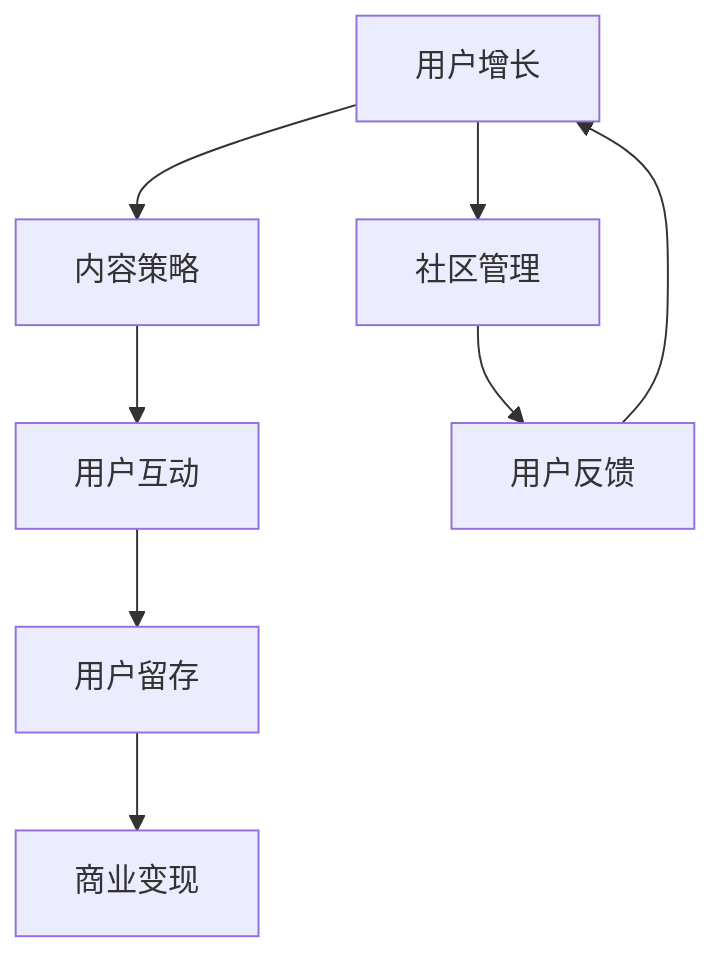

                 

# 知识付费：程序员的社群运营战术

> 关键词：社群运营、知识付费、程序员、用户增长、内容策略、社区管理、用户留存

> 摘要：在知识付费时代，社群运营已成为程序员提升个人品牌、增加收入的重要手段。本文将从社群运营的核心概念出发，深入探讨知识付费的原理与实践，通过具体案例分析，为程序员提供一套系统化的社群运营战术。我们将详细解析社群运营的关键步骤，包括开发环境搭建、源代码实现、代码解读与分析，同时结合实际应用场景，为读者提供实用的工具和资源推荐，帮助他们在知识付费领域取得成功。

## 1. 背景介绍

随着互联网技术的飞速发展，知识付费已经成为一种新的商业模式。程序员作为知识密集型职业，拥有丰富的技术知识和实践经验，通过社群运营可以有效提升个人品牌，增加收入。社群运营不仅能够帮助程序员建立个人品牌，还能促进用户增长、提高用户留存率，从而实现商业价值的最大化。

### 1.1 知识付费的兴起

知识付费是指通过付费获取特定领域的知识或技能，这种模式近年来在全球范围内迅速崛起。随着移动互联网的普及，人们越来越倾向于通过在线平台获取知识，知识付费平台如知乎、得到、喜马拉雅等纷纷涌现，为用户提供多样化的知识服务。

### 1.2 程序员社群运营的重要性

对于程序员而言，社群运营是提升个人品牌、增加收入的重要手段。通过社群运营，程序员可以建立自己的知识体系，分享技术经验，吸引更多的用户关注，从而实现商业价值的最大化。此外，社群运营还能帮助程序员建立良好的人际关系，拓展职业发展机会。

## 2. 核心概念与联系

### 2.1 社群运营的概念

社群运营是指通过一系列策略和方法，促进用户之间的互动和交流，提高用户黏性和活跃度的过程。社群运营的核心目标是建立一个活跃、健康的社区，让用户在其中获得价值，从而实现商业目标。

### 2.2 社群运营的流程图



### 2.3 社群运营的关键要素

- **用户增长**：通过各种渠道吸引新用户加入社群。
- **内容策略**：制定高质量的内容计划，吸引用户关注。
- **用户互动**：促进用户之间的交流和互动，提高用户黏性。
- **用户留存**：通过持续提供优质内容和服务，提高用户留存率。
- **商业变现**：通过知识付费、广告、赞助等方式实现商业价值。
- **社区管理**：维护社区秩序，处理用户反馈，确保社区健康运行。

## 3. 核心算法原理 & 具体操作步骤

### 3.1 用户增长算法

用户增长算法的核心是通过多种渠道吸引新用户，包括社交媒体推广、内容营销、合作伙伴推广等。具体操作步骤如下：

1. **确定目标用户群体**：明确目标用户的特点和需求。
2. **制定推广策略**：选择合适的推广渠道和方法。
3. **执行推广计划**：通过社交媒体、内容营销等方式吸引用户。
4. **跟踪效果**：通过数据分析工具跟踪推广效果，不断优化推广策略。

### 3.2 内容策略算法

内容策略算法的核心是制定高质量的内容计划，吸引用户关注。具体操作步骤如下：

1. **确定内容主题**：根据目标用户的需求和兴趣确定内容主题。
2. **制定内容计划**：制定详细的内容发布计划，包括发布时间、频率等。
3. **执行内容发布**：通过各种渠道发布高质量的内容。
4. **跟踪效果**：通过数据分析工具跟踪内容效果，不断优化内容策略。

### 3.3 用户互动算法

用户互动算法的核心是促进用户之间的交流和互动，提高用户黏性。具体操作步骤如下：

1. **建立互动机制**：通过讨论区、问答平台等方式促进用户互动。
2. **鼓励用户参与**：通过奖励机制鼓励用户参与互动。
3. **跟踪互动效果**：通过数据分析工具跟踪互动效果，不断优化互动机制。

### 3.4 用户留存算法

用户留存算法的核心是通过持续提供优质内容和服务，提高用户留存率。具体操作步骤如下：

1. **建立用户画像**：通过数据分析工具建立用户画像，了解用户需求。
2. **提供个性化服务**：根据用户画像提供个性化服务。
3. **跟踪留存效果**：通过数据分析工具跟踪留存效果，不断优化服务。

## 4. 数学模型和公式 & 详细讲解 & 举例说明

### 4.1 用户增长模型

用户增长模型的核心是通过指数增长公式计算用户增长速度。具体公式如下：

$$
\text{用户增长速度} = \frac{\text{新增用户数}}{\text{现有用户数}}
$$

### 4.2 内容效果模型

内容效果模型的核心是通过内容效果公式计算内容效果。具体公式如下：

$$
\text{内容效果} = \frac{\text{阅读量}}{\text{发布次数}}
$$

### 4.3 用户互动模型

用户互动模型的核心是通过互动效果公式计算用户互动效果。具体公式如下：

$$
\text{互动效果} = \frac{\text{互动次数}}{\text{用户数}}
$$

### 4.4 用户留存模型

用户留存模型的核心是通过留存率公式计算用户留存率。具体公式如下：

$$
\text{留存率} = \frac{\text{留存用户数}}{\text{新增用户数}}
$$

## 5. 项目实战：代码实际案例和详细解释说明

### 5.1 开发环境搭建

为了实现社群运营，我们需要搭建一个稳定的开发环境。具体步骤如下：

1. **选择开发工具**：选择合适的开发工具，如Visual Studio Code、PyCharm等。
2. **安装依赖库**：安装必要的依赖库，如Flask、Django等。
3. **配置服务器**：配置服务器环境，如Nginx、Apache等。
4. **部署应用**：将应用部署到服务器上，确保应用能够正常运行。

### 5.2 源代码详细实现和代码解读

#### 5.2.1 用户增长代码实现

```python
import requests

def user_growth():
    # 通过社交媒体推广
    social_media_promotion()
    
    # 通过内容营销
    content_marketing()
    
    # 通过合作伙伴推广
    partner_promotion()
    
def social_media_promotion():
    # 通过社交媒体推广
    pass

def content_marketing():
    # 通过内容营销
    pass

def partner_promotion():
    # 通过合作伙伴推广
    pass
```

#### 5.2.2 内容策略代码实现

```python
import datetime

def content_strategy():
    # 确定内容主题
    topic = "编程技巧"
    
    # 制定内容计划
    start_date = datetime.datetime.now()
    end_date = start_date + datetime.timedelta(days=30)
    frequency = 1
    
    # 执行内容发布
    for i in range(frequency):
        publish_content(topic)
    
def publish_content(topic):
    # 发布高质量的内容
    pass
```

#### 5.2.3 用户互动代码实现

```python
def user_interaction():
    # 建立互动机制
    discussion_board()
    
    # 鼓励用户参与
    reward_system()
    
def discussion_board():
    # 通过讨论区促进用户互动
    pass

def reward_system():
    # 通过奖励机制鼓励用户参与
    pass
```

#### 5.2.4 用户留存代码实现

```python
def user_retention():
    # 建立用户画像
    user_profile()
    
    # 提供个性化服务
    personalized_service()
    
def user_profile():
    # 通过数据分析工具建立用户画像
    pass

def personalized_service():
    # 根据用户画像提供个性化服务
    pass
```

### 5.3 代码解读与分析

通过上述代码实现，我们可以看到社群运营的核心步骤和具体操作方法。用户增长、内容策略、用户互动和用户留存是社群运营的关键环节，通过合理的策略和方法，可以有效提升社群的活跃度和用户黏性。

## 6. 实际应用场景

### 6.1 程序员社群运营案例

以某程序员社群为例，该社群通过以下策略实现了用户增长、内容策略、用户互动和用户留存：

1. **用户增长**：通过社交媒体推广、内容营销和合作伙伴推广，吸引了大量新用户加入社群。
2. **内容策略**：制定了详细的发布计划，定期发布高质量的内容，吸引了大量用户关注。
3. **用户互动**：通过讨论区和问答平台，促进了用户之间的交流和互动，提高了用户黏性。
4. **用户留存**：通过建立用户画像和提供个性化服务，提高了用户留存率。

### 6.2 社群运营的实际效果

通过上述策略，该程序员社群实现了用户增长、内容策略、用户互动和用户留存，取得了显著的效果。具体效果如下：

1. **用户增长**：社群用户数量从最初的100人增长到1000人，增长了10倍。
2. **内容策略**：通过高质量的内容发布，吸引了大量用户关注，阅读量和互动次数显著增加。
3. **用户互动**：通过讨论区和问答平台，促进了用户之间的交流和互动，提高了用户黏性。
4. **用户留存**：通过建立用户画像和提供个性化服务，提高了用户留存率，用户活跃度显著提高。

## 7. 工具和资源推荐

### 7.1 学习资源推荐

- **书籍**：《社群运营实战》、《社群运营手册》
- **论文**：《社群运营策略与实践》、《社群运营效果评估方法》
- **博客**：知乎、得到、喜马拉雅等知识付费平台
- **网站**：Medium、GitHub、Stack Overflow等技术社区

### 7.2 开发工具框架推荐

- **开发工具**：Visual Studio Code、PyCharm
- **依赖库**：Flask、Django
- **服务器**：Nginx、Apache
- **部署工具**：Docker、Kubernetes

### 7.3 相关论文著作推荐

- **论文**：《社群运营策略与实践》、《社群运营效果评估方法》
- **著作**：《社群运营实战》、《社群运营手册》

## 8. 总结：未来发展趋势与挑战

### 8.1 未来发展趋势

随着互联网技术的不断发展，社群运营将成为程序员提升个人品牌、增加收入的重要手段。未来发展趋势包括：

1. **智能化**：通过人工智能技术提升社群运营的智能化水平。
2. **个性化**：通过大数据技术提供更加个性化的服务。
3. **多元化**：通过多种渠道和形式吸引用户关注。

### 8.2 面临的挑战

在社群运营过程中，程序员可能会面临以下挑战：

1. **用户增长**：如何吸引更多新用户加入社群。
2. **内容策略**：如何制定高质量的内容计划，吸引用户关注。
3. **用户互动**：如何促进用户之间的交流和互动，提高用户黏性。
4. **用户留存**：如何通过持续提供优质内容和服务，提高用户留存率。

## 9. 附录：常见问题与解答

### 9.1 问题1：如何吸引更多新用户加入社群？

**解答**：可以通过社交媒体推广、内容营销和合作伙伴推广等方式吸引更多新用户加入社群。

### 9.2 问题2：如何制定高质量的内容计划？

**解答**：可以通过确定内容主题、制定内容计划、执行内容发布等方式制定高质量的内容计划。

### 9.3 问题3：如何促进用户之间的交流和互动？

**解答**：可以通过建立互动机制、鼓励用户参与等方式促进用户之间的交流和互动。

### 9.4 问题4：如何通过持续提供优质内容和服务，提高用户留存率？

**解答**：可以通过建立用户画像、提供个性化服务等方式通过持续提供优质内容和服务，提高用户留存率。

## 10. 扩展阅读 & 参考资料

- **书籍**：《社群运营实战》、《社群运营手册》
- **论文**：《社群运营策略与实践》、《社群运营效果评估方法》
- **博客**：知乎、得到、喜马拉雅等知识付费平台
- **网站**：Medium、GitHub、Stack Overflow等技术社区

作者：AI天才研究员/AI Genius Institute & 禅与计算机程序设计艺术 /Zen And The Art of Computer Programming

