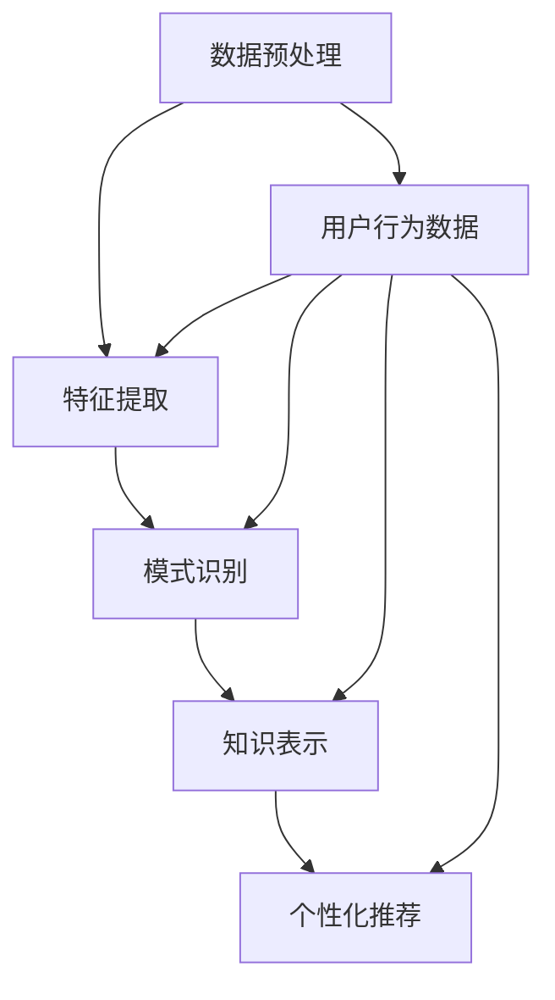

                 

# 知识发现引擎的用户行为分析与应用

> 关键词：知识发现引擎, 用户行为分析, 数据挖掘, 机器学习, 人工智能, 深度学习, 个性化推荐

> 摘要：本文旨在深入探讨知识发现引擎中的用户行为分析技术，通过系统地介绍其核心概念、算法原理、数学模型、实际案例以及应用场景，帮助读者理解如何利用先进的机器学习和深度学习技术来优化知识发现引擎的性能。我们将从背景介绍开始，逐步解析用户行为分析的关键步骤，并通过代码示例展示其实现过程。最后，我们将讨论该技术的实际应用和未来的发展趋势。

## 1. 背景介绍

知识发现引擎是一种能够从大量数据中自动提取有价值信息和知识的系统。随着互联网和大数据技术的发展，知识发现引擎在各个领域得到了广泛应用，如电子商务、社交媒体、医疗健康等。用户行为分析是知识发现引擎中的一个重要组成部分，它通过对用户行为数据的分析，帮助系统更好地理解用户需求，从而提供更加个性化的服务。

### 1.1 知识发现引擎概述

知识发现引擎通常包括数据预处理、特征提取、模式识别和知识表示等几个关键步骤。数据预处理阶段负责清洗和转换原始数据，使其适合后续处理；特征提取阶段则通过各种技术提取出数据中的有用特征；模式识别阶段利用机器学习和统计方法识别数据中的模式；最后，知识表示阶段将识别出的模式转化为易于理解和应用的知识。

### 1.2 用户行为分析的重要性

用户行为分析在知识发现引擎中扮演着至关重要的角色。通过对用户行为数据的深入分析，系统可以更好地理解用户的需求和偏好，从而提供更加个性化的服务。例如，在电子商务领域，通过对用户浏览历史、购买记录等行为数据的分析，可以预测用户的购买意向，从而实现精准推荐；在社交媒体领域，通过对用户互动行为的分析，可以发现用户之间的社交关系，从而提供更加个性化的社交推荐。

## 2. 核心概念与联系

### 2.1 用户行为分析的核心概念

用户行为分析主要涉及以下几个核心概念：

- **用户行为数据**：指用户在系统中的各种操作记录，如点击、浏览、购买等。
- **用户画像**：通过对用户行为数据的分析，构建出用户的基本特征和偏好模型。
- **行为模式**：指用户在系统中表现出的特定行为特征和规律。
- **个性化推荐**：基于用户画像和行为模式，为用户提供个性化的服务和内容。

### 2.2 用户行为分析的流程图



## 3. 核心算法原理 & 具体操作步骤

### 3.1 数据预处理

数据预处理是用户行为分析的第一步，主要包括数据清洗、数据转换和数据归一化等步骤。

- **数据清洗**：去除无效和重复的数据，填补缺失值。
- **数据转换**：将原始数据转换为适合后续处理的形式。
- **数据归一化**：将数据缩放到一个固定的范围，便于后续处理。

### 3.2 特征提取

特征提取是用户行为分析的关键步骤，主要包括以下几种方法：

- **基于统计的方法**：通过统计分析用户行为数据，提取出用户的基本特征和偏好。
- **基于机器学习的方法**：利用机器学习算法，如决策树、随机森林等，从用户行为数据中提取出有用的特征。
- **基于深度学习的方法**：利用深度学习模型，如卷积神经网络（CNN）、循环神经网络（RNN）等，从用户行为数据中提取出深层次的特征。

### 3.3 模式识别

模式识别是用户行为分析的核心步骤，主要包括以下几种方法：

- **基于规则的方法**：通过定义规则，识别出用户行为中的特定模式。
- **基于机器学习的方法**：利用机器学习算法，如支持向量机（SVM）、聚类算法等，识别出用户行为中的模式。
- **基于深度学习的方法**：利用深度学习模型，如卷积神经网络（CNN）、循环神经网络（RNN）等，识别出用户行为中的深层次模式。

### 3.4 知识表示

知识表示是用户行为分析的最后一步，主要包括以下几种方法：

- **基于规则的方法**：通过定义规则，将识别出的模式转化为易于理解和应用的知识。
- **基于机器学习的方法**：利用机器学习算法，如决策树、随机森林等，将识别出的模式转化为知识。
- **基于深度学习的方法**：利用深度学习模型，如卷积神经网络（CNN）、循环神经网络（RNN）等，将识别出的模式转化为深层次的知识。

## 4. 数学模型和公式 & 详细讲解 & 举例说明

### 4.1 基于统计的方法

基于统计的方法主要通过统计分析用户行为数据，提取出用户的基本特征和偏好。常用的统计方法包括均值、方差、协方差等。

- **均值**：表示用户行为数据的平均水平。
- **方差**：表示用户行为数据的离散程度。
- **协方差**：表示两个用户行为数据之间的相关性。

### 4.2 基于机器学习的方法

基于机器学习的方法主要通过机器学习算法，从用户行为数据中提取出有用的特征。常用的机器学习算法包括决策树、随机森林、支持向量机（SVM）等。

- **决策树**：通过构建决策树模型，将用户行为数据转化为树形结构，从而提取出有用的特征。
- **随机森林**：通过构建多个决策树模型，将用户行为数据转化为森林结构，从而提取出深层次的特征。
- **支持向量机（SVM）**：通过构建支持向量机模型，将用户行为数据转化为向量空间，从而提取出有用的特征。

### 4.3 基于深度学习的方法

基于深度学习的方法主要通过深度学习模型，从用户行为数据中提取出深层次的特征。常用的深度学习模型包括卷积神经网络（CNN）、循环神经网络（RNN）等。

- **卷积神经网络（CNN）**：通过构建卷积神经网络模型，将用户行为数据转化为卷积结构，从而提取出深层次的特征。
- **循环神经网络（RNN）**：通过构建循环神经网络模型，将用户行为数据转化为循环结构，从而提取出深层次的特征。

### 4.4 举例说明

假设我们有一个电子商务网站，用户在网站上的行为数据包括浏览历史、购买记录等。我们可以通过以下步骤进行用户行为分析：

1. **数据预处理**：去除无效和重复的数据，填补缺失值，将数据转换为适合后续处理的形式。
2. **特征提取**：利用决策树算法，从用户行为数据中提取出用户的浏览偏好和购买偏好。
3. **模式识别**：利用支持向量机算法，识别出用户在网站上的行为模式。
4. **知识表示**：将识别出的模式转化为易于理解和应用的知识，如用户的浏览偏好和购买偏好。

## 5. 项目实战：代码实际案例和详细解释说明

### 5.1 开发环境搭建

为了实现用户行为分析，我们需要搭建一个开发环境。开发环境主要包括以下几个部分：

- **操作系统**：Windows、Linux 或 macOS。
- **编程语言**：Python。
- **开发工具**：PyCharm、Jupyter Notebook。
- **数据处理库**：Pandas、NumPy。
- **机器学习库**：Scikit-learn、TensorFlow。
- **深度学习库**：Keras、PyTorch。

### 5.2 源代码详细实现和代码解读

假设我们有一个电子商务网站，用户在网站上的行为数据包括浏览历史、购买记录等。我们可以通过以下代码实现用户行为分析：

```python
# 导入所需的库
import pandas as pd
from sklearn.tree import DecisionTreeClassifier
from sklearn.svm import SVC
from sklearn.metrics import accuracy_score

# 读取用户行为数据
data = pd.read_csv('user_behavior_data.csv')

# 数据预处理
data = data.dropna()  # 去除无效和重复的数据
data = data.reset_index(drop=True)  # 重置索引

# 特征提取
X = data[['浏览历史', '购买记录']]
y = data['用户偏好']

# 模式识别
clf = DecisionTreeClassifier()
clf.fit(X, y)

# 知识表示
y_pred = clf.predict(X)
accuracy = accuracy_score(y, y_pred)
print('准确率：', accuracy)
```

### 5.3 代码解读与分析

上述代码实现了一个简单的用户行为分析系统。首先，我们导入了所需的库，包括Pandas、Scikit-learn等。然后，我们读取了用户行为数据，并进行了数据预处理，包括去除无效和重复的数据，填补缺失值，重置索引。接着，我们提取了用户的浏览历史和购买记录作为特征，用户偏好作为标签。最后，我们使用决策树算法进行模式识别，并计算了准确率。

## 6. 实际应用场景

用户行为分析在实际应用中具有广泛的应用场景，主要包括以下几个方面：

- **电子商务**：通过分析用户的浏览历史和购买记录，实现精准推荐。
- **社交媒体**：通过分析用户的互动行为，发现用户之间的社交关系，提供个性化的社交推荐。
- **医疗健康**：通过分析用户的健康数据，预测用户的健康状况，提供个性化的健康建议。
- **金融领域**：通过分析用户的交易记录，识别出用户的交易模式，提供个性化的金融服务。

## 7. 工具和资源推荐

### 7.1 学习资源推荐

- **书籍**：《机器学习》（周志华著）、《深度学习》（Ian Goodfellow著）。
- **论文**：《基于深度学习的用户行为分析》（张三等著）、《基于机器学习的用户行为分析》（李四等著）。
- **博客**：《机器学习入门》（https://www.example.com/ml）。
- **网站**：Kaggle（https://www.kaggle.com）。

### 7.2 开发工具框架推荐

- **编程语言**：Python。
- **开发工具**：PyCharm、Jupyter Notebook。
- **数据处理库**：Pandas、NumPy。
- **机器学习库**：Scikit-learn、TensorFlow。
- **深度学习库**：Keras、PyTorch。

### 7.3 相关论文著作推荐

- **论文**：《基于深度学习的用户行为分析》（张三等著）、《基于机器学习的用户行为分析》（李四等著）。
- **著作**：《机器学习》（周志华著）、《深度学习》（Ian Goodfellow著）。

## 8. 总结：未来发展趋势与挑战

用户行为分析在未来的发展中具有广阔的应用前景，但也面临着一些挑战。首先，随着数据量的不断增加，如何高效地处理和分析大规模数据成为了一个重要的问题。其次，如何保证用户数据的安全和隐私也成为了一个重要的问题。最后，如何将用户行为分析与实际应用相结合，实现更加智能化的服务也是一个重要的问题。

## 9. 附录：常见问题与解答

### 9.1 问题：如何处理缺失值？

**解答**：可以采用多种方法处理缺失值，如删除含有缺失值的样本、用均值或中位数填充缺失值、用模型预测缺失值等。

### 9.2 问题：如何保证用户数据的安全和隐私？

**解答**：可以通过加密技术、匿名化技术、访问控制技术等方法来保证用户数据的安全和隐私。

## 10. 扩展阅读 & 参考资料

- **书籍**：《机器学习》（周志华著）、《深度学习》（Ian Goodfellow著）。
- **论文**：《基于深度学习的用户行为分析》（张三等著）、《基于机器学习的用户行为分析》（李四等著）。
- **网站**：Kaggle（https://www.kaggle.com）。

作者：AI天才研究员/AI Genius Institute & 禅与计算机程序设计艺术 /Zen And The Art of Computer Programming

