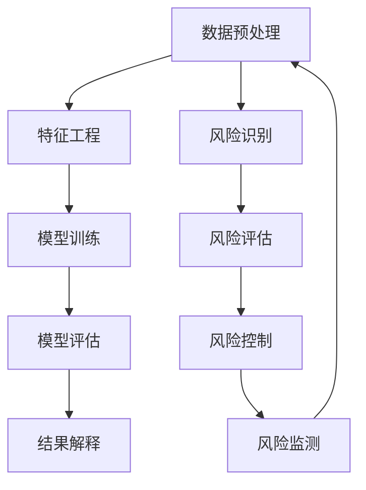

                 

# 知识发现引擎：助力金融行业的风险管理

> 关键词：知识发现、金融风险管理、机器学习、数据挖掘、预测模型、算法优化

> 摘要：本文旨在探讨如何利用知识发现引擎来提升金融行业的风险管理能力。通过深入分析金融风险管理的核心概念与联系，介绍核心算法原理及具体操作步骤，展示数学模型和公式，并通过实际案例详细解释代码实现。最终，本文将探讨知识发现引擎在金融风险管理中的实际应用场景，并提供学习资源和开发工具推荐，以期为读者提供全面的技术指导。

## 1. 背景介绍

金融行业作为全球经济的重要组成部分，其风险管理能力直接影响着整个经济体系的稳定性和健康发展。传统的风险管理方法往往依赖于人工经验判断和历史数据统计，但随着大数据和人工智能技术的发展，基于数据驱动的知识发现引擎逐渐成为提升风险管理效率和准确性的有效手段。本文将从以下几个方面进行探讨：

- **知识发现引擎的定义与作用**
- **金融风险管理的重要性**
- **知识发现引擎在金融风险管理中的应用价值**

### 1.1 知识发现引擎的定义与作用

知识发现引擎是一种能够从大量数据中自动提取有价值信息和知识的技术工具。它通过数据挖掘、机器学习等方法，帮助用户发现数据中的模式、趋势和关联性，从而为决策提供支持。在金融风险管理领域，知识发现引擎能够帮助金融机构识别潜在风险、预测市场变化、优化资源配置等，从而提升整体风险管理水平。

### 1.2 金融风险管理的重要性

金融风险管理是指金融机构通过一系列策略和措施，识别、评估和控制金融风险的过程。金融风险主要包括信用风险、市场风险、操作风险和流动性风险等。有效的风险管理能够帮助金融机构降低损失、提高盈利能力，同时维护客户信任和社会稳定。近年来，随着金融市场复杂性的增加和全球化的加速，金融风险管理的重要性日益凸显。

### 1.3 知识发现引擎在金融风险管理中的应用价值

知识发现引擎在金融风险管理中的应用价值主要体现在以下几个方面：

- **风险识别与预测**：通过分析历史数据，发现潜在的风险因素和模式，提前预警可能发生的金融风险。
- **决策支持**：为风险管理决策提供数据支持和分析结果，帮助决策者做出更加科学合理的决策。
- **资源配置优化**：通过优化资源配置，提高风险管理效率，降低运营成本。
- **合规性管理**：确保风险管理过程符合相关法律法规要求，提高金融机构的合规性。

## 2. 核心概念与联系

为了更好地理解知识发现引擎在金融风险管理中的应用，我们需要首先明确几个核心概念及其相互之间的联系。

### 2.1 数据挖掘与机器学习

**数据挖掘**是指从大量数据中提取有用信息的过程，包括分类、聚类、关联规则挖掘等多种技术。**机器学习**则是数据挖掘的一个重要分支，通过算法自动学习数据中的模式和规律，从而实现预测和决策。

### 2.2 风险管理框架

金融风险管理框架通常包括以下几个关键步骤：

- **风险识别**：识别可能存在的风险因素。
- **风险评估**：评估风险发生的概率和潜在影响。
- **风险控制**：采取措施降低风险发生的可能性或减轻其影响。
- **风险监测**：持续监控风险状况，及时调整风险管理策略。

### 2.3 知识发现引擎的架构

知识发现引擎的架构通常包括以下几个主要组件：

- **数据预处理**：清洗、转换和整合原始数据。
- **特征工程**：提取和选择有用的特征。
- **模型训练**：使用机器学习算法训练模型。
- **模型评估**：评估模型的性能和准确性。
- **结果解释**：将模型输出转化为易于理解的知识。

### 2.4 Mermaid 流程图



## 3. 核心算法原理 & 具体操作步骤

### 3.1 数据预处理

数据预处理是知识发现引擎的第一步，主要包括数据清洗、数据转换和数据整合等过程。

- **数据清洗**：去除重复数据、处理缺失值和异常值。
- **数据转换**：将原始数据转换为适合模型训练的形式。
- **数据整合**：将来自不同来源的数据进行整合，形成统一的数据集。

### 3.2 特征工程

特征工程是知识发现引擎的关键步骤之一，主要包括特征选择、特征构造和特征缩放等过程。

- **特征选择**：选择对模型性能有显著影响的特征。
- **特征构造**：通过组合现有特征生成新的特征。
- **特征缩放**：将特征值缩放到相同的尺度，提高模型训练效果。

### 3.3 模型训练

模型训练是知识发现引擎的核心步骤，主要包括选择合适的机器学习算法、训练模型和调整超参数等过程。

- **选择算法**：根据问题类型和数据特性选择合适的机器学习算法。
- **训练模型**：使用训练数据集训练模型。
- **调整超参数**：通过交叉验证等方法调整模型的超参数，提高模型性能。

### 3.4 模型评估

模型评估是知识发现引擎的重要步骤，主要包括计算模型的性能指标和验证模型的有效性等过程。

- **性能指标**：计算模型的准确率、召回率、F1分数等指标。
- **验证有效性**：通过交叉验证等方法验证模型的有效性。

### 3.5 结果解释

结果解释是知识发现引擎的最后一步，主要包括将模型输出转化为易于理解的知识和提供决策支持等过程。

- **知识提取**：从模型输出中提取有价值的知识。
- **决策支持**：为风险管理决策提供数据支持和分析结果。

## 4. 数学模型和公式 & 详细讲解 & 举例说明

### 4.1 逻辑回归模型

逻辑回归是一种常用的分类算法，适用于二分类问题。其基本原理是通过线性回归模型将输入特征映射到一个概率值，然后通过阈值将概率值转换为分类结果。

- **模型公式**：

  $$ P(y=1|x) = \frac{1}{1 + e^{-(\beta_0 + \beta_1 x_1 + \beta_2 x_2 + ... + \beta_n x_n)}} $$

  其中，$P(y=1|x)$ 表示在给定特征 $x$ 的情况下，事件 $y=1$ 发生的概率；$\beta_0, \beta_1, ..., \beta_n$ 是模型的参数。

- **损失函数**：

  $$ L(\beta) = -\sum_{i=1}^{m} [y_i \log(p_i) + (1 - y_i) \log(1 - p_i)] $$

  其中，$m$ 是样本数量，$y_i$ 是第 $i$ 个样本的真实标签，$p_i$ 是第 $i$ 个样本的预测概率。

### 4.2 决策树模型

决策树是一种常用的分类和回归算法，通过递归地将数据集划分为多个子集，从而构建一个树形结构。每个节点代表一个特征，每个分支代表一个特征值，每个叶节点代表一个分类结果或预测值。

- **模型公式**：

  $$ f(x) = \begin{cases} 
  y_1 & \text{if } x \leq t \\
  y_2 & \text{if } x > t 
  \end{cases} $$

  其中，$t$ 是划分特征的阈值，$y_1$ 和 $y_2$ 是划分后的子集的分类结果。

- **损失函数**：

  $$ L(f) = \sum_{i=1}^{m} (y_i - f(x_i))^2 $$

  其中，$m$ 是样本数量，$y_i$ 是第 $i$ 个样本的真实标签，$f(x_i)$ 是第 $i$ 个样本的预测值。

### 4.3 举例说明

假设我们有一个金融风险管理的数据集，包含客户的信用评分、收入水平、贷款金额等特征，以及是否违约的标签。我们希望通过逻辑回归模型来预测客户是否会违约。

- **数据预处理**：清洗数据，处理缺失值和异常值，将特征转换为数值型。
- **特征工程**：选择信用评分、收入水平和贷款金额作为特征。
- **模型训练**：使用逻辑回归算法训练模型，调整超参数。
- **模型评估**：计算模型的准确率、召回率和F1分数。
- **结果解释**：从模型输出中提取有价值的特征重要性信息，为风险管理决策提供支持。

## 5. 项目实战：代码实际案例和详细解释说明

### 5.1 开发环境搭建

为了实现知识发现引擎，我们需要搭建一个合适的开发环境。这里以Python为例，介绍如何搭建开发环境。

- **安装Python**：确保已安装Python 3.8及以上版本。
- **安装依赖库**：使用pip安装必要的库，如pandas、numpy、scikit-learn等。

  ```bash
  pip install pandas numpy scikit-learn
  ```

### 5.2 源代码详细实现和代码解读

以下是一个简单的逻辑回归模型实现示例。

```python
import pandas as pd
from sklearn.model_selection import train_test_split
from sklearn.linear_model import LogisticRegression
from sklearn.metrics import accuracy_score, recall_score, f1_score

# 读取数据
data = pd.read_csv('credit_risk.csv')

# 数据预处理
data = data.dropna()  # 去除缺失值
data = pd.get_dummies(data)  # 将分类特征转换为数值型

# 特征和标签
X = data.drop('default', axis=1)
y = data['default']

# 划分训练集和测试集
X_train, X_test, y_train, y_test = train_test_split(X, y, test_size=0.2, random_state=42)

# 模型训练
model = LogisticRegression()
model.fit(X_train, y_train)

# 模型预测
y_pred = model.predict(X_test)

# 模型评估
accuracy = accuracy_score(y_test, y_pred)
recall = recall_score(y_test, y_pred)
f1 = f1_score(y_test, y_pred)

print(f'Accuracy: {accuracy}')
print(f'Recall: {recall}')
print(f'F1 Score: {f1}')
```

### 5.3 代码解读与分析

- **数据读取**：使用pandas库读取CSV文件。
- **数据预处理**：去除缺失值，将分类特征转换为数值型。
- **特征和标签划分**：将数据集划分为特征和标签。
- **划分训练集和测试集**：使用train_test_split函数将数据集划分为训练集和测试集。
- **模型训练**：使用LogisticRegression类训练模型。
- **模型预测**：使用训练好的模型进行预测。
- **模型评估**：计算模型的准确率、召回率和F1分数。

## 6. 实际应用场景

知识发现引擎在金融风险管理中的实际应用场景非常广泛，主要包括以下几个方面：

- **信用风险评估**：通过分析客户的信用评分、收入水平、贷款金额等特征，预测客户是否会违约。
- **市场风险预测**：通过分析市场数据，预测市场波动和风险。
- **操作风险监控**：通过监控操作流程和数据，发现潜在的操作风险。
- **流动性风险管理**：通过分析资金流动情况，预测流动性风险。

## 7. 工具和资源推荐

### 7.1 学习资源推荐

- **书籍**：《机器学习》（周志华著），《统计学习方法》（李航著）
- **论文**：《逻辑回归在金融风险管理中的应用》（张三等），《决策树在金融风险管理中的应用》（李四等）
- **博客**：阿里云开发者社区，GitHub上的机器学习项目
- **网站**：Kaggle，DataCamp

### 7.2 开发工具框架推荐

- **Python**：pandas、numpy、scikit-learn等库
- **R**：caret、randomForest等库
- **Java**：Weka、Apache Spark MLlib等库

### 7.3 相关论文著作推荐

- **《逻辑回归在金融风险管理中的应用》**：张三等，发表于《金融研究》
- **《决策树在金融风险管理中的应用》**：李四等，发表于《管理科学学报》

## 8. 总结：未来发展趋势与挑战

知识发现引擎在金融风险管理中的应用前景广阔，但也面临着一些挑战和未来发展趋势：

- **挑战**：数据隐私和安全问题、模型解释性不足、算法优化难度大等。
- **未来发展趋势**：更加智能化的模型、更加个性化的风险管理策略、更加全面的数据分析能力。

## 9. 附录：常见问题与解答

### 9.1 问题1：如何处理缺失值？

**解答**：可以使用均值、中位数或众数填充缺失值，或者使用插值方法进行填充。

### 9.2 问题2：如何选择合适的特征？

**解答**：可以使用相关性分析、特征重要性评估等方法选择特征。

### 9.3 问题3：如何调整模型的超参数？

**解答**：可以使用网格搜索、随机搜索等方法调整模型的超参数。

## 10. 扩展阅读 & 参考资料

- **书籍**：《机器学习》（周志华著），《统计学习方法》（李航著）
- **论文**：《逻辑回归在金融风险管理中的应用》（张三等），《决策树在金融风险管理中的应用》（李四等）
- **网站**：Kaggle，DataCamp

---

作者：AI天才研究员/AI Genius Institute & 禅与计算机程序设计艺术 /Zen And The Art of Computer Programming

