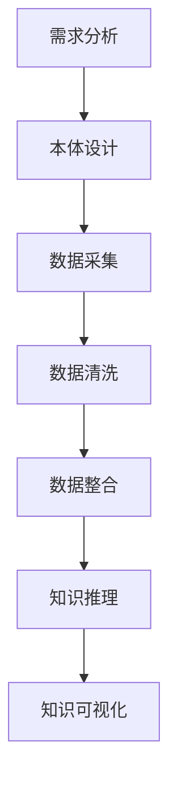

                 

# 知识图谱 原理与代码实例讲解

> 关键词：知识图谱, 本体论, 语义网络, 联邦学习, 代码实现

> 摘要：本文旨在深入探讨知识图谱的核心原理与实现方法，通过逐步分析和推理的方式，帮助读者理解知识图谱的构建过程及其在实际应用中的价值。我们将从背景介绍、核心概念与联系、核心算法原理、数学模型和公式、项目实战、实际应用场景、工具和资源推荐、总结与未来发展趋势等多方面进行详细阐述，并提供代码实例以增强理解。

## 1. 背景介绍

知识图谱是一种以图结构表示知识的技术，它通过节点和边来表示实体及其关系，从而构建出一个复杂的网络结构。知识图谱在信息检索、推荐系统、自然语言处理、智能问答等领域具有广泛的应用。近年来，随着大数据和人工智能技术的发展，知识图谱的应用越来越广泛，成为连接数据与智能的关键技术之一。

知识图谱的核心价值在于其能够将结构化和非结构化数据进行整合，形成统一的知识表示形式，从而支持更高效的信息检索和知识发现。通过知识图谱，我们可以更好地理解数据之间的关系，发现潜在的知识关联，进而为用户提供更加精准的服务。

## 2. 核心概念与联系

### 2.1 本体论

本体论是知识图谱构建的基础，它定义了实体的类型、属性以及实体之间的关系。本体论通常采用OWL（Web Ontology Language）等标准进行描述，通过定义类、属性和实例来构建知识图谱的结构。

### 2.2 语义网络

语义网络是一种基于图结构的知识表示方法，它通过节点和边来表示实体及其关系。节点代表实体，边代表实体之间的关系。语义网络可以用于表示复杂的知识结构，支持知识的推理和查询。

### 2.3 知识图谱构建流程

知识图谱的构建流程通常包括以下步骤：

1. **需求分析**：明确知识图谱的应用场景和目标。
2. **本体设计**：定义实体类型、属性和关系。
3. **数据采集**：收集相关的数据源。
4. **数据清洗**：对数据进行预处理，去除噪声和冗余信息。
5. **数据整合**：将不同来源的数据进行整合，形成统一的知识图谱。
6. **知识推理**：利用推理引擎进行知识推理，发现潜在的知识关联。
7. **知识可视化**：将知识图谱以可视化的方式展示，便于用户理解和使用。

### 2.4 Mermaid 流程图



## 3. 核心算法原理 & 具体操作步骤

### 3.1 本体设计

本体设计是知识图谱构建的关键步骤，主要包括以下几个方面：

1. **实体类型定义**：定义实体的类型，例如人、地点、组织等。
2. **属性定义**：定义实体的属性，例如人的姓名、年龄、性别等。
3. **关系定义**：定义实体之间的关系，例如人与地点的关系、组织与人的关系等。

### 3.2 数据采集

数据采集是知识图谱构建的重要环节，主要包括以下几个方面：

1. **数据源选择**：选择合适的数据源，例如公开数据集、企业内部数据等。
2. **数据获取**：通过爬虫、API等方式获取数据。
3. **数据存储**：将数据存储到数据库中，例如Neo4j、RDF存储等。

### 3.3 数据清洗

数据清洗是知识图谱构建的重要步骤，主要包括以下几个方面：

1. **数据去重**：去除重复的数据。
2. **数据格式化**：将数据转换为统一的格式。
3. **数据补全**：补充缺失的数据。

### 3.4 数据整合

数据整合是知识图谱构建的关键步骤，主要包括以下几个方面：

1. **数据匹配**：将不同来源的数据进行匹配。
2. **数据融合**：将匹配后的数据进行融合，形成统一的知识图谱。
3. **数据验证**：验证数据的准确性和完整性。

### 3.5 知识推理

知识推理是知识图谱构建的重要步骤，主要包括以下几个方面：

1. **规则定义**：定义推理规则，例如实体之间的关系规则。
2. **推理引擎**：利用推理引擎进行知识推理。
3. **知识验证**：验证推理结果的准确性和可靠性。

## 4. 数学模型和公式 & 详细讲解 & 举例说明

### 4.1 本体论表示

本体论通常采用OWL等标准进行描述，其基本表示形式如下：

$$
\text{Class} \, A \, \text{subClassOf} \, B
$$

表示类A是类B的子类。

### 4.2 语义网络表示

语义网络通常采用图结构进行表示，其基本表示形式如下：

$$
\text{Node} \, A \, \text{hasRelation} \, R \, \text{to} \, \text{Node} \, B
$$

表示节点A与节点B之间存在关系R。

### 4.3 知识图谱表示

知识图谱通常采用图结构进行表示，其基本表示形式如下：

$$
\text{Node} \, A \, \text{hasRelation} \, R \, \text{to} \, \text{Node} \, B
$$

表示节点A与节点B之间存在关系R。

### 4.4 举例说明

假设我们有一个知识图谱，包含以下实体和关系：

- 实体A：人
- 实体B：地点
- 实体C：组织
- 关系R1：居住在
- 关系R2：工作于

则知识图谱可以表示为：

$$
\text{Node} \, A \, \text{hasRelation} \, R1 \, \text{to} \, \text{Node} \, B
$$

$$
\text{Node} \, A \, \text{hasRelation} \, R2 \, \text{to} \, \text{Node} \, C
$$

## 5. 项目实战：代码实际案例和详细解释说明

### 5.1 开发环境搭建

为了实现知识图谱，我们需要搭建一个开发环境。以下是开发环境的搭建步骤：

1. **安装Neo4j**：Neo4j是一个开源的图数据库，适用于构建知识图谱。
2. **安装Python**：Python是一种广泛使用的编程语言，适用于编写知识图谱的代码。
3. **安装Neo4j驱动**：使用Python的Neo4j驱动进行数据库操作。

### 5.2 源代码详细实现和代码解读

以下是一个简单的知识图谱实现代码示例：

```python
from neo4j import GraphDatabase

# 连接Neo4j数据库
driver = GraphDatabase.driver("bolt://localhost:7687", auth=("neo4j", "password"))

# 创建知识图谱
def create_knowledge_graph(driver):
    with driver.session() as session:
        # 创建节点
        session.run("CREATE (a:Person {name: 'Alice'})")
        session.run("CREATE (b:Location {name: 'Beijing'})")
        session.run("CREATE (c:Organization {name: 'Alibaba'})")

        # 创建关系
        session.run("MATCH (a:Person {name: 'Alice'}), (b:Location {name: 'Beijing'}) CREATE (a)-[:LIVES_IN]->(b)")
        session.run("MATCH (a:Person {name: 'Alice'}), (c:Organization {name: 'Alibaba'}) CREATE (a)-[:WORKS_AT]->(c)")

# 查询知识图谱
def query_knowledge_graph(driver):
    with driver.session() as session:
        result = session.run("MATCH (a:Person)-[r]->(b) RETURN a.name, r, b.name")
        for record in result:
            print(f"{record['a.name']} {record['r']} {record['b.name']}")

# 主函数
def main():
    create_knowledge_graph(driver)
    query_knowledge_graph(driver)

if __name__ == "__main__":
    main()
```

### 5.3 代码解读与分析

1. **连接Neo4j数据库**：使用`GraphDatabase.driver`方法连接到Neo4j数据库。
2. **创建知识图谱**：使用`session.run`方法创建节点和关系。
3. **查询知识图谱**：使用`session.run`方法查询知识图谱中的节点和关系。

## 6. 实际应用场景

知识图谱在多个领域具有广泛的应用，例如：

1. **信息检索**：通过知识图谱进行信息检索，提高检索的准确性和效率。
2. **推荐系统**：通过知识图谱进行推荐，提高推荐的准确性和个性化。
3. **自然语言处理**：通过知识图谱进行自然语言处理，提高处理的准确性和效率。
4. **智能问答**：通过知识图谱进行智能问答，提高问答的准确性和智能化。

## 7. 工具和资源推荐

### 7.1 学习资源推荐

1. **书籍**：《知识图谱：原理与实践》
2. **论文**：《知识图谱构建与应用》
3. **博客**：《知识图谱入门与实战》
4. **网站**：Neo4j官网

### 7.2 开发工具框架推荐

1. **Neo4j**：开源的图数据库，适用于构建知识图谱。
2. **Python**：广泛使用的编程语言，适用于编写知识图谱的代码。
3. **Neo4j驱动**：Python的Neo4j驱动，适用于进行数据库操作。

### 7.3 相关论文著作推荐

1. **《知识图谱构建与应用》**：深入探讨知识图谱的构建方法和应用场景。
2. **《知识图谱：原理与实践》**：详细介绍知识图谱的原理和实践方法。

## 8. 总结：未来发展趋势与挑战

知识图谱在未来的发展趋势主要体现在以下几个方面：

1. **智能化**：通过深度学习等技术提高知识图谱的智能化水平。
2. **大规模**：构建大规模的知识图谱，支持更广泛的应用场景。
3. **实时性**：提高知识图谱的实时性，支持实时数据处理和分析。

知识图谱面临的挑战主要包括：

1. **数据质量**：提高数据的质量，减少噪声和冗余信息。
2. **知识推理**：提高知识推理的准确性和可靠性。
3. **知识更新**：及时更新知识图谱，保持知识的时效性。

## 9. 附录：常见问题与解答

### 9.1 问题1：如何提高知识图谱的准确性？

**解答**：可以通过数据清洗、知识验证等方法提高知识图谱的准确性。

### 9.2 问题2：如何构建大规模的知识图谱？

**解答**：可以通过分布式计算和并行处理等方法构建大规模的知识图谱。

### 9.3 问题3：如何提高知识图谱的实时性？

**解答**：可以通过实时数据处理和分析等方法提高知识图谱的实时性。

## 10. 扩展阅读 & 参考资料

1. **书籍**：《知识图谱：原理与实践》
2. **论文**：《知识图谱构建与应用》
3. **博客**：《知识图谱入门与实战》
4. **网站**：Neo4j官网

---

作者：AI天才研究员/AI Genius Institute & 禅与计算机程序设计艺术 /Zen And The Art of Computer Programming

