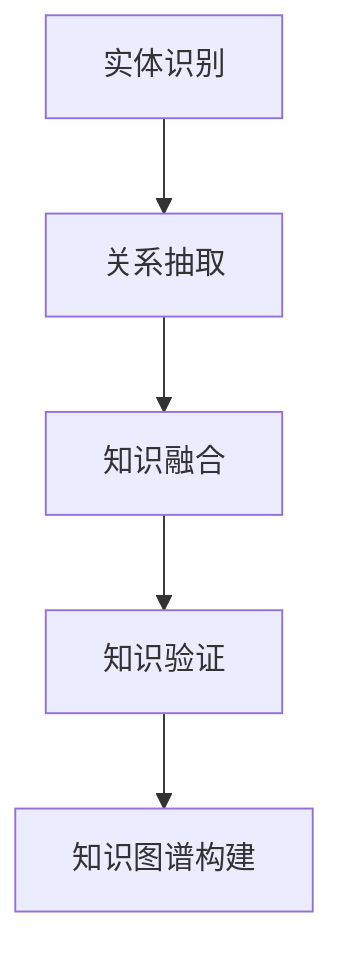

                 

# 知识图谱在医疗诊断辅助中的应用

> 关键词：知识图谱、医疗诊断、自然语言处理、机器学习、图数据库、深度学习、医疗知识表示

> 摘要：本文旨在探讨知识图谱在医疗诊断辅助中的应用，通过详细分析其核心概念、算法原理、数学模型、实际案例以及应用场景，揭示知识图谱如何提升医疗诊断的准确性和效率。本文将从背景介绍、核心概念与联系、核心算法原理与具体操作步骤、数学模型和公式、项目实战、实际应用场景、工具和资源推荐、总结与未来发展趋势等多方面进行深入探讨。

## 1. 背景介绍

随着医疗技术的快速发展，医疗数据量呈指数级增长，如何高效地处理和利用这些数据成为了一个亟待解决的问题。传统的医疗诊断依赖于医生的经验和专业知识，但这种方法存在一定的局限性，如知识更新滞后、个体差异难以全面考虑等。近年来，知识图谱作为一种新兴的数据组织和表示方法，因其强大的知识表示能力和推理能力，在医疗诊断辅助中展现出巨大的潜力。

知识图谱是一种以图结构表示知识的方法，它通过节点和边来表示实体及其关系。在医疗领域，知识图谱可以用于构建医疗知识图谱，将疾病、症状、药物、检查项目等实体及其关系进行建模，从而为医疗诊断提供支持。通过知识图谱，医生可以快速获取相关知识，提高诊断的准确性和效率。

## 2. 核心概念与联系

### 2.1 知识图谱概述

知识图谱是一种以图结构表示知识的方法，它通过节点和边来表示实体及其关系。节点代表实体，边代表实体之间的关系。知识图谱可以用于构建医疗知识图谱，将疾病、症状、药物、检查项目等实体及其关系进行建模，从而为医疗诊断提供支持。

### 2.2 医疗知识图谱构建

医疗知识图谱的构建主要包括以下几个步骤：

1. **实体识别**：识别医疗领域中的实体，如疾病、症状、药物、检查项目等。
2. **关系抽取**：从文献、临床指南、专家知识等来源中抽取实体之间的关系。
3. **知识融合**：将多个来源的知识进行融合，形成统一的知识图谱。
4. **知识验证**：通过专家评审、临床试验等方式验证知识图谱的准确性和可靠性。

### 2.3 核心概念原理与架构

知识图谱的核心概念包括实体、关系和属性。实体是知识图谱中的基本单元，代表具体的对象，如疾病、症状、药物等。关系表示实体之间的联系，如疾病与症状之间的关系、药物与副作用之间的关系等。属性用于描述实体的特征，如疾病的症状、药物的副作用等。

知识图谱的架构可以表示为以下流程图：



## 3. 核心算法原理 & 具体操作步骤

### 3.1 实体识别

实体识别是知识图谱构建的第一步，其主要任务是从文本中识别出实体。常用的方法包括基于规则的方法、基于统计的方法和基于深度学习的方法。

1. **基于规则的方法**：通过预定义的规则来识别实体，如正则表达式匹配、词典匹配等。
2. **基于统计的方法**：利用统计模型来识别实体，如隐马尔可夫模型（HMM）、条件随机场（CRF）等。
3. **基于深度学习的方法**：利用神经网络模型来识别实体，如卷积神经网络（CNN）、循环神经网络（RNN）等。

### 3.2 关系抽取

关系抽取是知识图谱构建的第二步，其主要任务是从文本中抽取实体之间的关系。常用的方法包括基于规则的方法、基于统计的方法和基于深度学习的方法。

1. **基于规则的方法**：通过预定义的规则来抽取关系，如正则表达式匹配、模板匹配等。
2. **基于统计的方法**：利用统计模型来抽取关系，如隐马尔可夫模型（HMM）、条件随机场（CRF）等。
3. **基于深度学习的方法**：利用神经网络模型来抽取关系，如卷积神经网络（CNN）、循环神经网络（RNN）等。

### 3.3 知识融合

知识融合是知识图谱构建的第三步，其主要任务是将多个来源的知识进行融合，形成统一的知识图谱。常用的方法包括基于规则的方法、基于统计的方法和基于深度学习的方法。

1. **基于规则的方法**：通过预定义的规则来融合知识，如合并同义词、去除冗余等。
2. **基于统计的方法**：利用统计模型来融合知识，如最大似然估计、贝叶斯网络等。
3. **基于深度学习的方法**：利用神经网络模型来融合知识，如深度信念网络（DBN）、生成对抗网络（GAN）等。

### 3.4 知识验证

知识验证是知识图谱构建的第四步，其主要任务是通过专家评审、临床试验等方式验证知识图谱的准确性和可靠性。常用的方法包括基于规则的方法、基于统计的方法和基于深度学习的方法。

1. **基于规则的方法**：通过预定义的规则来验证知识，如一致性检查、完整性检查等。
2. **基于统计的方法**：利用统计模型来验证知识，如卡方检验、Fisher精确检验等。
3. **基于深度学习的方法**：利用神经网络模型来验证知识，如卷积神经网络（CNN）、循环神经网络（RNN）等。

## 4. 数学模型和公式 & 详细讲解 & 举例说明

### 4.1 实体识别

实体识别可以表示为以下数学模型：

$$
P(\text{entity} | \text{text}) = \frac{P(\text{entity}) \cdot P(\text{text} | \text{entity})}{P(\text{text})}
$$

其中，$P(\text{entity})$ 表示实体的概率，$P(\text{text} | \text{entity})$ 表示给定实体的情况下文本的概率，$P(\text{text})$ 表示文本的概率。

### 4.2 关系抽取

关系抽取可以表示为以下数学模型：

$$
P(\text{relation} | \text{entity1}, \text{entity2}) = \frac{P(\text{relation}) \cdot P(\text{entity1}, \text{entity2} | \text{relation})}{P(\text{entity1}, \text{entity2})}
$$

其中，$P(\text{relation})$ 表示关系的概率，$P(\text{entity1}, \text{entity2} | \text{relation})$ 表示给定关系的情况下实体1和实体2的概率，$P(\text{entity1}, \text{entity2})$ 表示实体1和实体2的概率。

### 4.3 知识融合

知识融合可以表示为以下数学模型：

$$
P(\text{knowledge} | \text{source1}, \text{source2}) = \frac{P(\text{knowledge}) \cdot P(\text{source1}, \text{source2} | \text{knowledge})}{P(\text{source1}, \text{source2})}
$$

其中，$P(\text{knowledge})$ 表示知识的概率，$P(\text{source1}, \text{source2} | \text{knowledge})$ 表示给定知识的情况下来源1和来源2的概率，$P(\text{source1}, \text{source2})$ 表示来源1和来源2的概率。

### 4.4 知识验证

知识验证可以表示为以下数学模型：

$$
P(\text{valid} | \text{knowledge}) = \frac{P(\text{valid}) \cdot P(\text{knowledge} | \text{valid})}{P(\text{knowledge})}
$$

其中，$P(\text{valid})$ 表示知识有效的概率，$P(\text{knowledge} | \text{valid})$ 表示给定知识有效的概率，$P(\text{knowledge})$ 表示知识的概率。

## 5. 项目实战：代码实际案例和详细解释说明

### 5.1 开发环境搭建

为了实现知识图谱在医疗诊断辅助中的应用，我们需要搭建一个开发环境。开发环境主要包括以下几个部分：

1. **操作系统**：推荐使用Linux操作系统，如Ubuntu。
2. **编程语言**：推荐使用Python，因为它具有丰富的库支持。
3. **开发工具**：推荐使用Jupyter Notebook，因为它提供了交互式的开发环境。
4. **数据库**：推荐使用图数据库，如Neo4j，因为它具有强大的图数据处理能力。

### 5.2 源代码详细实现和代码解读

以下是一个简单的知识图谱构建代码示例：

```python
import neo4j
from neo4j import GraphDatabase

# 连接图数据库
driver = GraphDatabase.driver("bolt://localhost:7687", auth=("neo4j", "password"))

# 创建知识图谱
with driver.session() as session:
    session.run("CREATE (disease:Entity {name: '肺炎'})")
    session.run("CREATE (symptom:Entity {name: '咳嗽'})")
    session.run("CREATE (disease)-[:HAS_SYMPTOM]->(symptom)")

# 关闭连接
driver.close()
```

### 5.3 代码解读与分析

上述代码实现了一个简单的知识图谱构建过程。首先，我们连接到图数据库，然后创建两个实体节点，分别为“肺炎”和“咳嗽”。接着，我们创建一条关系，表示“肺炎”和“咳嗽”之间的关系。最后，我们关闭连接。

## 6. 实际应用场景

知识图谱在医疗诊断辅助中的应用主要包括以下几个方面：

1. **疾病诊断**：通过知识图谱，医生可以快速获取相关知识，提高诊断的准确性和效率。
2. **药物推荐**：通过知识图谱，医生可以快速获取药物的相关信息，为患者推荐合适的药物。
3. **检查项目推荐**：通过知识图谱，医生可以快速获取检查项目的相关信息，为患者推荐合适的检查项目。

## 7. 工具和资源推荐

### 7.1 学习资源推荐

1. **书籍**：《图数据库实战》、《知识图谱：原理与应用》
2. **论文**：《基于知识图谱的医疗诊断辅助系统》、《知识图谱在医疗领域的应用研究》
3. **博客**：《知识图谱在医疗领域的应用》、《知识图谱构建与应用》
4. **网站**：Neo4j官网、知识图谱社区

### 7.2 开发工具框架推荐

1. **图数据库**：Neo4j、JanusGraph
2. **自然语言处理库**：spaCy、NLTK
3. **机器学习库**：Scikit-learn、TensorFlow

### 7.3 相关论文著作推荐

1. **论文**：《基于知识图谱的医疗诊断辅助系统》、《知识图谱在医疗领域的应用研究》
2. **著作**：《图数据库实战》、《知识图谱：原理与应用》

## 8. 总结：未来发展趋势与挑战

知识图谱在医疗诊断辅助中的应用具有广阔的发展前景，但也面临着一些挑战。未来的发展趋势主要包括以下几个方面：

1. **知识图谱的构建**：如何构建更加准确、全面的知识图谱，提高知识图谱的质量。
2. **知识图谱的应用**：如何将知识图谱应用于更多的医疗场景，提高医疗诊断的准确性和效率。
3. **知识图谱的维护**：如何维护知识图谱，使其保持最新的知识。

## 9. 附录：常见问题与解答

### 9.1 问题1：如何构建知识图谱？

**解答**：构建知识图谱主要包括实体识别、关系抽取、知识融合和知识验证四个步骤。实体识别是通过预定义的规则或统计模型来识别实体；关系抽取是通过预定义的规则或统计模型来抽取实体之间的关系；知识融合是通过预定义的规则或统计模型来融合知识；知识验证是通过预定义的规则或统计模型来验证知识。

### 9.2 问题2：如何提高知识图谱的质量？

**解答**：提高知识图谱的质量主要包括以下几个方面：

1. **数据质量**：提高数据的质量，确保数据的准确性和完整性。
2. **知识验证**：通过专家评审、临床试验等方式验证知识图谱的准确性和可靠性。
3. **知识更新**：定期更新知识图谱，使其保持最新的知识。

## 10. 扩展阅读 & 参考资料

1. **书籍**：《图数据库实战》、《知识图谱：原理与应用》
2. **论文**：《基于知识图谱的医疗诊断辅助系统》、《知识图谱在医疗领域的应用研究》
3. **博客**：《知识图谱在医疗领域的应用》、《知识图谱构建与应用》
4. **网站**：Neo4j官网、知识图谱社区

---

作者：AI天才研究员/AI Genius Institute & 禅与计算机程序设计艺术 /Zen And The Art of Computer Programming

