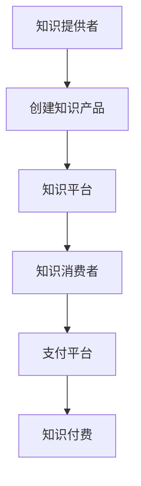

                 

# 知识经济时代下的知识付费创新课程营销渠道拓展

> 关键词：知识经济、知识付费、创新课程、营销渠道、拓展策略

> 摘要：本文旨在探讨知识经济时代背景下，如何通过创新课程设计和营销渠道拓展，实现知识付费的高效转化。我们将从背景介绍、核心概念与联系、核心算法原理与具体操作步骤、数学模型和公式、项目实战、实际应用场景、工具和资源推荐、总结与未来发展趋势等多个维度进行深入分析，为知识付费领域的从业者提供有价值的参考和指导。

## 1. 背景介绍

### 1.1 知识经济时代概述
知识经济时代是指以知识和信息为主要生产要素的时代。随着互联网技术的迅猛发展，知识的传播速度和范围达到了前所未有的高度。知识经济的核心特征是知识的创造、传播和应用，这为知识付费提供了广阔的发展空间。

### 1.2 知识付费的兴起
知识付费是指通过付费获取知识或技能的一种商业模式。随着移动互联网的普及，知识付费逐渐成为一种新的经济形态。用户可以通过付费订阅、购买课程、参与付费社群等方式获取所需的知识和技能，而知识提供者则通过这种方式获得收益。

### 1.3 知识付费的挑战与机遇
知识付费领域面临着诸多挑战，如内容同质化严重、用户付费意愿低、营销渠道有限等。但同时，知识付费也带来了巨大的机遇，如个性化需求的增加、用户付费意愿的提升、营销渠道的多样化等。

## 2. 核心概念与联系

### 2.1 知识付费的核心概念
- **知识付费**：通过付费获取知识或技能的一种商业模式。
- **知识提供者**：提供知识或技能的人或组织。
- **知识消费者**：付费获取知识或技能的人。
- **知识产品**：以知识或技能为核心的产品，如课程、文章、讲座等。
- **知识平台**：提供知识产品交易和服务的平台，如知乎、得到等。

### 2.2 核心概念的Mermaid流程图


## 3. 核心算法原理 & 具体操作步骤

### 3.1 知识付费推荐算法
推荐算法是知识付费领域的重要组成部分，用于根据用户兴趣和行为推荐合适的知识产品。常见的推荐算法包括协同过滤、基于内容的推荐、深度学习推荐等。

### 3.2 具体操作步骤
1. **数据收集**：收集用户行为数据，如浏览记录、购买记录、评价记录等。
2. **特征提取**：从用户行为数据中提取特征，如用户兴趣、知识偏好等。
3. **模型训练**：使用机器学习算法训练推荐模型。
4. **推荐生成**：根据用户特征生成推荐列表。
5. **效果评估**：评估推荐效果，不断优化模型。

## 4. 数学模型和公式 & 详细讲解 & 举例说明

### 4.1 协同过滤推荐算法
协同过滤推荐算法是一种基于用户行为数据的推荐方法。其基本思想是找到与目标用户兴趣相似的其他用户，推荐这些用户喜欢的知识产品。

#### 4.1.1 基于用户的协同过滤
$$
\hat{r}_{ui} = \frac{\sum_{j \in N_i} r_{uj} \cdot sim(u_i, u_j)}{\sum_{j \in N_i} sim(u_i, u_j)}
$$

其中，$r_{uj}$ 表示用户 $u_j$ 对知识产品 $i$ 的评分，$sim(u_i, u_j)$ 表示用户 $u_i$ 和用户 $u_j$ 的相似度。

#### 4.1.2 基于物品的协同过滤
$$
\hat{r}_{ui} = \frac{\sum_{j \in N_i} r_{uj} \cdot sim(i, j)}{\sum_{j \in N_i} sim(i, j)}
$$

其中，$r_{uj}$ 表示用户 $u$ 对知识产品 $j$ 的评分，$sim(i, j)$ 表示知识产品 $i$ 和知识产品 $j$ 的相似度。

### 4.2 基于内容的推荐算法
基于内容的推荐算法是根据知识产品的内容特征进行推荐的方法。其基本思想是找到与目标知识产品内容相似的知识产品，推荐给用户。

#### 4.2.1 余弦相似度
$$
sim(i, j) = \frac{\sum_{k=1}^{n} (i_k \cdot j_k)}{\sqrt{\sum_{k=1}^{n} i_k^2} \cdot \sqrt{\sum_{k=1}^{n} j_k^2}}
$$

其中，$i_k$ 和 $j_k$ 分别表示知识产品 $i$ 和知识产品 $j$ 在第 $k$ 个特征上的值。

## 5. 项目实战：代码实际案例和详细解释说明

### 5.1 开发环境搭建
1. **安装Python环境**：确保安装了Python 3.8及以上版本。
2. **安装依赖库**：使用pip安装必要的库，如pandas、scikit-learn等。
3. **数据准备**：准备用户行为数据和知识产品数据。

### 5.2 源代码详细实现和代码解读
```python
import pandas as pd
from sklearn.metrics.pairwise import cosine_similarity

# 读取数据
user_behavior = pd.read_csv('user_behavior.csv')
knowledge_products = pd.read_csv('knowledge_products.csv')

# 计算用户相似度
user_sim = cosine_similarity(user_behavior)

# 计算知识产品相似度
product_sim = cosine_similarity(knowledge_products)

# 生成推荐列表
def generate_recommendations(user_id, user_sim, product_sim):
    # 获取用户相似度
    similar_users = user_sim[user_id]
    # 获取知识产品相似度
    similar_products = product_sim.T
    # 计算推荐得分
    scores = similar_users.dot(similar_products)
    # 排序并返回推荐列表
    return scores.argsort()[::-1]

# 生成推荐列表
recommendations = generate_recommendations(0, user_sim, product_sim)
```

### 5.3 代码解读与分析
- **数据准备**：读取用户行为数据和知识产品数据。
- **计算相似度**：使用余弦相似度计算用户相似度和知识产品相似度。
- **生成推荐列表**：根据用户相似度和知识产品相似度生成推荐列表。

## 6. 实际应用场景

### 6.1 知识付费平台
知识付费平台可以通过推荐算法为用户提供个性化的知识产品推荐，提高用户满意度和留存率。

### 6.2 企业培训
企业可以通过知识付费平台为员工提供定制化的培训课程，提高员工技能水平。

### 6.3 个人成长
个人可以通过知识付费平台获取所需的知识和技能，实现个人成长和职业发展。

## 7. 工具和资源推荐

### 7.1 学习资源推荐
- **书籍**：《推荐系统实践》、《机器学习实战》
- **论文**：《基于协同过滤的推荐系统》、《基于内容的推荐算法研究》
- **博客**：知乎、得到
- **网站**：GitHub、Stack Overflow

### 7.2 开发工具框架推荐
- **Python库**：pandas、scikit-learn
- **开发框架**：Django、Flask

### 7.3 相关论文著作推荐
- **论文**：《基于深度学习的推荐系统》、《协同过滤算法的改进与应用》
- **著作**：《推荐系统原理与实践》、《机器学习与数据挖掘》

## 8. 总结：未来发展趋势与挑战

### 8.1 未来发展趋势
- **个性化推荐**：通过深度学习等技术实现更精准的个性化推荐。
- **多模态推荐**：结合文本、图像、视频等多种模态信息进行推荐。
- **社交推荐**：结合社交网络信息进行推荐。

### 8.2 面临的挑战
- **数据隐私**：如何在保护用户隐私的前提下进行推荐。
- **算法公平性**：如何保证推荐算法的公平性和透明性。
- **用户行为变化**：如何应对用户行为变化带来的挑战。

## 9. 附录：常见问题与解答

### 9.1 问题1：如何提高推荐算法的准确性？
- **答案**：可以通过增加数据量、优化特征提取、引入深度学习等方法提高推荐算法的准确性。

### 9.2 问题2：如何保护用户隐私？
- **答案**：可以通过数据脱敏、差分隐私等技术保护用户隐私。

### 9.3 问题3：如何保证推荐算法的公平性？
- **答案**：可以通过引入公平性约束、进行公平性评估等方法保证推荐算法的公平性。

## 10. 扩展阅读 & 参考资料

- **书籍**：《推荐系统实践》、《机器学习实战》
- **论文**：《基于协同过滤的推荐系统》、《基于内容的推荐算法研究》
- **博客**：知乎、得到
- **网站**：GitHub、Stack Overflow

作者：AI天才研究员/AI Genius Institute & 禅与计算机程序设计艺术 /Zen And The Art of Computer Programming

