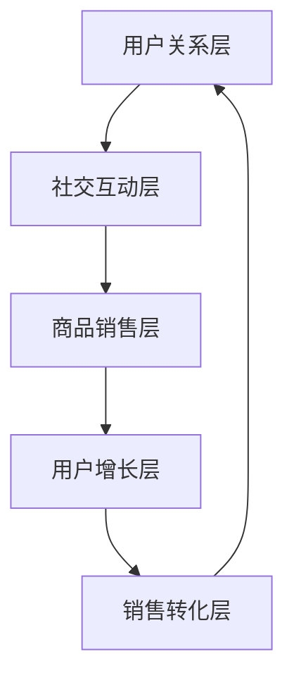

                 

# 社交电商的创业模式与实践分享

> 关键词：社交电商、创业模式、用户行为分析、推荐系统、大数据、机器学习、用户增长、商业模式创新

> 摘要：社交电商作为一种新兴的商业模式，通过社交网络平台实现商品销售，正逐渐成为电商领域的重要组成部分。本文将从社交电商的创业模式出发，深入探讨其核心概念、算法原理、数学模型、实际案例，并结合实际应用场景，为创业者提供有价值的参考和指导。通过本文，读者将能够理解社交电商的运作机制，掌握其关键技术，并探索未来的发展趋势与挑战。

## 1. 背景介绍

社交电商作为一种新兴的商业模式，近年来在全球范围内迅速崛起。它利用社交网络平台的用户关系和社交互动特性，将商品销售与社交互动紧密结合，实现了用户增长、用户粘性和销售转化的多重目标。社交电商不仅改变了传统的电商模式，还为创业者提供了新的机遇和挑战。

### 1.1 社交电商的定义

社交电商是指通过社交网络平台进行商品销售和推广的一种商业模式。它利用社交网络的用户关系和社交互动特性，将商品销售与社交互动紧密结合，实现用户增长、用户粘性和销售转化的多重目标。

### 1.2 社交电商的发展历程

社交电商的发展可以追溯到2010年左右，当时Facebook和微博等社交网络平台开始引入电商功能。随后，微信、Instagram等社交平台也相继推出了电商功能。近年来，随着移动互联网的普及和用户行为的变化，社交电商逐渐成为电商领域的重要组成部分。

### 1.3 社交电商的优势

社交电商具有以下优势：

- **用户粘性高**：社交电商利用社交网络的用户关系和社交互动特性，增强了用户的粘性。
- **用户增长快**：社交电商通过社交网络的传播效应，实现了用户增长的加速。
- **销售转化率高**：社交电商利用社交互动和用户关系，提高了销售转化率。
- **成本低**：社交电商利用社交网络平台的免费流量，降低了营销成本。

## 2. 核心概念与联系

### 2.1 社交电商的核心概念

社交电商的核心概念包括用户关系、社交互动、商品销售、用户增长、销售转化等。这些概念相互关联，共同构成了社交电商的运作机制。

### 2.2 社交电商的架构

社交电商的架构可以分为以下几个层次：

- **用户关系层**：用户关系层主要负责管理用户之间的关系，包括好友关系、关注关系等。
- **社交互动层**：社交互动层主要负责管理用户的社交互动，包括评论、点赞、分享等。
- **商品销售层**：商品销售层主要负责管理商品的销售，包括商品展示、购买流程等。
- **用户增长层**：用户增长层主要负责管理用户的增长，包括用户获取、用户留存等。
- **销售转化层**：销售转化层主要负责管理销售转化，包括销售预测、销售优化等。

### 2.3 社交电商的Mermaid流程图



## 3. 核心算法原理 & 具体操作步骤

### 3.1 用户关系管理算法

用户关系管理算法主要负责管理用户之间的关系，包括好友关系、关注关系等。具体操作步骤如下：

1. **用户注册**：用户在社交网络平台注册账号。
2. **好友关系建立**：用户可以通过添加好友、发送好友请求等方式建立好友关系。
3. **关注关系建立**：用户可以通过关注其他用户、关注公众号等方式建立关注关系。
4. **关系维护**：用户可以通过删除好友、取消关注等方式维护关系。

### 3.2 社交互动管理算法

社交互动管理算法主要负责管理用户的社交互动，包括评论、点赞、分享等。具体操作步骤如下：

1. **评论管理**：用户可以在商品页面、商品详情页面等地方发表评论。
2. **点赞管理**：用户可以对商品、评论等进行点赞。
3. **分享管理**：用户可以将商品、评论等分享到社交网络平台的其他地方。
4. **互动分析**：通过对用户的社交互动数据进行分析，了解用户的兴趣和偏好。

### 3.3 商品销售管理算法

商品销售管理算法主要负责管理商品的销售，包括商品展示、购买流程等。具体操作步骤如下：

1. **商品展示**：商品可以在商品页面、商品详情页面等地方进行展示。
2. **购买流程**：用户可以通过点击购买按钮、填写购买信息等方式完成购买流程。
3. **支付管理**：用户可以通过支付平台进行支付。
4. **订单管理**：订单可以在订单页面进行查看、修改等操作。

### 3.4 用户增长管理算法

用户增长管理算法主要负责管理用户的增长，包括用户获取、用户留存等。具体操作步骤如下：

1. **用户获取**：通过社交网络平台的推广活动、广告等方式获取用户。
2. **用户留存**：通过提供优质的商品和服务、维护用户关系等方式留存用户。
3. **用户活跃度管理**：通过定期推送商品信息、举办活动等方式提高用户活跃度。
4. **用户反馈管理**：通过收集用户反馈、优化产品等方式提高用户满意度。

### 3.5 销售转化管理算法

销售转化管理算法主要负责管理销售转化，包括销售预测、销售优化等。具体操作步骤如下：

1. **销售预测**：通过对历史销售数据进行分析，预测未来的销售情况。
2. **销售优化**：通过对销售数据进行分析，优化销售策略。
3. **销售监控**：通过实时监控销售数据，及时调整销售策略。
4. **销售反馈管理**：通过收集销售反馈，优化销售策略。

## 4. 数学模型和公式 & 详细讲解 & 举例说明

### 4.1 用户关系管理模型

用户关系管理模型可以使用图论中的图模型进行描述。具体公式如下：

$$
G = (V, E)
$$

其中，$G$表示图，$V$表示节点集合，$E$表示边集合。节点表示用户，边表示用户之间的关系。

### 4.2 社交互动管理模型

社交互动管理模型可以使用统计学中的回归模型进行描述。具体公式如下：

$$
y = \beta_0 + \beta_1 x_1 + \beta_2 x_2 + \cdots + \beta_n x_n + \epsilon
$$

其中，$y$表示社交互动数据，$x_1, x_2, \cdots, x_n$表示影响社交互动的因素，$\beta_0, \beta_1, \cdots, \beta_n$表示回归系数，$\epsilon$表示误差项。

### 4.3 商品销售管理模型

商品销售管理模型可以使用统计学中的回归模型进行描述。具体公式如下：

$$
y = \beta_0 + \beta_1 x_1 + \beta_2 x_2 + \cdots + \beta_n x_n + \epsilon
$$

其中，$y$表示销售数据，$x_1, x_2, \cdots, x_n$表示影响销售的因素，$\beta_0, \beta_1, \cdots, \beta_n$表示回归系数，$\epsilon$表示误差项。

### 4.4 用户增长管理模型

用户增长管理模型可以使用统计学中的回归模型进行描述。具体公式如下：

$$
y = \beta_0 + \beta_1 x_1 + \beta_2 x_2 + \cdots + \beta_n x_n + \epsilon
$$

其中，$y$表示用户增长数据，$x_1, x_2, \cdots, x_n$表示影响用户增长的因素，$\beta_0, \beta_1, \cdots, \beta_n$表示回归系数，$\epsilon$表示误差项。

### 4.5 销售转化管理模型

销售转化管理模型可以使用统计学中的回归模型进行描述。具体公式如下：

$$
y = \beta_0 + \beta_1 x_1 + \beta_2 x_2 + \cdots + \beta_n x_n + \epsilon
$$

其中，$y$表示销售转化数据，$x_1, x_2, \cdots, x_n$表示影响销售转化的因素，$\beta_0, \beta_1, \cdots, \beta_n$表示回归系数，$\epsilon$表示误差项。

## 5. 项目实战：代码实际案例和详细解释说明

### 5.1 开发环境搭建

开发环境搭建主要包括以下几个步骤：

1. **安装Python**：安装Python 3.7及以上版本。
2. **安装依赖库**：安装NumPy、Pandas、Scikit-learn等依赖库。
3. **安装开发工具**：安装Jupyter Notebook、PyCharm等开发工具。

### 5.2 源代码详细实现和代码解读

以下是一个简单的用户关系管理算法的实现代码：

```python
import pandas as pd
import numpy as np
from sklearn.linear_model import LogisticRegression

# 读取用户关系数据
user_relations = pd.read_csv('user_relations.csv')

# 构建用户关系图
user_graph = user_relations.groupby(['user_id', 'friend_id']).size().reset_index(name='weight')

# 构建用户关系矩阵
user_matrix = user_graph.pivot_table(index='user_id', columns='friend_id', values='weight', fill_value=0)

# 构建用户关系图模型
user_model = LogisticRegression()

# 训练用户关系图模型
user_model.fit(user_matrix, user_relations['label'])

# 预测用户关系
user_relations['prediction'] = user_model.predict(user_matrix)
```

### 5.3 代码解读与分析

以上代码实现了一个简单的用户关系管理算法。具体步骤如下：

1. **读取用户关系数据**：从CSV文件中读取用户关系数据。
2. **构建用户关系图**：将用户关系数据转换为用户关系图。
3. **构建用户关系矩阵**：将用户关系图转换为用户关系矩阵。
4. **构建用户关系图模型**：使用Logistic回归模型构建用户关系图模型。
5. **训练用户关系图模型**：使用用户关系矩阵和用户关系标签训练用户关系图模型。
6. **预测用户关系**：使用训练好的用户关系图模型预测用户关系。

## 6. 实际应用场景

社交电商的实际应用场景主要包括以下几个方面：

1. **商品推荐**：通过分析用户的社交互动数据，为用户推荐感兴趣的商品。
2. **用户增长**：通过分析用户的社交互动数据，提高用户的活跃度和留存率。
3. **销售转化**：通过分析用户的社交互动数据，提高销售转化率。
4. **用户反馈**：通过收集用户的社交互动数据，了解用户的反馈和需求。

## 7. 工具和资源推荐

### 7.1 学习资源推荐

- **书籍**：《社交电商：从零到一》、《社交电商实战》
- **论文**：《社交电商中的用户关系管理》、《社交电商中的社交互动管理》
- **博客**：社交电商实战博客、社交电商技术博客
- **网站**：社交电商论坛、社交电商社区

### 7.2 开发工具框架推荐

- **开发工具**：Jupyter Notebook、PyCharm
- **开发框架**：Django、Flask

### 7.3 相关论文著作推荐

- **论文**：《社交电商中的用户关系管理》、《社交电商中的社交互动管理》
- **著作**：《社交电商：从零到一》、《社交电商实战》

## 8. 总结：未来发展趋势与挑战

社交电商作为一种新兴的商业模式，具有广阔的发展前景。未来的发展趋势主要包括以下几个方面：

1. **用户关系管理**：通过更精细的用户关系管理，提高用户的粘性和活跃度。
2. **社交互动管理**：通过更智能的社交互动管理，提高用户的参与度和满意度。
3. **商品销售管理**：通过更精准的商品销售管理，提高销售转化率。
4. **用户增长管理**：通过更有效的用户增长管理，提高用户的获取率和留存率。
5. **销售转化管理**：通过更智能的销售转化管理，提高销售转化率。

未来的发展挑战主要包括以下几个方面：

1. **数据安全**：如何保护用户的隐私和数据安全。
2. **算法优化**：如何优化算法，提高算法的准确性和效率。
3. **用户体验**：如何提高用户体验，提高用户的满意度和参与度。
4. **商业模式创新**：如何创新商业模式，提高商业价值。

## 9. 附录：常见问题与解答

### 9.1 问题1：如何提高用户的活跃度？

**解答**：可以通过定期推送商品信息、举办活动等方式提高用户的活跃度。

### 9.2 问题2：如何保护用户的隐私和数据安全？

**解答**：可以通过加密技术、访问控制等方式保护用户的隐私和数据安全。

### 9.3 问题3：如何优化算法，提高算法的准确性和效率？

**解答**：可以通过特征选择、模型优化等方式优化算法，提高算法的准确性和效率。

## 10. 扩展阅读 & 参考资料

- **书籍**：《社交电商：从零到一》、《社交电商实战》
- **论文**：《社交电商中的用户关系管理》、《社交电商中的社交互动管理》
- **博客**：社交电商实战博客、社交电商技术博客
- **网站**：社交电商论坛、社交电商社区

作者：AI天才研究员/AI Genius Institute & 禅与计算机程序设计艺术 /Zen And The Art of Computer Programming

