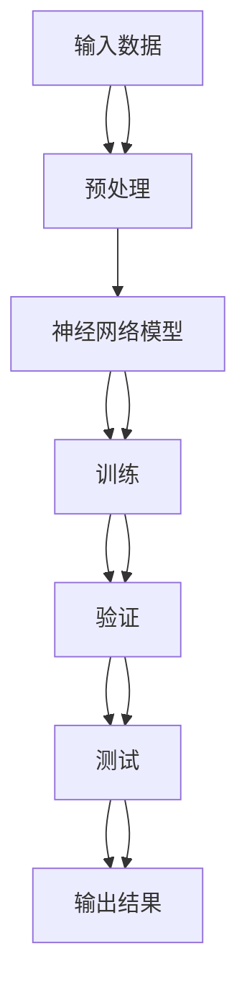

                 

# 神经网络在材料科学中的应用

> 关键词：神经网络, 材料科学, 深度学习, 材料模拟, 数据驱动, 机器学习

> 摘要：本文旨在探讨神经网络在材料科学中的应用，通过深入分析神经网络的基本原理及其在材料科学中的具体应用，展示如何利用神经网络进行材料模拟和预测。我们将从背景介绍、核心概念与联系、核心算法原理、数学模型和公式、项目实战、实际应用场景、工具和资源推荐、总结与未来发展趋势等几个方面进行详细阐述。

## 1. 背景介绍

材料科学是研究材料的组成、结构、性质及其应用的科学。随着科技的发展，材料科学的研究越来越依赖于实验和理论的结合。然而，传统的实验方法往往耗时长、成本高，且难以实现大规模的材料筛选。近年来，随着计算能力的提升和机器学习技术的发展，数据驱动的方法逐渐成为材料科学研究的重要手段之一。神经网络作为一种强大的机器学习工具，能够从大量数据中学习并发现材料的性质和结构之间的关系，从而加速材料的发现和优化过程。

## 2. 核心概念与联系

### 2.1 神经网络的基本原理

神经网络是一种模仿人脑神经元结构和功能的计算模型。它由多个神经元（节点）组成，每个神经元接收输入信号，经过加权求和后通过激活函数产生输出信号。神经网络通过调整权重和偏置来学习输入与输出之间的映射关系。

### 2.2 材料科学中的应用

在材料科学中，神经网络可以用于预测材料的性质、结构和性能。例如，通过训练神经网络模型，可以预测新材料的力学性能、热稳定性、电导率等。此外，神经网络还可以用于材料的结构优化，通过模拟不同结构的材料性能，找到最优的结构设计方案。

### 2.3 Mermaid 流程图



## 3. 核心算法原理 & 具体操作步骤

### 3.1 神经网络的构建

神经网络的构建主要包括以下几个步骤：

1. **定义网络结构**：确定神经网络的层数、每层的神经元数量以及激活函数。
2. **初始化权重和偏置**：随机初始化权重和偏置值。
3. **前向传播**：将输入数据通过网络进行前向传播，计算每一层的输出。
4. **计算损失**：根据预测结果和真实标签计算损失函数。
5. **反向传播**：通过损失函数计算梯度，并更新权重和偏置。
6. **重复训练**：重复前向传播和反向传播的过程，直到损失函数收敛。

### 3.2 具体操作步骤

1. **数据预处理**：对输入数据进行归一化、标准化等预处理操作。
2. **选择模型**：根据任务需求选择合适的神经网络模型，如多层感知机（MLP）、卷积神经网络（CNN）等。
3. **训练模型**：使用训练数据集进行模型训练，调整权重和偏置。
4. **验证模型**：使用验证数据集验证模型的性能。
5. **测试模型**：使用测试数据集测试模型的泛化能力。

## 4. 数学模型和公式 & 详细讲解 & 举例说明

### 4.1 神经网络的数学模型

神经网络的数学模型可以表示为：

$$
y = f(Wx + b)
$$

其中，$x$ 是输入向量，$W$ 是权重矩阵，$b$ 是偏置向量，$f$ 是激活函数。

### 4.2 激活函数

常用的激活函数有：

- **Sigmoid 函数**：
  $$
  f(x) = \frac{1}{1 + e^{-x}}
  $$

- **ReLU 函数**：
  $$
  f(x) = \max(0, x)
  $$

- **Tanh 函数**：
  $$
  f(x) = \tanh(x) = \frac{e^x - e^{-x}}{e^x + e^{-x}}
  $$

### 4.3 损失函数

常用的损失函数有：

- **均方误差（MSE）**：
  $$
  L = \frac{1}{n} \sum_{i=1}^{n} (y_i - \hat{y}_i)^2
  $$

- **交叉熵损失**：
  $$
  L = -\frac{1}{n} \sum_{i=1}^{n} \left[ y_i \log(\hat{y}_i) + (1 - y_i) \log(1 - \hat{y}_i) \right]
  $$

### 4.4 举例说明

假设我们有一个简单的神经网络模型，用于预测材料的力学性能。输入数据为材料的组成成分，输出为材料的杨氏模量。我们使用一个包含两个隐藏层的多层感知机（MLP）模型。

```python
import torch
import torch.nn as nn
import torch.optim as optim

# 定义神经网络模型
class MaterialNN(nn.Module):
    def __init__(self):
        super(MaterialNN, self).__init__()
        self.fc1 = nn.Linear(10, 64)
        self.fc2 = nn.Linear(64, 64)
        self.fc3 = nn.Linear(64, 1)

    def forward(self, x):
        x = torch.relu(self.fc1(x))
        x = torch.relu(self.fc2(x))
        x = self.fc3(x)
        return x

# 初始化模型
model = MaterialNN()
criterion = nn.MSELoss()
optimizer = optim.Adam(model.parameters(), lr=0.001)

# 训练模型
for epoch in range(1000):
    optimizer.zero_grad()
    outputs = model(inputs)
    loss = criterion(outputs, targets)
    loss.backward()
    optimizer.step()
```

## 5. 项目实战：代码实际案例和详细解释说明

### 5.1 开发环境搭建

为了进行神经网络的训练和测试，我们需要搭建一个合适的开发环境。这里我们使用 Python 3.8 作为开发语言，PyTorch 作为深度学习框架。

```bash
# 安装 PyTorch
pip install torch torchvision
```

### 5.2 源代码详细实现和代码解读

```python
import torch
import torch.nn as nn
import torch.optim as optim
from sklearn.preprocessing import StandardScaler
from sklearn.model_selection import train_test_split

# 生成示例数据
data = torch.randn(1000, 10)  # 1000个样本，每个样本10个特征
labels = torch.randn(1000, 1)  # 1000个标签

# 数据预处理
scaler = StandardScaler()
data_scaled = scaler.fit_transform(data.numpy())
data_scaled = torch.tensor(data_scaled, dtype=torch.float32)

# 划分训练集和测试集
train_data, test_data, train_labels, test_labels = train_test_split(data_scaled, labels, test_size=0.2, random_state=42)

# 定义神经网络模型
class MaterialNN(nn.Module):
    def __init__(self):
        super(MaterialNN, self).__init__()
        self.fc1 = nn.Linear(10, 64)
        self.fc2 = nn.Linear(64, 64)
        self.fc3 = nn.Linear(64, 1)

    def forward(self, x):
        x = torch.relu(self.fc1(x))
        x = torch.relu(self.fc2(x))
        x = self.fc3(x)
        return x

# 初始化模型
model = MaterialNN()
criterion = nn.MSELoss()
optimizer = optim.Adam(model.parameters(), lr=0.001)

# 训练模型
for epoch in range(1000):
    optimizer.zero_grad()
    outputs = model(train_data)
    loss = criterion(outputs, train_labels)
    loss.backward()
    optimizer.step()

# 测试模型
with torch.no_grad():
    test_outputs = model(test_data)
    test_loss = criterion(test_outputs, test_labels)
    print(f"Test Loss: {test_loss.item()}")
```

### 5.3 代码解读与分析

1. **数据生成**：我们生成了1000个样本，每个样本有10个特征，标签为1000个随机值。
2. **数据预处理**：使用 `StandardScaler` 对数据进行标准化处理。
3. **数据划分**：将数据划分为训练集和测试集，测试集占20%。
4. **模型定义**：定义了一个包含两个隐藏层的多层感知机（MLP）模型。
5. **模型训练**：使用均方误差（MSE）作为损失函数，使用 Adam 优化器进行训练。
6. **模型测试**：在测试集上进行预测，并计算测试损失。

## 6. 实际应用场景

神经网络在材料科学中的应用非常广泛，主要包括以下几个方面：

1. **材料性质预测**：通过训练神经网络模型，可以预测新材料的力学性能、热稳定性、电导率等。
2. **材料结构优化**：通过模拟不同结构的材料性能，找到最优的结构设计方案。
3. **材料筛选**：利用神经网络模型进行大规模的材料筛选，加速新材料的发现过程。
4. **材料设计**：通过神经网络模型进行材料设计，优化材料的性能。

## 7. 工具和资源推荐

### 7.1 学习资源推荐

- **书籍**：《深度学习》（Goodfellow, Bengio, Courville）
- **论文**：《Materials Informatics: A Machine Learning Approach to Materials Design》（Jain et al.）
- **博客**：Medium上的深度学习系列文章
- **网站**：Kaggle、GitHub上的深度学习项目

### 7.2 开发工具框架推荐

- **PyTorch**：深度学习框架，易于上手，功能强大。
- **TensorFlow**：另一个流行的深度学习框架，功能全面。

### 7.3 相关论文著作推荐

- **Materials Informatics: A Machine Learning Approach to Materials Design**（Jain et al.）
- **Deep Learning for Materials Science**（Ghiringhelli et al.）

## 8. 总结：未来发展趋势与挑战

神经网络在材料科学中的应用前景广阔，但也面临着一些挑战。未来的发展趋势主要包括：

1. **模型优化**：通过改进模型结构和训练方法，提高预测精度。
2. **数据增强**：通过数据增强技术，提高模型的泛化能力。
3. **多模态数据融合**：结合多种数据源（如实验数据、理论计算数据等），提高模型的预测能力。
4. **可解释性**：提高模型的可解释性，便于研究人员理解模型的预测机制。

## 9. 附录：常见问题与解答

### 9.1 问题：如何选择合适的神经网络模型？

**解答**：选择合适的神经网络模型需要根据具体任务需求和数据特点来决定。对于简单的线性关系，可以使用线性回归模型；对于复杂的非线性关系，可以使用多层感知机（MLP）或卷积神经网络（CNN）。

### 9.2 问题：如何处理数据不平衡问题？

**解答**：数据不平衡问题可以通过过采样、欠采样或使用加权损失函数来解决。此外，还可以使用生成对抗网络（GAN）生成更多的样本，以平衡数据分布。

## 10. 扩展阅读 & 参考资料

- **书籍**：《深度学习》（Goodfellow, Bengio, Courville）
- **论文**：《Materials Informatics: A Machine Learning Approach to Materials Design》（Jain et al.）
- **博客**：Medium上的深度学习系列文章
- **网站**：Kaggle、GitHub上的深度学习项目

---

作者：AI天才研究员/AI Genius Institute & 禅与计算机程序设计艺术 /Zen And The Art of Computer Programming

