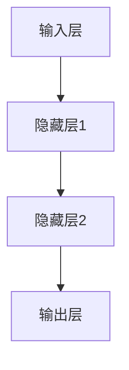

                 

# 神经网络：人工智能的基石

> 关键词：神经网络, 人工智能, 深度学习, 机器学习, 神经元, 前向传播, 反向传播

> 摘要：神经网络是人工智能领域中最核心的技术之一，它模仿人脑的工作方式，通过学习数据中的模式来进行预测和决策。本文将从神经网络的基本概念出发，深入探讨其核心算法原理，通过数学模型和公式进行详细讲解，并结合实际代码案例进行实战演示。最后，我们将展望神经网络的未来发展趋势和挑战。

## 1. 背景介绍

神经网络是模仿人脑神经元结构和工作原理的一种计算模型。它通过模拟生物神经元之间的连接和信息传递机制，实现对复杂数据的处理和学习。神经网络在图像识别、自然语言处理、语音识别等领域取得了显著的成果，成为推动人工智能发展的关键力量。

### 1.1 人工智能的发展历程

- 1956年：达特茅斯会议，人工智能（AI）概念首次提出。
- 1960年代：专家系统兴起，基于规则的系统开始应用于实际问题。
- 1980年代：神经网络研究复兴，BP算法的提出使得多层神经网络成为可能。
- 2000年代：大数据和计算能力的提升，深度学习成为主流。
- 2010年代至今：神经网络技术不断进步，应用场景日益广泛。

### 1.2 神经网络的历史沿革

- 1943年：Warren McCulloch和Walter Pitts提出第一个神经网络模型。
- 1958年：Frank Rosenblatt发明感知机（Perceptron），开启了神经网络研究的新篇章。
- 1969年：Paul Werbos提出反向传播算法（Backpropagation），为多层神经网络的学习提供了理论基础。
- 1986年：David Rumelhart, Geoffrey Hinton和Ronald Williams发表《Learning representations by back-propagating errors》，进一步完善了反向传播算法。
- 2012年：AlexNet在ImageNet竞赛中取得突破性成绩，标志着深度学习时代的到来。

## 2. 核心概念与联系

### 2.1 神经元模型

神经元是神经网络的基本单元，它接收输入信号，经过处理后产生输出信号。神经元模型可以表示为：

$$
y = f\left(\sum_{i=1}^{n} w_i x_i + b\right)
$$

其中，$x_i$ 是输入信号，$w_i$ 是权重，$b$ 是偏置项，$f$ 是激活函数。

### 2.2 神经网络架构

神经网络由多个神经元层组成，包括输入层、隐藏层和输出层。每层神经元通过权重连接到下一层的神经元。神经网络的架构可以表示为：



### 2.3 前向传播与反向传播

- **前向传播**：输入数据通过神经网络，逐层计算输出。
- **反向传播**：通过误差反向传播，调整权重和偏置项，以最小化损失函数。

## 3. 核心算法原理 & 具体操作步骤

### 3.1 前向传播

前向传播的过程可以表示为：

1. 初始化输入数据。
2. 逐层计算隐藏层和输出层的激活值。
3. 输出最终结果。

### 3.2 反向传播

反向传播的过程可以表示为：

1. 计算输出层的误差。
2. 逐层计算隐藏层的误差。
3. 更新权重和偏置项。

## 4. 数学模型和公式 & 详细讲解 & 举例说明

### 4.1 前向传播公式

前向传播的计算公式可以表示为：

$$
z^{(l)} = W^{(l)} a^{(l-1)} + b^{(l)}
$$

$$
a^{(l)} = f(z^{(l)})
$$

其中，$W^{(l)}$ 是第 $l$ 层的权重矩阵，$b^{(l)}$ 是第 $l$ 层的偏置向量，$a^{(l-1)}$ 是第 $l-1$ 层的激活值，$f$ 是激活函数。

### 4.2 反向传播公式

反向传播的计算公式可以表示为：

$$
\delta^{(l)} = (a^{(l)} - y) \odot f'(z^{(l)})
$$

$$
\Delta W^{(l)} = \delta^{(l)} (a^{(l-1)})^T
$$

$$
\Delta b^{(l)} = \delta^{(l)}
$$

其中，$\delta^{(l)}$ 是第 $l$ 层的误差，$y$ 是期望输出，$\odot$ 表示逐元素乘法，$f'$ 是激活函数的导数，$\Delta W^{(l)}$ 和 $\Delta b^{(l)}$ 分别是第 $l$ 层权重和偏置项的更新量。

### 4.3 举例说明

假设有一个简单的神经网络，包含一个输入层、一个隐藏层和一个输出层。输入层有2个节点，隐藏层有3个节点，输出层有1个节点。激活函数为ReLU。

- 输入数据：$x = [1, 2]$
- 权重矩阵：$W^{(1)} = \begin{bmatrix} 0.1 & 0.2 & 0.3 \\ 0.4 & 0.5 & 0.6 \end{bmatrix}$
- 偏置向量：$b^{(1)} = [0.1, 0.2, 0.3]$
- 输出层权重矩阵：$W^{(2)} = \begin{bmatrix} 0.7 & 0.8 & 0.9 \end{bmatrix}$
- 输出层偏置项：$b^{(2)} = 0.1$

#### 前向传播

1. 计算隐藏层激活值：

$$
z^{(1)} = W^{(1)} x + b^{(1)} = \begin{bmatrix} 0.1 & 0.2 & 0.3 \\ 0.4 & 0.5 & 0.6 \end{bmatrix} \begin{bmatrix} 1 \\ 2 \end{bmatrix} + \begin{bmatrix} 0.1 \\ 0.2 \\ 0.3 \end{bmatrix} = \begin{bmatrix} 0.7 \\ 1.5 \end{bmatrix}
$$

$$
a^{(1)} = f(z^{(1)}) = \begin{bmatrix} \max(0, 0.7) \\ \max(0, 1.5) \end{bmatrix} = \begin{bmatrix} 0.7 \\ 1.5 \end{bmatrix}
$$

2. 计算输出层激活值：

$$
z^{(2)} = W^{(2)} a^{(1)} + b^{(2)} = 0.7 \cdot 0.7 + 0.8 \cdot 1.5 + 0.9 \cdot 0 + 0.1 = 2.24
$$

$$
a^{(2)} = f(z^{(2)}) = \max(0, 2.24) = 2.24
$$

#### 反向传播

1. 计算输出层误差：

$$
\delta^{(2)} = (a^{(2)} - y) \odot f'(z^{(2)}) = (2.24 - 1) \cdot 1 = 1.24
$$

2. 计算隐藏层误差：

$$
\delta^{(1)} = (W^{(2)})^T \delta^{(2)} \odot f'(z^{(1)}) = \begin{bmatrix} 0.7 & 0.8 & 0.9 \end{bmatrix} \begin{bmatrix} 1.24 \end{bmatrix} \odot \begin{bmatrix} 1 \\ 1 \\ 1 \end{bmatrix} = \begin{bmatrix} 0.868 \\ 0.992 \\ 1.116 \end{bmatrix}
$$

3. 更新权重和偏置项：

$$
\Delta W^{(2)} = \delta^{(2)} (a^{(1)})^T = 1.24 \begin{bmatrix} 0.7 \\ 1.5 \end{bmatrix} = \begin{bmatrix} 0.868 \\ 1.86 \end{bmatrix}
$$

$$
\Delta b^{(2)} = \delta^{(2)} = 1.24
$$

$$
\Delta W^{(1)} = \delta^{(1)} x^T = \begin{bmatrix} 0.868 & 0.992 & 1.116 \end{bmatrix} \begin{bmatrix} 1 \\ 2 \end{bmatrix} = \begin{bmatrix} 2.794 \\ 3.984 \end{bmatrix}
$$

$$
\Delta b^{(1)} = \delta^{(1)} = \begin{bmatrix} 0.868 \\ 0.992 \\ 1.116 \end{bmatrix}
$$

## 5. 项目实战：代码实际案例和详细解释说明

### 5.1 开发环境搭建

#### 5.1.1 安装Python和相关库

```bash
pip install numpy tensorflow
```

### 5.2 源代码详细实现和代码解读

```python
import numpy as np
import tensorflow as tf

# 定义神经网络参数
input_size = 2
hidden_size = 3
output_size = 1

# 初始化权重和偏置项
W1 = tf.Variable(tf.random.normal([input_size, hidden_size]))
b1 = tf.Variable(tf.zeros([hidden_size]))
W2 = tf.Variable(tf.random.normal([hidden_size, output_size]))
b2 = tf.Variable(tf.zeros([output_size]))

# 定义激活函数
def relu(x):
    return tf.maximum(0.0, x)

# 前向传播
def forward(x):
    z1 = tf.add(tf.matmul(x, W1), b1)
    a1 = relu(z1)
    z2 = tf.add(tf.matmul(a1, W2), b2)
    a2 = relu(z2)
    return a2

# 计算损失
def loss(y_true, y_pred):
    return tf.reduce_mean(tf.square(y_true - y_pred))

# 反向传播
def backward(x, y_true):
    with tf.GradientTape() as tape:
        y_pred = forward(x)
        loss_value = loss(y_true, y_pred)
    gradients = tape.gradient(loss_value, [W1, b1, W2, b2])
    return gradients

# 训练数据
x_train = np.array([[1, 2], [2, 3], [3, 4], [4, 5]])
y_train = np.array([[2.24], [3.48], [4.72], [5.96]])

# 训练参数
learning_rate = 0.01
epochs = 1000

# 训练过程
for epoch in range(epochs):
    gradients = backward(x_train, y_train)
    W1.assign_sub(gradients[0] * learning_rate)
    b1.assign_sub(gradients[1] * learning_rate)
    W2.assign_sub(gradients[2] * learning_rate)
    b2.assign_sub(gradients[3] * learning_rate)
    if epoch % 100 == 0:
        y_pred = forward(x_train)
        print(f"Epoch {epoch}, Loss: {loss(y_train, y_pred).numpy()}")

# 测试数据
x_test = np.array([[1, 2], [2, 3]])
y_test = np.array([[2.24], [3.48]])

y_pred = forward(x_test)
print(f"Predictions: {y_pred.numpy()}")
```

### 5.3 代码解读与分析

- **初始化权重和偏置项**：使用随机值初始化权重和偏置项。
- **定义激活函数**：使用ReLU作为激活函数。
- **前向传播**：计算隐藏层和输出层的激活值。
- **计算损失**：使用均方误差作为损失函数。
- **反向传播**：计算权重和偏置项的梯度，并进行更新。
- **训练过程**：通过多次迭代更新权重和偏置项，以最小化损失函数。
- **测试数据**：使用测试数据进行预测，并输出预测结果。

## 6. 实际应用场景

神经网络在多个领域有着广泛的应用，包括但不限于：

- **图像识别**：通过训练神经网络识别图像中的物体。
- **自然语言处理**：通过训练神经网络进行文本分类、情感分析等任务。
- **语音识别**：通过训练神经网络识别语音中的关键词。
- **推荐系统**：通过训练神经网络进行用户偏好预测，提供个性化推荐。

## 7. 工具和资源推荐

### 7.1 学习资源推荐

- **书籍**：《深度学习》（Goodfellow, Bengio, Courville）
- **论文**：《Learning representations by back-propagating errors》（Rumelhart, Hinton, Williams）
- **博客**：Medium上的深度学习系列文章
- **网站**：Kaggle、TensorFlow官网

### 7.2 开发工具框架推荐

- **TensorFlow**：强大的深度学习框架，支持多种编程语言。
- **PyTorch**：灵活的深度学习框架，易于上手。

### 7.3 相关论文著作推荐

- **《神经网络与深度学习》**（Michael Nielsen）
- **《深度学习》**（Ian Goodfellow, Yoshua Bengio, Aaron Courville）

## 8. 总结：未来发展趋势与挑战

### 8.1 未来发展趋势

- **模型优化**：通过剪枝、量化等技术提高模型的效率。
- **迁移学习**：利用预训练模型进行快速迁移，提高模型的泛化能力。
- **联邦学习**：通过多方协作训练模型，保护用户隐私。

### 8.2 挑战

- **计算资源**：大规模模型训练需要大量的计算资源。
- **数据隐私**：如何在保护用户隐私的前提下进行模型训练。
- **模型解释性**：如何提高模型的可解释性，使其更加透明。

## 9. 附录：常见问题与解答

### 9.1 问题1：神经网络为什么需要多层结构？

**解答**：多层结构可以捕捉数据中的复杂模式，提高模型的表达能力。通过增加隐藏层，神经网络可以学习到更深层次的特征表示。

### 9.2 问题2：如何选择合适的激活函数？

**解答**：ReLU在大多数情况下表现良好，但在某些情况下可以尝试使用Sigmoid、Tanh等激活函数。选择合适的激活函数需要根据具体任务和数据集进行实验。

### 9.3 问题3：如何避免过拟合？

**解答**：可以通过正则化、数据增强、早停等方法避免过拟合。正则化可以减少模型的复杂度，数据增强可以增加训练数据的多样性，早停可以在验证集上监控模型性能，防止过拟合。

## 10. 扩展阅读 & 参考资料

- **书籍**：《深度学习》（Ian Goodfellow, Yoshua Bengio, Aaron Courville）
- **论文**：《Learning representations by back-propagating errors》（Rumelhart, Hinton, Williams）
- **网站**：Kaggle、TensorFlow官网

---

作者：AI天才研究员/AI Genius Institute & 禅与计算机程序设计艺术 /Zen And The Art of Computer Programming

