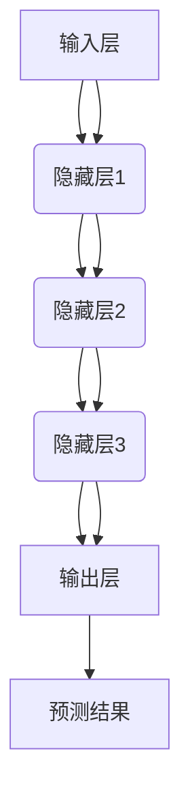

                 

# 神经网络：机器学习的新范式

> 关键词：神经网络, 机器学习, 深度学习, 人工智能, 计算机视觉, 自然语言处理

> 摘要：本文旨在深入探讨神经网络作为机器学习领域的新范式，从其核心概念、原理、数学模型到实际应用，进行全面解析。通过逐步推理和详细解释，帮助读者理解神经网络的工作机制及其在现代技术中的重要性。本文还提供了实际代码案例，帮助读者更好地掌握神经网络的构建和应用。

## 1. 背景介绍

神经网络是机器学习领域的一个重要分支，它模仿人脑神经元的工作方式，通过多层次的节点和连接来处理信息。神经网络的发展经历了从简单的感知器到复杂的深度神经网络的演变，其在图像识别、自然语言处理、语音识别等领域取得了显著的成果。本文将从神经网络的基本概念出发，逐步深入到其核心原理和实际应用，帮助读者全面理解这一技术。

## 2. 核心概念与联系

### 2.1 神经网络的基本概念

神经网络由多个节点（神经元）组成，每个节点接收输入信号，经过处理后输出信号。节点之间的连接具有权重，这些权重决定了信号的传递强度。神经网络通过调整这些权重来学习和优化其性能。

### 2.2 神经网络的架构

神经网络的架构可以分为输入层、隐藏层和输出层。输入层接收原始数据，隐藏层进行复杂的特征提取，输出层给出最终结果。神经网络的层数和节点数量可以根据具体任务进行调整。

### 2.3 神经网络的工作流程

神经网络的工作流程可以表示为以下流程图：



### 2.4 神经网络的训练过程

神经网络的训练过程包括前向传播和反向传播两个阶段。前向传播是指数据从输入层传递到输出层的过程，反向传播则是通过误差反向传播来调整权重，以最小化预测结果与实际结果之间的误差。

## 3. 核心算法原理 & 具体操作步骤

### 3.1 前向传播

前向传播是指数据从输入层传递到输出层的过程。具体步骤如下：

1. **输入层接收数据**：输入层接收原始数据，将其传递给隐藏层。
2. **隐藏层计算**：隐藏层中的每个节点根据输入数据和权重计算输出值。
3. **激活函数**：隐藏层的输出值通过激活函数进行非线性变换，产生新的输出值。
4. **传递到下一层**：隐藏层的输出值传递给下一层，重复上述步骤，直到输出层。

### 3.2 反向传播

反向传播是指通过误差反向传播来调整权重的过程。具体步骤如下：

1. **计算误差**：输出层的预测结果与实际结果之间的误差。
2. **反向传播误差**：误差从输出层反向传播到隐藏层，计算每个节点的误差。
3. **调整权重**：根据误差和学习率调整权重，以最小化误差。
4. **重复训练**：重复上述步骤，直到误差满足预定条件。

## 4. 数学模型和公式 & 详细讲解 & 举例说明

### 4.1 前向传播公式

前向传播公式可以表示为：

$$
z^{(l)} = W^{(l)}a^{(l-1)} + b^{(l)}
$$

其中，$z^{(l)}$ 是第 $l$ 层的线性组合，$W^{(l)}$ 是第 $l$ 层的权重矩阵，$a^{(l-1)}$ 是第 $l-1$ 层的激活值，$b^{(l)}$ 是第 $l$ 层的偏置向量。

### 4.2 激活函数

常用的激活函数有 Sigmoid、ReLU 和 Tanh。以 ReLU 为例：

$$
\text{ReLU}(z) = \max(0, z)
$$

### 4.3 反向传播公式

反向传播公式可以表示为：

$$
\delta^{(l)} = (W^{(l)})^T \delta^{(l+1)} \odot \sigma'(z^{(l)})
$$

其中，$\delta^{(l)}$ 是第 $l$ 层的误差，$\sigma'(z^{(l)})$ 是激活函数的导数，$\odot$ 表示逐元素乘法。

### 4.4 举例说明

假设有一个简单的神经网络，包含一个输入层、一个隐藏层和一个输出层。输入层有 2 个节点，隐藏层有 3 个节点，输出层有 1 个节点。权重矩阵和偏置向量如下：

$$
W^{(1)} = \begin{bmatrix}
0.1 & 0.2 & 0.3 \\
0.4 & 0.5 & 0.6
\end{bmatrix}, \quad b^{(1)} = \begin{bmatrix}
0.7 \\
0.8 \\
0.9
\end{bmatrix}
$$

$$
W^{(2)} = \begin{bmatrix}
0.1 & 0.2 & 0.3 \\
0.4 & 0.5 & 0.6 \\
0.7 & 0.8 & 0.9
\end{bmatrix}, \quad b^{(2)} = \begin{bmatrix}
1.0 \\
1.1 \\
1.2
\end{bmatrix}
$$

假设输入数据为：

$$
a^{(0)} = \begin{bmatrix}
0.5 \\
0.6
\end{bmatrix}
$$

通过前向传播计算隐藏层的输出：

$$
z^{(1)} = W^{(1)}a^{(0)} + b^{(1)} = \begin{bmatrix}
0.1 \times 0.5 + 0.2 \times 0.6 + 0.3 \times 0.7 + 0.7 \\
0.4 \times 0.5 + 0.5 \times 0.6 + 0.6 \times 0.7 + 0.8 \\
0.7 \times 0.5 + 0.8 \times 0.6 + 0.9 \times 0.7 + 0.9
\end{bmatrix} = \begin{bmatrix}
1.6 \\
2.2 \\
2.8
\end{bmatrix}
$$

$$
a^{(1)} = \text{ReLU}(z^{(1)}) = \begin{bmatrix}
1.6 \\
2.2 \\
2.8
\end{bmatrix}
$$

通过前向传播计算输出层的输出：

$$
z^{(2)} = W^{(2)}a^{(1)} + b^{(2)} = \begin{bmatrix}
0.1 \times 1.6 + 0.2 \times 2.2 + 0.3 \times 2.8 + 1.0 \\
0.4 \times 1.6 + 0.5 \times 2.2 + 0.6 \times 2.8 + 1.1 \\
0.7 \times 1.6 + 0.8 \times 2.2 + 0.9 \times 2.8 + 1.2
\end{bmatrix} = \begin{bmatrix}
2.6 \\
3.2 \\
3.8
\end{bmatrix}
$$

$$
a^{(2)} = \text{ReLU}(z^{(2)}) = \begin{bmatrix}
2.6 \\
3.2 \\
3.8
\end{bmatrix}
$$

## 5. 项目实战：代码实际案例和详细解释说明

### 5.1 开发环境搭建

为了搭建神经网络项目，我们需要安装 Python 和相关的库。推荐使用 Anaconda 环境，安装步骤如下：

1. 安装 Anaconda：访问 [Anaconda 官网](https://www.anaconda.com/products/distribution) 下载并安装。
2. 创建虚拟环境：打开 Anaconda Prompt，输入以下命令创建虚拟环境：

    ```bash
    conda create -n nn_env python=3.8
    conda activate nn_env
    ```

3. 安装所需库：输入以下命令安装 TensorFlow 和 Keras：

    ```bash
    pip install tensorflow keras
    ```

### 5.2 源代码详细实现和代码解读

我们将使用 TensorFlow 和 Keras 构建一个简单的神经网络，用于手写数字识别。

```python
import tensorflow as tf
from tensorflow.keras import layers, models

# 定义神经网络模型
model = models.Sequential([
    layers.Flatten(input_shape=(28, 28)),
    layers.Dense(128, activation='relu'),
    layers.Dense(10, activation='softmax')
])

# 编译模型
model.compile(optimizer='adam',
              loss='sparse_categorical_crossentropy',
              metrics=['accuracy'])

# 加载数据集
mnist = tf.keras.datasets.mnist
(x_train, y_train), (x_test, y_test) = mnist.load_data()

# 数据预处理
x_train, x_test = x_train / 255.0, x_test / 255.0

# 训练模型
model.fit(x_train, y_train, epochs=5)

# 评估模型
test_loss, test_acc = model.evaluate(x_test, y_test)
print(f'Test accuracy: {test_acc}')
```

### 5.3 代码解读与分析

1. **导入库**：导入 TensorFlow 和 Keras 库。
2. **定义模型**：使用 `Sequential` 模型定义一个简单的神经网络，包含一个 `Flatten` 层、一个 `Dense` 层和一个 `Dense` 层。
3. **编译模型**：设置优化器、损失函数和评估指标。
4. **加载数据集**：使用 MNIST 数据集，这是一个包含手写数字的图像数据集。
5. **数据预处理**：将图像数据归一化到 0-1 范围。
6. **训练模型**：使用训练数据训练模型，设置训练轮数。
7. **评估模型**：使用测试数据评估模型的性能。

## 6. 实际应用场景

神经网络在多个领域都有广泛的应用，包括但不限于：

- **计算机视觉**：图像分类、目标检测、图像生成等。
- **自然语言处理**：文本分类、情感分析、机器翻译等。
- **语音识别**：语音识别、语音合成等。
- **推荐系统**：个性化推荐、商品推荐等。

## 7. 工具和资源推荐

### 7.1 学习资源推荐

- **书籍**：《深度学习》（Goodfellow, Bengio, Courville）
- **论文**：《Neural Networks and Deep Learning》（Ian Goodfellow）
- **博客**：[机器之心](https://www.jiqizhixin.com/)、[TensorFlow 官方博客](https://www.tensorflow.org/)
- **网站**：[Kaggle](https://www.kaggle.com/)、[Coursera](https://www.coursera.org/)、[edX](https://www.edx.org/)

### 7.2 开发工具框架推荐

- **TensorFlow**：一个开源的机器学习框架。
- **Keras**：一个高级神经网络 API，可以运行在 TensorFlow 之上。
- **PyTorch**：一个开源的深度学习框架。

### 7.3 相关论文著作推荐

- **《深度学习》**：Ian Goodfellow, Yoshua Bengio, Aaron Courville
- **《神经网络与深度学习》**：Ian Goodfellow, Yoshua Bengio, Aaron Courville

## 8. 总结：未来发展趋势与挑战

神经网络作为机器学习领域的重要技术，未来的发展趋势包括：

- **模型优化**：通过更高效的算法和架构优化模型性能。
- **自动化训练**：通过自动化工具和框架简化模型训练过程。
- **可解释性**：提高模型的可解释性，使其更容易被人类理解。

然而，神经网络也面临一些挑战，包括：

- **计算资源需求**：大规模训练模型需要大量的计算资源。
- **数据隐私**：在处理敏感数据时需要保护用户隐私。
- **模型泛化能力**：提高模型在不同场景下的泛化能力。

## 9. 附录：常见问题与解答

### 9.1 问题：神经网络为什么需要多层结构？

**解答**：多层结构可以捕捉更复杂的特征，提高模型的表达能力。通过多层次的特征提取，神经网络可以更好地理解输入数据的复杂性。

### 9.2 问题：如何选择合适的激活函数？

**解答**：选择激活函数需要考虑模型的复杂性和计算效率。常用的激活函数有 Sigmoid、ReLU 和 Tanh，其中 ReLU 在大多数情况下表现较好。

### 9.3 问题：如何调整学习率？

**解答**：学习率的调整需要根据具体任务和模型表现进行。通常可以通过实验来确定合适的学习率，或者使用自适应学习率算法。

## 10. 扩展阅读 & 参考资料

- **书籍**：《深度学习》（Ian Goodfellow, Yoshua Bengio, Aaron Courville）
- **论文**：《Neural Networks and Deep Learning》（Ian Goodfellow）
- **网站**：[TensorFlow 官方文档](https://www.tensorflow.org/)、[Kaggle](https://www.kaggle.com/)

---

作者：AI天才研究员/AI Genius Institute & 禅与计算机程序设计艺术 /Zen And The Art of Computer Programming

