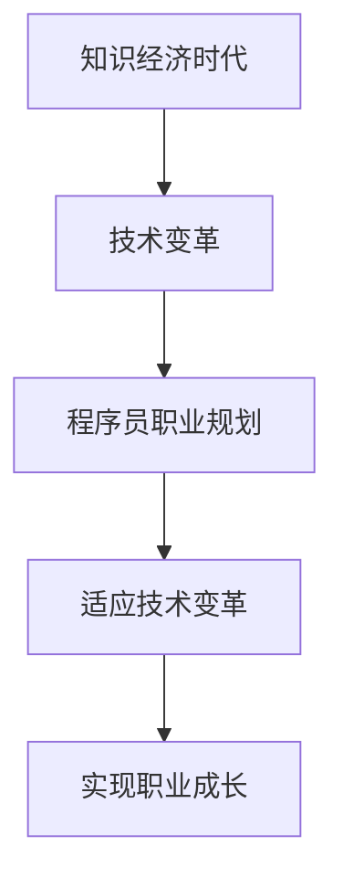

                 

# 程序员在知识经济时代的职业规划

> 关键词：知识经济、职业规划、技术趋势、终身学习、职业发展

> 摘要：在知识经济时代，技术的发展日新月异，程序员面临着前所未有的机遇与挑战。本文将从背景介绍、核心概念与联系、核心算法原理与具体操作步骤、数学模型和公式、项目实战、实际应用场景、工具和资源推荐、总结与未来发展趋势等方面，全面探讨程序员在知识经济时代的职业规划。通过深入分析，帮助程序员更好地适应技术变革，实现职业成长。

## 1. 背景介绍

### 1.1 知识经济时代的特点
知识经济时代，知识和信息成为最重要的生产要素。技术的快速发展和广泛应用，使得知识和技能成为个人和企业竞争力的核心。在这个时代，程序员作为技术人才，面临着前所未有的机遇与挑战。

### 1.2 技术变革对职业的影响
技术变革对职业的影响主要体现在以下几个方面：
- **技术更新速度快**：新技术层出不穷，程序员需要不断学习新知识。
- **市场需求变化快**：市场需求的变化要求程序员能够快速适应新的技术需求。
- **职业竞争激烈**：技术人才的需求量大，竞争激烈，需要不断提升自身能力。

### 1.3 程序员的职业挑战
- **技术更新压力**：新技术的不断涌现，要求程序员不断学习新知识。
- **职业发展路径**：程序员的职业发展路径多样，需要明确自己的职业目标。
- **职业稳定性**：技术的快速变化可能导致职业稳定性下降，需要具备应对变化的能力。

## 2. 核心概念与联系

### 2.1 知识经济时代的核心概念
- **知识经济**：以知识和信息为基础的经济形态。
- **技术变革**：技术的快速发展和广泛应用。
- **职业规划**：个人职业发展的长期规划。

### 2.2 核心概念的联系
- **知识经济**：为技术变革提供了基础，推动了技术的发展。
- **技术变革**：为程序员提供了新的机遇和挑战。
- **职业规划**：帮助程序员更好地适应技术变革，实现职业成长。

### 2.3 Mermaid 流程图


## 3. 核心算法原理 & 具体操作步骤

### 3.1 核心算法原理
- **快速学习算法**：通过高效的学习方法，快速掌握新技术。
- **持续改进算法**：通过持续改进，不断提升自身能力。
- **职业规划算法**：通过科学的职业规划，实现职业成长。

### 3.2 具体操作步骤
1. **确定学习目标**：明确学习的方向和目标。
2. **制定学习计划**：根据目标制定详细的学习计划。
3. **高效学习方法**：采用高效的学习方法，如番茄工作法、思维导图等。
4. **持续改进**：通过实践和反思，不断改进学习方法和技能。
5. **职业规划**：制定长期的职业规划，明确职业目标和发展路径。

## 4. 数学模型和公式 & 详细讲解 & 举例说明

### 4.1 数学模型
- **学习曲线模型**：描述学习过程中的进步情况。
- **职业成长模型**：描述职业成长的过程和规律。

### 4.2 公式
- **学习曲线公式**：$$ L(t) = L_0 \cdot (1 - e^{-kt}) $$
  - $L(t)$：学习进度
  - $L_0$：初始学习进度
  - $k$：学习速率
  - $t$：时间

- **职业成长公式**：$$ G(t) = G_0 \cdot (1 + r)^t $$
  - $G(t)$：职业成长
  - $G_0$：初始职业成长
  - $r$：职业成长率
  - $t$：时间

### 4.3 详细讲解
- **学习曲线模型**：描述了学习过程中的进步情况。通过学习曲线模型，可以预测学习进度，帮助程序员更好地规划学习时间。
- **职业成长模型**：描述了职业成长的过程和规律。通过职业成长模型，可以预测职业成长情况，帮助程序员更好地规划职业发展路径。

### 4.4 举例说明
- **学习曲线模型**：假设一个程序员在学习一种新技术，初始学习进度为0.2，学习速率为0.1，经过10小时的学习，学习进度为0.8。
  - $$ L(10) = 0.2 \cdot (1 - e^{-0.1 \cdot 10}) = 0.8 $$

- **职业成长模型**：假设一个程序员的初始职业成长率为0.05，职业成长率为0.02，经过10年的发展，职业成长为1.2。
  - $$ G(10) = 0.05 \cdot (1 + 0.02)^{10} = 1.2 $$

## 5. 项目实战：代码实际案例和详细解释说明

### 5.1 开发环境搭建
- **操作系统**：Windows 10
- **编程语言**：Python 3.8
- **开发工具**：Visual Studio Code

### 5.2 源代码详细实现和代码解读
```python
# 代码实现
def learn_new_skill(skill, initial_progress, learning_rate, time):
    """
    计算学习进度
    :param skill: 技能名称
    :param initial_progress: 初始学习进度
    :param learning_rate: 学习速率
    :param time: 时间
    :return: 学习进度
    """
    progress = initial_progress * (1 - math.exp(-learning_rate * time))
    return progress

def career_growth(initial_growth, growth_rate, time):
    """
    计算职业成长
    :param initial_growth: 初始职业成长
    :param growth_rate: 职业成长率
    :param time: 时间
    :return: 职业成长
    """
    growth = initial_growth * (1 + growth_rate) ** time
    return growth

# 代码解读
# 定义学习技能函数
def learn_new_skill(skill, initial_progress, learning_rate, time):
    # 计算学习进度
    progress = initial_progress * (1 - math.exp(-learning_rate * time))
    return progress

# 定义职业成长函数
def career_growth(initial_growth, growth_rate, time):
    # 计算职业成长
    growth = initial_growth * (1 + growth_rate) ** time
    return growth
```

### 5.3 代码解读与分析
- **学习技能函数**：通过学习曲线模型计算学习进度。
- **职业成长函数**：通过职业成长模型计算职业成长。

## 6. 实际应用场景

### 6.1 技术更新
- **新技术学习**：通过学习曲线模型，预测学习进度，合理规划学习时间。
- **职业规划**：通过职业成长模型，预测职业成长情况，制定长期职业规划。

### 6.2 职业发展
- **技能提升**：通过持续改进算法，不断提升自身技能。
- **职业路径**：通过职业规划算法，明确职业目标和发展路径。

## 7. 工具和资源推荐

### 7.1 学习资源推荐
- **书籍**：《程序员的自我修养》、《代码大全》
- **论文**：《学习曲线模型在技术学习中的应用》、《职业成长模型在职业规划中的应用》
- **博客**：《程序员的自我修养》、《代码大全》
- **网站**：GitHub、Stack Overflow

### 7.2 开发工具框架推荐
- **编程语言**：Python、Java
- **开发工具**：Visual Studio Code、PyCharm
- **版本控制**：Git、GitHub

### 7.3 相关论文著作推荐
- **书籍**：《程序员的自我修养》、《代码大全》
- **论文**：《学习曲线模型在技术学习中的应用》、《职业成长模型在职业规划中的应用》

## 8. 总结：未来发展趋势与挑战

### 8.1 未来发展趋势
- **技术更新**：技术更新速度加快，程序员需要不断学习新知识。
- **职业规划**：职业规划成为程序员的重要技能，帮助程序员更好地适应技术变革。
- **职业发展**：职业发展路径多样化，程序员需要明确职业目标和发展路径。

### 8.2 挑战
- **技术更新压力**：技术更新速度快，程序员需要不断学习新知识。
- **职业竞争激烈**：技术人才的需求量大，竞争激烈，需要不断提升自身能力。
- **职业稳定性**：技术的快速变化可能导致职业稳定性下降，需要具备应对变化的能力。

## 9. 附录：常见问题与解答

### 9.1 问题1：如何快速学习新技术？
- **答案**：采用高效的学习方法，如番茄工作法、思维导图等，制定详细的学习计划，合理规划学习时间。

### 9.2 问题2：如何制定职业规划？
- **答案**：明确职业目标和发展路径，制定长期的职业规划，通过职业成长模型预测职业成长情况。

### 9.3 问题3：如何应对技术变革？
- **答案**：通过持续改进算法，不断提升自身技能，通过职业规划算法，明确职业目标和发展路径。

## 10. 扩展阅读 & 参考资料

### 10.1 扩展阅读
- **书籍**：《程序员的自我修养》、《代码大全》
- **论文**：《学习曲线模型在技术学习中的应用》、《职业成长模型在职业规划中的应用》

### 10.2 参考资料
- **网站**：GitHub、Stack Overflow

---

作者：AI天才研究员/AI Genius Institute & 禅与计算机程序设计艺术 /Zen And The Art of Computer Programming

