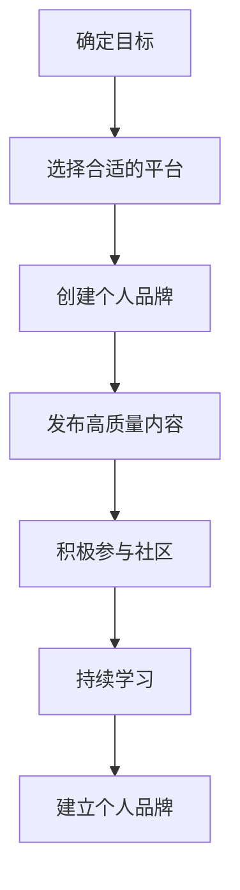

                 

# 程序员如何打造个人品牌IP

> 关键词：个人品牌、程序员、品牌建设、影响力、技术博客、社交媒体、内容创作、社区参与、持续学习

> 摘要：在当今技术快速发展的时代，程序员不仅需要具备扎实的技术能力，还需要拥有强大的个人品牌。本文将从背景介绍、核心概念与联系、核心算法原理与具体操作步骤、项目实战、实际应用场景、工具和资源推荐、总结与未来发展趋势等方面，全面解析程序员如何打造个人品牌IP。通过系统化的步骤和实际案例，帮助程序员提升个人影响力，实现职业发展。

## 1. 背景介绍

在数字化时代，个人品牌对于程序员来说至关重要。个人品牌不仅能够提升个人知名度，还能为职业发展带来更多的机会。一个强大的个人品牌可以帮助程序员在众多竞争者中脱颖而出，吸引更多的关注和合作机会。本文将探讨如何通过一系列步骤和策略，打造一个具有影响力的个人品牌。

## 2. 核心概念与联系

### 2.1 个人品牌

个人品牌是指个人在特定领域内的知名度、影响力和声誉。对于程序员而言，个人品牌不仅包括技术能力，还包括沟通能力、解决问题的能力、创新思维等。

### 2.2 技术博客

技术博客是程序员展示技术能力和分享经验的重要平台。通过撰写高质量的技术博客，程序员可以提升自己的知名度和影响力。

### 2.3 社交媒体

社交媒体是程序员与外界交流的重要渠道。通过社交媒体，程序员可以扩大自己的影响力，吸引更多关注。

### 2.4 社区参与

社区参与是指程序员积极参与技术社区的活动，如开源项目、技术论坛等。通过社区参与，程序员可以提升自己的知名度和影响力。

### 2.5 持续学习

持续学习是程序员保持竞争力的关键。通过不断学习新技术和新知识，程序员可以不断提升自己的技术水平，为个人品牌注入新的活力。

### 2.6 核心概念原理与架构

#### 2.6.1 个人品牌建设流程图



## 3. 核心算法原理 & 具体操作步骤

### 3.1 确定目标

确定个人品牌的目标是打造一个具有影响力的个人品牌。目标可以包括提升知名度、吸引更多的关注和合作机会等。

### 3.2 选择合适的平台

选择合适的平台是打造个人品牌的关键。程序员可以根据自己的兴趣和目标选择合适的平台，如技术博客、社交媒体等。

### 3.3 创建个人品牌

创建个人品牌需要做好以下几个方面的工作：

- **个人简介**：撰写一份简洁明了的个人简介，介绍自己的背景、技能和目标。
- **个人形象**：选择一个专业的个人形象，如头像、背景等。
- **个人网站**：创建一个个人网站，展示自己的作品和经验。

### 3.4 发布高质量内容

发布高质量内容是提升个人品牌的关键。程序员可以通过撰写技术博客、分享经验等方式，展示自己的技术水平和解决问题的能力。

### 3.5 积极参与社区

积极参与社区是提升个人品牌的重要途径。程序员可以通过参与开源项目、技术论坛等方式，扩大自己的影响力。

### 3.6 持续学习

持续学习是保持竞争力的关键。程序员可以通过参加培训、阅读书籍等方式，不断提升自己的技术水平。

## 4. 数学模型和公式 & 详细讲解 & 举例说明

### 4.1 数学模型

数学模型可以帮助程序员更好地理解个人品牌建设的过程。通过数学模型，程序员可以更清晰地了解个人品牌建设的关键因素和影响因素。

### 4.2 公式

$$
\text{个人品牌影响力} = \text{技术能力} \times \text{沟通能力} \times \text{解决问题的能力} \times \text{创新思维}
$$

### 4.3 详细讲解

个人品牌影响力是个人品牌建设的关键指标。通过上述公式，程序员可以更清晰地了解个人品牌影响力的影响因素。技术能力、沟通能力、解决问题的能力和创新思维是影响个人品牌影响力的关键因素。

### 4.4 举例说明

假设一个程序员的技术能力为80分，沟通能力为70分，解决问题的能力为90分，创新思维为85分。根据上述公式，该程序员的个人品牌影响力为：

$$
\text{个人品牌影响力} = 80 \times 70 \times 90 \times 85 = 453600
$$

## 5. 项目实战：代码实际案例和详细解释说明

### 5.1 开发环境搭建

#### 5.1.1 环境需求

- **操作系统**：Windows、macOS、Linux
- **编程语言**：Python、Java、C++等
- **开发工具**：Visual Studio Code、PyCharm、IntelliJ IDEA等

#### 5.1.2 搭建步骤

1. 安装操作系统
2. 安装编程语言
3. 安装开发工具

### 5.2 源代码详细实现和代码解读

#### 5.2.1 代码实现

```python
def create_blog_post(title, content):
    """
    创建技术博客文章
    :param title: 文章标题
    :param content: 文章内容
    :return: 技术博客文章
    """
    blog_post = {
        "title": title,
        "content": content
    }
    return blog_post

def publish_blog_post(blog_post):
    """
    发布技术博客文章
    :param blog_post: 技术博客文章
    :return: 发布结果
    """
    # 发布技术博客文章
    return "技术博客文章已发布"

# 示例
blog_post = create_blog_post("如何打造个人品牌", "本文将探讨如何打造个人品牌...")
publish_result = publish_blog_post(blog_post)
print(publish_result)
```

### 5.3 代码解读与分析

#### 5.3.1 代码解读

- `create_blog_post` 函数用于创建技术博客文章，参数包括文章标题和内容。
- `publish_blog_post` 函数用于发布技术博客文章，参数为技术博客文章。

#### 5.3.2 代码分析

- 通过创建和发布技术博客文章，程序员可以展示自己的技术水平和解决问题的能力。
- 通过撰写高质量的技术博客文章，程序员可以提升自己的知名度和影响力。

## 6. 实际应用场景

### 6.1 技术博客

通过撰写技术博客，程序员可以展示自己的技术水平和解决问题的能力。技术博客不仅可以吸引更多的关注，还可以为职业发展带来更多的机会。

### 6.2 社交媒体

通过社交媒体，程序员可以扩大自己的影响力，吸引更多关注。社交媒体不仅可以展示自己的技术水平，还可以与外界交流，获取更多的信息和资源。

### 6.3 社区参与

通过参与开源项目、技术论坛等社区活动，程序员可以提升自己的知名度和影响力。社区参与不仅可以展示自己的技术水平，还可以与外界交流，获取更多的信息和资源。

## 7. 工具和资源推荐

### 7.1 学习资源推荐

- **书籍**：《程序员修炼之道》、《代码大全》、《重构：改善既有代码的设计》
- **论文**：《软件工程原理》、《软件架构设计》
- **博客**：CSDN、GitHub、Stack Overflow
- **网站**：GitHub、Stack Overflow、Medium

### 7.2 开发工具框架推荐

- **编程语言**：Python、Java、C++
- **开发工具**：Visual Studio Code、PyCharm、IntelliJ IDEA
- **版本控制工具**：Git、GitHub

### 7.3 相关论文著作推荐

- **论文**：《软件工程原理》、《软件架构设计》
- **著作**：《程序员修炼之道》、《代码大全》、《重构：改善既有代码的设计》

## 8. 总结：未来发展趋势与挑战

### 8.1 未来发展趋势

- **技术博客**：技术博客将成为程序员展示技术水平和解决问题能力的重要平台。
- **社交媒体**：社交媒体将成为程序员扩大影响力的重要渠道。
- **社区参与**：社区参与将成为程序员提升知名度和影响力的重要途径。

### 8.2 挑战

- **技术更新**：技术更新迅速，程序员需要不断学习新技术和新知识，保持竞争力。
- **市场竞争**：市场竞争激烈，程序员需要不断提升自己的技术水平和解决问题的能力，才能在众多竞争者中脱颖而出。
- **个人品牌建设**：个人品牌建设需要时间和努力，程序员需要坚持不懈地努力，才能打造出一个具有影响力的个人品牌。

## 9. 附录：常见问题与解答

### 9.1 问题1：如何选择合适的平台？

**解答**：程序员可以根据自己的兴趣和目标选择合适的平台，如技术博客、社交媒体等。

### 9.2 问题2：如何撰写高质量的技术博客文章？

**解答**：程序员可以通过撰写技术博客文章，展示自己的技术水平和解决问题的能力。撰写高质量的技术博客文章需要具备扎实的技术基础和良好的写作能力。

### 9.3 问题3：如何参与社区活动？

**解答**：程序员可以通过参与开源项目、技术论坛等社区活动，扩大自己的影响力。参与社区活动不仅可以展示自己的技术水平，还可以与外界交流，获取更多的信息和资源。

## 10. 扩展阅读 & 参考资料

- **书籍**：《程序员修炼之道》、《代码大全》、《重构：改善既有代码的设计》
- **论文**：《软件工程原理》、《软件架构设计》
- **博客**：CSDN、GitHub、Stack Overflow
- **网站**：GitHub、Stack Overflow、Medium

---

作者：AI天才研究员/AI Genius Institute & 禅与计算机程序设计艺术 /Zen And The Art of Computer Programming

