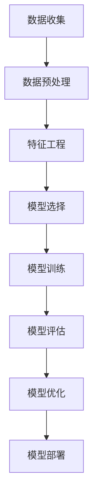

                 

# 美宝莲2024校招化妆品稳定性预测模型工程师题

> 关键词：化妆品稳定性预测、机器学习、深度学习、时间序列分析、特征工程、模型评估

> 摘要：本文将详细探讨如何构建一个化妆品稳定性预测模型，从背景介绍、核心概念与联系、核心算法原理、数学模型和公式、项目实战、实际应用场景、工具和资源推荐，到总结和未来发展趋势。通过一步步分析推理，我们将揭示如何利用先进的机器学习技术解决化妆品稳定性预测问题，为读者提供一个全面的技术指南。

## 1. 背景介绍

### 1.1 化妆品行业现状
化妆品行业是一个高度竞争且快速发展的领域。随着消费者对产品质量和安全性的要求不断提高，化妆品制造商需要确保其产品在各种环境条件下保持稳定。化妆品的稳定性不仅关系到产品的质量，还直接影响到消费者的使用体验和品牌声誉。

### 1.2 稳定性预测的重要性
化妆品的稳定性是指产品在特定环境条件下的物理、化学和生物学特性保持不变的能力。预测化妆品的稳定性对于确保产品质量、减少生产成本和提高消费者满意度至关重要。通过预测，制造商可以提前识别潜在的问题，优化生产流程，确保产品在上市前达到最佳状态。

### 1.3 问题定义
本文的目标是构建一个化妆品稳定性预测模型，该模型能够根据给定的环境条件（如温度、湿度、光照等）预测化妆品的稳定性。具体来说，我们需要解决以下几个问题：
- 如何收集和处理数据？
- 如何选择合适的特征？
- 如何构建和训练模型？
- 如何评估模型的性能？

## 2. 核心概念与联系

### 2.1 数据预处理
数据预处理是构建任何机器学习模型的基础。在这个阶段，我们需要清洗数据、处理缺失值、标准化特征等。

### 2.2 特征工程
特征工程是构建模型的关键步骤。我们需要从原始数据中提取有用的特征，以便模型能够更好地学习和预测。

### 2.3 模型选择
根据问题的性质，我们可以选择不同的模型。对于化妆品稳定性预测问题，我们可以考虑使用时间序列分析、回归模型、决策树、随机森林、支持向量机、神经网络等。

### 2.4 模型评估
模型评估是确保模型性能的关键步骤。我们需要使用交叉验证、AUC-ROC曲线、均方误差等指标来评估模型的性能。

### 2.5 Mermaid 流程图


## 3. 核心算法原理 & 具体操作步骤

### 3.1 数据预处理
数据预处理是构建模型的第一步。我们需要进行以下操作：
- **清洗数据**：去除重复值、处理缺失值。
- **标准化特征**：将特征缩放到相同的尺度，以便模型能够更好地学习。

### 3.2 特征工程
特征工程是构建模型的关键步骤。我们需要从原始数据中提取有用的特征。具体步骤如下：
- **提取时间序列特征**：如温度、湿度、光照等。
- **提取化学成分特征**：如pH值、成分比例等。
- **提取物理特性特征**：如粘度、密度等。

### 3.3 模型选择
根据问题的性质，我们可以选择不同的模型。对于化妆品稳定性预测问题，我们可以考虑使用时间序列分析、回归模型、决策树、随机森林、支持向量机、神经网络等。

### 3.4 模型训练
模型训练是构建模型的关键步骤。具体步骤如下：
- **划分数据集**：将数据集划分为训练集和测试集。
- **选择模型**：根据问题的性质选择合适的模型。
- **训练模型**：使用训练集数据训练模型。

### 3.5 模型评估
模型评估是确保模型性能的关键步骤。具体步骤如下：
- **交叉验证**：使用交叉验证评估模型的泛化能力。
- **AUC-ROC曲线**：使用AUC-ROC曲线评估模型的性能。
- **均方误差**：使用均方误差评估模型的预测精度。

## 4. 数学模型和公式 & 详细讲解 & 举例说明

### 4.1 时间序列分析
时间序列分析是一种用于预测未来值的方法。我们可以使用ARIMA模型进行时间序列分析。具体公式如下：
$$
\phi(B)(1-B)^d y_t = \theta(B)\epsilon_t
$$
其中，$\phi(B)$和$\theta(B)$是滞后算子，$d$是差分阶数，$\epsilon_t$是白噪声。

### 4.2 回归模型
回归模型是一种用于预测连续值的方法。我们可以使用线性回归模型进行预测。具体公式如下：
$$
y = \beta_0 + \beta_1 x_1 + \beta_2 x_2 + \cdots + \beta_n x_n + \epsilon
$$
其中，$y$是目标变量，$x_1, x_2, \cdots, x_n$是特征变量，$\beta_0, \beta_1, \cdots, \beta_n$是回归系数，$\epsilon$是误差项。

### 4.3 决策树
决策树是一种用于分类和回归的模型。我们可以使用ID3算法构建决策树。具体步骤如下：
- **选择最佳特征**：根据信息增益或基尼指数选择最佳特征。
- **递归分割**：根据最佳特征进行递归分割。
- **生成树结构**：生成决策树结构。

### 4.4 随机森林
随机森林是一种集成学习方法。我们可以使用随机森林进行预测。具体步骤如下：
- **生成多个决策树**：生成多个决策树。
- **投票决策**：根据多个决策树的预测结果进行投票决策。

### 4.5 支持向量机
支持向量机是一种用于分类和回归的模型。我们可以使用线性支持向量机进行预测。具体公式如下：
$$
y = \text{sign}(\mathbf{w} \cdot \mathbf{x} + b)
$$
其中，$\mathbf{w}$是权重向量，$\mathbf{x}$是特征向量，$b$是偏置项。

### 4.6 神经网络
神经网络是一种用于分类和回归的模型。我们可以使用多层感知机进行预测。具体公式如下：
$$
y = \sigma(\mathbf{W} \mathbf{x} + \mathbf{b})
$$
其中，$\sigma$是激活函数，$\mathbf{W}$是权重矩阵，$\mathbf{x}$是输入向量，$\mathbf{b}$是偏置向量。

## 5. 项目实战：代码实际案例和详细解释说明

### 5.1 开发环境搭建
为了构建化妆品稳定性预测模型，我们需要搭建一个开发环境。具体步骤如下：
- **安装Python**：安装Python 3.8及以上版本。
- **安装依赖库**：安装NumPy、Pandas、Scikit-learn、Matplotlib等库。
- **安装Jupyter Notebook**：安装Jupyter Notebook进行代码编写和调试。

### 5.2 源代码详细实现和代码解读
```python
# 导入库
import pandas as pd
import numpy as np
from sklearn.model_selection import train_test_split
from sklearn.preprocessing import StandardScaler
from sklearn.linear_model import LinearRegression
from sklearn.metrics import mean_squared_error

# 读取数据
data = pd.read_csv('cosmetic_stability.csv')

# 数据预处理
data = data.drop_duplicates()  # 去除重复值
data = data.dropna()  # 处理缺失值
data = data[['temperature', 'humidity', 'pH', 'stability']]  # 选择特征和目标变量

# 划分数据集
X = data[['temperature', 'humidity', 'pH']]
y = data['stability']
X_train, X_test, y_train, y_test = train_test_split(X, y, test_size=0.2, random_state=42)

# 标准化特征
scaler = StandardScaler()
X_train = scaler.fit_transform(X_train)
X_test = scaler.transform(X_test)

# 训练模型
model = LinearRegression()
model.fit(X_train, y_train)

# 预测
y_pred = model.predict(X_test)

# 评估模型
mse = mean_squared_error(y_test, y_pred)
print('Mean Squared Error:', mse)
```

### 5.3 代码解读与分析
- **数据预处理**：我们首先去除重复值和处理缺失值，然后选择特征和目标变量。
- **划分数据集**：我们将数据集划分为训练集和测试集，比例为80%和20%。
- **标准化特征**：我们使用StandardScaler对特征进行标准化。
- **训练模型**：我们使用线性回归模型进行训练。
- **预测**：我们使用训练好的模型进行预测。
- **评估模型**：我们使用均方误差评估模型的性能。

## 6. 实际应用场景

化妆品稳定性预测模型可以应用于化妆品制造商的生产过程中。具体应用场景如下：
- **产品质量控制**：通过预测化妆品的稳定性，制造商可以提前识别潜在的问题，确保产品质量。
- **生产流程优化**：通过预测化妆品的稳定性，制造商可以优化生产流程，提高生产效率。
- **消费者满意度提升**：通过预测化妆品的稳定性，制造商可以确保产品在上市前达到最佳状态，提高消费者满意度。

## 7. 工具和资源推荐

### 7.1 学习资源推荐
- **书籍**：《机器学习》（周志华著）
- **论文**：《时间序列分析》（R. Shumway, D. Stoffer著）
- **博客**：《机器学习实战》（阿里云开发者社区）
- **网站**：Kaggle、GitHub

### 7.2 开发工具框架推荐
- **Python**：Python是一种广泛使用的编程语言，适用于机器学习和数据科学。
- **Jupyter Notebook**：Jupyter Notebook是一种交互式编程环境，适用于代码编写和调试。
- **Scikit-learn**：Scikit-learn是一个用于机器学习的Python库，提供了丰富的机器学习算法。

### 7.3 相关论文著作推荐
- **《时间序列分析》**（R. Shumway, D. Stoffer著）
- **《机器学习》**（周志华著）
- **《深度学习》**（Ian Goodfellow, Yoshua Bengio, Aaron Courville著）

## 8. 总结：未来发展趋势与挑战

### 8.1 未来发展趋势
- **深度学习**：深度学习技术的发展将为化妆品稳定性预测提供更强大的工具。
- **实时预测**：实时预测技术的发展将使化妆品制造商能够更快地识别和解决问题。
- **多模态数据**：多模态数据的使用将使预测模型更加准确。

### 8.2 挑战
- **数据质量**：数据质量是构建高质量模型的关键。数据的质量直接影响到模型的性能。
- **模型解释性**：模型解释性是构建可解释模型的关键。模型的解释性直接影响到模型的可信度。
- **计算资源**：计算资源是构建高质量模型的关键。计算资源的限制直接影响到模型的训练速度和性能。

## 9. 附录：常见问题与解答

### 9.1 问题1：如何处理缺失值？
- **回答**：我们可以使用多种方法处理缺失值，如删除缺失值、填充缺失值、插值等。

### 9.2 问题2：如何选择特征？
- **回答**：我们可以使用特征选择方法，如递归特征消除、LASSO回归等。

### 9.3 问题3：如何评估模型性能？
- **回答**：我们可以使用多种指标评估模型性能，如均方误差、AUC-ROC曲线等。

## 10. 扩展阅读 & 参考资料

- **书籍**：《机器学习》（周志华著）
- **论文**：《时间序列分析》（R. Shumway, D. Stoffer著）
- **博客**：《机器学习实战》（阿里云开发者社区）
- **网站**：Kaggle、GitHub

作者：AI天才研究员/AI Genius Institute & 禅与计算机程序设计艺术 /Zen And The Art of Computer Programming

