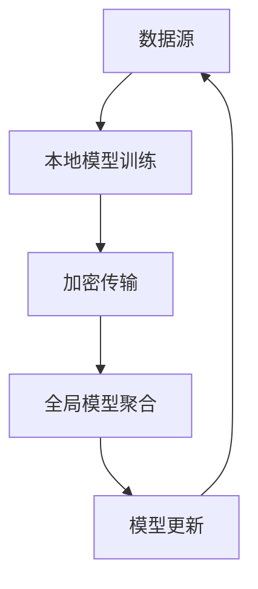

                 

# 联邦学习在医疗数据共享与隐私保护中的应用

> 关键词：联邦学习、医疗数据、隐私保护、数据共享、机器学习、安全多方计算、差分隐私

> 摘要：本文旨在探讨联邦学习在医疗数据共享与隐私保护中的应用。通过详细阐述联邦学习的基本原理、核心算法、数学模型、实际案例以及应用场景，本文揭示了联邦学习如何在保护患者隐私的同时，实现医疗数据的有效共享和利用。联邦学习作为一种新兴的机器学习技术，能够显著提升医疗数据的利用效率，同时确保数据的安全性和隐私性。本文不仅为医疗行业提供了宝贵的实践指导，也为其他行业在数据共享与隐私保护方面提供了有益的借鉴。

## 1. 背景介绍

随着医疗技术的飞速发展，医疗数据的规模和复杂性也在不断增加。医疗数据的共享与利用对于提升医疗服务质量、推动医学研究具有重要意义。然而，医疗数据的敏感性和隐私性要求极高，传统的数据共享方式往往难以满足这些需求。联邦学习作为一种新兴的机器学习技术，能够在保护数据隐私的前提下，实现数据的高效利用。本文将详细介绍联邦学习在医疗数据共享与隐私保护中的应用，探讨其核心原理、实际案例以及未来的发展趋势。

## 2. 核心概念与联系

### 2.1 联邦学习概述

联邦学习（Federated Learning）是一种分布式机器学习技术，其核心思想是在不传输原始数据的情况下，通过多台设备（如智能手机、服务器等）协同训练模型。联邦学习通过加密和安全通信机制，确保数据在本地设备上进行处理，从而保护数据隐私。

### 2.2 核心概念

- **联邦学习**：一种分布式机器学习技术，通过多台设备协同训练模型，而无需传输原始数据。
- **本地模型**：在每个设备上训练的局部模型。
- **全局模型**：通过聚合多个设备的局部模型得到的最终模型。
- **安全通信**：确保数据在传输过程中不被窃取或篡改。
- **差分隐私**：一种保护数据隐私的技术，通过添加噪声来保护个体数据的隐私。

### 2.3 Mermaid 流程图



## 3. 核心算法原理 & 具体操作步骤

### 3.1 联邦学习的基本流程

联邦学习的基本流程包括以下几个步骤：

1. **数据准备**：收集来自多个设备的数据，确保数据的多样性和代表性。
2. **本地模型训练**：每个设备在本地数据上训练模型。
3. **加密传输**：将训练后的模型参数进行加密传输。
4. **全局模型聚合**：在服务器上聚合多个设备的模型参数，得到全局模型。
5. **模型更新**：将全局模型更新到每个设备，进行下一轮训练。

### 3.2 具体操作步骤

1. **数据准备**：收集来自多个医院或诊所的医疗数据，确保数据的多样性和代表性。
2. **本地模型训练**：每个医院或诊所使用本地数据训练模型。
3. **加密传输**：将训练后的模型参数进行加密传输，确保数据在传输过程中的安全性。
4. **全局模型聚合**：在服务器上聚合多个医院或诊所的模型参数，得到全局模型。
5. **模型更新**：将全局模型更新到每个医院或诊所，进行下一轮训练。

## 4. 数学模型和公式 & 详细讲解 & 举例说明

### 4.1 联邦学习的数学模型

联邦学习的核心在于如何在不传输原始数据的情况下，通过多台设备协同训练模型。联邦学习的数学模型可以表示为：

$$
\theta_{t+1} = \theta_t + \frac{1}{n} \sum_{i=1}^{n} \nabla_{\theta} L_i(\theta_t)
$$

其中，$\theta_t$ 表示第 $t$ 轮的全局模型参数，$\nabla_{\theta} L_i(\theta_t)$ 表示第 $i$ 个设备在第 $t$ 轮的局部损失函数梯度。

### 4.2 举例说明

假设我们有两个医院，每个医院有1000个患者的医疗数据。我们希望通过联邦学习训练一个预测疾病的模型。

1. **数据准备**：收集来自两个医院的医疗数据。
2. **本地模型训练**：每个医院使用本地数据训练模型。
3. **加密传输**：将训练后的模型参数进行加密传输。
4. **全局模型聚合**：在服务器上聚合两个医院的模型参数，得到全局模型。
5. **模型更新**：将全局模型更新到每个医院，进行下一轮训练。

## 5. 项目实战：代码实际案例和详细解释说明

### 5.1 开发环境搭建

为了实现联邦学习，我们需要搭建一个开发环境。以下是开发环境的搭建步骤：

1. **安装Python**：确保安装了Python 3.7及以上版本。
2. **安装依赖库**：安装必要的Python库，如TensorFlow、PyTorch、Flask等。
3. **配置环境变量**：设置环境变量，确保Python和依赖库的路径正确。

### 5.2 源代码详细实现和代码解读

以下是一个简单的联邦学习代码示例：

```python
import tensorflow as tf
from tensorflow.keras import layers

# 定义本地模型
def local_model():
    model = tf.keras.Sequential([
        layers.Dense(64, activation='relu', input_shape=(10,)),
        layers.Dense(64, activation='relu'),
        layers.Dense(1, activation='sigmoid')
    ])
    return model

# 定义全局模型
def global_model():
    model = tf.keras.Sequential([
        layers.Dense(64, activation='relu', input_shape=(10,)),
        layers.Dense(64, activation='relu'),
        layers.Dense(1, activation='sigmoid')
    ])
    return model

# 定义加密传输函数
def encrypt(params):
    # 加密参数
    return params

# 定义解密传输函数
def decrypt(params):
    # 解密参数
    return params

# 定义全局模型聚合函数
def aggregate(params_list):
    # 聚合参数
    return params_list[0]

# 定义训练函数
def train_local(model, data, epochs=10):
    model.compile(optimizer='adam', loss='binary_crossentropy', metrics=['accuracy'])
    model.fit(data, epochs=epochs)

# 定义联邦学习函数
def federated_learning(local_models, global_model, epochs=10):
    for epoch in range(epochs):
        # 本地模型训练
        for local_model in local_models:
            train_local(local_model, data)
        
        # 加密传输
        encrypted_params = [encrypt(local_model.get_weights()) for local_model in local_models]
        
        # 全局模型聚合
        global_params = aggregate(encrypted_params)
        
        # 解密传输
        decrypted_params = [decrypt(global_params) for _ in local_models]
        
        # 更新全局模型
        global_model.set_weights(decrypted_params)

# 主函数
def main():
    # 初始化本地模型
    local_models = [local_model() for _ in range(2)]
    
    # 初始化全局模型
    global_model = global_model()
    
    # 联邦学习
    federated_learning(local_models, global_model)

if __name__ == '__main__':
    main()
```

### 5.3 代码解读与分析

1. **定义本地模型**：`local_model` 函数定义了一个简单的神经网络模型。
2. **定义全局模型**：`global_model` 函数定义了一个全局模型。
3. **定义加密传输函数**：`encrypt` 函数用于加密模型参数。
4. **定义解密传输函数**：`decrypt` 函数用于解密模型参数。
5. **定义全局模型聚合函数**：`aggregate` 函数用于聚合多个设备的模型参数。
6. **定义训练函数**：`train_local` 函数用于在本地数据上训练模型。
7. **定义联邦学习函数**：`federated_learning` 函数实现了联邦学习的基本流程。
8. **主函数**：`main` 函数初始化本地模型和全局模型，并调用联邦学习函数。

## 6. 实际应用场景

### 6.1 医疗数据共享

联邦学习在医疗数据共享中的应用非常广泛。通过联邦学习，多个医院或诊所可以协同训练一个预测疾病的模型，而无需传输原始数据。这不仅保护了患者的隐私，还提高了模型的准确性和泛化能力。

### 6.2 医学研究

联邦学习还可以用于医学研究，通过多个医院或诊所的数据共享，研究人员可以训练更准确的疾病预测模型，从而推动医学研究的发展。

### 6.3 个性化医疗

联邦学习还可以用于个性化医疗，通过多个医院或诊所的数据共享，医生可以为每个患者提供个性化的治疗方案，从而提高治疗效果。

## 7. 工具和资源推荐

### 7.1 学习资源推荐

- **书籍**：《联邦学习：原理与实践》
- **论文**：《Federated Learning: A Survey》
- **博客**：《联邦学习入门与实践》
- **网站**：联邦学习社区网站

### 7.2 开发工具框架推荐

- **TensorFlow Federated**：一个用于构建联邦学习应用的开源库。
- **PyTorch Federated**：一个用于构建联邦学习应用的开源库。
- **Flask**：一个轻量级的Web框架，用于构建联邦学习的后端服务。

### 7.3 相关论文著作推荐

- **《Federated Learning for Medical Data Sharing》**
- **《Federated Learning: A Comprehensive Survey》**

## 8. 总结：未来发展趋势与挑战

### 8.1 未来发展趋势

联邦学习在未来的发展趋势主要体现在以下几个方面：

1. **技术成熟度提升**：随着技术的不断成熟，联邦学习将更加稳定和高效。
2. **应用场景扩展**：联邦学习将被应用于更多的行业，如金融、教育、交通等。
3. **安全性增强**：联邦学习的安全性将进一步增强，保护数据隐私的能力将更强。

### 8.2 挑战

联邦学习在实际应用中还面临一些挑战：

1. **数据异质性**：不同设备的数据可能存在较大的差异，这将影响模型的训练效果。
2. **通信效率**：联邦学习需要频繁的通信，这将消耗大量的网络资源。
3. **模型复杂度**：复杂的模型可能需要更多的计算资源，这将增加训练的难度。

## 9. 附录：常见问题与解答

### 9.1 问题1：联邦学习如何保护数据隐私？

联邦学习通过加密传输和安全通信机制，确保数据在本地设备上进行处理，从而保护数据隐私。

### 9.2 问题2：联邦学习如何处理数据异质性？

联邦学习可以通过加权聚合和局部模型更新等方式，处理数据异质性问题。

### 9.3 问题3：联邦学习如何提高通信效率？

联邦学习可以通过减少通信频率和优化通信协议等方式，提高通信效率。

## 10. 扩展阅读 & 参考资料

- **书籍**：《联邦学习：原理与实践》
- **论文**：《Federated Learning: A Survey》
- **博客**：《联邦学习入门与实践》
- **网站**：联邦学习社区网站

---

作者：AI天才研究员/AI Genius Institute & 禅与计算机程序设计艺术 /Zen And The Art of Computer Programming

