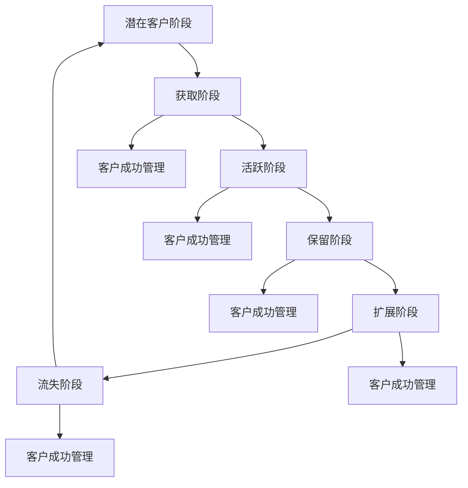

                 

# 自动化创业中的客户成功管理

> 关键词：客户成功管理, 自动化, 创业, 人工智能, 客户生命周期, 客户满意度, 数据分析

> 摘要：在创业过程中，客户成功管理是确保业务持续增长的关键。本文将深入探讨如何通过自动化手段提升客户成功管理的效率和效果。我们将从客户生命周期管理入手，分析其核心概念和流程，介绍相关算法原理和具体操作步骤，并通过实际案例展示如何实现自动化客户成功管理。最后，我们将讨论未来的发展趋势和面临的挑战。

## 1. 背景介绍

在当今快速变化的商业环境中，客户成功管理已成为企业能否持续发展的关键因素之一。客户成功管理（Customer Success Management, CSM）旨在确保客户能够充分利用产品或服务，实现其业务目标，从而提高客户满意度和忠诚度。对于初创企业而言，资源有限，如何高效地进行客户成功管理尤为重要。

### 1.1 客户生命周期管理

客户生命周期管理（Customer Lifecycle Management, CLM）是指从潜在客户到最终客户流失的整个过程中的管理活动。这一过程可以分为以下几个阶段：

- **潜在客户阶段**：识别潜在客户，进行初步接触和评估。
- **获取阶段**：通过销售活动将潜在客户转化为实际客户。
- **活跃阶段**：确保客户能够充分利用产品或服务。
- **保留阶段**：通过持续的支持和服务，保持客户的满意度和忠诚度。
- **扩展阶段**：鼓励客户增加使用量或推荐其他客户。
- **流失阶段**：处理客户流失，分析原因并采取措施。

### 1.2 自动化在客户成功管理中的作用

自动化可以显著提高客户成功管理的效率和效果。通过自动化工具，企业可以：

- **提高响应速度**：快速响应客户的需求和问题。
- **减少人工错误**：减少人为错误，提高数据准确性。
- **优化资源分配**：根据客户需求动态调整资源分配。
- **提升客户体验**：通过个性化的服务提升客户满意度。

## 2. 核心概念与联系

### 2.1 客户成功管理的核心概念

- **客户成功**：客户能够实现其业务目标。
- **客户满意度**：客户对产品或服务的满意程度。
- **客户忠诚度**：客户对品牌的忠诚程度。
- **客户生命周期价值**（Customer Lifetime Value, CLV）：客户在整个生命周期内为企业带来的价值。

### 2.2 客户成功管理的流程

客户成功管理的流程可以分为以下几个步骤：

1. **客户识别**：通过数据分析识别潜在客户。
2. **客户获取**：通过销售活动将潜在客户转化为实际客户。
3. **客户激活**：通过培训和指导帮助客户快速上手。
4. **客户保留**：通过持续的支持和服务保持客户满意度。
5. **客户扩展**：鼓励客户增加使用量或推荐其他客户。
6. **客户流失管理**：分析客户流失原因并采取措施。

### 2.3 Mermaid 流程图



## 3. 核心算法原理 & 具体操作步骤

### 3.1 客户成功评分算法

客户成功评分算法用于评估客户在各个阶段的表现，从而预测其未来的行为。该算法可以分为以下几个步骤：

1. **数据收集**：收集客户的基本信息、使用数据和反馈数据。
2. **特征提取**：提取与客户成功相关的特征，如使用频率、满意度评分等。
3. **模型训练**：使用机器学习算法（如逻辑回归、随机森林等）训练模型。
4. **评分计算**：根据模型预测客户在各个阶段的表现。

### 3.2 具体操作步骤

1. **数据收集**：收集客户的基本信息、使用数据和反馈数据。
2. **特征提取**：提取与客户成功相关的特征，如使用频率、满意度评分等。
3. **模型训练**：使用机器学习算法（如逻辑回归、随机森林等）训练模型。
4. **评分计算**：根据模型预测客户在各个阶段的表现。
5. **自动化响应**：根据评分结果自动触发相应的响应措施。

## 4. 数学模型和公式 & 详细讲解 & 举例说明

### 4.1 客户成功评分模型

客户成功评分模型可以使用逻辑回归模型进行预测。逻辑回归模型的公式如下：

$$
P(y=1|x) = \frac{1}{1 + e^{-(\beta_0 + \beta_1 x_1 + \beta_2 x_2 + \cdots + \beta_n x_n)}}
$$

其中，$P(y=1|x)$ 表示客户成功概率，$\beta_0, \beta_1, \cdots, \beta_n$ 是模型参数，$x_1, x_2, \cdots, x_n$ 是特征变量。

### 4.2 举例说明

假设我们有一个客户成功评分模型，特征变量包括使用频率（$x_1$）和满意度评分（$x_2$）。模型参数为 $\beta_0 = -2, \beta_1 = 0.5, \beta_2 = 0.3$。对于一个客户，其使用频率为 5，满意度评分为 4，我们可以计算其客户成功概率：

$$
P(y=1|x) = \frac{1}{1 + e^{-( -2 + 0.5 \times 5 + 0.3 \times 4 )}} = \frac{1}{1 + e^{-1.7}} \approx 0.85
$$

这意味着该客户成功概率约为 85%。

## 5. 项目实战：代码实际案例和详细解释说明

### 5.1 开发环境搭建

为了实现自动化客户成功管理，我们需要搭建一个开发环境。这里我们使用 Python 作为开发语言，使用 Pandas 和 Scikit-learn 作为数据处理和机器学习库。

1. **安装 Python 和相关库**：
    ```bash
    pip install pandas scikit-learn
    ```

2. **创建项目结构**：
    ```
    customer_success/
    ├── data/
    │   ├── customer_data.csv
    │   └── feature_extraction.py
    ├── models/
    │   └── customer_success_model.py
    ├── scripts/
    │   └── train_model.py
    └── notebooks/
        └── analyze_data.ipynb
    ```

### 5.2 源代码详细实现和代码解读

#### 5.2.1 数据处理

```python
# feature_extraction.py
import pandas as pd

def load_data(file_path):
    return pd.read_csv(file_path)

def extract_features(data):
    # 提取特征变量
    features = data[['usage_frequency', 'satisfaction_score']]
    return features

def main():
    data = load_data('data/customer_data.csv')
    features = extract_features(data)
    features.to_csv('data/processed_features.csv', index=False)

if __name__ == '__main__':
    main()
```

#### 5.2.2 模型训练

```python
# customer_success_model.py
import pandas as pd
from sklearn.linear_model import LogisticRegression
from sklearn.model_selection import train_test_split
from sklearn.metrics import accuracy_score

def load_data(file_path):
    return pd.read_csv(file_path)

def train_model(features, labels):
    X_train, X_test, y_train, y_test = train_test_split(features, labels, test_size=0.2, random_state=42)
    model = LogisticRegression()
    model.fit(X_train, y_train)
    y_pred = model.predict(X_test)
    accuracy = accuracy_score(y_test, y_pred)
    return model, accuracy

def main():
    data = load_data('data/processed_features.csv')
    labels = data['success']
    features = data.drop(columns=['success'])
    model, accuracy = train_model(features, labels)
    print(f'Model accuracy: {accuracy}')
    model.save('models/customer_success_model.pkl')

if __name__ == '__main__':
    main()
```

### 5.3 代码解读与分析

1. **数据处理**：`feature_extraction.py` 负责加载数据并提取特征变量。
2. **模型训练**：`customer_success_model.py` 负责加载数据、训练模型并保存模型。
3. **模型评估**：通过 `accuracy_score` 函数评估模型的准确性。

## 6. 实际应用场景

### 6.1 客户成功管理平台

通过自动化客户成功管理平台，企业可以实现以下功能：

- **客户识别**：通过数据分析识别潜在客户。
- **客户获取**：通过销售活动将潜在客户转化为实际客户。
- **客户激活**：通过培训和指导帮助客户快速上手。
- **客户保留**：通过持续的支持和服务保持客户满意度。
- **客户扩展**：鼓励客户增加使用量或推荐其他客户。
- **客户流失管理**：分析客户流失原因并采取措施。

### 6.2 客户成功管理工具

通过客户成功管理工具，企业可以实现以下功能：

- **自动化响应**：根据评分结果自动触发相应的响应措施。
- **个性化服务**：根据客户的需求提供个性化的服务。
- **数据分析**：通过数据分析了解客户的行为和需求。
- **客户反馈**：收集客户反馈并及时调整服务策略。

## 7. 工具和资源推荐

### 7.1 学习资源推荐

- **书籍**：《客户成功管理：如何让客户成功》
- **论文**：《客户成功管理的实践与挑战》
- **博客**：《客户成功管理的最佳实践》
- **网站**：客户成功管理社区

### 7.2 开发工具框架推荐

- **Python**：用于数据处理和机器学习。
- **Pandas**：用于数据处理。
- **Scikit-learn**：用于机器学习。
- **TensorFlow**：用于深度学习。

### 7.3 相关论文著作推荐

- **论文**：《客户成功管理的实践与挑战》
- **著作**：《客户成功管理：如何让客户成功》

## 8. 总结：未来发展趋势与挑战

### 8.1 未来发展趋势

- **自动化程度提高**：自动化工具将更加成熟，提高客户成功管理的效率。
- **个性化服务**：通过大数据和人工智能技术提供更加个性化的服务。
- **客户体验优化**：通过持续优化客户体验提升客户满意度。

### 8.2 面临的挑战

- **数据安全**：保护客户数据的安全和隐私。
- **技术更新**：不断更新技术以应对新的挑战。
- **人才短缺**：培养和吸引具有相关技能的人才。

## 9. 附录：常见问题与解答

### 9.1 问题：如何处理客户流失？

**解答**：通过数据分析了解客户流失的原因，并采取相应的措施，如提供更好的服务、优化产品功能等。

### 9.2 问题：如何提高客户满意度？

**解答**：通过持续的支持和服务，了解客户的需求并及时调整服务策略。

## 10. 扩展阅读 & 参考资料

- **书籍**：《客户成功管理：如何让客户成功》
- **论文**：《客户成功管理的实践与挑战》
- **博客**：《客户成功管理的最佳实践》
- **网站**：客户成功管理社区

---

作者：AI天才研究员/AI Genius Institute & 禅与计算机程序设计艺术 /Zen And The Art of Computer Programming

