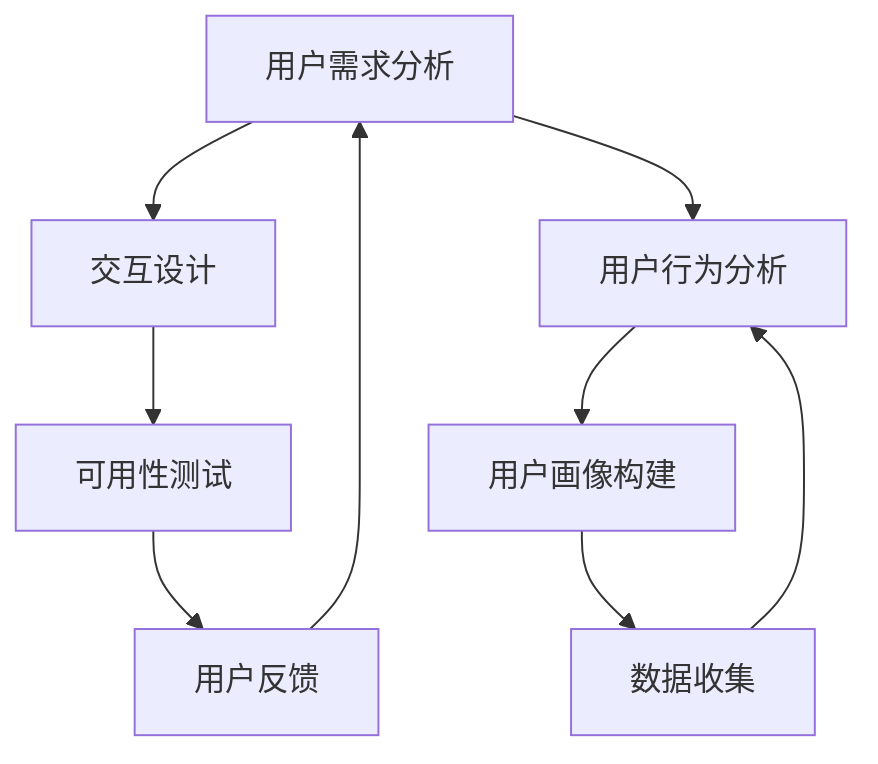

                 

# 自动化创业中的用户体验设计思维

> 关键词：用户体验设计、自动化创业、人工智能、用户行为分析、交互设计、用户反馈、产品迭代

> 摘要：在自动化创业中，用户体验设计思维是至关重要的。本文将从用户体验设计的核心概念出发，探讨如何通过用户行为分析、交互设计和用户反馈来优化产品，实现自动化创业的成功。我们将通过具体的案例和数学模型，深入解析用户体验设计的原理和方法，帮助创业者更好地理解用户需求，提升产品竞争力。

## 1. 背景介绍

在当今快速发展的科技时代，自动化创业成为了一种新的商业模式。自动化创业的核心在于利用人工智能和自动化技术，为用户提供高效、便捷的服务。然而，仅仅依靠技术并不能确保创业的成功。用户体验设计思维在这一过程中扮演着至关重要的角色。用户体验设计不仅关注产品的功能性和技术实现，更注重用户的需求和感受。通过深入了解用户行为、优化交互设计和及时获取用户反馈，可以显著提升产品的用户体验，从而在激烈的市场竞争中脱颖而出。

### 1.1 自动化创业的定义与特点

自动化创业是指利用自动化技术和人工智能，为用户提供高效、便捷的服务。其特点包括：

- **技术驱动**：依赖于先进的技术手段，如机器学习、自然语言处理等。
- **用户体验优先**：注重提升用户在使用产品过程中的体验。
- **快速迭代**：通过不断收集用户反馈，快速调整和优化产品。

### 1.2 为什么用户体验设计在自动化创业中至关重要

在自动化创业中，用户体验设计的重要性体现在以下几个方面：

- **提高用户满意度**：良好的用户体验可以显著提高用户的满意度和忠诚度。
- **增加用户黏性**：通过优化用户体验，可以增加用户的使用频率和停留时间。
- **促进口碑传播**：满意的用户更愿意向他人推荐产品，从而带来更多的用户。
- **提升产品竞争力**：在激烈的市场竞争中，优秀的用户体验可以成为产品的核心竞争力。

## 2. 核心概念与联系

### 2.1 用户体验设计的核心概念

用户体验设计（User Experience Design, UX Design）是指通过设计和优化产品，使用户在使用过程中获得愉悦和满意的过程。其核心概念包括：

- **用户需求分析**：了解用户的需求和期望。
- **交互设计**：设计用户与产品之间的交互方式。
- **可用性测试**：通过测试评估产品的易用性和用户体验。
- **用户反馈**：收集和分析用户的反馈，不断优化产品。

### 2.2 用户行为分析

用户行为分析（User Behavior Analysis, UBA）是指通过收集和分析用户在使用产品过程中的行为数据，了解用户的行为模式和偏好。其核心概念包括：

- **数据收集**：通过日志、问卷、访谈等方式收集用户数据。
- **数据分析**：使用统计学和机器学习方法分析用户数据。
- **行为模式识别**：识别用户的行为模式和偏好。
- **用户画像构建**：根据行为数据构建用户画像。

### 2.3 交互设计

交互设计（Interaction Design, IxD）是指设计用户与产品之间的交互方式，使用户能够高效、愉悦地完成任务。其核心概念包括：

- **界面设计**：设计用户界面，使用户能够直观地操作产品。
- **导航设计**：设计用户在产品中的导航路径，使用户能够轻松找到所需功能。
- **反馈设计**：设计用户操作后的反馈，使用户能够及时了解操作结果。
- **一致性设计**：保持界面和交互的一致性，提高用户的熟悉度和满意度。

### 2.4 用户反馈

用户反馈是指收集和分析用户对产品使用过程中的意见和建议。其核心概念包括：

- **反馈渠道**：提供多种渠道供用户反馈，如在线问卷、社交媒体、客服等。
- **反馈分析**：对用户反馈进行分类和分析，识别问题和改进点。
- **反馈处理**：根据反馈调整产品设计和功能。
- **反馈循环**：建立用户反馈的闭环机制，不断优化产品。

### 2.5 Mermaid 流程图



## 3. 核心算法原理 & 具体操作步骤

### 3.1 用户行为分析算法

用户行为分析算法的核心在于通过数据挖掘和机器学习方法，识别用户的行为模式和偏好。具体操作步骤如下：

1. **数据收集**：通过日志、问卷、访谈等方式收集用户数据。
2. **数据预处理**：清洗和整理数据，去除无效和重复的数据。
3. **特征提取**：从数据中提取有用的特征，如点击率、停留时间等。
4. **模型训练**：使用机器学习算法（如决策树、随机森林、神经网络等）训练模型。
5. **模型评估**：通过交叉验证等方法评估模型的性能。
6. **行为模式识别**：根据模型结果识别用户的行为模式和偏好。
7. **用户画像构建**：根据行为模式和偏好构建用户画像。

### 3.2 交互设计算法

交互设计算法的核心在于通过设计和优化用户界面和交互方式，提高用户的使用体验。具体操作步骤如下：

1. **需求分析**：了解用户的需求和期望。
2. **原型设计**：设计产品原型，包括界面设计和交互设计。
3. **用户测试**：通过原型测试评估用户的使用体验。
4. **反馈收集**：收集用户的反馈和建议。
5. **设计优化**：根据反馈优化产品设计。
6. **迭代改进**：不断迭代改进产品设计，提高用户体验。

### 3.3 用户反馈处理算法

用户反馈处理算法的核心在于通过收集和分析用户反馈，不断优化产品设计和功能。具体操作步骤如下：

1. **反馈渠道**：提供多种渠道供用户反馈，如在线问卷、社交媒体、客服等。
2. **反馈分类**：对用户反馈进行分类，识别问题和改进点。
3. **反馈分析**：对反馈进行详细分析，识别问题的根源。
4. **反馈处理**：根据反馈调整产品设计和功能。
5. **反馈循环**：建立用户反馈的闭环机制，不断优化产品。

## 4. 数学模型和公式 & 详细讲解 & 举例说明

### 4.1 用户行为分析模型

用户行为分析模型的核心在于通过机器学习算法识别用户的行为模式和偏好。具体数学模型如下：

$$
P(\text{行为模式} | \text{用户数据}) = \frac{P(\text{用户数据} | \text{行为模式}) \cdot P(\text{行为模式})}{P(\text{用户数据})}
$$

其中，$P(\text{行为模式} | \text{用户数据})$ 表示在给定用户数据的情况下，用户的行为模式的概率；$P(\text{用户数据} | \text{行为模式})$ 表示在给定行为模式的情况下，用户数据的概率；$P(\text{行为模式})$ 表示行为模式的先验概率；$P(\text{用户数据})$ 表示用户数据的先验概率。

### 4.2 交互设计模型

交互设计模型的核心在于通过设计和优化用户界面和交互方式，提高用户的使用体验。具体数学模型如下：

$$
\text{用户体验} = \text{易用性} \times \text{满意度} \times \text{效率}
$$

其中，用户体验表示用户在使用产品过程中的整体体验；易用性表示用户操作产品的难易程度；满意度表示用户对产品的满意程度；效率表示用户完成任务的速度。

### 4.3 用户反馈处理模型

用户反馈处理模型的核心在于通过收集和分析用户反馈，不断优化产品设计和功能。具体数学模型如下：

$$
\text{反馈处理效果} = \text{反馈收集} \times \text{反馈分析} \times \text{反馈处理} \times \text{反馈循环}
$$

其中，反馈处理效果表示用户反馈处理的效果；反馈收集表示收集用户反馈的能力；反馈分析表示分析用户反馈的能力；反馈处理表示处理用户反馈的能力；反馈循环表示建立用户反馈的闭环机制的能力。

## 5. 项目实战：代码实际案例和详细解释说明

### 5.1 开发环境搭建

为了实现自动化创业中的用户体验设计，我们需要搭建一个完整的开发环境。具体步骤如下：

1. **选择编程语言**：选择适合的编程语言，如Python、JavaScript等。
2. **安装开发工具**：安装相应的开发工具，如Visual Studio Code、PyCharm等。
3. **配置开发环境**：配置开发环境，包括安装必要的库和框架。
4. **搭建项目结构**：搭建项目的文件结构，包括前端和后端的文件夹。

### 5.2 源代码详细实现和代码解读

以下是一个简单的用户行为分析代码示例：

```python
import pandas as pd
from sklearn.model_selection import train_test_split
from sklearn.ensemble import RandomForestClassifier
from sklearn.metrics import accuracy_score

# 1. 数据收集
data = pd.read_csv('user_behavior_data.csv')

# 2. 数据预处理
data = data.dropna()

# 3. 特征提取
X = data[['click_rate', 'stay_time']]
y = data['behavior_mode']

# 4. 模型训练
X_train, X_test, y_train, y_test = train_test_split(X, y, test_size=0.2, random_state=42)
model = RandomForestClassifier()
model.fit(X_train, y_train)

# 5. 模型评估
y_pred = model.predict(X_test)
accuracy = accuracy_score(y_test, y_pred)
print('Accuracy:', accuracy)

# 6. 行为模式识别
behavior_mode = model.predict([[0.8, 30]])
print('Behavior Mode:', behavior_mode)
```

### 5.3 代码解读与分析

1. **数据收集**：从CSV文件中读取用户行为数据。
2. **数据预处理**：删除缺失值。
3. **特征提取**：提取点击率和停留时间作为特征。
4. **模型训练**：使用随机森林分类器训练模型。
5. **模型评估**：计算模型的准确率。
6. **行为模式识别**：使用训练好的模型预测用户的行为模式。

## 6. 实际应用场景

### 6.1 电商网站

在电商网站中，用户体验设计可以显著提升用户的购物体验。通过分析用户的点击率、停留时间和购买行为，可以优化商品推荐算法，提高用户的购买转化率。

### 6.2 金融应用

在金融应用中，用户体验设计可以提升用户的使用体验。通过分析用户的交易行为和风险偏好，可以优化风险评估模型，提高用户的信任度和满意度。

### 6.3 社交媒体

在社交媒体中，用户体验设计可以提升用户的互动体验。通过分析用户的点赞、评论和分享行为，可以优化内容推荐算法，提高用户的活跃度和黏性。

## 7. 工具和资源推荐

### 7.1 学习资源推荐

- **书籍**：《用户体验要素》、《设计心理学》
- **论文**：《用户行为分析在电商中的应用》、《交互设计原则》
- **博客**：UX Planet、Smashing Magazine
- **网站**：UX Design、A List Apart

### 7.2 开发工具框架推荐

- **前端框架**：React、Vue、Angular
- **后端框架**：Django、Flask、Node.js
- **数据分析工具**：Pandas、NumPy、Scikit-learn

### 7.3 相关论文著作推荐

- **论文**：《用户行为分析在电商中的应用》、《交互设计原则》
- **著作**：《用户体验要素》、《设计心理学》

## 8. 总结：未来发展趋势与挑战

### 8.1 未来发展趋势

- **个性化推荐**：通过深度学习和自然语言处理技术，实现更加个性化的推荐。
- **智能交互**：通过语音识别和自然语言处理技术，实现更加智能的交互。
- **用户体验优化**：通过用户行为分析和交互设计，不断优化用户体验。

### 8.2 挑战

- **数据隐私**：如何在保护用户隐私的前提下，收集和使用用户数据。
- **技术实现**：如何在有限的资源和时间内，实现高质量的用户体验设计。
- **用户反馈**：如何建立有效的用户反馈机制，及时获取和处理用户反馈。

## 9. 附录：常见问题与解答

### 9.1 问题1：如何收集用户数据？

**解答**：可以通过日志、问卷、访谈等方式收集用户数据。日志可以记录用户的操作行为，问卷可以了解用户的需求和期望，访谈可以深入了解用户的真实想法。

### 9.2 问题2：如何分析用户数据？

**解答**：可以通过统计学和机器学习方法分析用户数据。常用的统计学方法包括描述性统计、相关分析等；常用的机器学习方法包括决策树、随机森林、神经网络等。

### 9.3 问题3：如何优化用户体验？

**解答**：可以通过用户行为分析和交互设计，不断优化用户体验。具体方法包括优化界面设计、优化交互设计、优化反馈设计等。

## 10. 扩展阅读 & 参考资料

- **书籍**：《用户体验要素》、《设计心理学》
- **论文**：《用户行为分析在电商中的应用》、《交互设计原则》
- **博客**：UX Planet、Smashing Magazine
- **网站**：UX Design、A List Apart

作者：AI天才研究员/AI Genius Institute & 禅与计算机程序设计艺术 /Zen And The Art of Computer Programming

