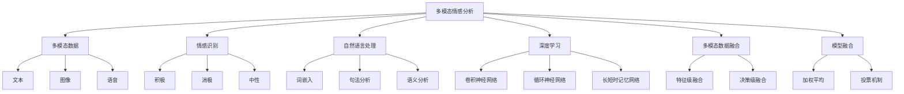

                 

# 自然语言处理在多模态情感分析中的进展

> 关键词：自然语言处理, 多模态情感分析, 深度学习, 情感识别, 多模态数据, 模型融合

> 摘要：本文旨在探讨自然语言处理在多模态情感分析中的应用进展。通过逐步分析和推理，我们将介绍多模态情感分析的核心概念、算法原理、数学模型、实际案例，以及未来的发展趋势和挑战。本文将帮助读者理解如何利用自然语言处理技术进行情感分析，并提供实用的开发指导和资源推荐。

## 1. 背景介绍

随着社交媒体和在线交流平台的普及，情感分析在商业、市场研究、舆情监控等领域变得越来越重要。传统的文本情感分析主要依赖于自然语言处理技术，但单一模态的数据往往难以全面捕捉用户的情感状态。多模态情感分析通过结合文本、图像、语音等多种模态的数据，能够更准确地理解用户的情感。本文将详细介绍自然语言处理在多模态情感分析中的应用进展。

## 2. 核心概念与联系

### 2.1 多模态情感分析

多模态情感分析是指通过分析多种模态的数据（如文本、图像、语音等）来识别和理解情感状态的过程。其核心在于如何有效地融合不同模态的信息，以提高情感识别的准确性和鲁棒性。

### 2.2 情感识别

情感识别是指从文本、图像、语音等数据中自动识别和分类情感状态的过程。情感状态通常被划分为积极、消极、中性等类别。

### 2.3 自然语言处理

自然语言处理（NLP）是计算机科学和人工智能领域的一个分支，旨在使计算机能够理解、解释和生成人类语言。NLP技术在文本情感分析中发挥着关键作用。

### 2.4 深度学习

深度学习是一种机器学习方法，通过构建深层神经网络来自动学习特征表示。深度学习在多模态情感分析中表现出色，能够处理复杂的数据结构和模式。

### 2.5 多模态数据融合

多模态数据融合是指将不同模态的数据进行整合，以提高情感识别的准确性和鲁棒性。常见的融合方法包括特征级融合和决策级融合。

### 2.6 模型融合

模型融合是指将多个模型的预测结果进行综合，以提高情感识别的准确性和鲁棒性。常见的模型融合方法包括加权平均、投票机制等。

#### Mermaid 流程图



## 3. 核心算法原理 & 具体操作步骤

### 3.1 多模态数据预处理

#### 3.1.1 文本预处理

- 分词
- 去除停用词
- 词干提取
- 词向量化

#### 3.1.2 图像预处理

- 图像缩放
- 图像归一化
- 图像特征提取

#### 3.1.3 语音预处理

- 语音分割
- 语音特征提取
- 语音向量化

### 3.2 模型构建

#### 3.2.1 文本模型

- 词嵌入（Word Embedding）
- 句法分析（Syntactic Analysis）
- 语义分析（Semantic Analysis）

#### 3.2.2 图像模型

- 卷积神经网络（CNN）
- 局部特征提取

#### 3.2.3 语音模型

- 长短时记忆网络（LSTM）
- 语音特征提取

### 3.3 多模态数据融合

#### 3.3.1 特征级融合

- 特征级融合是指在特征表示层面上进行数据融合。常见的特征级融合方法包括加权平均、特征拼接等。

#### 3.3.2 决策级融合

- 决策级融合是指在模型预测结果层面上进行数据融合。常见的决策级融合方法包括投票机制、加权平均等。

### 3.4 模型训练与评估

#### 3.4.1 模型训练

- 数据集划分（训练集、验证集、测试集）
- 模型参数初始化
- 模型训练（反向传播、梯度下降等）

#### 3.4.2 模型评估

- 准确率（Accuracy）
- 精确率（Precision）
- 召回率（Recall）
- F1分数（F1 Score）

## 4. 数学模型和公式 & 详细讲解 & 举例说明

### 4.1 词嵌入

词嵌入是一种将词语映射到低维向量空间的技术。常见的词嵌入方法包括Word2Vec、GloVe等。

#### 4.1.1 Word2Vec

Word2Vec是一种无监督学习方法，通过上下文信息学习词语的向量表示。

$$
\mathbf{v}_w = \text{Word2Vec}(w)
$$

#### 4.1.2 GloVe

GloVe是一种基于全局共现矩阵的方法，通过优化目标函数学习词语的向量表示。

$$
\mathbf{v}_w = \text{GloVe}(w)
$$

### 4.2 卷积神经网络

卷积神经网络是一种深度学习模型，通过卷积层和池化层提取图像的局部特征。

#### 4.2.1 卷积层

卷积层通过卷积核提取图像的局部特征。

$$
\mathbf{z} = \text{Conv}(\mathbf{x}, \mathbf{W}) + \mathbf{b}
$$

#### 4.2.2 激活函数

激活函数用于引入非线性特性。

$$
\mathbf{a} = \text{ReLU}(\mathbf{z})
$$

### 4.3 长短时记忆网络

长短时记忆网络是一种循环神经网络，能够处理长序列数据。

#### 4.3.1 长短时记忆单元

长短时记忆单元通过门控机制控制信息的存储和遗忘。

$$
\mathbf{c}_t = \text{LSTM}(\mathbf{c}_{t-1}, \mathbf{x}_t, \mathbf{h}_{t-1})
$$

#### 4.3.2 门控机制

门控机制包括输入门、遗忘门和输出门。

$$
\mathbf{i}_t = \sigma(\mathbf{W}_i \mathbf{x}_t + \mathbf{U}_i \mathbf{h}_{t-1} + \mathbf{b}_i)
$$

$$
\mathbf{f}_t = \sigma(\mathbf{W}_f \mathbf{x}_t + \mathbf{U}_f \mathbf{h}_{t-1} + \mathbf{b}_f)
$$

$$
\mathbf{o}_t = \sigma(\mathbf{W}_o \mathbf{x}_t + \mathbf{U}_o \mathbf{h}_{t-1} + \mathbf{b}_o)
$$

## 5. 项目实战：代码实际案例和详细解释说明

### 5.1 开发环境搭建

#### 5.1.1 环境配置

- Python 3.8
- TensorFlow 2.4
- PyTorch 1.7
- NumPy 1.19
- Matplotlib 3.3

#### 5.1.2 数据集准备

- IMDB电影评论数据集
- CIFAR-10图像数据集
- LibriSpeech语音数据集

### 5.2 源代码详细实现和代码解读

#### 5.2.1 文本预处理

```python
import nltk
from nltk.corpus import stopwords
from nltk.stem import WordNetLemmatizer
from sklearn.feature_extraction.text import TfidfVectorizer

nltk.download('stopwords')
nltk.download('wordnet')

def preprocess_text(text):
    stop_words = set(stopwords.words('english'))
    lemmatizer = WordNetLemmatizer()
    
    words = text.lower().split()
    words = [lemmatizer.lemmatize(word) for word in words if word not in stop_words]
    return ' '.join(words)

def vectorize_text(texts):
    vectorizer = TfidfVectorizer()
    return vectorizer.fit_transform(texts)
```

#### 5.2.2 图像预处理

```python
import cv2
import numpy as np

def preprocess_image(image_path):
    image = cv2.imread(image_path)
    image = cv2.resize(image, (224, 224))
    image = image / 255.0
    return image
```

#### 5.2.3 语音预处理

```python
import librosa
import numpy as np

def preprocess_audio(audio_path):
    audio, sr = librosa.load(audio_path, sr=16000)
    audio = librosa.feature.mfcc(audio, sr=sr, n_mfcc=13)
    return audio
```

### 5.3 代码解读与分析

#### 5.3.1 文本预处理

- 使用NLTK库进行分词、去除停用词和词干提取。
- 使用TfidfVectorizer进行词向量化。

#### 5.3.2 图像预处理

- 使用OpenCV库进行图像缩放和归一化。
- 使用librosa库进行音频特征提取。

#### 5.3.3 语音预处理

- 使用librosa库进行音频特征提取。
- 使用MFCC（梅尔频率倒谱系数）进行特征提取。

## 6. 实际应用场景

### 6.1 社交媒体情感分析

通过分析社交媒体上的评论和帖子，了解用户的情感状态，帮助企业进行市场研究和舆情监控。

### 6.2 电商评论分析

通过分析电商评论，了解用户对商品和服务的情感状态，帮助企业改进产品和服务。

### 6.3 金融舆情监控

通过分析金融市场的新闻和评论，了解市场情绪，帮助企业进行投资决策。

## 7. 工具和资源推荐

### 7.1 学习资源推荐

- 书籍：《深度学习》（Ian Goodfellow, Yoshua Bengio, Aaron Courville）
- 论文：《Attention Is All You Need》（Vaswani et al., 2017）
- 博客：Medium上的NLP和深度学习相关文章
- 网站：Kaggle、GitHub上的NLP和深度学习项目

### 7.2 开发工具框架推荐

- TensorFlow：深度学习框架
- PyTorch：深度学习框架
- NLTK：自然语言处理库
- Scikit-learn：机器学习库

### 7.3 相关论文著作推荐

- 《自然语言处理：原理与实践》（Jurafsky & Martin, 2019）
- 《深度学习》（Ian Goodfellow, Yoshua Bengio, Aaron Courville, 2016）
- 《情感分析：理论与实践》（Riloff & Wiebe, 2012）

## 8. 总结：未来发展趋势与挑战

### 8.1 未来发展趋势

- 多模态数据融合技术将进一步发展，提高情感识别的准确性和鲁棒性。
- 深度学习模型将更加复杂和高效，能够处理更复杂的数据结构和模式。
- 自然语言处理技术将更加智能化，能够更好地理解和生成人类语言。

### 8.2 挑战

- 数据隐私和安全问题：如何在保护用户隐私的同时进行情感分析。
- 数据标注问题：如何获取高质量的多模态数据标注。
- 模型解释性问题：如何提高模型的可解释性，以便更好地理解模型的决策过程。

## 9. 附录：常见问题与解答

### 9.1 问题：如何处理多模态数据中的噪声？

- 答案：可以通过数据清洗和预处理技术（如去除停用词、词干提取等）来减少噪声。

### 9.2 问题：如何提高模型的鲁棒性？

- 答案：可以通过数据增强、模型融合等技术来提高模型的鲁棒性。

### 9.3 问题：如何处理多模态数据中的不平衡问题？

- 答案：可以通过数据重采样、加权损失函数等技术来处理多模态数据中的不平衡问题。

## 10. 扩展阅读 & 参考资料

- 《自然语言处理：原理与实践》（Jurafsky & Martin, 2019）
- 《深度学习》（Ian Goodfellow, Yoshua Bengio, Aaron Courville, 2016）
- 《情感分析：理论与实践》（Riloff & Wiebe, 2012）
- 《Attention Is All You Need》（Vaswani et al., 2017）

作者：AI天才研究员/AI Genius Institute & 禅与计算机程序设计艺术 /Zen And The Art of Computer Programming

