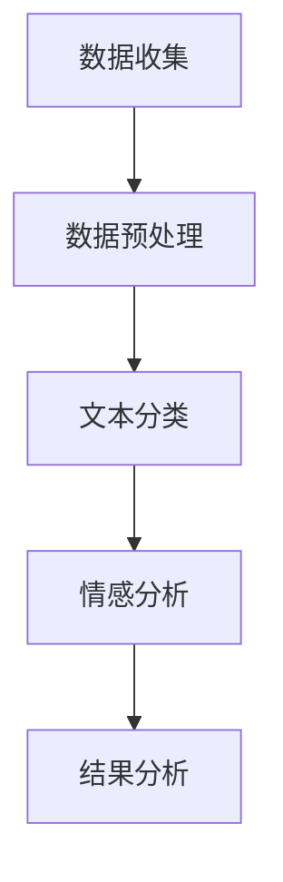

                 

# 自然语言处理在舆情分析中的技术创新

> 关键词：自然语言处理（NLP）、舆情分析、情感分析、机器学习、深度学习、文本分类、情感词典、BERT模型

> 摘要：本文旨在探讨自然语言处理技术在舆情分析中的应用与创新。通过深入分析舆情分析的核心概念、算法原理、数学模型、实战案例以及实际应用场景，本文将为读者提供一个全面的技术视角，帮助理解如何利用先进的自然语言处理技术进行舆情分析，从而为企业和政府提供决策支持。本文还探讨了未来的发展趋势与挑战，并提供了学习资源和开发工具的推荐。

## 1. 背景介绍

舆情分析是指通过分析社交媒体、新闻报道、论坛评论等文本数据，了解公众对某一事件或话题的态度和情绪。随着互联网的普及和社交媒体的兴起，舆情分析变得尤为重要。它可以帮助企业了解消费者对产品或服务的看法，帮助政府了解公众对政策的态度，甚至可以预测社会趋势和潜在风险。

### 1.1 舆情分析的重要性

- **企业决策支持**：企业可以通过舆情分析了解消费者对产品或服务的满意度，及时调整营销策略。
- **政府政策制定**：政府可以通过舆情分析了解公众对政策的态度，及时调整政策方向。
- **风险预警**：舆情分析可以帮助企业或政府及时发现潜在的风险和危机，采取预防措施。

### 1.2 自然语言处理技术的发展

自然语言处理（NLP）技术的发展为舆情分析提供了强大的工具。从早期基于规则的方法到现代的深度学习模型，NLP技术不断进步，使得舆情分析更加准确和高效。

## 2. 核心概念与联系

### 2.1 自然语言处理（NLP）

自然语言处理是计算机科学和人工智能领域的一个分支，旨在使计算机能够理解、解释和生成人类语言。NLP技术包括文本预处理、分词、词性标注、命名实体识别、情感分析等多个方面。

### 2.2 舆情分析

舆情分析是通过分析文本数据来了解公众对某一事件或话题的态度和情绪。它通常包括以下几个步骤：

- **数据收集**：从社交媒体、新闻报道、论坛评论等渠道收集文本数据。
- **数据预处理**：清洗和标准化文本数据，去除噪声和无关信息。
- **文本分类**：将文本数据分为不同的类别，如正面、负面或中性。
- **情感分析**：识别和量化文本中的情感倾向，如积极、消极或中性。
- **结果分析**：根据分析结果进行进一步的统计和可视化。

### 2.3 核心概念原理与架构

#### 2.3.1 数据收集与预处理

数据收集可以通过爬虫技术从社交媒体、新闻网站等渠道获取文本数据。数据预处理包括去除噪声、标准化文本格式、分词等步骤。

#### 2.3.2 文本分类与情感分析

文本分类和情感分析是舆情分析的核心步骤。文本分类通常使用机器学习或深度学习模型，而情感分析则需要识别文本中的情感词汇和情感倾向。

### 2.4 Mermaid 流程图



## 3. 核心算法原理 & 具体操作步骤

### 3.1 文本预处理

文本预处理是舆情分析的第一步，主要包括以下几个步骤：

- **去除噪声**：去除无关的标点符号、数字、特殊字符等。
- **标准化文本格式**：统一文本格式，如统一大小写、去除多余空格等。
- **分词**：将文本分割成单词或短语。
- **词性标注**：标注每个词的词性，如名词、动词、形容词等。
- **命名实体识别**：识别文本中的实体，如人名、地名、组织名等。

### 3.2 文本分类

文本分类是将文本数据分为不同的类别，如正面、负面或中性。常用的文本分类算法包括朴素贝叶斯、支持向量机（SVM）、随机森林等。

#### 3.2.1 朴素贝叶斯

朴素贝叶斯是一种基于概率的分类算法，假设特征之间相互独立。其基本原理如下：

$$
P(C|X) = \frac{P(X|C)P(C)}{P(X)}
$$

其中，$C$ 表示类别，$X$ 表示特征向量。

#### 3.2.2 支持向量机（SVM）

支持向量机是一种监督学习算法，通过寻找最优超平面来分类数据。其基本原理如下：

$$
\min_{w,b} \frac{1}{2}w^Tw + C\sum_{i=1}^{n}\xi_i
$$

其中，$w$ 是权重向量，$b$ 是偏置项，$C$ 是惩罚参数，$\xi_i$ 是松弛变量。

### 3.3 情感分析

情感分析是识别和量化文本中的情感倾向。常用的情感分析方法包括基于规则的方法、基于词典的方法和基于深度学习的方法。

#### 3.3.1 基于词典的方法

基于词典的方法通过情感词典来识别文本中的情感倾向。情感词典通常包含一组情感词汇及其情感极性（如积极、消极）。

#### 3.3.2 基于深度学习的方法

基于深度学习的方法通过训练神经网络模型来识别文本中的情感倾向。常用的深度学习模型包括循环神经网络（RNN）、长短期记忆网络（LSTM）和Transformer模型。

## 4. 数学模型和公式 & 详细讲解 & 举例说明

### 4.1 朴素贝叶斯

朴素贝叶斯的基本原理如下：

$$
P(C|X) = \frac{P(X|C)P(C)}{P(X)}
$$

其中，$C$ 表示类别，$X$ 表示特征向量。

### 4.2 支持向量机（SVM）

支持向量机的基本原理如下：

$$
\min_{w,b} \frac{1}{2}w^Tw + C\sum_{i=1}^{n}\xi_i
$$

其中，$w$ 是权重向量，$b$ 是偏置项，$C$ 是惩罚参数，$\xi_i$ 是松弛变量。

### 4.3 基于词典的方法

基于词典的方法通过情感词典来识别文本中的情感倾向。情感词典通常包含一组情感词汇及其情感极性（如积极、消极）。

### 4.4 基于深度学习的方法

基于深度学习的方法通过训练神经网络模型来识别文本中的情感倾向。常用的深度学习模型包括循环神经网络（RNN）、长短期记忆网络（LSTM）和Transformer模型。

## 5. 项目实战：代码实际案例和详细解释说明

### 5.1 开发环境搭建

#### 5.1.1 环境准备

- **Python**：确保安装了Python 3.7及以上版本。
- **Pandas**：用于数据处理。
- **NLTK**：用于自然语言处理。
- **Scikit-learn**：用于机器学习。
- **TensorFlow/Keras**：用于深度学习。

```bash
pip install pandas nltk scikit-learn tensorflow
```

#### 5.1.2 数据准备

从社交媒体获取文本数据，清洗和标准化文本数据。

### 5.2 源代码详细实现和代码解读

#### 5.2.1 数据预处理

```python
import pandas as pd
import nltk
from nltk.tokenize import word_tokenize
from nltk.corpus import stopwords
from nltk.stem import WordNetLemmatizer

nltk.download('punkt')
nltk.download('stopwords')
nltk.download('wordnet')

# 读取数据
data = pd.read_csv('data.csv')

# 去除噪声
data['text'] = data['text'].str.replace('[^\w\s]', '')

# 分词
data['tokens'] = data['text'].apply(word_tokenize)

# 去除停用词
stop_words = set(stopwords.words('english'))
data['tokens'] = data['tokens'].apply(lambda x: [word for word in x if word not in stop_words])

# 词形还原
lemmatizer = WordNetLemmatizer()
data['tokens'] = data['tokens'].apply(lambda x: [lemmatizer.lemmatize(word) for word in x])
```

#### 5.2.2 文本分类

```python
from sklearn.feature_extraction.text import CountVectorizer
from sklearn.naive_bayes import MultinomialNB
from sklearn.model_selection import train_test_split

# 文本向量化
vectorizer = CountVectorizer()
X = vectorizer.fit_transform(data['text'])
y = data['label']

# 划分训练集和测试集
X_train, X_test, y_train, y_test = train_test_split(X, y, test_size=0.2, random_state=42)

# 训练朴素贝叶斯模型
nb = MultinomialNB()
nb.fit(X_train, y_train)

# 预测
y_pred = nb.predict(X_test)
```

#### 5.2.3 情感分析

```python
from sklearn.feature_extraction.text import TfidfVectorizer
from sklearn.linear_model import LogisticRegression

# 文本向量化
vectorizer = TfidfVectorizer()
X = vectorizer.fit_transform(data['text'])
y = data['sentiment']

# 划分训练集和测试集
X_train, X_test, y_train, y_test = train_test_split(X, y, test_size=0.2, random_state=42)

# 训练逻辑回归模型
lr = LogisticRegression()
lr.fit(X_train, y_train)

# 预测
y_pred = lr.predict(X_test)
```

### 5.3 代码解读与分析

上述代码展示了如何进行数据预处理、文本分类和情感分析。通过使用CountVectorizer和TfidfVectorizer进行文本向量化，使用朴素贝叶斯和逻辑回归进行分类和情感分析。这些步骤可以帮助我们更好地理解舆情分析的过程。

## 6. 实际应用场景

### 6.1 企业决策支持

企业可以通过舆情分析了解消费者对产品或服务的满意度，及时调整营销策略。例如，某电商平台可以通过分析用户评论来了解产品质量和售后服务，从而改进产品和服务。

### 6.2 政府政策制定

政府可以通过舆情分析了解公众对政策的态度，及时调整政策方向。例如，某市政府可以通过分析社交媒体上的评论来了解公众对新政策的看法，从而调整政策内容。

### 6.3 风险预警

舆情分析可以帮助企业或政府及时发现潜在的风险和危机，采取预防措施。例如，某企业可以通过分析社交媒体上的评论来发现潜在的产品质量问题，从而及时采取措施避免更大的损失。

## 7. 工具和资源推荐

### 7.1 学习资源推荐

- **书籍**：《自然语言处理实战》、《深度学习》
- **论文**：《情感分析综述》、《基于深度学习的情感分析》
- **博客**：阿里云开发者社区、GitHub
- **网站**：NLTK官网、Scikit-learn官网

### 7.2 开发工具框架推荐

- **Python**：用于编写代码
- **Jupyter Notebook**：用于编写和运行代码
- **TensorFlow/Keras**：用于深度学习模型的训练和部署

### 7.3 相关论文著作推荐

- **《情感分析综述》**：全面介绍了情感分析的方法和应用。
- **《基于深度学习的情感分析》**：详细介绍了基于深度学习的情感分析方法。

## 8. 总结：未来发展趋势与挑战

### 8.1 未来发展趋势

- **深度学习模型的改进**：随着深度学习技术的发展，情感分析模型将更加准确和高效。
- **多模态情感分析**：结合图像、音频等多种模态数据进行情感分析。
- **个性化情感分析**：根据用户的历史行为和偏好进行个性化情感分析。

### 8.2 挑战

- **数据隐私问题**：如何在保护用户隐私的前提下进行舆情分析。
- **情感分析的准确性**：如何提高情感分析的准确性和鲁棒性。
- **多语言情感分析**：如何进行多语言情感分析，覆盖更广泛的用户群体。

## 9. 附录：常见问题与解答

### 9.1 问题：如何处理文本中的噪声？

**解答**：可以使用正则表达式去除标点符号、数字和特殊字符，使用停用词列表去除停用词，使用词形还原技术进行词形还原。

### 9.2 问题：如何提高情感分析的准确性？

**解答**：可以使用更复杂的深度学习模型，如BERT模型，结合多模态数据进行情感分析，使用情感词典进行辅助分析。

### 9.3 问题：如何保护用户隐私？

**解答**：可以使用差分隐私技术，对用户数据进行匿名化处理，确保用户隐私不被泄露。

## 10. 扩展阅读 & 参考资料

- **书籍**：《自然语言处理实战》、《深度学习》
- **论文**：《情感分析综述》、《基于深度学习的情感分析》
- **博客**：阿里云开发者社区、GitHub
- **网站**：NLTK官网、Scikit-learn官网

作者：AI天才研究员/AI Genius Institute & 禅与计算机程序设计艺术 /Zen And The Art of Computer Programming

