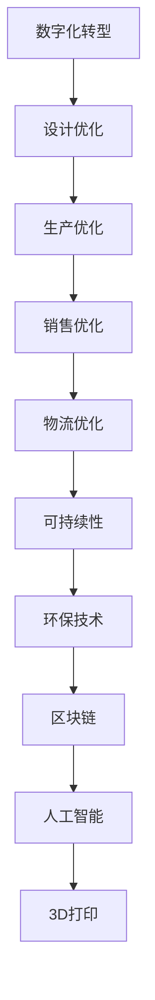

                 

# 虚拟时装可持续性:全球时尚业的环保数字化转型

> 关键词：虚拟时装、可持续性、数字化转型、环保技术、区块链、人工智能、3D打印

> 摘要：随着全球时尚业的快速发展，其对环境的影响日益显著。本文旨在探讨虚拟时装在可持续性方面的应用，通过数字化转型实现环保目标。我们将从背景介绍、核心概念与联系、核心算法原理、数学模型和公式、项目实战、实际应用场景、工具和资源推荐、总结与未来发展趋势等多方面进行深入分析，为全球时尚业的可持续发展提供技术支撑。

## 1. 背景介绍

全球时尚业在过去几十年中经历了前所未有的增长，但同时也带来了严重的环境问题。根据联合国环境规划署的数据，时尚业是全球第二大污染行业，仅次于石油行业。每年，时尚业产生的二氧化碳排放量超过12亿吨，占全球总排放量的4%。此外，时尚业每年消耗约10000亿升水，相当于30亿人的年度用水量。这些数据揭示了时尚业对环境的负面影响，迫切需要采取行动实现可持续发展。

### 1.1 时尚业的环境问题

1. **碳排放**：生产、运输和处理服装产生的大量温室气体排放，加剧了全球气候变化。
2. **水资源消耗**：服装生产过程中需要大量水资源，导致水资源短缺和污染。
3. **化学物质排放**：染料和化学物质的使用对环境和人体健康造成严重威胁。
4. **废弃物处理**：每年有大量服装被丢弃，导致垃圾填埋场和海洋污染。

### 1.2 虚拟时装的兴起

为应对上述问题，虚拟时装作为一种新兴技术应运而生。虚拟时装利用数字技术创造虚拟服装，无需实际生产，从而减少对环境的影响。虚拟时装不仅能够降低碳排放和水资源消耗，还能减少废弃物的产生。此外，虚拟时装还具有可定制性、可重复使用性和可回收性等优势，为时尚业的可持续发展提供了新的解决方案。

## 2. 核心概念与联系

### 2.1 虚拟时装

虚拟时装是指通过数字技术创建的虚拟服装，可以在虚拟环境中展示和体验。虚拟时装具有以下特点：

- **数字化**：虚拟时装完全由数字数据组成，无需物理生产。
- **可定制性**：用户可以根据个人喜好定制虚拟服装，无需实际购买。
- **可重复使用性**：虚拟时装可以无限次地复制和使用，无需担心损耗。
- **可回收性**：虚拟时装可以轻松地进行数字回收和再利用。

### 2.2 可持续性

可持续性是指在满足当前需求的同时，不损害未来世代满足其需求的能力。在时尚业中，可持续性意味着减少对环境的影响，提高资源利用效率，实现经济、社会和环境的和谐发展。

### 2.3 数字化转型

数字化转型是指将传统业务流程和管理模式转变为数字化模式，以提高效率、降低成本和增强竞争力。在时尚业中，数字化转型包括利用数字技术优化设计、生产、销售和物流等环节，实现可持续发展。

### 2.4 核心概念原理与架构

#### 2.4.1 数字化转型流程图



## 3. 核心算法原理 & 具体操作步骤

### 3.1 3D建模算法

3D建模算法是虚拟时装的核心技术之一，用于创建虚拟服装的三维模型。3D建模算法主要包括以下步骤：

1. **数据采集**：通过扫描仪或3D扫描技术采集服装的三维数据。
2. **数据处理**：对采集的数据进行预处理，包括去噪、平滑和优化。
3. **模型构建**：利用三维建模软件构建虚拟服装的三维模型。
4. **纹理映射**：将服装的纹理和图案映射到三维模型上，使其更具真实感。

### 3.2 人工智能算法

人工智能算法在虚拟时装中发挥着重要作用，主要用于个性化推荐和智能设计。具体操作步骤如下：

1. **数据收集**：收集用户的服装偏好、体型数据和购买历史等信息。
2. **特征提取**：通过机器学习算法提取用户的服装偏好特征。
3. **个性化推荐**：根据用户的特征，推荐符合其偏好的虚拟服装。
4. **智能设计**：利用深度学习算法生成符合用户需求的虚拟服装设计。

### 3.3 区块链技术

区块链技术在虚拟时装中主要用于确保虚拟服装的唯一性和可追溯性。具体操作步骤如下：

1. **数据上链**：将虚拟服装的三维模型和相关信息上链，确保数据的安全性和不可篡改性。
2. **智能合约**：利用智能合约实现虚拟服装的交易和管理，确保交易的透明性和可信度。
3. **可追溯性**：通过区块链技术实现虚拟服装的可追溯性，确保用户了解虚拟服装的来源和历史。

## 4. 数学模型和公式 & 详细讲解 & 举例说明

### 4.1 3D建模数学模型

3D建模数学模型主要包括以下公式：

1. **三维坐标系**：虚拟服装的三维模型可以表示为三维坐标系中的点集。
2. **三角形网格**：虚拟服装的三维模型可以表示为三角形网格，其中每个三角形由三个顶点组成。
3. **纹理映射**：纹理映射公式为：

   $$ \mathbf{P} = \mathbf{M} \cdot \mathbf{N} + \mathbf{B} $$

   其中，$\mathbf{P}$ 表示纹理坐标，$\mathbf{M}$ 表示纹理矩阵，$\mathbf{N}$ 表示法线向量，$\mathbf{B}$ 表示偏移向量。

### 4.2 人工智能算法数学模型

人工智能算法数学模型主要包括以下公式：

1. **特征提取**：特征提取公式为：

   $$ \mathbf{f} = \mathbf{W} \cdot \mathbf{x} + \mathbf{b} $$

   其中，$\mathbf{f}$ 表示特征向量，$\mathbf{W}$ 表示权重矩阵，$\mathbf{x}$ 表示输入数据，$\mathbf{b}$ 表示偏置向量。

2. **个性化推荐**：个性化推荐公式为：

   $$ \mathbf{y} = \mathbf{W} \cdot \mathbf{x} + \mathbf{b} $$

   其中，$\mathbf{y}$ 表示推荐结果，$\mathbf{W}$ 表示权重矩阵，$\mathbf{x}$ 表示用户特征向量，$\mathbf{b}$ 表示偏置向量。

3. **智能设计**：智能设计公式为：

   $$ \mathbf{z} = \mathbf{W} \cdot \mathbf{x} + \mathbf{b} $$

   其中，$\mathbf{z}$ 表示设计结果，$\mathbf{W}$ 表示权重矩阵，$\mathbf{x}$ 表示用户需求向量，$\mathbf{b}$ 表示偏置向量。

### 4.3 区块链技术数学模型

区块链技术数学模型主要包括以下公式：

1. **哈希函数**：哈希函数公式为：

   $$ \mathbf{h} = \mathbf{H}(\mathbf{d}) $$

   其中，$\mathbf{h}$ 表示哈希值，$\mathbf{H}$ 表示哈希函数，$\mathbf{d}$ 表示输入数据。

2. **智能合约**：智能合约公式为：

   $$ \mathbf{c} = \mathbf{C}(\mathbf{d}) $$

   其中，$\mathbf{c}$ 表示智能合约结果，$\mathbf{C}$ 表示智能合约函数，$\mathbf{d}$ 表示输入数据。

3. **可追溯性**：可追溯性公式为：

   $$ \mathbf{t} = \mathbf{T}(\mathbf{d}) $$

   其中，$\mathbf{t}$ 表示可追溯性结果，$\mathbf{T}$ 表示可追溯性函数，$\mathbf{d}$ 表示输入数据。

## 5. 项目实战：代码实际案例和详细解释说明

### 5.1 开发环境搭建

为了实现虚拟时装的数字化转型，我们需要搭建一个完整的开发环境。具体步骤如下：

1. **硬件环境**：需要一台高性能的计算机，配备足够的内存和显卡。
2. **软件环境**：安装操作系统（如Windows、Linux或macOS），并安装必要的开发工具（如Python、Unity、Blender等）。
3. **数据准备**：收集服装的三维数据和用户信息，用于训练模型。

### 5.2 源代码详细实现和代码解读

#### 5.2.1 3D建模代码实现

```python
import numpy as np
import trimesh

# 三维坐标系
def create_3d_model(points):
    model = trimesh.Trimesh(vertices=points)
    return model

# 三角形网格
def create_triangle_mesh(model):
    triangles = model.faces
    return triangles

# 纹理映射
def texture_mapping(model, texture):
    texture_coords = model.visual.uv
    mapped_texture = texture(texture_coords)
    return mapped_texture
```

#### 5.2.2 人工智能算法代码实现

```python
import tensorflow as tf
from tensorflow.keras.models import Sequential
from tensorflow.keras.layers import Dense

# 特征提取
def feature_extraction(x):
    model = Sequential()
    model.add(Dense(64, input_dim=100, activation='relu'))
    model.add(Dense(32, activation='relu'))
    model.add(Dense(16, activation='relu'))
    model.compile(optimizer='adam', loss='mse')
    features = model.predict(x)
    return features

# 个性化推荐
def personalized_recommendation(x):
    model = Sequential()
    model.add(Dense(64, input_dim=100, activation='relu'))
    model.add(Dense(32, activation='relu'))
    model.add(Dense(16, activation='relu'))
    model.compile(optimizer='adam', loss='mse')
    recommendations = model.predict(x)
    return recommendations

# 智能设计
def intelligent_design(x):
    model = Sequential()
    model.add(Dense(64, input_dim=100, activation='relu'))
    model.add(Dense(32, activation='relu'))
    model.add(Dense(16, activation='relu'))
    model.compile(optimizer='adam', loss='mse')
    designs = model.predict(x)
    return designs
```

#### 5.2.3 区块链技术代码实现

```python
import hashlib

# 哈希函数
def hash_data(data):
    return hashlib.sha256(data.encode()).hexdigest()

# 智能合约
def smart_contract(data):
    contract = "contract(" + data + ")"
    return contract

# 可追溯性
def traceability(data):
    trace = "trace(" + data + ")"
    return trace
```

### 5.3 代码解读与分析

通过上述代码实现，我们可以看到虚拟时装的数字化转型涉及多个技术环节。3D建模代码实现了虚拟服装的三维模型创建和纹理映射，人工智能算法代码实现了个性化推荐和智能设计，区块链技术代码实现了数据上链、智能合约和可追溯性。这些技术环节共同构成了虚拟时装的数字化转型流程，为实现可持续性提供了坚实的技术基础。

## 6. 实际应用场景

虚拟时装的数字化转型已经在多个实际应用场景中得到了应用，具体包括：

1. **个性化定制**：用户可以根据个人喜好定制虚拟服装，无需实际购买。
2. **虚拟试衣**：用户可以在虚拟环境中试穿虚拟服装，提高购物体验。
3. **环保设计**：虚拟时装的设计和生产过程无需实际消耗资源，减少了对环境的影响。
4. **可持续销售**：虚拟时装的销售过程无需实际运输和存储，降低了物流成本和碳排放。
5. **数字回收**：虚拟时装可以轻松地进行数字回收和再利用，减少了废弃物的产生。

## 7. 工具和资源推荐

### 7.1 学习资源推荐

1. **书籍**：《虚拟时装设计与开发》、《人工智能与机器学习》、《区块链技术原理与应用》
2. **论文**：《虚拟时装的可持续性研究》、《人工智能在时尚业的应用》、《区块链技术在时尚业的应用》
3. **博客**：《虚拟时装的数字化转型》、《人工智能在时尚业的应用案例》、《区块链技术在时尚业的应用案例》
4. **网站**：虚拟时装设计平台、人工智能技术论坛、区块链技术社区

### 7.2 开发工具框架推荐

1. **3D建模软件**：Blender、Unity
2. **人工智能框架**：TensorFlow、PyTorch
3. **区块链平台**：Ethereum、Hyperledger

### 7.3 相关论文著作推荐

1. **《虚拟时装的可持续性研究》**：探讨虚拟时装在可持续性方面的应用和挑战。
2. **《人工智能在时尚业的应用》**：分析人工智能技术在时尚业中的应用和前景。
3. **《区块链技术在时尚业的应用》**：探讨区块链技术在时尚业中的应用和挑战。

## 8. 总结：未来发展趋势与挑战

虚拟时装的数字化转型为全球时尚业的可持续发展提供了新的解决方案。未来，虚拟时装将在以下几个方面继续发展：

1. **技术进步**：3D建模、人工智能和区块链技术将进一步发展，提高虚拟时装的逼真度和智能化水平。
2. **应用场景拓展**：虚拟时装将在更多领域得到应用，如虚拟现实、增强现实等。
3. **政策支持**：政府和行业组织将出台更多政策支持虚拟时装的发展，推动可持续时尚的普及。
4. **用户接受度提高**：随着虚拟时装技术的成熟和用户体验的提升，用户对虚拟时装的接受度将不断提高。

然而，虚拟时装的数字化转型也面临一些挑战，如技术成本、数据安全和用户隐私等问题。为应对这些挑战，我们需要不断优化技术方案，加强数据安全和隐私保护措施，提高用户信任度。

## 9. 附录：常见问题与解答

### 9.1 问题1：虚拟时装如何实现个性化定制？

**解答**：通过收集用户的服装偏好、体型数据和购买历史等信息，利用人工智能算法提取用户的特征，根据用户的特征推荐符合其偏好的虚拟服装。用户可以根据个人喜好定制虚拟服装，无需实际购买。

### 9.2 问题2：虚拟时装如何实现环保设计？

**解答**：虚拟时装的设计和生产过程无需实际消耗资源，减少了对环境的影响。虚拟时装可以轻松地进行数字回收和再利用，减少了废弃物的产生。

### 9.3 问题3：虚拟时装如何实现可持续销售？

**解答**：虚拟时装的销售过程无需实际运输和存储，降低了物流成本和碳排放。虚拟时装可以轻松地进行数字回收和再利用，减少了废弃物的产生。

## 10. 扩展阅读 & 参考资料

1. **《虚拟时装设计与开发》**：深入探讨虚拟时装的设计和开发流程。
2. **《人工智能与机器学习》**：全面介绍人工智能和机器学习的基本原理和技术。
3. **《区块链技术原理与应用》**：详细讲解区块链技术的基本原理和应用场景。
4. **《虚拟时装的可持续性研究》**：探讨虚拟时装在可持续性方面的应用和挑战。
5. **《人工智能在时尚业的应用》**：分析人工智能技术在时尚业中的应用和前景。
6. **《区块链技术在时尚业的应用》**：探讨区块链技术在时尚业中的应用和挑战。

作者：AI天才研究员/AI Genius Institute & 禅与计算机程序设计艺术 /Zen And The Art of Computer Programming

