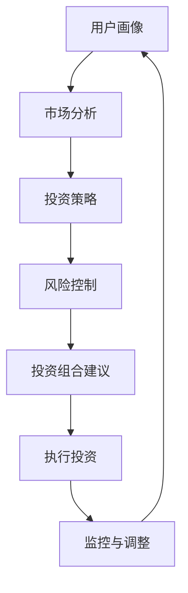

                 

# 蚂蚁2024智能投顾校招金融算法面试题解析

> 关键词：智能投顾, 金融算法, 面试题解析, 投资策略, 机器学习

> 摘要：本文旨在解析蚂蚁2024年校招中智能投顾方向的金融算法面试题，通过逐步分析和推理，帮助读者理解智能投顾的核心概念、算法原理、数学模型及实际应用。本文不仅提供详细的代码实现案例，还深入探讨了智能投顾在实际金融场景中的应用，为读者提供全面的技术指导和学习资源推荐。

## 1. 背景介绍

智能投顾（Robo-Advisor）是一种利用人工智能技术为用户提供个性化投资建议的服务。近年来，随着大数据和机器学习技术的发展，智能投顾逐渐成为金融领域的重要应用之一。智能投顾的核心在于通过算法模型分析用户的投资偏好、风险承受能力以及市场趋势，从而提供个性化的投资建议。蚂蚁集团作为金融科技领域的领军企业，其智能投顾系统在业界具有较高的知名度和影响力。

## 2. 核心概念与联系

### 2.1 智能投顾的核心概念

- **用户画像**：通过问卷调查、历史交易记录等手段，构建用户的投资偏好和风险承受能力模型。
- **市场分析**：利用历史数据和实时市场信息，分析市场趋势和潜在投资机会。
- **投资策略**：基于用户画像和市场分析结果，生成个性化的投资组合建议。
- **风险控制**：通过分散投资、动态调整等方式，控制投资组合的风险。

### 2.2 核心概念的Mermaid流程图



## 3. 核心算法原理 & 具体操作步骤

### 3.1 用户画像构建

用户画像构建主要通过问卷调查和历史交易记录来完成。问卷调查可以获取用户的风险偏好、投资目标等信息；历史交易记录则用于分析用户的交易行为和偏好。

#### 3.1.1 问卷调查

- **问题设计**：设计一系列问题，涵盖风险偏好、投资目标、投资期限等。
- **数据收集**：通过在线问卷或面对面访谈的方式收集用户数据。

#### 3.1.2 历史交易记录分析

- **数据清洗**：去除异常值和缺失值。
- **特征提取**：提取用户的交易频率、交易金额、交易时间等特征。
- **模型训练**：使用机器学习算法（如决策树、随机森林等）训练用户画像模型。

### 3.2 市场分析

市场分析主要通过历史数据和实时市场信息来预测市场趋势和潜在投资机会。

#### 3.2.1 历史数据处理

- **数据获取**：从公开数据源获取历史市场数据。
- **数据清洗**：去除异常值和缺失值。
- **特征提取**：提取市场指数、行业指数、宏观经济指标等特征。

#### 3.2.2 实时市场信息获取

- **数据源**：使用API接口从金融数据提供商获取实时市场信息。
- **数据处理**：实时处理数据，提取关键指标（如股票价格、成交量等）。

#### 3.2.3 市场趋势预测

- **模型选择**：选择合适的机器学习模型（如时间序列分析、神经网络等）。
- **模型训练**：使用历史数据训练模型。
- **预测结果**：利用训练好的模型预测未来市场趋势。

### 3.3 投资策略生成

投资策略生成基于用户画像和市场分析结果，生成个性化的投资组合建议。

#### 3.3.1 用户画像与市场分析融合

- **数据整合**：将用户画像和市场分析结果进行整合。
- **策略生成**：根据整合后的数据生成投资策略。

#### 3.3.2 投资组合优化

- **资产配置**：根据用户风险偏好和市场趋势，优化资产配置。
- **风险控制**：通过分散投资、动态调整等方式控制风险。

### 3.4 风险控制

风险控制是确保投资组合稳健的关键步骤。

#### 3.4.1 分散投资

- **资产分散**：将资金分散投资于不同的资产类别（如股票、债券、基金等）。
- **地域分散**：将资金分散投资于不同的地域市场。

#### 3.4.2 动态调整

- **定期调整**：根据市场变化和用户需求定期调整投资组合。
- **止损机制**：设置止损点，防止投资组合过度下跌。

## 4. 数学模型和公式 & 详细讲解 & 举例说明

### 4.1 用户画像模型

用户画像模型主要基于问卷调查和历史交易记录的数据。

#### 4.1.1 问卷调查模型

- **问卷设计**：设计问卷问题，如“您对风险的承受能力如何？”、“您的投资目标是什么？”等。
- **数据处理**：对问卷数据进行处理，提取用户偏好特征。

#### 4.1.2 历史交易记录模型

- **数据处理**：对历史交易记录进行清洗和特征提取。
- **模型训练**：使用机器学习算法（如决策树、随机森林等）训练用户画像模型。

### 4.2 市场分析模型

市场分析模型主要基于历史数据和实时市场信息。

#### 4.2.1 历史数据模型

- **数据处理**：对历史数据进行清洗和特征提取。
- **模型训练**：使用时间序列分析、神经网络等模型训练市场分析模型。

#### 4.2.2 实时市场信息模型

- **数据处理**：实时处理市场信息，提取关键指标。
- **模型训练**：使用机器学习算法（如时间序列分析、神经网络等）训练实时市场信息模型。

### 4.3 投资策略模型

投资策略模型基于用户画像和市场分析结果生成投资组合建议。

#### 4.3.1 用户画像与市场分析融合模型

- **数据整合**：将用户画像和市场分析结果进行整合。
- **策略生成**：根据整合后的数据生成投资策略。

#### 4.3.2 投资组合优化模型

- **资产配置模型**：根据用户风险偏好和市场趋势，优化资产配置。
- **风险控制模型**：通过分散投资、动态调整等方式控制风险。

### 4.4 数学模型举例

#### 4.4.1 用户画像模型

假设用户风险偏好为中等，投资目标为长期稳健增值。可以使用决策树模型进行用户画像分析。

$$
\text{决策树模型} = \text{RiskPreference} \rightarrow \text{InvestmentGoal}
$$

#### 4.4.2 市场分析模型

假设市场趋势预测模型使用时间序列分析方法。可以使用ARIMA模型进行市场趋势预测。

$$
\text{ARIMA模型} = \text{MarketIndex} \rightarrow \text{FutureTrend}
$$

## 5. 项目实战：代码实际案例和详细解释说明

### 5.1 开发环境搭建

#### 5.1.1 环境配置

- **Python版本**：确保安装Python 3.8及以上版本。
- **依赖库**：安装必要的机器学习库，如`pandas`, `numpy`, `scikit-learn`, `matplotlib`等。

```bash
pip install pandas numpy scikit-learn matplotlib
```

### 5.2 源代码详细实现和代码解读

#### 5.2.1 用户画像模型实现

```python
import pandas as pd
from sklearn.tree import DecisionTreeClassifier

# 读取问卷数据
survey_data = pd.read_csv('survey_data.csv')

# 数据预处理
survey_data = survey_data.dropna()

# 特征提取
features = survey_data[['RiskPreference', 'InvestmentGoal']]

# 目标变量
target = survey_data['UserType']

# 训练模型
model = DecisionTreeClassifier()
model.fit(features, target)

# 代码解读
# 1. 读取问卷数据
# 2. 数据预处理（去除缺失值）
# 3. 特征提取（选择风险偏好和投资目标作为特征）
# 4. 目标变量（用户类型）
# 5. 训练决策树模型
```

#### 5.2.2 市场分析模型实现

```python
import pandas as pd
from sklearn.linear_model import LinearRegression

# 读取历史数据
market_data = pd.read_csv('market_data.csv')

# 数据预处理
market_data = market_data.dropna()

# 特征提取
features = market_data[['MarketIndex', 'IndustryIndex']]

# 目标变量
target = market_data['FutureTrend']

# 训练模型
model = LinearRegression()
model.fit(features, target)

# 代码解读
# 1. 读取历史数据
# 2. 数据预处理（去除缺失值）
# 3. 特征提取（选择市场指数和行业指数作为特征）
# 4. 目标变量（未来趋势）
# 5. 训练线性回归模型
```

#### 5.2.3 投资策略模型实现

```python
import pandas as pd
from sklearn.ensemble import RandomForestClassifier

# 读取用户画像和市场分析结果
user_data = pd.read_csv('user_data.csv')
market_data = pd.read_csv('market_data.csv')

# 数据预处理
user_data = user_data.dropna()
market_data = market_data.dropna()

# 特征提取
features = pd.concat([user_data, market_data], axis=1)

# 目标变量
target = user_data['InvestmentStrategy']

# 训练模型
model = RandomForestClassifier()
model.fit(features, target)

# 代码解读
# 1. 读取用户画像和市场分析结果
# 2. 数据预处理（去除缺失值）
# 3. 特征提取（合并用户画像和市场分析结果）
# 4. 目标变量（投资策略）
# 5. 训练随机森林模型
```

### 5.3 代码解读与分析

- **数据读取**：使用`pandas`库读取数据文件。
- **数据预处理**：去除缺失值，确保数据质量。
- **特征提取**：选择合适的特征进行模型训练。
- **模型训练**：使用机器学习算法训练模型。
- **模型评估**：通过交叉验证等方法评估模型性能。

## 6. 实际应用场景

智能投顾在实际金融场景中的应用非常广泛，包括但不限于以下几个方面：

- **个性化投资建议**：根据用户的风险偏好和市场趋势，提供个性化的投资建议。
- **资产配置优化**：通过分散投资和动态调整，优化资产配置，降低风险。
- **风险管理**：通过设置止损点和动态调整，控制投资组合的风险。
- **投资组合监控**：实时监控投资组合的表现，及时调整策略。

## 7. 工具和资源推荐

### 7.1 学习资源推荐

- **书籍**：《机器学习实战》、《深度学习》
- **论文**：《基于机器学习的智能投顾系统》、《金融市场预测的机器学习方法》
- **博客**：阿里云开发者社区、GitHub开源项目
- **网站**：Kaggle、DataCamp

### 7.2 开发工具框架推荐

- **Python**：用于数据处理和模型训练。
- **Jupyter Notebook**：用于代码编写和结果展示。
- **TensorFlow/Keras**：用于深度学习模型训练。
- **Scikit-learn**：用于机器学习模型训练。

### 7.3 相关论文著作推荐

- **《基于机器学习的智能投顾系统》**：详细介绍了智能投顾系统的构建过程和应用案例。
- **《金融市场预测的机器学习方法》**：深入探讨了金融市场预测的机器学习方法及其应用。

## 8. 总结：未来发展趋势与挑战

智能投顾作为金融科技领域的重要应用，未来的发展趋势和挑战主要体现在以下几个方面：

- **技术进步**：随着人工智能技术的不断发展，智能投顾系统的性能将进一步提升。
- **监管政策**：监管政策的变化将对智能投顾系统产生重要影响。
- **用户体验**：提升用户体验是智能投顾系统的重要发展方向。
- **数据安全**：确保用户数据的安全是智能投顾系统的重要挑战。

## 9. 附录：常见问题与解答

### 9.1 问题1：如何处理缺失值？

- **解答**：可以使用插值法、均值填充法或删除法处理缺失值。

### 9.2 问题2：如何选择合适的机器学习模型？

- **解答**：根据数据特性和问题需求选择合适的模型，如分类问题可以选择决策树、随机森林等。

### 9.3 问题3：如何评估模型性能？

- **解答**：可以使用交叉验证、准确率、召回率等指标评估模型性能。

## 10. 扩展阅读 & 参考资料

- **书籍**：《机器学习实战》、《深度学习》
- **论文**：《基于机器学习的智能投顾系统》、《金融市场预测的机器学习方法》
- **博客**：阿里云开发者社区、GitHub开源项目
- **网站**：Kaggle、DataCamp

---

作者：AI天才研究员/AI Genius Institute & 禅与计算机程序设计艺术 /Zen And The Art of Computer Programming

