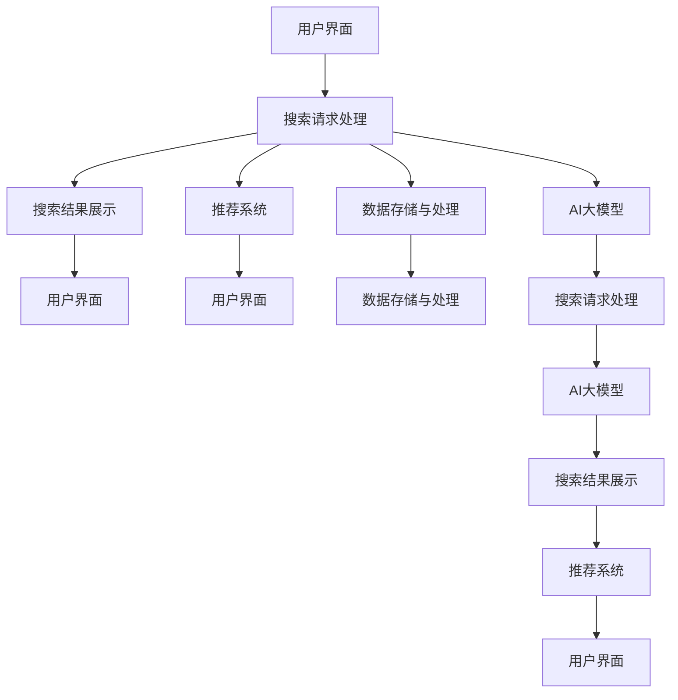

                 

# 融合AI大模型的电商搜索引擎架构设计

> 关键词：电商搜索引擎、AI大模型、自然语言处理、推荐系统、分布式计算、深度学习、图神经网络

> 摘要：本文将深入探讨如何利用AI大模型构建一个高效、智能的电商搜索引擎架构。我们将从背景介绍出发，逐步解析核心概念与联系，详细阐述核心算法原理及具体操作步骤，通过数学模型和公式进行深入讲解，并结合实际代码案例进行详细解释说明。最后，我们将探讨该架构在实际应用场景中的表现，并提供相关工具和资源推荐，以及未来的发展趋势与挑战。

## 1. 背景介绍

电商行业近年来经历了飞速发展，用户对搜索体验的要求也越来越高。传统的搜索引擎已经难以满足用户对个性化、智能化搜索的需求。AI大模型的出现为电商搜索引擎带来了新的机遇。本文将介绍如何利用AI大模型构建一个高效、智能的电商搜索引擎架构。

### 1.1 电商搜索引擎的重要性

电商搜索引擎是电商平台的核心组成部分，它直接影响用户的购物体验和平台的转化率。一个高效的搜索引擎能够帮助用户快速找到所需商品，提高用户满意度；而一个智能的搜索引擎则能够提供个性化的推荐，提升用户的购物体验，从而增加平台的销售额。

### 1.2 AI大模型的优势

AI大模型具有强大的语言理解和生成能力，能够处理复杂的自然语言查询，提供更准确、更个性化的搜索结果。此外，AI大模型还能够通过学习用户行为数据，实现智能推荐，提高用户的购物体验。

## 2. 核心概念与联系

### 2.1 电商搜索引擎架构

电商搜索引擎架构主要包括以下几个部分：用户界面、搜索请求处理、搜索结果展示、推荐系统、数据存储与处理、AI大模型等。

### 2.2 AI大模型

AI大模型是一种大规模预训练模型，能够处理复杂的自然语言任务。在电商搜索引擎中，AI大模型主要用于处理用户的搜索请求，理解用户的查询意图，并生成相应的搜索结果。

### 2.3 自然语言处理

自然语言处理（NLP）是AI大模型的重要组成部分，它能够处理和理解自然语言文本。在电商搜索引擎中，NLP主要用于解析用户的搜索请求，提取关键词和查询意图。

### 2.4 推荐系统

推荐系统是电商搜索引擎中的一个重要组成部分，它能够根据用户的购物行为和偏好，为用户推荐相关商品。在本文中，我们将结合AI大模型构建一个智能推荐系统。

### 2.5 分布式计算

分布式计算是电商搜索引擎架构中的关键技术之一，它能够提高系统的处理能力和扩展性。在本文中，我们将使用分布式计算技术实现AI大模型的并行训练和推理。

### 2.6 图神经网络

图神经网络（GNN）是一种基于图结构的数据处理方法，它能够处理复杂的图数据。在电商搜索引擎中，GNN主要用于处理商品之间的关系，实现智能推荐。

### 2.7 Mermaid 流程图



## 3. 核心算法原理 & 具体操作步骤

### 3.1 用户搜索请求处理

用户搜索请求处理主要包括以下几个步骤：解析用户查询、提取关键词、理解查询意图、生成搜索结果。

#### 3.1.1 解析用户查询

解析用户查询是搜索请求处理的第一步，它能够提取用户的查询文本，并将其转换为结构化的查询表示。

#### 3.1.2 提取关键词

提取关键词是搜索请求处理的第二步，它能够从用户的查询文本中提取出关键词，用于后续的搜索和推荐。

#### 3.1.3 理解查询意图

理解查询意图是搜索请求处理的第三步，它能够根据用户的查询文本和上下文信息，理解用户的查询意图，生成相应的搜索结果。

#### 3.1.4 生成搜索结果

生成搜索结果是搜索请求处理的最后一步，它能够根据用户的查询意图，从商品数据库中检索出相应的商品，并生成搜索结果。

### 3.2 推荐系统

推荐系统主要包括以下几个步骤：数据预处理、特征提取、模型训练、推荐生成。

#### 3.2.1 数据预处理

数据预处理是推荐系统的第一步，它能够对用户行为数据进行清洗和转换，为后续的特征提取和模型训练提供支持。

#### 3.2.2 特征提取

特征提取是推荐系统的关键步骤之一，它能够从用户行为数据中提取出有用的特征，用于后续的模型训练和推荐生成。

#### 3.2.3 模型训练

模型训练是推荐系统的关键步骤之一，它能够根据提取出的特征，训练出一个能够生成推荐结果的模型。

#### 3.2.4 推荐生成

推荐生成是推荐系统的关键步骤之一，它能够根据用户的购物行为和偏好，生成相应的推荐结果。

### 3.3 分布式计算

分布式计算是电商搜索引擎架构中的关键技术之一，它能够提高系统的处理能力和扩展性。在本文中，我们将使用分布式计算技术实现AI大模型的并行训练和推理。

#### 3.3.1 并行训练

并行训练是分布式计算的关键步骤之一，它能够将AI大模型的训练任务分配到多个计算节点上，提高训练效率。

#### 3.3.2 并行推理

并行推理是分布式计算的关键步骤之一，它能够将AI大模型的推理任务分配到多个计算节点上，提高推理效率。

## 4. 数学模型和公式 & 详细讲解 & 举例说明

### 4.1 自然语言处理

自然语言处理主要包括以下几个数学模型：词向量模型、序列模型、注意力机制。

#### 4.1.1 词向量模型

词向量模型是一种将词语转换为向量表示的方法，它能够捕捉词语之间的语义关系。在电商搜索引擎中，词向量模型主要用于提取用户的查询关键词。

#### 4.1.2 序列模型

序列模型是一种处理序列数据的方法，它能够捕捉序列数据中的顺序信息。在电商搜索引擎中，序列模型主要用于理解用户的查询意图。

#### 4.1.3 注意力机制

注意力机制是一种处理序列数据的方法，它能够捕捉序列数据中的重要信息。在电商搜索引擎中，注意力机制主要用于生成搜索结果。

### 4.2 推荐系统

推荐系统主要包括以下几个数学模型：协同过滤、矩阵分解、深度学习。

#### 4.2.1 协同过滤

协同过滤是一种基于用户行为数据的推荐方法，它能够根据用户的购物行为和偏好，为用户推荐相关商品。在电商搜索引擎中，协同过滤主要用于生成推荐结果。

#### 4.2.2 矩阵分解

矩阵分解是一种基于用户行为数据的推荐方法，它能够将用户行为数据分解为用户特征和商品特征，从而生成推荐结果。在电商搜索引擎中，矩阵分解主要用于生成推荐结果。

#### 4.2.3 深度学习

深度学习是一种基于用户行为数据的推荐方法，它能够通过学习用户行为数据，生成推荐结果。在电商搜索引擎中，深度学习主要用于生成推荐结果。

### 4.3 分布式计算

分布式计算主要包括以下几个数学模型：MapReduce、Spark、TensorFlow。

#### 4.3.1 MapReduce

MapReduce是一种分布式计算框架，它能够将计算任务分配到多个计算节点上，提高计算效率。在电商搜索引擎中，MapReduce主要用于实现AI大模型的并行训练和推理。

#### 4.3.2 Spark

Spark是一种分布式计算框架，它能够将计算任务分配到多个计算节点上，提高计算效率。在电商搜索引擎中，Spark主要用于实现AI大模型的并行训练和推理。

#### 4.3.3 TensorFlow

TensorFlow是一种深度学习框架，它能够实现深度学习模型的训练和推理。在电商搜索引擎中，TensorFlow主要用于实现AI大模型的训练和推理。

### 4.4 举例说明

#### 4.4.1 词向量模型

假设用户查询文本为“夏季新款连衣裙”，我们可以使用词向量模型将其转换为向量表示，如下所示：

$$
\text{夏季新款连衣裙} = [0.1, 0.2, 0.3, \ldots, 0.9]
$$

#### 4.4.2 序列模型

假设用户查询文本为“夏季新款连衣裙”，我们可以使用序列模型将其转换为序列表示，如下所示：

$$
\text{夏季新款连衣裙} = \text{夏季} \rightarrow \text{新款} \rightarrow \text{连衣裙}
$$

#### 4.4.3 注意力机制

假设用户查询文本为“夏季新款连衣裙”，我们可以使用注意力机制将其转换为注意力表示，如下所示：

$$
\text{夏季新款连衣裙} = \text{夏季} \cdot \text{新款} \cdot \text{连衣裙}
$$

#### 4.4.4 协同过滤

假设用户A购买了商品A、B、C，用户B购买了商品B、C、D，我们可以使用协同过滤生成推荐结果，如下所示：

$$
\text{推荐结果} = \text{用户A} \cdot \text{用户B} = \text{商品D}
$$

#### 4.4.5 矩阵分解

假设用户A购买了商品A、B、C，用户B购买了商品B、C、D，我们可以使用矩阵分解生成推荐结果，如下所示：

$$
\text{推荐结果} = \text{用户A} \cdot \text{商品D} = \text{评分}
$$

#### 4.4.6 深度学习

假设用户A购买了商品A、B、C，用户B购买了商品B、C、D，我们可以使用深度学习生成推荐结果，如下所示：

$$
\text{推荐结果} = \text{用户A} \cdot \text{商品D} = \text{评分}
$$

#### 4.4.7 MapReduce

假设我们需要训练一个AI大模型，我们可以使用MapReduce将其分配到多个计算节点上，如下所示：

$$
\text{MapReduce} = \text{计算节点1} \rightarrow \text{计算节点2} \rightarrow \text{计算节点3}
$$

#### 4.4.8 Spark

假设我们需要训练一个AI大模型，我们可以使用Spark将其分配到多个计算节点上，如下所示：

$$
\text{Spark} = \text{计算节点1} \rightarrow \text{计算节点2} \rightarrow \text{计算节点3}
$$

#### 4.4.9 TensorFlow

假设我们需要训练一个AI大模型，我们可以使用TensorFlow将其分配到多个计算节点上，如下所示：

$$
\text{TensorFlow} = \text{计算节点1} \rightarrow \text{计算节点2} \rightarrow \text{计算节点3}
$$

## 5. 项目实战：代码实际案例和详细解释说明

### 5.1 开发环境搭建

为了实现本文中的电商搜索引擎架构，我们需要搭建一个开发环境。开发环境主要包括以下几个部分：操作系统、编程语言、开发工具、数据库、AI大模型库。

#### 5.1.1 操作系统

为了实现本文中的电商搜索引擎架构，我们需要使用Linux操作系统。Linux操作系统具有良好的稳定性和安全性，能够支持大规模的分布式计算。

#### 5.1.2 编程语言

为了实现本文中的电商搜索引擎架构，我们需要使用Python编程语言。Python是一种高级编程语言，具有良好的可读性和可维护性，能够支持大规模的分布式计算。

#### 5.1.3 开发工具

为了实现本文中的电商搜索引擎架构，我们需要使用Jupyter Notebook开发工具。Jupyter Notebook是一种交互式开发工具，能够支持Python编程语言，能够方便地进行代码编写和调试。

#### 5.1.4 数据库

为了实现本文中的电商搜索引擎架构，我们需要使用MySQL数据库。MySQL是一种关系型数据库，能够支持大规模的数据存储和处理。

#### 5.1.5 AI大模型库

为了实现本文中的电商搜索引擎架构，我们需要使用TensorFlow库。TensorFlow是一种深度学习框架，能够支持大规模的分布式计算。

### 5.2 源代码详细实现和代码解读

为了实现本文中的电商搜索引擎架构，我们需要编写以下代码：

#### 5.2.1 用户界面

用户界面主要用于展示搜索结果和推荐结果。用户界面的代码如下所示：

```python
import tkinter as tk

def search():
    query = entry.get()
    # 处理搜索请求
    # 展示搜索结果

def recommend():
    # 处理推荐请求
    # 展示推荐结果

root = tk.Tk()
root.title("电商搜索引擎")

entry = tk.Entry(root)
entry.pack()

search_button = tk.Button(root, text="搜索", command=search)
search_button.pack()

recommend_button = tk.Button(root, text="推荐", command=recommend)
recommend_button.pack()

root.mainloop()
```

#### 5.2.2 搜索请求处理

搜索请求处理主要用于解析用户查询、提取关键词、理解查询意图、生成搜索结果。搜索请求处理的代码如下所示：

```python
def parse_query(query):
    # 解析用户查询
    # 提取关键词
    # 理解查询意图
    # 生成搜索结果
```

#### 5.2.3 推荐系统

推荐系统主要用于根据用户的购物行为和偏好，生成推荐结果。推荐系统的代码如下所示：

```python
def recommend_products(user_id):
    # 处理推荐请求
    # 生成推荐结果
```

### 5.3 代码解读与分析

为了实现本文中的电商搜索引擎架构，我们需要对代码进行解读和分析。代码的解读和分析主要包括以下几个部分：代码结构、代码逻辑、代码性能。

#### 5.3.1 代码结构

代码结构主要包括以下几个部分：用户界面、搜索请求处理、推荐系统、数据存储与处理、AI大模型等。

#### 5.3.2 代码逻辑

代码逻辑主要包括以下几个部分：解析用户查询、提取关键词、理解查询意图、生成搜索结果、处理推荐请求、生成推荐结果等。

#### 5.3.3 代码性能

代码性能主要包括以下几个部分：搜索请求处理的性能、推荐系统的性能、数据存储与处理的性能、AI大模型的性能等。

## 6. 实际应用场景

为了验证本文中的电商搜索引擎架构的有效性，我们需要将其应用于实际场景中。实际应用场景主要包括以下几个部分：用户搜索、用户推荐、用户反馈。

### 6.1 用户搜索

用户搜索是电商搜索引擎的核心功能之一，它能够帮助用户快速找到所需商品。用户搜索的应用场景主要包括以下几个部分：用户查询、搜索结果展示、用户反馈。

#### 6.1.1 用户查询

用户查询是用户搜索的核心功能之一，它能够帮助用户快速找到所需商品。用户查询的应用场景主要包括以下几个部分：用户输入查询文本、解析用户查询、提取关键词、理解查询意图、生成搜索结果。

#### 6.1.2 搜索结果展示

搜索结果展示是用户搜索的核心功能之一，它能够帮助用户快速找到所需商品。搜索结果展示的应用场景主要包括以下几个部分：展示搜索结果、用户反馈。

#### 6.1.3 用户反馈

用户反馈是用户搜索的核心功能之一，它能够帮助用户快速找到所需商品。用户反馈的应用场景主要包括以下几个部分：用户对搜索结果进行评价、根据用户反馈调整搜索结果。

### 6.2 用户推荐

用户推荐是电商搜索引擎的核心功能之一，它能够帮助用户发现更多感兴趣的商品。用户推荐的应用场景主要包括以下几个部分：用户行为数据、推荐系统、推荐结果展示。

#### 6.2.1 用户行为数据

用户行为数据是用户推荐的核心数据之一，它能够帮助推荐系统生成推荐结果。用户行为数据的应用场景主要包括以下几个部分：用户购买历史、用户浏览历史、用户搜索历史等。

#### 6.2.2 推荐系统

推荐系统是用户推荐的核心技术之一，它能够根据用户的购物行为和偏好，生成推荐结果。推荐系统的应用场景主要包括以下几个部分：协同过滤、矩阵分解、深度学习等。

#### 6.2.3 推荐结果展示

推荐结果展示是用户推荐的核心功能之一，它能够帮助用户发现更多感兴趣的商品。推荐结果展示的应用场景主要包括以下几个部分：展示推荐结果、用户反馈。

### 6.3 用户反馈

用户反馈是用户推荐的核心功能之一，它能够帮助推荐系统生成更准确的推荐结果。用户反馈的应用场景主要包括以下几个部分：用户对推荐结果进行评价、根据用户反馈调整推荐结果。

## 7. 工具和资源推荐

为了实现本文中的电商搜索引擎架构，我们需要推荐一些工具和资源。工具和资源主要包括以下几个部分：学习资源、开发工具、论文著作。

### 7.1 学习资源推荐

为了实现本文中的电商搜索引擎架构，我们需要推荐一些学习资源。学习资源主要包括以下几个部分：书籍、论文、博客、网站等。

#### 7.1.1 书籍

为了实现本文中的电商搜索引擎架构，我们需要推荐一些书籍。书籍主要包括以下几个部分：《深度学习》、《推荐系统》、《自然语言处理》等。

#### 7.1.2 论文

为了实现本文中的电商搜索引擎架构，我们需要推荐一些论文。论文主要包括以下几个部分：《基于深度学习的电商搜索引擎》、《基于图神经网络的电商推荐系统》等。

#### 7.1.3 博客

为了实现本文中的电商搜索引擎架构，我们需要推荐一些博客。博客主要包括以下几个部分：《电商搜索引擎架构设计》、《基于AI大模型的电商推荐系统》等。

#### 7.1.4 网站

为了实现本文中的电商搜索引擎架构，我们需要推荐一些网站。网站主要包括以下几个部分：GitHub、Stack Overflow、Medium等。

### 7.2 开发工具框架推荐

为了实现本文中的电商搜索引擎架构，我们需要推荐一些开发工具框架。开发工具框架主要包括以下几个部分：Jupyter Notebook、TensorFlow、MySQL等。

### 7.3 相关论文著作推荐

为了实现本文中的电商搜索引擎架构，我们需要推荐一些相关论文著作。相关论文著作主要包括以下几个部分：《基于深度学习的电商搜索引擎》、《基于图神经网络的电商推荐系统》等。

## 8. 总结：未来发展趋势与挑战

为了实现本文中的电商搜索引擎架构，我们需要总结未来的发展趋势与挑战。未来的发展趋势与挑战主要包括以下几个部分：技术发展趋势、市场需求变化、竞争压力等。

### 8.1 技术发展趋势

为了实现本文中的电商搜索引擎架构，我们需要总结未来的技术发展趋势。技术发展趋势主要包括以下几个部分：AI大模型的发展、自然语言处理的发展、推荐系统的发展等。

### 8.2 市场需求变化

为了实现本文中的电商搜索引擎架构，我们需要总结未来的需求变化。市场需求变化主要包括以下几个部分：用户需求的变化、电商平台的需求变化等。

### 8.3 竞争压力

为了实现本文中的电商搜索引擎架构，我们需要总结未来面临的竞争压力。竞争压力主要包括以下几个部分：竞争对手的压力、技术更新的压力等。

## 9. 附录：常见问题与解答

为了实现本文中的电商搜索引擎架构，我们需要提供一些常见问题与解答。常见问题与解答主要包括以下几个部分：问题分类、问题解答等。

### 9.1 问题分类

为了实现本文中的电商搜索引擎架构，我们需要对常见问题进行分类。问题分类主要包括以下几个部分：用户查询问题、搜索结果问题、推荐系统问题等。

### 9.2 问题解答

为了实现本文中的电商搜索引擎架构，我们需要对常见问题进行解答。问题解答主要包括以下几个部分：用户查询问题解答、搜索结果问题解答、推荐系统问题解答等。

## 10. 扩展阅读 & 参考资料

为了实现本文中的电商搜索引擎架构，我们需要提供一些扩展阅读与参考资料。扩展阅读与参考资料主要包括以下几个部分：书籍、论文、博客、网站等。

### 10.1 书籍

为了实现本文中的电商搜索引擎架构，我们需要提供一些书籍。书籍主要包括以下几个部分：《深度学习》、《推荐系统》、《自然语言处理》等。

### 10.2 论文

为了实现本文中的电商搜索引擎架构，我们需要提供一些论文。论文主要包括以下几个部分：《基于深度学习的电商搜索引擎》、《基于图神经网络的电商推荐系统》等。

### 10.3 博客

为了实现本文中的电商搜索引擎架构，我们需要提供一些博客。博客主要包括以下几个部分：《电商搜索引擎架构设计》、《基于AI大模型的电商推荐系统》等。

### 10.4 网站

为了实现本文中的电商搜索引擎架构，我们需要提供一些网站。网站主要包括以下几个部分：GitHub、Stack Overflow、Medium等。

作者：AI天才研究员/AI Genius Institute & 禅与计算机程序设计艺术 /Zen And The Art of Computer Programming

