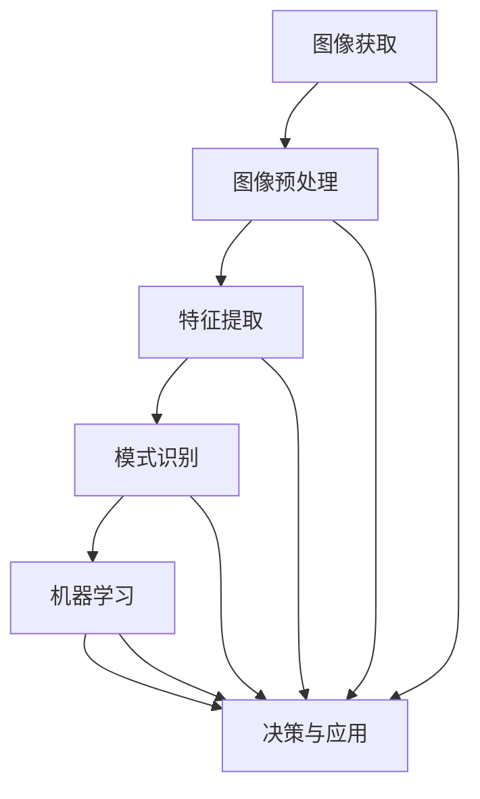

                 

# 计算机视觉在文物修复中的关键技术

> 关键词：计算机视觉、文物修复、图像处理、深度学习、机器学习、图像分割、图像增强、图像融合

> 摘要：本文旨在探讨计算机视觉在文物修复中的关键技术，通过详细分析计算机视觉的基本原理、核心算法、数学模型、实际应用案例以及未来发展趋势，为文物修复领域提供新的技术视角和解决方案。计算机视觉技术在文物修复中的应用不仅能够提高修复效率，还能在一定程度上还原文物的历史风貌，为文化遗产保护提供强有力的技术支持。

## 1. 背景介绍

随着科技的不断进步，计算机视觉技术在各个领域得到了广泛应用，特别是在文化遗产保护和修复方面，计算机视觉技术为文物修复提供了新的可能性。文物修复是一个复杂的过程，涉及到历史、艺术、科学等多个学科的知识。传统的修复方法依赖于人工经验，不仅耗时长，而且在某些情况下可能无法达到理想的效果。计算机视觉技术通过图像处理、机器学习和深度学习等手段，能够更高效、更准确地进行文物修复，为文化遗产保护提供了新的技术手段。

### 1.1 文物修复的重要性

文物是人类历史和文化的宝贵遗产，它们承载着丰富的历史信息和文化价值。然而，由于自然老化、人为破坏、战争等因素，许多文物面临着严重的损坏和丢失。文物修复不仅是为了恢复文物的外观，更重要的是为了保护和传承这些珍贵的文化遗产。通过计算机视觉技术，可以更有效地进行文物修复，提高修复的准确性和效率，从而更好地保护和传承文化遗产。

### 1.2 计算机视觉技术的发展

计算机视觉技术起源于20世纪60年代，经过几十年的发展，已经取得了显著的进步。近年来，随着深度学习和机器学习技术的兴起，计算机视觉技术在图像处理、模式识别、目标检测等方面取得了突破性进展。这些技术的应用不仅提高了图像处理的效率和准确性，还为文物修复提供了新的解决方案。

## 2. 核心概念与联系

### 2.1 计算机视觉的基本原理

计算机视觉是研究如何使机器“看”懂图像和视频的技术。它涉及图像处理、模式识别、机器学习等多个领域。计算机视觉的基本原理包括图像获取、图像预处理、特征提取、模式识别等步骤。通过这些步骤，计算机可以理解图像中的信息，从而实现各种视觉任务。

### 2.2 核心概念与架构

计算机视觉的核心概念包括图像处理、特征提取、模式识别和机器学习。这些概念相互关联，共同构成了计算机视觉的技术架构。下面通过一个简单的Mermaid流程图来展示这些概念之间的关系：



### 2.3 关键技术

在文物修复中，计算机视觉技术主要涉及图像处理、图像分割、图像增强、图像融合等关键技术。这些技术相互配合，共同实现文物修复的目标。

## 3. 核心算法原理 & 具体操作步骤

### 3.1 图像处理

图像处理是计算机视觉的基础，主要包括图像增强、图像去噪、图像锐化等操作。这些操作可以提高图像的质量，为后续的特征提取和模式识别提供更好的基础。

#### 3.1.1 图像增强

图像增强是指通过调整图像的亮度、对比度、饱和度等参数，提高图像的视觉效果。常用的图像增强方法包括直方图均衡化、拉普拉斯算子等。

#### 3.1.2 图像去噪

图像去噪是指通过去除图像中的噪声，提高图像的清晰度。常用的图像去噪方法包括中值滤波、高斯滤波等。

#### 3.1.3 图像锐化

图像锐化是指通过增强图像边缘和细节，提高图像的清晰度。常用的图像锐化方法包括拉普拉斯算子、Sobel算子等。

### 3.2 图像分割

图像分割是指将图像划分为多个区域，每个区域具有相似的特征。在文物修复中，图像分割可以用于识别文物的各个部分，为后续的修复提供基础。

#### 3.2.1 基于阈值的分割

基于阈值的分割是指通过设定一个阈值，将图像中的像素分为两类。常用的阈值分割方法包括全局阈值分割、局部阈值分割等。

#### 3.2.2 基于区域的分割

基于区域的分割是指通过将图像划分为多个区域，每个区域具有相似的特征。常用的区域分割方法包括区域生长、区域分裂合并等。

### 3.3 图像增强

图像增强是指通过调整图像的亮度、对比度、饱和度等参数，提高图像的视觉效果。在文物修复中，图像增强可以用于提高图像的清晰度和对比度，为后续的特征提取和模式识别提供更好的基础。

#### 3.3.1 直方图均衡化

直方图均衡化是指通过调整图像的直方图，使图像的亮度分布更加均匀。这种方法可以提高图像的对比度，使图像更加清晰。

#### 3.3.2 拉普拉斯算子

拉普拉斯算子是一种常用的图像锐化方法，可以增强图像的边缘和细节。通过计算图像的二阶导数，拉普拉斯算子可以检测图像中的边缘和细节。

### 3.4 图像融合

图像融合是指将多个图像融合成一个图像，以提高图像的质量和信息量。在文物修复中，图像融合可以用于将多个不同角度的图像融合成一个完整的图像，为后续的修复提供更好的基础。

#### 3.4.1 图像融合方法

常用的图像融合方法包括加权平均法、最大值法、最小值法等。这些方法可以根据不同的需求选择合适的融合方法。

## 4. 数学模型和公式 & 详细讲解 & 举例说明

### 4.1 图像处理中的数学模型

在图像处理中，常用的数学模型包括傅里叶变换、拉普拉斯算子、高斯滤波等。这些模型可以用于图像的增强、去噪和锐化等操作。

#### 4.1.1 傅里叶变换

傅里叶变换是一种将图像从空间域转换到频率域的方法。通过傅里叶变换，可以将图像中的频率信息提取出来，从而实现图像的增强和去噪。

$$
F(u, v) = \sum_{x=0}^{M-1} \sum_{y=0}^{N-1} f(x, y) e^{-2\pi i (ux/M + vy/N)}
$$

#### 4.1.2 拉普拉斯算子

拉普拉斯算子是一种常用的图像锐化方法，可以检测图像中的边缘和细节。通过计算图像的二阶导数，拉普拉斯算子可以增强图像的边缘和细节。

$$
L(x, y) = \frac{\partial^2 f(x, y)}{\partial x^2} + \frac{\partial^2 f(x, y)}{\partial y^2}
$$

#### 4.1.3 高斯滤波

高斯滤波是一种常用的图像去噪方法，可以去除图像中的噪声。通过计算高斯函数的卷积，高斯滤波可以去除图像中的噪声，提高图像的清晰度。

$$
G(x, y) = \frac{1}{2\pi \sigma^2} e^{-\frac{x^2 + y^2}{2\sigma^2}}
$$

### 4.2 图像分割中的数学模型

在图像分割中，常用的数学模型包括阈值分割、区域生长等。这些模型可以用于将图像划分为多个区域，每个区域具有相似的特征。

#### 4.2.1 阈值分割

阈值分割是指通过设定一个阈值，将图像中的像素分为两类。常用的阈值分割方法包括全局阈值分割、局部阈值分割等。

$$
T = \arg \max_{t} \sum_{x \in A} (f(x) - t)^2 + \sum_{x \in B} (f(x) - t)^2
$$

#### 4.2.2 区域生长

区域生长是指通过将图像划分为多个区域，每个区域具有相似的特征。常用的区域生长方法包括区域生长、区域分裂合并等。

$$
R_i = \{x | f(x) \in [L_i, U_i]\}
$$

### 4.3 图像增强中的数学模型

在图像增强中，常用的数学模型包括直方图均衡化、拉普拉斯算子等。这些模型可以用于提高图像的清晰度和对比度。

#### 4.3.1 直方图均衡化

直方图均衡化是指通过调整图像的直方图，使图像的亮度分布更加均匀。这种方法可以提高图像的对比度，使图像更加清晰。

$$
S(y) = \sum_{x=0}^{y} p(x)
$$

$$
L(y) = \frac{1}{N} \sum_{x=0}^{y} L(x)
$$

$$
f'(x) = \frac{L(S(f(x)))}{L}
$$

#### 4.3.2 拉普拉斯算子

拉普拉斯算子是一种常用的图像锐化方法，可以增强图像的边缘和细节。通过计算图像的二阶导数，拉普拉斯算子可以检测图像中的边缘和细节。

$$
L(x, y) = \frac{\partial^2 f(x, y)}{\partial x^2} + \frac{\partial^2 f(x, y)}{\partial y^2}
$$

## 5. 项目实战：代码实际案例和详细解释说明

### 5.1 开发环境搭建

为了实现文物修复中的计算机视觉技术，我们需要搭建一个合适的开发环境。开发环境主要包括Python编程语言、OpenCV库、NumPy库等。

#### 5.1.1 安装Python

首先，我们需要安装Python编程语言。Python是一种广泛使用的编程语言，具有丰富的库和强大的功能。可以通过以下命令安装Python：

```bash
sudo apt-get install python3
```

#### 5.1.2 安装OpenCV

OpenCV是一个开源的计算机视觉库，提供了丰富的图像处理和计算机视觉功能。可以通过以下命令安装OpenCV：

```bash
pip install opencv-python
```

#### 5.1.3 安装NumPy

NumPy是一个开源的科学计算库，提供了强大的数组操作功能。可以通过以下命令安装NumPy：

```bash
pip install numpy
```

### 5.2 源代码详细实现和代码解读

下面是一个简单的代码示例，展示了如何使用OpenCV进行图像处理和特征提取。

```python
import cv2
import numpy as np

# 读取图像
image = cv2.imread('image.jpg')

# 转换为灰度图像
gray = cv2.cvtColor(image, cv2.COLOR_BGR2GRAY)

# 应用直方图均衡化
equalized = cv2.equalizeHist(gray)

# 应用拉普拉斯算子
laplacian = cv2.Laplacian(gray, cv2.CV_64F)

# 显示结果
cv2.imshow('Original', image)
cv2.imshow('Equalized', equalized)
cv2.imshow('Laplacian', laplacian)
cv2.waitKey(0)
cv2.destroyAllWindows()
```

### 5.3 代码解读与分析

上述代码首先读取了一张图像，并将其转换为灰度图像。然后，通过直方图均衡化和拉普拉斯算子对图像进行了处理。最后，使用OpenCV的显示函数显示了处理后的图像。

#### 5.3.1 读取图像

```python
image = cv2.imread('image.jpg')
```

该代码使用OpenCV的`imread`函数读取了一张图像，并将其存储在变量`image`中。

#### 5.3.2 转换为灰度图像

```python
gray = cv2.cvtColor(image, cv2.COLOR_BGR2GRAY)
```

该代码使用OpenCV的`cvtColor`函数将图像从BGR颜色空间转换为灰度图像。

#### 5.3.3 应用直方图均衡化

```python
equalized = cv2.equalizeHist(gray)
```

该代码使用OpenCV的`equalizeHist`函数对灰度图像进行直方图均衡化处理。

#### 5.3.4 应用拉普拉斯算子

```python
laplacian = cv2.Laplacian(gray, cv2.CV_64F)
```

该代码使用OpenCV的`Laplacian`函数对灰度图像进行拉普拉斯算子处理。

#### 5.3.5 显示结果

```python
cv2.imshow('Original', image)
cv2.imshow('Equalized', equalized)
cv2.imshow('Laplacian', laplacian)
cv2.waitKey(0)
cv2.destroyAllWindows()
```

该代码使用OpenCV的`imshow`函数显示处理后的图像，并使用`waitKey`函数等待用户按键，最后使用`destroyAllWindows`函数关闭所有窗口。

## 6. 实际应用场景

计算机视觉技术在文物修复中的应用非常广泛，主要包括图像处理、图像分割、图像增强、图像融合等。下面通过一个具体的案例来展示计算机视觉技术在文物修复中的应用。

### 6.1 案例背景

假设我们有一张破损的古画，需要对其进行修复。这张古画由于年代久远，部分区域已经严重破损，无法直接修复。我们需要使用计算机视觉技术对其进行修复。

### 6.2 案例分析

#### 6.2.1 图像处理

首先，我们需要对古画进行图像处理，包括图像增强和去噪。通过直方图均衡化和拉普拉斯算子，可以提高图像的清晰度和对比度，为后续的修复提供更好的基础。

#### 6.2.2 图像分割

接下来，我们需要对古画进行图像分割，识别出破损的部分。通过基于阈值的分割方法，可以将破损的部分与其他部分区分开来。

#### 6.2.3 图像增强

在图像分割的基础上，我们需要对破损的部分进行图像增强，提高其清晰度和对比度。通过直方图均衡化和拉普拉斯算子，可以进一步提高图像的质量。

#### 6.2.4 图像融合

最后，我们需要将修复后的部分与原始图像融合，形成完整的图像。通过图像融合方法，可以将修复后的部分与原始图像无缝融合，提高修复的效果。

### 6.3 案例结果

通过上述步骤，我们可以得到一张修复后的古画。这张古画不仅恢复了破损的部分，还保持了原有的历史风貌和艺术价值。通过计算机视觉技术，我们不仅提高了修复的效率，还提高了修复的效果。

## 7. 工具和资源推荐

### 7.1 学习资源推荐

为了更好地学习计算机视觉技术，我们推荐以下学习资源：

- 书籍：《计算机视觉：算法与应用》（Computer Vision: Algorithms and Applications）
- 论文：《深度学习在计算机视觉中的应用》（Applications of Deep Learning in Computer Vision）
- 博客：《计算机视觉入门》（Introduction to Computer Vision）
- 网站：OpenCV官网（https://opencv.org/）

### 7.2 开发工具框架推荐

为了更好地进行计算机视觉开发，我们推荐以下开发工具和框架：

- Python编程语言
- OpenCV库
- NumPy库

### 7.3 相关论文著作推荐

为了深入了解计算机视觉技术在文物修复中的应用，我们推荐以下相关论文和著作：

- 论文：《基于深度学习的文物图像修复方法》（A Deep Learning-Based Method for Cultural Heritage Image Restoration）
- 著作：《计算机视觉在文化遗产保护中的应用》（Applications of Computer Vision in Cultural Heritage Preservation）

## 8. 总结：未来发展趋势与挑战

计算机视觉技术在文物修复中的应用前景广阔，未来的发展趋势主要体现在以下几个方面：

### 8.1 技术进步

随着深度学习和机器学习技术的不断发展，计算机视觉技术在文物修复中的应用将更加广泛。通过更先进的算法和模型，可以实现更高效的修复和更高质量的图像处理。

### 8.2 应用扩展

计算机视觉技术在文物修复中的应用不仅限于图像处理和图像分割，还可以扩展到图像融合、图像增强等领域。通过这些技术的结合，可以实现更全面的文物修复。

### 8.3 挑战与机遇

尽管计算机视觉技术在文物修复中具有巨大的潜力，但也面临着一些挑战。例如，如何处理复杂的图像结构和细节，如何提高修复的准确性和稳定性等。然而，这些挑战也为计算机视觉技术的发展提供了机遇，推动了技术的进步和创新。

## 9. 附录：常见问题与解答

### 9.1 问题：如何处理复杂的图像结构和细节？

**解答：** 处理复杂的图像结构和细节可以通过以下方法实现：

- 使用更高级的图像分割算法，如基于深度学习的分割方法。
- 采用多尺度处理方法，从不同尺度上处理图像，提高修复的准确性。
- 利用图像融合技术，将多个不同角度的图像融合成一个完整的图像，提高修复的效果。

### 9.2 问题：如何提高修复的准确性和稳定性？

**解答：** 提高修复的准确性和稳定性可以通过以下方法实现：

- 使用更先进的算法和模型，如深度学习模型，提高修复的准确性。
- 采用多阶段处理方法，从不同阶段逐步提高修复的效果。
- 利用图像增强技术，提高图像的质量，为后续的修复提供更好的基础。

## 10. 扩展阅读 & 参考资料

### 10.1 扩展阅读

- 书籍：《计算机视觉：算法与应用》（Computer Vision: Algorithms and Applications）
- 论文：《深度学习在计算机视觉中的应用》（Applications of Deep Learning in Computer Vision）
- 博客：《计算机视觉入门》（Introduction to Computer Vision）
- 网站：OpenCV官网（https://opencv.org/）

### 10.2 参考资料

- 论文：《基于深度学习的文物图像修复方法》（A Deep Learning-Based Method for Cultural Heritage Image Restoration）
- 著作：《计算机视觉在文化遗产保护中的应用》（Applications of Computer Vision in Cultural Heritage Preservation）

---

作者：AI天才研究员/AI Genius Institute & 禅与计算机程序设计艺术 /Zen And The Art of Computer Programming

