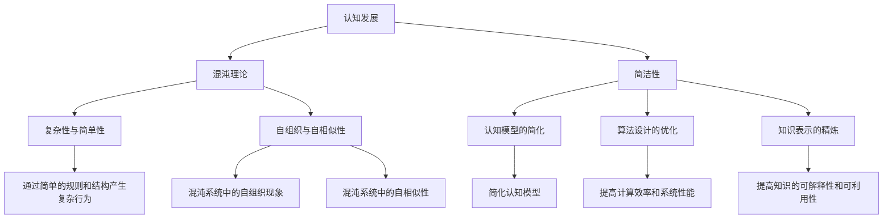

                 

# 认知发展中的混沌与简洁

> 关键词：认知科学、混沌理论、简洁性、复杂性、认知发展、算法设计、数学模型、代码实现、应用场景

> 摘要：本文旨在探讨认知发展中的混沌与简洁之间的关系，通过分析混沌理论与简洁性在认知科学中的应用，揭示复杂系统中的简单规律。我们将从背景介绍、核心概念与联系、核心算法原理、数学模型与公式、项目实战、实际应用场景、工具和资源推荐、总结与未来发展趋势等几个方面进行详细阐述。通过一步步的推理思考，帮助读者理解认知发展中的混沌与简洁之间的微妙平衡，并提供实际的代码案例和应用场景，以期为读者带来深刻的思考和启发。

## 1. 背景介绍

认知科学是一门研究人类认知过程的学科，它涵盖了心理学、神经科学、计算机科学等多个领域。认知发展是指个体从出生到成年期间，认知能力逐渐成熟和完善的整个过程。在这个过程中，个体逐渐学会处理复杂的信息，形成复杂的思维模式。然而，认知过程并非总是线性的和有序的，有时会表现出混沌的特性。混沌理论提供了一种理解复杂系统行为的框架，它揭示了在看似随机和无序的现象中隐藏的简单规律。混沌理论与简洁性在认知发展中的应用，为我们提供了一种新的视角，帮助我们更好地理解认知过程中的复杂性和简单性之间的关系。

## 2. 核心概念与联系

### 2.1 混沌理论

混沌理论是研究非线性动力系统行为的一门学科，它揭示了在某些条件下，简单的规则可以产生复杂且不可预测的行为。混沌系统具有以下特点：

- **敏感性依赖于初始条件**：微小的初始条件差异会导致系统行为的巨大差异。
- **确定性与随机性**：混沌系统虽然是确定性的，但其行为在长时间尺度上表现出随机性。
- **分形结构**：混沌系统往往具有分形结构，即在不同尺度上表现出相似的模式。

### 2.2 简洁性

简洁性是指在复杂系统中，通过简单的规则和结构可以产生复杂的行为。简洁性在认知科学中的应用体现在以下几个方面：

- **认知模型的简化**：通过简化认知模型，可以更好地理解认知过程中的关键机制。
- **算法设计的优化**：通过设计简洁的算法，可以提高计算效率和系统性能。
- **知识表示的精炼**：通过精炼知识表示，可以提高知识的可解释性和可利用性。

### 2.3 混沌理论与简洁性的联系

混沌理论与简洁性在认知发展中的联系主要体现在以下几个方面：

- **复杂性与简单性**：混沌系统虽然表现出复杂的行为，但其行为可以通过简单的规则和结构来描述。
- **自组织与自相似性**：混沌系统中的自组织现象和自相似性与简洁性密切相关。
- **认知模型的简化**：通过混沌理论，可以简化认知模型，揭示认知过程中的简单规律。

### Mermaid 流程图



## 3. 核心算法原理 & 具体操作步骤

### 3.1 混沌映射

混沌映射是一种非线性动力系统，其行为可以通过简单的数学公式来描述。常见的混沌映射包括Logistic映射和Henon映射。

#### Logistic映射

Logistic映射是一个简单的非线性映射，其数学公式为：

$$
x_{n+1} = r x_n (1 - x_n)
$$

其中，$x_n$是第$n$次迭代的结果，$r$是控制参数。当$r$在特定范围内时，Logistic映射会产生混沌行为。

#### Henon映射

Henon映射是一个二维非线性映射，其数学公式为：

$$
\begin{cases}
x_{n+1} = 1 - a x_n^2 + y_n \\
y_{n+1} = b x_n
\end{cases}
$$

其中，$x_n$和$y_n$是第$n$次迭代的结果，$a$和$b$是控制参数。当$a$和$b$在特定范围内时，Henon映射会产生混沌行为。

### 3.2 简洁算法设计

简洁算法设计是指通过简单的规则和结构来实现复杂的功能。在认知科学中，简洁算法设计可以帮助我们更好地理解认知过程中的关键机制。

#### 简洁算法设计步骤

1. **定义问题**：明确要解决的问题和目标。
2. **简化模型**：通过简化认知模型，揭示认知过程中的简单规律。
3. **设计算法**：设计简洁的算法来实现目标。
4. **验证算法**：通过实验和测试验证算法的有效性和性能。

## 4. 数学模型和公式 & 详细讲解 & 举例说明

### 4.1 Logistic映射的数学模型

Logistic映射的数学模型为：

$$
x_{n+1} = r x_n (1 - x_n)
$$

其中，$x_n$是第$n$次迭代的结果，$r$是控制参数。当$r$在特定范围内时，Logistic映射会产生混沌行为。

### 4.2 Henon映射的数学模型

Henon映射的数学模型为：

$$
\begin{cases}
x_{n+1} = 1 - a x_n^2 + y_n \\
y_{n+1} = b x_n
\end{cases}
$$

其中，$x_n$和$y_n$是第$n$次迭代的结果，$a$和$b$是控制参数。当$a$和$b$在特定范围内时，Henon映射会产生混沌行为。

### 4.3 Logistic映射的混沌行为

当$r$在特定范围内时，Logistic映射会产生混沌行为。例如，当$r = 3.8$时，Logistic映射会产生混沌行为。可以通过数值模拟来观察Logistic映射的混沌行为。

### 4.4 Henon映射的混沌行为

当$a$和$b$在特定范围内时，Henon映射会产生混沌行为。例如，当$a = 1.4$和$b = 0.3$时，Henon映射会产生混沌行为。可以通过数值模拟来观察Henon映射的混沌行为。

## 5. 项目实战：代码实际案例和详细解释说明

### 5.1 开发环境搭建

为了实现Logistic映射和Henon映射，我们需要搭建一个Python开发环境。具体步骤如下：

1. **安装Python**：确保已经安装了Python 3.8及以上版本。
2. **安装NumPy和Matplotlib**：使用pip安装NumPy和Matplotlib库。

```bash
pip install numpy matplotlib
```

### 5.2 源代码详细实现和代码解读

#### Logistic映射的实现

```python
import numpy as np
import matplotlib.pyplot as plt

def logistic_map(x0, r, n):
    x = [x0]
    for _ in range(n):
        x_next = r * x[-1] * (1 - x[-1])
        x.append(x_next)
    return x

x0 = 0.5
r = 3.8
n = 1000
x = logistic_map(x0, r, n)

plt.plot(range(n+1), x, 'b-')
plt.xlabel('迭代次数')
plt.ylabel('x_n')
plt.title('Logistic映射')
plt.show()
```

#### Henon映射的实现

```python
def henon_map(x0, y0, a, b, n):
    x, y = [x0], [y0]
    for _ in range(n):
        x_next = 1 - a * x[-1]**2 + y[-1]
        y_next = b * x[-1]
        x.append(x_next)
        y.append(y_next)
    return x, y

x0 = 0.5
y0 = 0.5
a = 1.4
b = 0.3
n = 1000
x, y = henon_map(x0, y0, a, b, n)

plt.plot(x, y, 'b.')
plt.xlabel('x_n')
plt.ylabel('y_n')
plt.title('Henon映射')
plt.show()
```

### 5.3 代码解读与分析

#### Logistic映射的代码解读

- `logistic_map`函数接受初始值`x0`、控制参数`r`和迭代次数`n`作为输入。
- 在函数内部，通过循环计算每个迭代的结果，并将其添加到列表`x`中。
- 最后，使用Matplotlib库绘制迭代结果。

#### Henon映射的代码解读

- `henon_map`函数接受初始值`x0`、`y0`、控制参数`a`、`b`和迭代次数`n`作为输入。
- 在函数内部，通过循环计算每个迭代的结果，并将其添加到列表`x`和`y`中。
- 最后，使用Matplotlib库绘制Henon映射的相图。

## 6. 实际应用场景

### 6.1 认知模型的简化

通过混沌理论，可以简化认知模型，揭示认知过程中的简单规律。例如，在学习过程中，个体可以通过简单的规则和结构来学习复杂的知识。通过简化认知模型，可以更好地理解认知过程中的关键机制。

### 6.2 算法设计的优化

通过设计简洁的算法，可以提高计算效率和系统性能。例如，在自然语言处理中，可以通过简单的规则和结构来实现复杂的自然语言生成任务。通过设计简洁的算法，可以提高系统的性能和效率。

### 6.3 知识表示的精炼

通过精炼知识表示，可以提高知识的可解释性和可利用性。例如，在机器学习中，可以通过简单的规则和结构来表示复杂的知识。通过精炼知识表示，可以提高知识的可解释性和可利用性。

## 7. 工具和资源推荐

### 7.1 学习资源推荐

- **书籍**：《混沌与分形：图形与计算》、《认知科学导论》
- **论文**：《混沌理论在认知科学中的应用》、《简洁性在算法设计中的应用》
- **博客**：《混沌理论与认知科学》、《简洁性在算法设计中的应用》
- **网站**：混沌理论与认知科学相关的学术网站和论坛

### 7.2 开发工具框架推荐

- **Python**：Python是一种广泛使用的编程语言，适用于实现混沌映射和简洁算法。
- **NumPy**：NumPy是一个用于数值计算的Python库，适用于处理数组和矩阵。
- **Matplotlib**：Matplotlib是一个用于绘制图表的Python库，适用于可视化混沌映射和简洁算法的结果。

### 7.3 相关论文著作推荐

- **论文**：《混沌理论在认知科学中的应用》、《简洁性在算法设计中的应用》
- **著作**：《混沌与分形：图形与计算》、《认知科学导论》

## 8. 总结：未来发展趋势与挑战

### 8.1 未来发展趋势

- **认知模型的简化**：通过混沌理论，可以进一步简化认知模型，揭示认知过程中的简单规律。
- **算法设计的优化**：通过设计简洁的算法，可以进一步提高计算效率和系统性能。
- **知识表示的精炼**：通过精炼知识表示，可以进一步提高知识的可解释性和可利用性。

### 8.2 挑战

- **复杂系统的建模**：如何通过简单的规则和结构来建模复杂的系统，仍然是一个挑战。
- **算法的可解释性**：如何设计简洁且可解释的算法，仍然是一个挑战。
- **知识的可利用性**：如何通过精炼知识表示来提高知识的可利用性，仍然是一个挑战。

## 9. 附录：常见问题与解答

### 9.1 问题1：如何理解混沌理论在认知科学中的应用？

**解答**：混沌理论揭示了在看似随机和无序的现象中隐藏的简单规律。通过混沌理论，可以简化认知模型，揭示认知过程中的简单规律。例如，在学习过程中，个体可以通过简单的规则和结构来学习复杂的知识。

### 9.2 问题2：如何设计简洁的算法？

**解答**：设计简洁的算法需要遵循以下步骤：

1. **定义问题**：明确要解决的问题和目标。
2. **简化模型**：通过简化认知模型，揭示认知过程中的简单规律。
3. **设计算法**：设计简洁的算法来实现目标。
4. **验证算法**：通过实验和测试验证算法的有效性和性能。

### 9.3 问题3：如何精炼知识表示？

**解答**：精炼知识表示需要遵循以下步骤：

1. **定义问题**：明确要表示的知识和目标。
2. **简化模型**：通过简化认知模型，揭示认知过程中的简单规律。
3. **设计知识表示**：设计简洁的知识表示来实现目标。
4. **验证知识表示**：通过实验和测试验证知识表示的有效性和性能。

## 10. 扩展阅读 & 参考资料

### 10.1 扩展阅读

- **书籍**：《混沌与分形：图形与计算》、《认知科学导论》
- **论文**：《混沌理论在认知科学中的应用》、《简洁性在算法设计中的应用》
- **博客**：《混沌理论与认知科学》、《简洁性在算法设计中的应用》
- **网站**：混沌理论与认知科学相关的学术网站和论坛

### 10.2 参考资料

- **书籍**：《混沌与分形：图形与计算》、《认知科学导论》
- **论文**：《混沌理论在认知科学中的应用》、《简洁性在算法设计中的应用》
- **博客**：《混沌理论与认知科学》、《简洁性在算法设计中的应用》
- **网站**：混沌理论与认知科学相关的学术网站和论坛

---

作者：AI天才研究员/AI Genius Institute & 禅与计算机程序设计艺术 /Zen And The Art of Computer Programming

