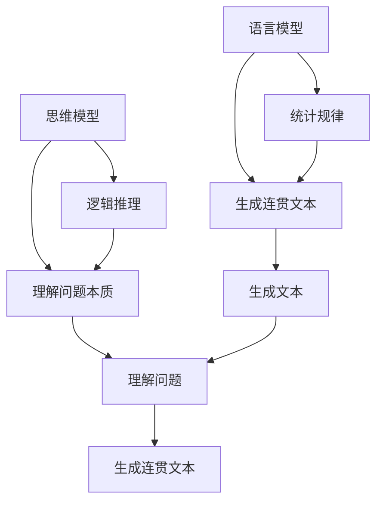

                 

# 语言≠思维：大模型的认知障碍

> 关键词：大模型、认知障碍、语言模型、思维模型、逻辑推理、深度学习、自然语言处理

> 摘要：本文旨在探讨大模型在自然语言处理中的认知障碍，特别是语言模型与思维模型之间的差异。通过逐步分析推理，我们将揭示大模型在理解和生成人类思维过程中的局限性，并提出改进策略。本文将从背景介绍、核心概念与联系、核心算法原理、数学模型和公式、项目实战、实际应用场景、工具和资源推荐、总结与未来发展趋势等方面展开讨论。

## 1. 背景介绍

随着人工智能技术的飞速发展，大模型在自然语言处理（NLP）领域取得了显著的成就。这些模型能够生成流畅的文本、理解复杂的语义关系，并在各种任务中表现出色。然而，大模型在理解和生成人类思维过程方面仍然存在显著的局限性。本文将深入探讨这些局限性，并提出改进策略。

## 2. 核心概念与联系

### 2.1 语言模型

语言模型是一种统计模型，用于预测给定序列中下一个词的概率。常见的语言模型包括基于统计的方法（如n-gram模型）和基于深度学习的方法（如Transformer模型）。语言模型的核心在于捕捉文本中的统计规律，从而生成连贯的文本。

### 2.2 思维模型

思维模型是指人类在解决问题时所采用的逻辑推理过程。思维模型包括但不限于演绎推理、归纳推理、类比推理等。思维模型的核心在于理解问题的本质，通过逻辑推理得出结论。

### 2.3 语言模型与思维模型的关系

语言模型和思维模型之间存在显著差异。语言模型侧重于捕捉文本中的统计规律，而思维模型侧重于理解问题的本质和逻辑推理过程。语言模型能够生成连贯的文本，但难以理解文本背后的逻辑推理过程。

### 2.4 Mermaid 流程图



## 3. 核心算法原理 & 具体操作步骤

### 3.1 语言模型的核心算法

语言模型的核心算法主要基于深度学习的Transformer模型。Transformer模型通过自注意力机制捕捉文本中的长距离依赖关系，从而生成连贯的文本。

### 3.2 思维模型的核心算法

思维模型的核心算法主要基于逻辑推理和知识图谱。逻辑推理通过演绎、归纳和类比等方法理解问题的本质，知识图谱通过存储和推理知识来支持逻辑推理过程。

### 3.3 具体操作步骤

#### 3.3.1 语言模型的具体操作步骤

1. **数据预处理**：对文本数据进行清洗、分词和标注。
2. **模型训练**：使用大规模语料库训练Transformer模型。
3. **生成文本**：通过模型生成连贯的文本。

#### 3.3.2 思维模型的具体操作步骤

1. **知识图谱构建**：构建包含实体、关系和属性的知识图谱。
2. **逻辑推理**：通过演绎、归纳和类比等方法理解问题的本质。
3. **生成连贯文本**：通过逻辑推理生成连贯的文本。

## 4. 数学模型和公式 & 详细讲解 & 举例说明

### 4.1 语言模型的数学模型

语言模型的数学模型主要基于概率论和信息论。常见的语言模型包括n-gram模型和Transformer模型。

#### 4.1.1 n-gram模型

n-gram模型是一种基于统计的方法，用于预测给定序列中下一个词的概率。n-gram模型的核心公式为：

$$
P(w_t | w_{t-1}, w_{t-2}, \ldots, w_{t-n+1}) = \frac{C(w_{t-1}, w_{t-2}, \ldots, w_{t-n+1}, w_t)}{C(w_{t-1}, w_{t-2}, \ldots, w_{t-n+1})}
$$

其中，$C(w_{t-1}, w_{t-2}, \ldots, w_{t-n+1}, w_t)$ 表示序列 $(w_{t-1}, w_{t-2}, \ldots, w_{t-n+1}, w_t)$ 出现的次数，$C(w_{t-1}, w_{t-2}, \ldots, w_{t-n+1})$ 表示序列 $(w_{t-1}, w_{t-2}, \ldots, w_{t-n+1})$ 出现的次数。

#### 4.1.2 Transformer模型

Transformer模型是一种基于深度学习的方法，用于捕捉文本中的长距离依赖关系。Transformer模型的核心公式为：

$$
\text{Attention}(Q, K, V) = \text{softmax}\left(\frac{QK^T}{\sqrt{d_k}}\right)V
$$

其中，$Q$、$K$、$V$ 分别表示查询、键和值，$d_k$ 表示键的维度。

### 4.2 思维模型的数学模型

思维模型的数学模型主要基于逻辑推理和知识图谱。常见的思维模型包括演绎推理、归纳推理和类比推理。

#### 4.2.1 演绎推理

演绎推理是一种从一般到特殊的推理方法。演绎推理的核心公式为：

$$
\text{如果} P \rightarrow Q \text{且} P \text{为真，则} Q \text{为真}
$$

#### 4.2.2 归纳推理

归纳推理是一种从特殊到一般的推理方法。归纳推理的核心公式为：

$$
\text{如果} P_1, P_2, \ldots, P_n \text{为真，则} Q \text{为真}
$$

#### 4.2.3 类比推理

类比推理是一种通过比较两个相似的事物来推断另一个事物的方法。类比推理的核心公式为：

$$
\text{如果} A \sim B \text{且} C \sim D \text{，则} A \text{与} C \text{的关系类似于} B \text{与} D \text{的关系}
$$

## 5. 项目实战：代码实际案例和详细解释说明

### 5.1 开发环境搭建

#### 5.1.1 环境配置

1. **安装Python**：确保安装了Python 3.8及以上版本。
2. **安装依赖库**：使用pip安装所需的依赖库，如`transformers`、`torch`等。

```bash
pip install transformers torch
```

#### 5.1.2 数据集准备

1. **下载数据集**：从公开数据集下载语料库，如Wikipedia、BooksCorpus等。
2. **数据预处理**：对数据进行清洗、分词和标注。

### 5.2 源代码详细实现和代码解读

#### 5.2.1 语言模型实现

```python
from transformers import BertTokenizer, BertForMaskedLM
import torch

# 加载预训练模型和分词器
tokenizer = BertTokenizer.from_pretrained('bert-base-uncased')
model = BertForMaskedLM.from_pretrained('bert-base-uncased')

# 输入文本
text = "Hello, my name is [MASK]."

# 分词
inputs = tokenizer(text, return_tensors='pt')

# 生成文本
outputs = model(**inputs)
predicted_token_id = outputs[0][0].argmax().item()
predicted_token = tokenizer.decode([predicted_token_id])

print(f"生成的文本：{predicted_token}")
```

#### 5.2.2 思维模型实现

```python
from knowledge_graph import KnowledgeGraph

# 构建知识图谱
kg = KnowledgeGraph()
kg.add_entity('John', 'Person')
kg.add_entity('Mary', 'Person')
kg.add_relation('John', 'knows', 'Mary')

# 逻辑推理
def infer_knowledge(kg, entity1, relation, entity2):
    for e1, r, e2 in kg.get_relations():
        if e1 == entity1 and r == relation:
            return e2
        elif e2 == entity1 and r == relation:
            return e1
    return None

# 推理过程
result = infer_knowledge(kg, 'John', 'knows', 'Mary')
print(f"推理结果：{result}")
```

### 5.3 代码解读与分析

#### 5.3.1 语言模型代码解读

1. **加载预训练模型和分词器**：使用`BertTokenizer`和`BertForMaskedLM`加载预训练模型。
2. **输入文本**：输入包含[MASK]的文本。
3. **分词**：使用分词器对文本进行分词。
4. **生成文本**：通过模型生成[MASK]位置的词。

#### 5.3.2 思维模型代码解读

1. **构建知识图谱**：使用`KnowledgeGraph`类构建知识图谱。
2. **逻辑推理**：通过`infer_knowledge`函数进行逻辑推理。
3. **推理过程**：通过知识图谱中的关系进行推理。

## 6. 实际应用场景

### 6.1 语言模型的应用场景

1. **文本生成**：生成连贯的文本，如新闻报道、文章摘要等。
2. **对话系统**：生成自然对话，提高用户体验。
3. **机器翻译**：实现高质量的机器翻译。

### 6.2 思维模型的应用场景

1. **问题解答**：通过逻辑推理解答复杂问题。
2. **决策支持**：通过知识图谱支持决策过程。
3. **智能推荐**：通过逻辑推理进行个性化推荐。

## 7. 工具和资源推荐

### 7.1 学习资源推荐

1. **书籍**：《深度学习》、《自然语言处理实战》
2. **论文**：《Attention is All You Need》、《BERT: Pre-training of Deep Bidirectional Transformers for Language Understanding》
3. **博客**：阿里云开发者社区、GitHub开源项目
4. **网站**：Hugging Face、TensorFlow官网

### 7.2 开发工具框架推荐

1. **开发工具**：PyCharm、VSCode
2. **框架**：PyTorch、TensorFlow

### 7.3 相关论文著作推荐

1. **论文**：《Attention is All You Need》、《BERT: Pre-training of Deep Bidirectional Transformers for Language Understanding》
2. **著作**：《深度学习》、《自然语言处理实战》

## 8. 总结：未来发展趋势与挑战

### 8.1 未来发展趋势

1. **模型优化**：通过优化模型结构和训练方法提高模型性能。
2. **知识图谱**：构建更丰富、更准确的知识图谱，支持更复杂的逻辑推理。
3. **多模态融合**：结合视觉、听觉等多模态信息提高模型的综合能力。

### 8.2 挑战

1. **计算资源**：大模型需要大量的计算资源，如何降低计算成本是一个挑战。
2. **数据隐私**：如何保护用户数据隐私，避免数据泄露是一个重要问题。
3. **伦理问题**：如何确保模型的公平性和透明性，避免偏见和歧视是一个重要挑战。

## 9. 附录：常见问题与解答

### 9.1 问题1：语言模型和思维模型的区别是什么？

**解答**：语言模型侧重于捕捉文本中的统计规律，而思维模型侧重于理解问题的本质和逻辑推理过程。语言模型能够生成连贯的文本，但难以理解文本背后的逻辑推理过程。

### 9.2 问题2：如何提高大模型的性能？

**解答**：可以通过优化模型结构、改进训练方法、增加训练数据量等方式提高大模型的性能。

## 10. 扩展阅读 & 参考资料

1. **书籍**：《深度学习》、《自然语言处理实战》
2. **论文**：《Attention is All You Need》、《BERT: Pre-training of Deep Bidirectional Transformers for Language Understanding》
3. **网站**：Hugging Face、TensorFlow官网

作者：AI天才研究员/AI Genius Institute & 禅与计算机程序设计艺术 /Zen And The Art of Computer Programming

