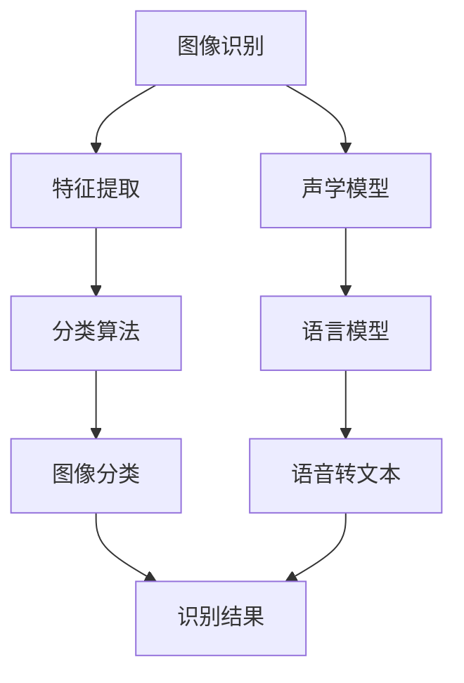

                 

# 软件 2.0 的应用领域：图像识别、语音识别

> 关键词：软件 2.0, 图像识别, 语音识别, 深度学习, 人工智能, 计算机视觉, 自然语言处理

> 摘要：本文将深入探讨软件 2.0 在图像识别和语音识别领域的应用。我们将从背景介绍出发，逐步解析核心概念、算法原理、数学模型，并通过实际代码案例进行详细讲解。此外，我们还将探讨这些技术的实际应用场景、推荐学习资源和开发工具，以及未来的发展趋势和挑战。

## 1. 背景介绍

### 1.1 软件 2.0 的定义
软件 2.0 是指基于大数据和机器学习的软件开发范式。与传统的软件 1.0 相比，软件 2.0 更加注重数据驱动和自动化。在软件 2.0 中，软件系统能够从大量数据中学习并自我优化，从而提供更智能、更个性化的服务。

### 1.2 图像识别与语音识别的发展
图像识别和语音识别是人工智能领域的重要分支，它们的发展经历了从规则基础系统到基于机器学习的系统。近年来，深度学习技术的兴起极大地推动了这两个领域的进步，使得图像识别和语音识别在准确性和实用性方面取得了显著提升。

## 2. 核心概念与联系

### 2.1 图像识别
图像识别是指计算机系统通过分析图像中的视觉信息，识别出图像中的物体、场景或动作。图像识别的核心在于特征提取和分类算法。

### 2.2 语音识别
语音识别是指计算机系统通过分析音频信号，将语音转换为文本。语音识别的关键在于声学模型和语言模型。

### 2.3 深度学习
深度学习是一种基于神经网络的机器学习方法，它能够从大量数据中自动学习特征表示。深度学习在图像识别和语音识别中发挥了重要作用。

### 2.4 Mermaid 流程图


## 3. 核心算法原理 & 具体操作步骤

### 3.1 图像识别算法原理
图像识别的核心步骤包括特征提取和分类。特征提取是从图像中提取有用的特征，分类则是将这些特征映射到相应的类别。

#### 3.1.1 特征提取
特征提取的方法有很多种，常见的有卷积神经网络（CNN）和局部二值模式（LBP）。

#### 3.1.2 分类算法
分类算法通常使用支持向量机（SVM）或深度神经网络（DNN）。

### 3.2 语音识别算法原理
语音识别的核心步骤包括声学模型和语言模型。

#### 3.2.1 声学模型
声学模型用于将音频信号转换为声学特征。常见的声学模型有高斯混合模型（GMM）和深度神经网络（DNN）。

#### 3.2.2 语言模型
语言模型用于预测语音序列的概率。常见的语言模型有N-gram模型和循环神经网络（RNN）。

## 4. 数学模型和公式 & 详细讲解 & 举例说明

### 4.1 图像识别的数学模型
图像识别的数学模型通常使用卷积神经网络（CNN）。

#### 4.1.1 卷积层
卷积层通过卷积操作提取图像的局部特征。卷积操作的数学公式为：
$$
y(x, y) = \sum_{i=-k}^{k} \sum_{j=-k}^{k} w(i, j) \cdot x(x+i, y+j)
$$
其中，$w(i, j)$ 是卷积核，$x(x+i, y+j)$ 是输入图像的像素值。

#### 4.1.2 池化层
池化层通过下采样操作降低特征图的维度。常见的池化操作有最大池化和平均池化。

### 4.2 语音识别的数学模型
语音识别的数学模型通常使用循环神经网络（RNN）。

#### 4.2.1 RNN
RNN 通过递归地处理序列数据，捕捉时间序列中的依赖关系。RNN 的数学公式为：
$$
h_t = \tanh(W_h h_{t-1} + W_x x_t + b)
$$
其中，$h_t$ 是当前时间步的隐藏状态，$x_t$ 是当前时间步的输入，$W_h$ 和 $W_x$ 是权重矩阵，$b$ 是偏置项。

## 5. 项目实战：代码实际案例和详细解释说明

### 5.1 开发环境搭建
为了进行图像识别和语音识别的实战项目，我们需要搭建相应的开发环境。这里以 Python 为例，使用 TensorFlow 和 Keras 库进行开发。

#### 5.1.1 安装依赖库
```bash
pip install tensorflow
pip install keras
```

### 5.2 源代码详细实现和代码解读
#### 5.2.1 图像识别代码
```python
import tensorflow as tf
from tensorflow.keras import layers, models

# 构建卷积神经网络模型
model = models.Sequential([
    layers.Conv2D(32, (3, 3), activation='relu', input_shape=(64, 64, 3)),
    layers.MaxPooling2D((2, 2)),
    layers.Conv2D(64, (3, 3), activation='relu'),
    layers.MaxPooling2D((2, 2)),
    layers.Conv2D(128, (3, 3), activation='relu'),
    layers.Flatten(),
    layers.Dense(128, activation='relu'),
    layers.Dense(10, activation='softmax')
])

# 编译模型
model.compile(optimizer='adam',
              loss='sparse_categorical_crossentropy',
              metrics=['accuracy'])

# 加载数据集
(x_train, y_train), (x_test, y_test) = tf.keras.datasets.cifar10.load_data()

# 数据预处理
x_train = x_train / 255.0
x_test = x_test / 255.0

# 训练模型
model.fit(x_train, y_train, epochs=10, validation_data=(x_test, y_test))
```

#### 5.2.2 语音识别代码
```python
import tensorflow as tf
from tensorflow.keras import layers, models

# 构建循环神经网络模型
model = models.Sequential([
    layers.Input(shape=(None, 13)),
    layers.Bidirectional(layers.LSTM(128, return_sequences=True)),
    layers.Dense(128, activation='relu'),
    layers.Dense(10, activation='softmax')
])

# 编译模型
model.compile(optimizer='adam',
              loss='sparse_categorical_crossentropy',
              metrics=['accuracy'])

# 加载数据集
(x_train, y_train), (x_test, y_test) = tf.keras.datasets.imdb.load_data()

# 数据预处理
x_train = tf.keras.preprocessing.sequence.pad_sequences(x_train, maxlen=200)
x_test = tf.keras.preprocessing.sequence.pad_sequences(x_test, maxlen=200)

# 训练模型
model.fit(x_train, y_train, epochs=10, validation_data=(x_test, y_test))
```

### 5.3 代码解读与分析
上述代码展示了如何使用 TensorFlow 和 Keras 构建卷积神经网络和循环神经网络模型。卷积神经网络模型用于图像识别，循环神经网络模型用于语音识别。通过训练模型，我们可以实现图像分类和语音转文本的功能。

## 6. 实际应用场景

### 6.1 图像识别的应用场景
图像识别技术广泛应用于安防监控、医疗影像分析、自动驾驶等领域。例如，安防监控系统可以通过图像识别技术实时检测异常行为，医疗影像分析系统可以通过图像识别技术辅助医生诊断疾病。

### 6.2 语音识别的应用场景
语音识别技术广泛应用于智能助手、语音翻译、语音搜索等领域。例如，智能助手可以通过语音识别技术理解用户的指令，语音翻译系统可以通过语音识别技术将不同语言的语音转换为文本。

## 7. 工具和资源推荐

### 7.1 学习资源推荐
- 书籍：《深度学习》（Ian Goodfellow, Yoshua Bengio, Aaron Courville）
- 论文：《ImageNet Classification with Deep Convolutional Neural Networks》（Alex Krizhevsky, Ilya Sutskever, Geoffrey E. Hinton）
- 博客：TensorFlow 官方博客（https://www.tensorflow.org/）
- 网站：Kaggle（https://www.kaggle.com/）

### 7.2 开发工具框架推荐
- TensorFlow：https://www.tensorflow.org/
- Keras：https://keras.io/
- PyTorch：https://pytorch.org/

### 7.3 相关论文著作推荐
- 《深度学习》（Ian Goodfellow, Yoshua Bengio, Aaron Courville）
- 《计算机视觉：算法与应用》（Richard Szeliski）
- 《语音识别：原理与应用》（Daniel Povey, Alan W. Black）

## 8. 总结：未来发展趋势与挑战

### 8.1 未来发展趋势
- 图像识别和语音识别技术将继续向更高精度和更广泛的应用场景发展。
- 深度学习模型将更加复杂，能够处理更复杂的数据和任务。
- 计算资源将更加丰富，使得模型训练和推理更加高效。

### 8.2 挑战
- 数据隐私和安全问题将更加突出。
- 模型的可解释性问题将更加严峻。
- 计算资源的消耗将更加庞大。

## 9. 附录：常见问题与解答

### 9.1 问题：如何提高图像识别的精度？
- 答案：可以通过增加训练数据量、优化模型结构和使用数据增强技术来提高图像识别的精度。

### 9.2 问题：如何处理语音识别中的噪声问题？
- 答案：可以通过使用噪声抑制技术、增加训练数据量和优化模型结构来处理语音识别中的噪声问题。

## 10. 扩展阅读 & 参考资料

- 《深度学习》（Ian Goodfellow, Yoshua Bengio, Aaron Courville）
- 《计算机视觉：算法与应用》（Richard Szeliski）
- 《语音识别：原理与应用》（Daniel Povey, Alan W. Black）
- TensorFlow 官方文档：https://www.tensorflow.org/
- Keras 官方文档：https://keras.io/

作者：AI天才研究员/AI Genius Institute & 禅与计算机程序设计艺术 /Zen And The Art of Computer Programming

