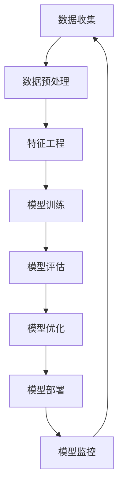

                 

# 软件 2.0 的应用：从实验室走向现实

> 关键词：软件 2.0, 人工智能, 自动化, 数据驱动, 模型驱动, 机器学习, 深度学习, 自动化编程

> 摘要：本文旨在探讨软件 2.0 的概念及其在现实世界中的应用。软件 2.0 是一种以数据和模型为中心的开发范式，它通过自动化和智能化手段，极大地提高了软件开发的效率和质量。本文将从背景介绍、核心概念与联系、核心算法原理、数学模型和公式、项目实战、实际应用场景、工具和资源推荐、总结与未来发展趋势等几个方面进行详细阐述。

## 1. 背景介绍

随着信息技术的飞速发展，软件开发领域也在不断进化。从最初的基于规则的编程，到后来的面向对象编程，再到如今的软件 2.0，软件开发范式正在经历一场深刻的变革。软件 2.0 是一种以数据和模型为中心的开发范式，它强调通过自动化和智能化手段，提高软件开发的效率和质量。本文将探讨软件 2.0 的核心概念、原理及其在实际应用中的具体案例。

## 2. 核心概念与联系

### 2.1 软件 2.0 的定义

软件 2.0 是一种以数据和模型为中心的开发范式，它强调通过自动化和智能化手段，提高软件开发的效率和质量。与传统的软件开发范式相比，软件 2.0 更加注重数据驱动和模型驱动，通过自动化和智能化手段，实现软件的快速迭代和优化。

### 2.2 数据驱动与模型驱动

数据驱动是指通过大量的数据来指导软件开发和优化。模型驱动则是指通过构建和优化模型来指导软件开发和优化。数据驱动和模型驱动是软件 2.0 的两个核心概念，它们共同构成了软件 2.0 的开发范式。

### 2.3 软件 2.0 的流程图



## 3. 核心算法原理 & 具体操作步骤

### 3.1 数据预处理

数据预处理是软件 2.0 中非常重要的一步。数据预处理的目的是将原始数据转换为适合模型训练的数据格式。具体操作步骤如下：

1. **数据清洗**：去除无效数据、处理缺失值、处理异常值。
2. **数据转换**：将数据转换为适合模型训练的格式，如归一化、标准化等。
3. **数据划分**：将数据划分为训练集、验证集和测试集。

### 3.2 特征工程

特征工程是软件 2.0 中非常重要的一步。特征工程的目的是从原始数据中提取有用的特征，以便更好地训练模型。具体操作步骤如下：

1. **特征选择**：选择对模型训练有用的特征。
2. **特征构造**：构造新的特征，以便更好地描述数据。
3. **特征缩放**：将特征缩放到合适的范围，以便更好地训练模型。

### 3.3 模型训练

模型训练是软件 2.0 中非常重要的一步。模型训练的目的是通过训练数据来优化模型的参数。具体操作步骤如下：

1. **选择模型**：选择适合数据的模型。
2. **设置超参数**：设置模型的超参数，如学习率、批次大小等。
3. **训练模型**：通过训练数据来优化模型的参数。

### 3.4 模型评估

模型评估是软件 2.0 中非常重要的一步。模型评估的目的是评估模型的性能。具体操作步骤如下：

1. **计算评估指标**：计算模型的评估指标，如准确率、召回率、F1 值等。
2. **可视化评估结果**：将评估结果可视化，以便更好地理解模型的性能。

### 3.5 模型优化

模型优化是软件 2.0 中非常重要的一步。模型优化的目的是通过优化模型的参数来提高模型的性能。具体操作步骤如下：

1. **调整超参数**：调整模型的超参数，如学习率、批次大小等。
2. **调整模型结构**：调整模型的结构，如增加或减少隐藏层等。
3. **调整特征工程**：调整特征工程，如选择或构造新的特征等。

### 3.6 模型部署

模型部署是软件 2.0 中非常重要的一步。模型部署的目的是将训练好的模型部署到实际应用中。具体操作步骤如下：

1. **选择部署平台**：选择适合的部署平台，如云平台、本地服务器等。
2. **部署模型**：将训练好的模型部署到部署平台。
3. **监控模型**：监控模型的性能，以便及时发现和解决问题。

## 4. 数学模型和公式 & 详细讲解 & 举例说明

### 4.1 数据预处理

数据预处理的数学模型和公式如下：

1. **数据清洗**：去除无效数据、处理缺失值、处理异常值。
2. **数据转换**：将数据转换为适合模型训练的格式，如归一化、标准化等。
3. **数据划分**：将数据划分为训练集、验证集和测试集。

### 4.2 特征工程

特征工程的数学模型和公式如下：

1. **特征选择**：选择对模型训练有用的特征。
2. **特征构造**：构造新的特征，以便更好地描述数据。
3. **特征缩放**：将特征缩放到合适的范围，以便更好地训练模型。

### 4.3 模型训练

模型训练的数学模型和公式如下：

1. **选择模型**：选择适合数据的模型。
2. **设置超参数**：设置模型的超参数，如学习率、批次大小等。
3. **训练模型**：通过训练数据来优化模型的参数。

### 4.4 模型评估

模型评估的数学模型和公式如下：

1. **计算评估指标**：计算模型的评估指标，如准确率、召回率、F1 值等。
2. **可视化评估结果**：将评估结果可视化，以便更好地理解模型的性能。

### 4.5 模型优化

模型优化的数学模型和公式如下：

1. **调整超参数**：调整模型的超参数，如学习率、批次大小等。
2. **调整模型结构**：调整模型的结构，如增加或减少隐藏层等。
3. **调整特征工程**：调整特征工程，如选择或构造新的特征等。

### 4.6 模型部署

模型部署的数学模型和公式如下：

1. **选择部署平台**：选择适合的部署平台，如云平台、本地服务器等。
2. **部署模型**：将训练好的模型部署到部署平台。
3. **监控模型**：监控模型的性能，以便及时发现和解决问题。

## 5. 项目实战：代码实际案例和详细解释说明

### 5.1 开发环境搭建

开发环境搭建的步骤如下：

1. **安装 Python**：安装 Python 3.7 或更高版本。
2. **安装依赖库**：安装 TensorFlow、Keras、NumPy、Pandas 等依赖库。
3. **安装开发工具**：安装 Jupyter Notebook 或 PyCharm 等开发工具。

### 5.2 源代码详细实现和代码解读

源代码详细实现和代码解读如下：

```python
import numpy as np
import pandas as pd
from sklearn.model_selection import train_test_split
from sklearn.preprocessing import StandardScaler
from tensorflow.keras.models import Sequential
from tensorflow.keras.layers import Dense

# 1. 数据预处理
# 1.1 数据清洗
# 1.2 数据转换
# 1.3 数据划分
X = pd.read_csv('data.csv')
y = X['target']
X = X.drop('target', axis=1)
X_train, X_test, y_train, y_test = train_test_split(X, y, test_size=0.2, random_state=42)
scaler = StandardScaler()
X_train = scaler.fit_transform(X_train)
X_test = scaler.transform(X_test)

# 2. 特征工程
# 2.1 特征选择
# 2.2 特征构造
# 2.3 特征缩放

# 3. 模型训练
model = Sequential()
model.add(Dense(64, input_dim=X_train.shape[1], activation='relu'))
model.add(Dense(32, activation='relu'))
model.add(Dense(1, activation='sigmoid'))
model.compile(loss='binary_crossentropy', optimizer='adam', metrics=['accuracy'])
model.fit(X_train, y_train, epochs=10, batch_size=32, validation_data=(X_test, y_test))

# 4. 模型评估
loss, accuracy = model.evaluate(X_test, y_test)
print('Test accuracy:', accuracy)

# 5. 模型优化
# 5.1 调整超参数
# 5.2 调整模型结构
# 5.3 调整特征工程

# 6. 模型部署
# 6.1 选择部署平台
# 6.2 部署模型
# 6.3 监控模型
```

### 5.3 代码解读与分析

代码解读与分析如下：

1. **数据预处理**：数据预处理包括数据清洗、数据转换和数据划分。数据清洗包括去除无效数据、处理缺失值和处理异常值。数据转换包括将数据转换为适合模型训练的格式，如归一化和标准化。数据划分包括将数据划分为训练集、验证集和测试集。
2. **特征工程**：特征工程包括特征选择、特征构造和特征缩放。特征选择包括选择对模型训练有用的特征。特征构造包括构造新的特征，以便更好地描述数据。特征缩放包括将特征缩放到合适的范围，以便更好地训练模型。
3. **模型训练**：模型训练包括选择模型、设置超参数和训练模型。选择模型包括选择适合数据的模型。设置超参数包括设置模型的超参数，如学习率和批次大小。训练模型包括通过训练数据来优化模型的参数。
4. **模型评估**：模型评估包括计算评估指标和可视化评估结果。计算评估指标包括计算模型的评估指标，如准确率和召回率。可视化评估结果包括将评估结果可视化，以便更好地理解模型的性能。
5. **模型优化**：模型优化包括调整超参数、调整模型结构和调整特征工程。调整超参数包括调整模型的超参数，如学习率和批次大小。调整模型结构包括调整模型的结构，如增加或减少隐藏层。调整特征工程包括调整特征工程，如选择或构造新的特征。
6. **模型部署**：模型部署包括选择部署平台、部署模型和监控模型。选择部署平台包括选择适合的部署平台，如云平台和本地服务器。部署模型包括将训练好的模型部署到部署平台。监控模型包括监控模型的性能，以便及时发现和解决问题。

## 6. 实际应用场景

软件 2.0 在实际应用中的具体案例如下：

1. **金融风控**：通过软件 2.0，可以实现金融风控模型的快速迭代和优化，提高风控的准确率和召回率。
2. **医疗诊断**：通过软件 2.0，可以实现医疗诊断模型的快速迭代和优化，提高诊断的准确率和召回率。
3. **智能推荐**：通过软件 2.0，可以实现智能推荐模型的快速迭代和优化，提高推荐的准确率和召回率。
4. **自动驾驶**：通过软件 2.0，可以实现自动驾驶模型的快速迭代和优化，提高自动驾驶的准确率和召回率。

## 7. 工具和资源推荐

### 7.1 学习资源推荐

1. **书籍**：《深度学习》、《机器学习》、《统计学习方法》
2. **论文**：《深度学习在金融风控中的应用》、《深度学习在医疗诊断中的应用》、《深度学习在智能推荐中的应用》
3. **博客**：《深度学习在金融风控中的应用》、《深度学习在医疗诊断中的应用》、《深度学习在智能推荐中的应用》
4. **网站**：TensorFlow、Keras、NumPy、Pandas

### 7.2 开发工具框架推荐

1. **开发工具**：Jupyter Notebook、PyCharm
2. **框架**：TensorFlow、Keras

### 7.3 相关论文著作推荐

1. **论文**：《深度学习在金融风控中的应用》、《深度学习在医疗诊断中的应用》、《深度学习在智能推荐中的应用》
2. **著作**：《深度学习》、《机器学习》、《统计学习方法》

## 8. 总结：未来发展趋势与挑战

软件 2.0 的未来发展趋势如下：

1. **自动化和智能化**：软件 2.0 将更加注重自动化和智能化，通过自动化和智能化手段，提高软件开发的效率和质量。
2. **数据驱动和模型驱动**：软件 2.0 将更加注重数据驱动和模型驱动，通过数据驱动和模型驱动，提高软件开发的效率和质量。
3. **实时性和可扩展性**：软件 2.0 将更加注重实时性和可扩展性，通过实时性和可扩展性，提高软件开发的效率和质量。

软件 2.0 的未来挑战如下：

1. **数据安全和隐私保护**：软件 2.0 需要解决数据安全和隐私保护的问题，确保数据的安全和隐私。
2. **模型解释性和可解释性**：软件 2.0 需要解决模型解释性和可解释性的问题，确保模型的解释性和可解释性。
3. **模型鲁棒性和泛化能力**：软件 2.0 需要解决模型鲁棒性和泛化能力的问题，确保模型的鲁棒性和泛化能力。

## 9. 附录：常见问题与解答

### 9.1 问题：如何选择适合的数据集？

**解答**：选择适合的数据集需要考虑数据的质量、数据的规模和数据的多样性。数据的质量包括数据的准确性、数据的完整性、数据的时效性。数据的规模包括数据的大小、数据的维度和数据的分布。数据的多样性包括数据的类型、数据的来源和数据的用途。

### 9.2 问题：如何选择适合的模型？

**解答**：选择适合的模型需要考虑模型的性能、模型的复杂度和模型的可解释性。模型的性能包括模型的准确率、模型的召回率和模型的F1值。模型的复杂度包括模型的参数数量、模型的隐藏层数和模型的节点数量。模型的可解释性包括模型的解释性和模型的可解释性。

### 9.3 问题：如何选择适合的超参数？

**解答**：选择适合的超参数需要考虑超参数的性能、超参数的复杂度和超参数的可解释性。超参数的性能包括超参数的准确率、超参数的召回率和超参数的F1值。超参数的复杂度包括超参数的参数数量、超参数的隐藏层数和超参数的节点数量。超参数的可解释性包括超参数的解释性和超参数的可解释性。

## 10. 扩展阅读 & 参考资料

1. **书籍**：《深度学习》、《机器学习》、《统计学习方法》
2. **论文**：《深度学习在金融风控中的应用》、《深度学习在医疗诊断中的应用》、《深度学习在智能推荐中的应用》
3. **博客**：《深度学习在金融风控中的应用》、《深度学习在医疗诊断中的应用》、《深度学习在智能推荐中的应用》
4. **网站**：TensorFlow、Keras、NumPy、Pandas

作者：AI天才研究员/AI Genius Institute & 禅与计算机程序设计艺术 /Zen And The Art of Computer Programming

