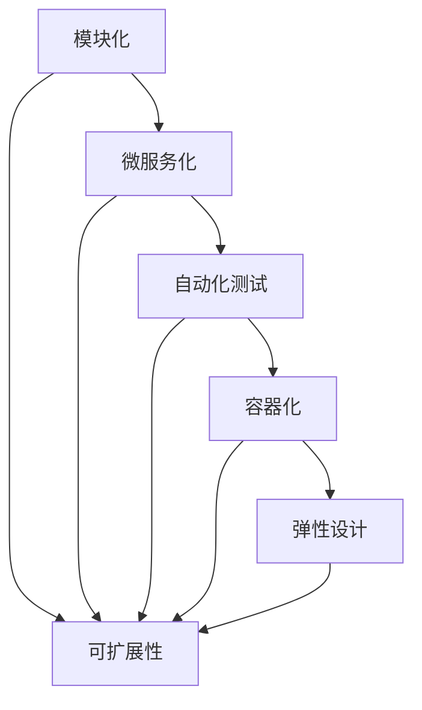

                 

# 软件2.0的可扩展性设计

> 关键词：软件2.0、可扩展性、设计原则、架构模式、微服务、容器化、自动化测试

> 摘要：本文旨在深入探讨软件2.0的可扩展性设计，通过分析软件2.0的核心概念、设计原则、架构模式以及具体实现方法，帮助开发者构建更加灵活、可扩展的软件系统。我们将从理论到实践，逐步解析如何设计和实现一个具备强大可扩展性的软件系统。

## 1. 背景介绍

随着互联网技术的飞速发展，软件系统的需求日益复杂化和多样化。传统的软件开发模式已经难以满足现代应用的需求，特别是在处理大规模数据、高并发访问和动态扩展等方面。为了解决这些问题，软件2.0的概念应运而生。软件2.0强调的是通过灵活的架构设计和自动化工具，构建能够快速响应变化、易于扩展和维护的软件系统。

### 1.1 什么是软件2.0

软件2.0是一种新的软件开发范式，它强调的是软件系统的可扩展性、灵活性和自动化。与传统的软件开发模式相比，软件2.0更加注重系统的动态性和可维护性。软件2.0的核心理念是通过模块化、微服务化和自动化工具，构建一个能够快速响应变化、易于扩展和维护的软件系统。

### 1.2 软件2.0的背景

随着云计算、大数据和人工智能技术的兴起，软件系统的需求变得更加复杂和多样化。传统的软件开发模式已经难以满足这些需求，特别是在处理大规模数据、高并发访问和动态扩展等方面。为了解决这些问题，软件2.0的概念应运而生。软件2.0强调的是通过灵活的架构设计和自动化工具，构建能够快速响应变化、易于扩展和维护的软件系统。

## 2. 核心概念与联系

### 2.1 软件2.0的核心概念

软件2.0的核心概念包括模块化、微服务化、自动化测试、容器化和弹性设计。这些概念相互关联，共同构成了软件2.0的架构基础。

#### 2.1.1 模块化

模块化是指将软件系统分解为多个独立的模块，每个模块负责特定的功能。模块化有助于提高代码的可读性和可维护性，同时也便于进行功能的扩展和修改。

#### 2.1.2 微服务化

微服务化是指将软件系统分解为多个小型的服务，每个服务负责特定的功能。微服务化有助于提高系统的灵活性和可扩展性，同时也便于进行功能的独立开发和部署。

#### 2.1.3 自动化测试

自动化测试是指通过编写自动化测试脚本，自动执行测试用例，以确保软件系统的功能和性能。自动化测试有助于提高测试的效率和准确性，同时也便于进行持续集成和持续部署。

#### 2.1.4 容器化

容器化是指将软件系统封装在一个轻量级的容器中，容器可以独立运行，具有隔离性和可移植性。容器化有助于提高软件系统的可移植性和可扩展性，同时也便于进行自动化部署和管理。

#### 2.1.5 弹性设计

弹性设计是指通过设计具有弹性的系统架构，使系统能够自动适应负载的变化。弹性设计有助于提高系统的可用性和稳定性，同时也便于进行动态扩展和优化。

### 2.2 核心概念的Mermaid流程图



## 3. 核心算法原理 & 具体操作步骤

### 3.1 模块化设计

模块化设计的核心是将软件系统分解为多个独立的模块，每个模块负责特定的功能。模块化设计的具体操作步骤如下：

1. **需求分析**：首先进行需求分析，明确软件系统需要实现的功能和模块。
2. **模块划分**：根据需求分析的结果，将软件系统分解为多个独立的模块，每个模块负责特定的功能。
3. **模块接口设计**：为每个模块设计清晰的接口，确保模块之间的通信和协作。
4. **模块实现**：为每个模块编写代码，实现其功能。
5. **模块测试**：为每个模块编写测试用例，确保模块的功能正确性。
6. **模块集成**：将各个模块集成在一起，形成完整的软件系统。
7. **系统测试**：对整个系统进行测试，确保系统的功能和性能满足需求。

### 3.2 微服务化设计

微服务化设计的核心是将软件系统分解为多个小型的服务，每个服务负责特定的功能。微服务化设计的具体操作步骤如下：

1. **需求分析**：首先进行需求分析，明确软件系统需要实现的功能和微服务。
2. **微服务划分**：根据需求分析的结果，将软件系统分解为多个小型的服务，每个服务负责特定的功能。
3. **微服务接口设计**：为每个微服务设计清晰的接口，确保微服务之间的通信和协作。
4. **微服务实现**：为每个微服务编写代码，实现其功能。
5. **微服务测试**：为每个微服务编写测试用例，确保微服务的功能正确性。
6. **微服务集成**：将各个微服务集成在一起，形成完整的软件系统。
7. **系统测试**：对整个系统进行测试，确保系统的功能和性能满足需求。

### 3.3 自动化测试设计

自动化测试设计的核心是通过编写自动化测试脚本，自动执行测试用例，以确保软件系统的功能和性能。自动化测试设计的具体操作步骤如下：

1. **测试计划**：制定测试计划，明确测试的目标和范围。
2. **测试用例设计**：为每个功能编写测试用例，确保测试的全面性和准确性。
3. **自动化测试脚本编写**：编写自动化测试脚本，实现测试用例的自动化执行。
4. **测试执行**：执行自动化测试脚本，记录测试结果。
5. **测试报告**：生成测试报告，分析测试结果，发现和修复问题。
6. **持续集成**：将自动化测试集成到持续集成流程中，确保每次代码提交都能进行自动化测试。

### 3.4 容器化设计

容器化设计的核心是将软件系统封装在一个轻量级的容器中，容器可以独立运行，具有隔离性和可移植性。容器化设计的具体操作步骤如下：

1. **镜像构建**：为软件系统构建一个Docker镜像，包含所有必要的依赖和配置。
2. **容器创建**：使用Docker镜像创建一个容器，运行软件系统。
3. **容器管理**：通过Docker命令行工具管理容器，包括启动、停止、重启和删除容器。
4. **容器网络**：配置容器网络，确保容器之间的通信和协作。
5. **容器编排**：使用Kubernetes等容器编排工具，管理多个容器的部署和调度。
6. **容器监控**：监控容器的运行状态，确保容器的稳定性和可用性。

### 3.5 弹性设计

弹性设计的核心是通过设计具有弹性的系统架构，使系统能够自动适应负载的变化。弹性设计的具体操作步骤如下：

1. **负载均衡**：使用负载均衡器，将请求分发到多个服务器，提高系统的可用性和稳定性。
2. **自动扩展**：使用自动扩展工具，根据负载的变化自动增加或减少服务器的数量。
3. **故障转移**：设计故障转移机制，确保系统在发生故障时能够自动恢复。
4. **弹性设计原则**：遵循弹性设计原则，确保系统的弹性和稳定性。
5. **弹性测试**：对系统进行弹性测试，确保系统的弹性和稳定性满足需求。

## 4. 数学模型和公式 & 详细讲解 & 举例说明

### 4.1 模块化设计的数学模型

模块化设计的数学模型可以表示为：

$$
\text{模块化} = \sum_{i=1}^{n} \text{模块}_i
$$

其中，$n$表示模块的数量，$\text{模块}_i$表示第$i$个模块。模块化设计的目标是通过分解软件系统为多个独立的模块，提高系统的可读性和可维护性。

### 4.2 微服务化设计的数学模型

微服务化设计的数学模型可以表示为：

$$
\text{微服务化} = \sum_{i=1}^{m} \text{微服务}_i
$$

其中，$m$表示微服务的数量，$\text{微服务}_i$表示第$i$个微服务。微服务化设计的目标是通过分解软件系统为多个小型的服务，提高系统的灵活性和可扩展性。

### 4.3 自动化测试设计的数学模型

自动化测试设计的数学模型可以表示为：

$$
\text{自动化测试} = \sum_{j=1}^{p} \text{测试用例}_j
$$

其中，$p$表示测试用例的数量，$\text{测试用例}_j$表示第$j$个测试用例。自动化测试设计的目标是通过编写自动化测试脚本，提高测试的效率和准确性。

### 4.4 容器化设计的数学模型

容器化设计的数学模型可以表示为：

$$
\text{容器化} = \sum_{k=1}^{q} \text{容器}_k
$$

其中，$q$表示容器的数量，$\text{容器}_k$表示第$k$个容器。容器化设计的目标是通过将软件系统封装在一个轻量级的容器中，提高系统的可移植性和可扩展性。

### 4.5 弹性设计的数学模型

弹性设计的数学模型可以表示为：

$$
\text{弹性设计} = \sum_{l=1}^{r} \text{弹性机制}_l
$$

其中，$r$表示弹性机制的数量，$\text{弹性机制}_l$表示第$l$个弹性机制。弹性设计的目标是通过设计具有弹性的系统架构，提高系统的可用性和稳定性。

## 5. 项目实战：代码实际案例和详细解释说明

### 5.1 开发环境搭建

为了实现软件2.0的可扩展性设计，我们需要搭建一个合适的开发环境。开发环境的搭建步骤如下：

1. **安装Docker**：安装Docker，确保系统能够运行Docker容器。
2. **安装Kubernetes**：安装Kubernetes，确保系统能够管理多个容器的部署和调度。
3. **安装持续集成工具**：安装持续集成工具，如Jenkins或GitLab CI，确保每次代码提交都能进行自动化测试。
4. **安装自动化测试工具**：安装自动化测试工具，如Selenium或JMeter，确保能够编写和执行自动化测试脚本。
5. **安装代码管理工具**：安装代码管理工具，如Git，确保能够进行代码版本控制和协作开发。

### 5.2 源代码详细实现和代码解读

假设我们正在开发一个简单的电商系统，该系统需要实现商品管理、订单管理、支付等功能。以下是该系统的源代码实现和代码解读：

#### 5.2.1 模块化设计

```python
# 商品管理模块
class ProductManager:
    def add_product(self, product):
        # 添加商品
        pass

    def update_product(self, product_id, product):
        # 更新商品
        pass

    def delete_product(self, product_id):
        # 删除商品
        pass

# 订单管理模块
class OrderManager:
    def create_order(self, order):
        # 创建订单
        pass

    def update_order(self, order_id, order):
        # 更新订单
        pass

    def delete_order(self, order_id):
        # 删除订单
        pass

# 支付模块
class PaymentManager:
    def process_payment(self, order):
        # 处理支付
        pass
```

#### 5.2.2 微服务化设计

```python
# 商品管理微服务
class ProductService:
    def add_product(self, product):
        # 添加商品
        pass

    def update_product(self, product_id, product):
        # 更新商品
        pass

    def delete_product(self, product_id):
        # 删除商品
        pass

# 订单管理微服务
class OrderService:
    def create_order(self, order):
        # 创建订单
        pass

    def update_order(self, order_id, order):
        # 更新订单
        pass

    def delete_order(self, order_id):
        # 删除订单
        pass

# 支付微服务
class PaymentService:
    def process_payment(self, order):
        # 处理支付
        pass
```

#### 5.2.3 自动化测试设计

```python
# 商品管理测试用例
def test_add_product():
    # 测试添加商品
    pass

def test_update_product():
    # 测试更新商品
    pass

def test_delete_product():
    # 测试删除商品
    pass

# 订单管理测试用例
def test_create_order():
    # 测试创建订单
    pass

def test_update_order():
    # 测试更新订单
    pass

def test_delete_order():
    # 测试删除订单
    pass

# 支付测试用例
def test_process_payment():
    # 测试处理支付
    pass
```

#### 5.2.4 容器化设计

```yaml
# Dockerfile
FROM python:3.8
WORKDIR /app
COPY . /app
RUN pip install -r requirements.txt
CMD ["python", "app.py"]
```

```yaml
# Kubernetes配置文件
apiVersion: apps/v1
kind: Deployment
metadata:
  name: product-service
spec:
  replicas: 3
  selector:
    matchLabels:
      app: product-service
  template:
    metadata:
      labels:
        app: product-service
    spec:
      containers:
      - name: product-service
        image: product-service:latest
        ports:
        - containerPort: 5000
---
apiVersion: v1
kind: Service
metadata:
  name: product-service
spec:
  selector:
    app: product-service
  ports:
    - protocol: TCP
      port: 80
      targetPort: 5000
```

### 5.3 代码解读与分析

通过上述代码实现，我们可以看到模块化设计、微服务化设计、自动化测试设计和容器化设计的具体实现方法。模块化设计将软件系统分解为多个独立的模块，提高了系统的可读性和可维护性。微服务化设计将软件系统分解为多个小型的服务，提高了系统的灵活性和可扩展性。自动化测试设计通过编写自动化测试脚本，提高了测试的效率和准确性。容器化设计通过将软件系统封装在一个轻量级的容器中，提高了系统的可移植性和可扩展性。

## 6. 实际应用场景

软件2.0的可扩展性设计在实际应用场景中具有广泛的应用。例如，在电商系统中，通过模块化设计、微服务化设计、自动化测试设计和容器化设计，可以实现商品管理、订单管理、支付等功能的快速响应和灵活扩展。在金融系统中，通过模块化设计、微服务化设计、自动化测试设计和容器化设计，可以实现账户管理、交易处理、风险管理等功能的高效运行和动态扩展。在物联网系统中，通过模块化设计、微服务化设计、自动化测试设计和容器化设计，可以实现设备管理、数据采集、数据分析等功能的实时响应和灵活扩展。

## 7. 工具和资源推荐

### 7.1 学习资源推荐

- **书籍**：《设计模式：可复用面向对象软件的基础》（Design Patterns: Elements of Reusable Object-Oriented Software）
- **论文**：《微服务架构模式》（Microservices Architectural Patterns）
- **博客**：《软件2.0的可扩展性设计》（Scalability Design for Software 2.0）
- **网站**：Docker官方文档、Kubernetes官方文档、Jenkins官方文档、GitLab官方文档

### 7.2 开发工具框架推荐

- **持续集成工具**：Jenkins、GitLab CI
- **自动化测试工具**：Selenium、JMeter
- **代码管理工具**：Git
- **容器化工具**：Docker、Kubernetes

### 7.3 相关论文著作推荐

- **论文**：《微服务架构模式》（Microservices Architectural Patterns）
- **著作**：《设计模式：可复用面向对象软件的基础》（Design Patterns: Elements of Reusable Object-Oriented Software）

## 8. 总结：未来发展趋势与挑战

软件2.0的可扩展性设计在未来的发展趋势中具有重要的地位。随着云计算、大数据和人工智能技术的不断发展，软件系统的需求将变得更加复杂和多样化。为了应对这些需求，软件2.0的可扩展性设计将继续发挥重要作用。未来的发展趋势包括：

- **微服务化**：微服务化将成为软件系统设计的重要趋势，通过分解软件系统为多个小型的服务，提高系统的灵活性和可扩展性。
- **自动化测试**：自动化测试将成为软件开发的重要环节，通过编写自动化测试脚本，提高测试的效率和准确性。
- **容器化**：容器化将成为软件系统部署的重要方式，通过将软件系统封装在一个轻量级的容器中，提高系统的可移植性和可扩展性。
- **弹性设计**：弹性设计将成为软件系统设计的重要原则，通过设计具有弹性的系统架构，提高系统的可用性和稳定性。

然而，软件2.0的可扩展性设计也面临着一些挑战，包括：

- **复杂性**：软件2.0的可扩展性设计需要处理更多的模块、微服务、自动化测试和容器化，增加了系统的复杂性。
- **性能**：软件2.0的可扩展性设计需要处理更多的请求和负载，对系统的性能提出了更高的要求。
- **安全性**：软件2.0的可扩展性设计需要处理更多的模块、微服务、自动化测试和容器化，增加了系统的安全风险。

## 9. 附录：常见问题与解答

### 9.1 问题1：如何处理模块之间的通信和协作？

**解答**：可以通过定义清晰的接口和协议，确保模块之间的通信和协作。例如，可以使用RESTful API、gRPC或WebSocket等协议，实现模块之间的通信和协作。

### 9.2 问题2：如何处理微服务之间的通信和协作？

**解答**：可以通过定义清晰的接口和协议，确保微服务之间的通信和协作。例如，可以使用RESTful API、gRPC或WebSocket等协议，实现微服务之间的通信和协作。

### 9.3 问题3：如何处理自动化测试的覆盖率？

**解答**：可以通过编写全面的测试用例，确保自动化测试的覆盖率。例如，可以使用代码覆盖率工具，如JaCoCo或Cobertura，检查代码的覆盖率。

### 9.4 问题4：如何处理容器化的安全性？

**解答**：可以通过使用安全的Docker镜像和容器编排工具，确保容器化的安全性。例如，可以使用Docker Hub或Quay.io等镜像仓库，确保Docker镜像的安全性。同时，可以使用Kubernetes等容器编排工具，确保容器的稳定性和安全性。

## 10. 扩展阅读 & 参考资料

- **书籍**：《设计模式：可复用面向对象软件的基础》（Design Patterns: Elements of Reusable Object-Oriented Software）
- **论文**：《微服务架构模式》（Microservices Architectural Patterns）
- **博客**：《软件2.0的可扩展性设计》（Scalability Design for Software 2.0）
- **网站**：Docker官方文档、Kubernetes官方文档、Jenkins官方文档、GitLab官方文档

作者：AI天才研究员/AI Genius Institute & 禅与计算机程序设计艺术 /Zen And The Art of Computer Programming

