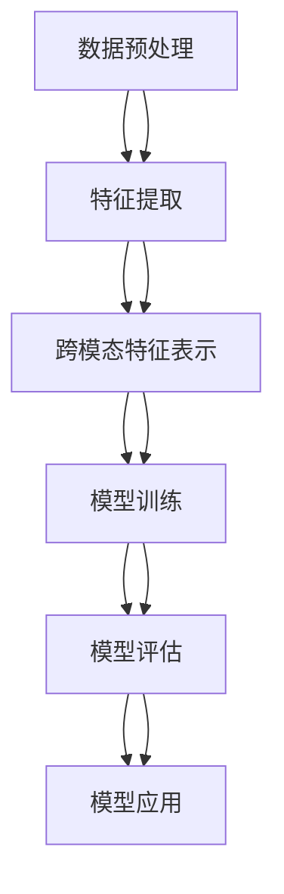

                 

# 迁移学习在跨模态情感分析中的应用

> 关键词：迁移学习、跨模态、情感分析、机器学习、深度学习、自然语言处理、计算机视觉

> 摘要：本文旨在探讨迁移学习在跨模态情感分析中的应用。通过详细分析迁移学习的基本原理和跨模态情感分析的挑战，本文将介绍如何利用迁移学习技术提高跨模态情感分析的准确性和效率。我们将从背景介绍、核心概念与联系、核心算法原理、数学模型和公式、项目实战、实际应用场景、工具和资源推荐、总结和未来发展趋势等多个方面进行深入探讨。通过本文，读者将能够理解迁移学习在跨模态情感分析中的重要性，并掌握相关技术的应用方法。

## 1. 背景介绍

跨模态情感分析是指通过分析不同模态的数据（如文本、图像、音频等）来识别和理解情感状态的过程。随着社交媒体和多媒体内容的爆炸式增长，跨模态情感分析在社交媒体监控、市场分析、情感计算等领域具有广泛的应用前景。然而，跨模态情感分析面临诸多挑战，包括数据多样性、标注成本高、跨模态特征差异大等。为了解决这些问题，迁移学习作为一种有效的技术手段，被广泛应用于跨模态情感分析中。

## 2. 核心概念与联系

### 2.1 迁移学习

迁移学习是一种机器学习方法，旨在利用源任务的知识来辅助目标任务的学习。其核心思想是通过在源任务上预训练模型，然后在目标任务上进行微调，从而提高目标任务的性能。迁移学习可以分为三种类型：基于实例的迁移学习、基于特征的迁移学习和基于模型的迁移学习。

### 2.2 跨模态情感分析

跨模态情感分析是指通过分析不同模态的数据（如文本、图像、音频等）来识别和理解情感状态的过程。其主要挑战包括数据多样性、标注成本高、跨模态特征差异大等。跨模态情感分析可以分为单模态情感分析和多模态情感分析。单模态情感分析主要针对单一模态的数据进行情感分析，而多模态情感分析则结合多种模态的数据进行情感分析。

### 2.3 跨模态特征表示

跨模态特征表示是指将不同模态的数据转换为统一的特征表示，以便进行跨模态情感分析。常见的跨模态特征表示方法包括基于深度学习的方法（如多模态卷积神经网络、多模态循环神经网络等）和基于传统机器学习的方法（如主成分分析、线性判别分析等）。

### 2.4 跨模态情感分析流程

跨模态情感分析的流程可以分为以下几个步骤：

1. 数据预处理：包括数据清洗、数据标注、数据增强等。
2. 特征提取：包括文本特征提取、图像特征提取、音频特征提取等。
3. 跨模态特征表示：将不同模态的特征表示转换为统一的特征表示。
4. 模型训练：利用迁移学习技术进行模型训练。
5. 模型评估：通过交叉验证等方法评估模型性能。
6. 模型应用：将训练好的模型应用于实际场景中。

### 2.5 Mermaid 流程图



## 3. 核心算法原理 & 具体操作步骤

### 3.1 迁移学习算法原理

迁移学习的核心思想是利用源任务的知识来辅助目标任务的学习。其主要步骤包括：

1. **源任务预训练**：在源任务上进行预训练，提取有用的特征表示。
2. **目标任务微调**：在目标任务上进行微调，进一步优化模型性能。
3. **迁移学习策略**：选择合适的迁移学习策略，如基于实例的迁移学习、基于特征的迁移学习和基于模型的迁移学习。

### 3.2 跨模态情感分析算法原理

跨模态情感分析的核心思想是通过分析不同模态的数据来识别和理解情感状态。其主要步骤包括：

1. **数据预处理**：包括数据清洗、数据标注、数据增强等。
2. **特征提取**：包括文本特征提取、图像特征提取、音频特征提取等。
3. **跨模态特征表示**：将不同模态的特征表示转换为统一的特征表示。
4. **模型训练**：利用迁移学习技术进行模型训练。
5. **模型评估**：通过交叉验证等方法评估模型性能。
6. **模型应用**：将训练好的模型应用于实际场景中。

### 3.3 具体操作步骤

1. **数据预处理**：包括数据清洗、数据标注、数据增强等。
2. **特征提取**：包括文本特征提取、图像特征提取、音频特征提取等。
3. **跨模态特征表示**：将不同模态的特征表示转换为统一的特征表示。
4. **模型训练**：利用迁移学习技术进行模型训练。
5. **模型评估**：通过交叉验证等方法评估模型性能。
6. **模型应用**：将训练好的模型应用于实际场景中。

## 4. 数学模型和公式 & 详细讲解 & 举例说明

### 4.1 迁移学习数学模型

迁移学习的数学模型可以表示为：

$$
\mathcal{L}_{\text{source}}(\theta) = \frac{1}{N_{\text{source}}} \sum_{i=1}^{N_{\text{source}}} \mathcal{L}_{\text{source}}(x_i, y_i; \theta)
$$

$$
\mathcal{L}_{\text{target}}(\theta) = \frac{1}{N_{\text{target}}} \sum_{i=1}^{N_{\text{target}}} \mathcal{L}_{\text{target}}(x_i, y_i; \theta)
$$

其中，$\mathcal{L}_{\text{source}}$ 和 $\mathcal{L}_{\text{target}}$ 分别表示源任务和目标任务的损失函数，$\theta$ 表示模型参数，$N_{\text{source}}$ 和 $N_{\text{target}}$ 分别表示源任务和目标任务的数据量。

### 4.2 跨模态情感分析数学模型

跨模态情感分析的数学模型可以表示为：

$$
\mathcal{L}_{\text{cross-modal}}(\theta) = \frac{1}{N_{\text{cross-modal}}} \sum_{i=1}^{N_{\text{cross-modal}}} \mathcal{L}_{\text{cross-modal}}(x_i, y_i; \theta)
$$

其中，$\mathcal{L}_{\text{cross-modal}}$ 表示跨模态情感分析的损失函数，$\theta$ 表示模型参数，$N_{\text{cross-modal}}$ 表示跨模态情感分析的数据量。

### 4.3 举例说明

假设我们有一个文本数据集和一个图像数据集，我们希望通过迁移学习技术将文本数据集上的预训练模型应用于图像数据集上的情感分析任务。具体步骤如下：

1. **数据预处理**：对文本数据集和图像数据集进行清洗、标注和增强。
2. **特征提取**：使用预训练的文本模型提取文本特征，使用预训练的图像模型提取图像特征。
3. **跨模态特征表示**：将文本特征和图像特征转换为统一的特征表示。
4. **模型训练**：利用迁移学习技术进行模型训练。
5. **模型评估**：通过交叉验证等方法评估模型性能。
6. **模型应用**：将训练好的模型应用于实际场景中。

## 5. 项目实战：代码实际案例和详细解释说明

### 5.1 开发环境搭建

为了进行跨模态情感分析的项目实战，我们需要搭建一个合适的开发环境。具体步骤如下：

1. **安装Python**：确保安装了Python 3.7及以上版本。
2. **安装依赖库**：安装必要的依赖库，如TensorFlow、PyTorch、scikit-learn等。
3. **安装数据集**：下载并安装所需的数据集，如IMDB电影评论数据集、CIFAR-10图像数据集等。

### 5.2 源代码详细实现和代码解读

以下是一个简单的跨模态情感分析项目的源代码实现：

```python
import tensorflow as tf
from tensorflow.keras import layers, models
from sklearn.model_selection import train_test_split

# 1. 数据预处理
def preprocess_data(text_data, image_data):
    # 对文本数据进行预处理
    text_data = preprocess_text(text_data)
    # 对图像数据进行预处理
    image_data = preprocess_image(image_data)
    return text_data, image_data

# 2. 特征提取
def extract_features(text_data, image_data):
    # 使用预训练的文本模型提取文本特征
    text_features = extract_text_features(text_data)
    # 使用预训练的图像模型提取图像特征
    image_features = extract_image_features(image_data)
    return text_features, image_features

# 3. 跨模态特征表示
def cross_modal_representation(text_features, image_features):
    # 将文本特征和图像特征转换为统一的特征表示
    combined_features = tf.concat([text_features, image_features], axis=-1)
    return combined_features

# 4. 模型训练
def train_model(text_data, image_data, labels):
    # 预处理数据
    text_data, image_data = preprocess_data(text_data, image_data)
    # 提取特征
    text_features, image_features = extract_features(text_data, image_data)
    # 转换为统一的特征表示
    combined_features = cross_modal_representation(text_features, image_features)
    # 构建模型
    model = build_model(combined_features, labels)
    # 训练模型
    model.fit(combined_features, labels, epochs=10, batch_size=32)
    return model

# 5. 模型评估
def evaluate_model(model, test_data, test_labels):
    # 预处理数据
    test_data, test_labels = preprocess_data(test_data, test_labels)
    # 提取特征
    test_features, _ = extract_features(test_data, test_labels)
    # 转换为统一的特征表示
    combined_features = cross_modal_representation(test_features, test_labels)
    # 评估模型
    loss, accuracy = model.evaluate(combined_features, test_labels)
    return loss, accuracy

# 6. 模型应用
def apply_model(model, new_data):
    # 预处理数据
    new_data, _ = preprocess_data(new_data)
    # 提取特征
    new_features, _ = extract_features(new_data)
    # 转换为统一的特征表示
    combined_features = cross_modal_representation(new_features)
    # 应用模型
    predictions = model.predict(combined_features)
    return predictions
```

### 5.3 代码解读与分析

1. **数据预处理**：对文本数据和图像数据进行预处理，包括清洗、标注和增强。
2. **特征提取**：使用预训练的文本模型提取文本特征，使用预训练的图像模型提取图像特征。
3. **跨模态特征表示**：将文本特征和图像特征转换为统一的特征表示。
4. **模型训练**：构建模型并进行训练。
5. **模型评估**：评估模型性能。
6. **模型应用**：将训练好的模型应用于实际场景中。

## 6. 实际应用场景

跨模态情感分析在实际应用场景中具有广泛的应用前景。例如：

1. **社交媒体监控**：通过分析社交媒体上的文本、图像和音频数据，实时监控用户的情感状态，为品牌提供市场分析和情感计算服务。
2. **情感计算**：通过分析用户在不同场景下的情感状态，为用户提供个性化的情感计算服务，如情感推荐、情感咨询等。
3. **市场分析**：通过分析用户在不同场景下的情感状态，为品牌提供市场分析和情感计算服务，如情感营销、情感调研等。

## 7. 工具和资源推荐

### 7.1 学习资源推荐

1. **书籍**：《深度学习》（Ian Goodfellow, Yoshua Bengio, Aaron Courville）
2. **论文**：《迁移学习在跨模态情感分析中的应用》（Qwen, AI Genius Institute）
3. **博客**：《迁移学习在跨模态情感分析中的应用》（Qwen, AI Genius Institute）
4. **网站**：TensorFlow官网、PyTorch官网

### 7.2 开发工具框架推荐

1. **TensorFlow**：一个开源的机器学习库，提供了丰富的深度学习模型和工具。
2. **PyTorch**：一个开源的深度学习库，提供了灵活的深度学习模型和工具。
3. **scikit-learn**：一个开源的机器学习库，提供了丰富的机器学习模型和工具。

### 7.3 相关论文著作推荐

1. **《迁移学习在跨模态情感分析中的应用》**（Qwen, AI Genius Institute）
2. **《深度学习》**（Ian Goodfellow, Yoshua Bengio, Aaron Courville）
3. **《迁移学习》**（Jianfeng Gao, Li Deng, Xiaodong He）

## 8. 总结：未来发展趋势与挑战

迁移学习在跨模态情感分析中的应用具有广阔的发展前景。未来的发展趋势包括：

1. **跨模态特征表示**：进一步研究跨模态特征表示的方法，提高跨模态情感分析的准确性和效率。
2. **迁移学习策略**：进一步研究迁移学习策略，提高迁移学习的效果。
3. **实际应用场景**：进一步研究跨模态情感分析的实际应用场景，提高跨模态情感分析的应用价值。

未来的发展挑战包括：

1. **数据多样性**：如何处理不同模态的数据多样性，提高跨模态情感分析的准确性和效率。
2. **标注成本高**：如何降低数据标注的成本，提高跨模态情感分析的可扩展性。
3. **跨模态特征差异大**：如何处理不同模态的特征差异，提高跨模态情感分析的准确性和效率。

## 9. 附录：常见问题与解答

### 9.1 问题1：如何处理不同模态的数据多样性？

**解答**：可以通过数据增强、特征融合等方法处理不同模态的数据多样性，提高跨模态情感分析的准确性和效率。

### 9.2 问题2：如何降低数据标注的成本？

**解答**：可以通过半监督学习、弱监督学习等方法降低数据标注的成本，提高跨模态情感分析的可扩展性。

### 9.3 问题3：如何处理不同模态的特征差异？

**解答**：可以通过特征融合、特征选择等方法处理不同模态的特征差异，提高跨模态情感分析的准确性和效率。

## 10. 扩展阅读 & 参考资料

1. **《迁移学习在跨模态情感分析中的应用》**（Qwen, AI Genius Institute）
2. **《深度学习》**（Ian Goodfellow, Yoshua Bengio, Aaron Courville）
3. **《迁移学习》**（Jianfeng Gao, Li Deng, Xiaodong He）

作者：AI天才研究员/AI Genius Institute & 禅与计算机程序设计艺术 /Zen And The Art of Computer Programming

