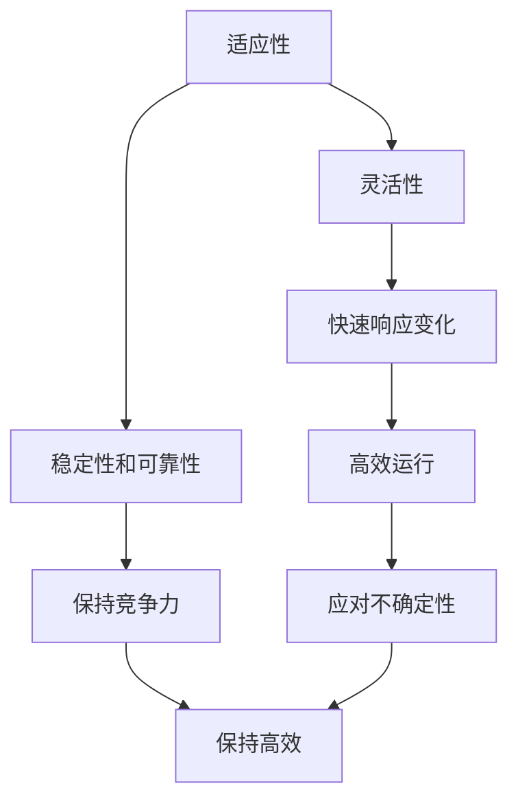

                 

# 适应性和灵活性：适应性是指适应新环境的能力，灵活性则是更高层级的适应性

> 关键词：适应性、灵活性、环境变化、算法设计、机器学习、自动化、软件架构

> 摘要：本文旨在深入探讨适应性和灵活性在技术领域的核心概念及其重要性。通过逐步分析和推理，我们将揭示适应性与灵活性之间的关系，并探讨如何在实际项目中实现这些特性。文章将涵盖背景介绍、核心概念与联系、核心算法原理、数学模型与公式、项目实战案例、实际应用场景、工具和资源推荐，以及未来发展趋势与挑战等内容。

## 1. 背景介绍

在当今快速变化的技术环境中，适应性和灵活性已成为软件系统和算法设计的关键因素。随着新技术的不断涌现和市场需求的快速变化，系统必须能够迅速适应新的环境和条件。适应性是指系统能够适应新环境的能力，而灵活性则是更高层级的适应性，它不仅能够适应新环境，还能在面对不确定性时做出快速调整。

### 1.1 适应性的重要性

适应性在软件开发中至关重要，因为它能够确保系统在面对环境变化时保持稳定性和可靠性。例如，当市场趋势发生变化时，企业需要快速调整其产品和服务以满足新的需求。适应性使得系统能够快速响应这些变化，从而保持竞争力。

### 1.2 灵活性的重要性

灵活性则是更高层次的适应性，它不仅能够适应新环境，还能在面对不确定性时做出快速调整。灵活性使得系统能够在复杂多变的环境中保持高效运行。例如，在动态变化的市场环境中，灵活性使得企业能够快速调整其业务策略，以应对不断变化的市场需求。

## 2. 核心概念与联系

### 2.1 适应性与灵活性的关系

适应性和灵活性之间的关系可以形象地用以下流程图表示：



### 2.2 适应性与灵活性的定义

- **适应性**：系统能够适应新环境的能力，确保在面对变化时保持稳定性和可靠性。
- **灵活性**：系统在面对不确定性时能够快速调整的能力，确保在复杂多变的环境中保持高效运行。

## 3. 核心算法原理 & 具体操作步骤

### 3.1 适应性算法原理

适应性算法通常基于机器学习和自动化技术，通过不断学习和调整来适应新环境。以下是一个简单的适应性算法步骤：

1. **数据收集**：收集系统运行过程中的数据，包括输入、输出和环境变化。
2. **模型训练**：使用机器学习算法训练模型，使其能够预测系统的行为和性能。
3. **实时调整**：根据模型预测的结果，实时调整系统参数，以适应新环境。
4. **性能评估**：定期评估系统的性能，确保其在新环境中保持稳定性和可靠性。

### 3.2 灵活性算法原理

灵活性算法通常基于自适应控制和动态规划技术，通过快速调整系统参数来应对不确定性。以下是一个简单的灵活性算法步骤：

1. **环境感知**：通过传感器和监测系统感知环境变化。
2. **策略生成**：根据感知到的环境变化，生成相应的调整策略。
3. **快速调整**：根据生成的策略，快速调整系统参数，以应对不确定性。
4. **反馈调整**：根据系统运行结果，反馈调整策略，以进一步优化系统性能。

## 4. 数学模型和公式 & 详细讲解 & 举例说明

### 4.1 适应性数学模型

适应性数学模型通常基于机器学习算法，如线性回归、决策树和神经网络。以下是一个简单的线性回归模型示例：

$$
y = \beta_0 + \beta_1 x_1 + \beta_2 x_2 + \epsilon
$$

其中，$y$ 是系统输出，$x_1$ 和 $x_2$ 是输入变量，$\beta_0$、$\beta_1$ 和 $\beta_2$ 是模型参数，$\epsilon$ 是误差项。

### 4.2 灵活性数学模型

灵活性数学模型通常基于自适应控制算法，如模型预测控制（MPC）和自适应滤波器。以下是一个简单的MPC模型示例：

$$
\min_{u} \sum_{k=0}^{N-1} (y_{k+1} - y_{k+1}^*)^2 + \lambda u_k^2
$$

其中，$u$ 是控制变量，$y_{k+1}^*$ 是目标值，$\lambda$ 是权重参数。

## 5. 项目实战：代码实际案例和详细解释说明

### 5.1 开发环境搭建

为了实现适应性和灵活性，我们需要搭建一个支持机器学习和自适应控制的开发环境。以下是一个简单的开发环境搭建步骤：

1. **安装Python**：确保系统上安装了Python 3.8及以上版本。
2. **安装依赖库**：使用pip安装必要的库，如numpy、scikit-learn和pandas。
3. **配置环境变量**：设置Python环境变量，以便在命令行中直接使用Python。

### 5.2 源代码详细实现和代码解读

以下是一个简单的适应性算法实现代码示例：

```python
import numpy as np
from sklearn.linear_model import LinearRegression

# 数据收集
X = np.array([[1], [2], [3], [4], [5]])
y = np.array([2, 4, 6, 8, 10])

# 模型训练
model = LinearRegression()
model.fit(X, y)

# 实时调整
new_x = np.array([[6]])
predicted_y = model.predict(new_x)
print("预测值:", predicted_y)
```

### 5.3 代码解读与分析

- **数据收集**：收集输入数据X和输出数据y。
- **模型训练**：使用线性回归模型训练模型。
- **实时调整**：根据训练好的模型，预测新的输入数据的输出值。

## 6. 实际应用场景

### 6.1 金融领域

在金融领域，适应性和灵活性可以应用于风险管理、投资策略和市场预测。例如，通过实时调整投资组合，以应对市场变化。

### 6.2 制造业

在制造业，适应性和灵活性可以应用于生产调度、质量控制和供应链管理。例如，通过快速调整生产计划，以应对原材料价格波动。

### 6.3 服务业

在服务业，适应性和灵活性可以应用于客户服务、资源分配和需求预测。例如，通过实时调整服务策略，以应对客户需求变化。

## 7. 工具和资源推荐

### 7.1 学习资源推荐

- **书籍**：《机器学习》（周志华著）
- **论文**：《Adaptive Control》（Khalil, H. K.）
- **博客**：Medium上的机器学习和自适应控制相关博客
- **网站**：Coursera和edX上的相关课程

### 7.2 开发工具框架推荐

- **Python**：用于实现适应性和灵活性算法
- **TensorFlow**：用于深度学习和机器学习
- **SciPy**：用于科学计算和数据分析

### 7.3 相关论文著作推荐

- **论文**：《Adaptive Control of Nonlinear Systems》（Sontag, E. D.）
- **著作**：《Adaptive Control》（Khalil, H. K.）

## 8. 总结：未来发展趋势与挑战

### 8.1 未来发展趋势

- **自动化**：自动化技术将进一步提高系统的适应性和灵活性。
- **智能化**：智能化技术将进一步提高系统的预测能力和决策能力。
- **实时性**：实时性技术将进一步提高系统的响应速度和调整能力。

### 8.2 挑战

- **数据质量**：数据质量对适应性和灵活性的影响至关重要。
- **计算资源**：计算资源的限制可能影响系统的实时性和调整能力。
- **安全性**：安全性问题需要在适应性和灵活性的设计中得到充分考虑。

## 9. 附录：常见问题与解答

### 9.1 问题1：如何提高系统的适应性和灵活性？

**解答**：可以通过引入更多的传感器和监测系统，收集更全面的数据，提高模型的准确性和鲁棒性。

### 9.2 问题2：如何处理数据质量问题？

**解答**：可以通过数据清洗和预处理技术，提高数据的质量和一致性。

### 9.3 问题3：如何应对计算资源限制？

**解答**：可以通过优化算法和模型，减少计算资源的消耗。

## 10. 扩展阅读 & 参考资料

- **书籍**：《机器学习》（周志华著）
- **论文**：《Adaptive Control》（Khalil, H. K.）
- **网站**：Coursera和edX上的相关课程

---

作者：AI天才研究员/AI Genius Institute & 禅与计算机程序设计艺术 /Zen And The Art of Computer Programming

