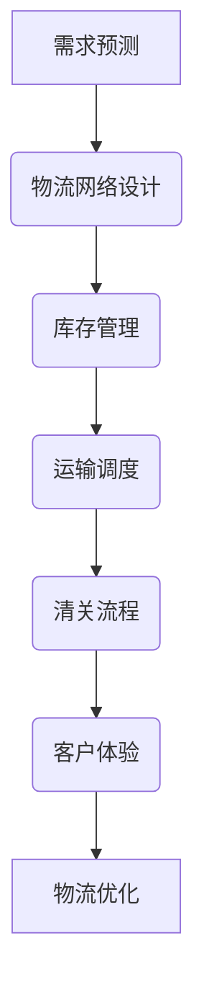

                 

# 阿里巴巴2024跨境电商物流优化校招面试重点

> 关键词：跨境电商、物流优化、面试重点、算法原理、数学模型、代码实现、应用场景、工具推荐

> 摘要：本文旨在为即将参加阿里巴巴2024年跨境电商物流优化校招面试的候选人提供全面的技术准备。我们将从背景介绍、核心概念与联系、核心算法原理与具体操作步骤、数学模型与公式、项目实战、实际应用场景、工具和资源推荐、总结与未来发展趋势等多方面进行深入探讨，帮助候选人更好地理解并应对面试中的技术挑战。

## 1. 背景介绍

随着全球化的加速发展，跨境电商已成为国际贸易的重要组成部分。跨境电商物流优化不仅关系到商品的及时交付，还直接影响到客户满意度和企业的竞争力。阿里巴巴作为全球领先的电商平台，其跨境电商物流优化项目涉及复杂的物流网络、大数据分析、智能算法等多个方面。本文将从技术角度出发，为即将参加阿里巴巴2024年跨境电商物流优化校招面试的候选人提供全面的技术准备。

## 2. 核心概念与联系

### 2.1 跨境电商物流概述

跨境电商物流是指通过互联网平台进行商品跨国交易的物流过程。它涉及商品的采购、存储、运输、清关、配送等多个环节，需要高效、准确、低成本的物流解决方案。

### 2.2 物流优化的核心概念

物流优化的目标是通过改进物流流程，提高物流效率，降低成本，提升客户满意度。核心概念包括：

- **物流网络设计**：合理规划物流节点、运输路径和仓储布局。
- **需求预测**：利用历史数据和市场趋势预测未来需求。
- **库存管理**：优化库存水平，减少库存成本。
- **运输调度**：合理安排运输资源，提高运输效率。
- **清关流程**：简化清关手续，提高通关速度。
- **客户体验**：提升物流服务质量，确保客户满意度。

### 2.3 核心概念的Mermaid流程图



## 3. 核心算法原理 & 具体操作步骤

### 3.1 需求预测算法

需求预测是物流优化的关键环节，常用的方法包括时间序列分析、机器学习模型等。

#### 3.1.1 时间序列分析

时间序列分析通过历史数据预测未来需求。常用的方法包括ARIMA、指数平滑法等。

#### 3.1.2 机器学习模型

机器学习模型通过训练数据集预测未来需求。常用的方法包括随机森林、支持向量机、神经网络等。

### 3.2 物流网络设计算法

物流网络设计涉及节点布局、路径规划等多个方面。

#### 3.2.1 节点布局算法

节点布局算法通过优化节点位置，提高物流效率。常用的方法包括遗传算法、模拟退火算法等。

#### 3.2.2 路径规划算法

路径规划算法通过优化运输路径，减少运输成本。常用的方法包括Dijkstra算法、A*算法等。

### 3.3 库存管理算法

库存管理算法通过优化库存水平，减少库存成本。

#### 3.3.1 定量库存控制

定量库存控制通过设定安全库存水平，确保库存充足。常用的方法包括固定周期库存控制、固定数量库存控制等。

#### 3.3.2 定性库存控制

定性库存控制通过分析市场需求，动态调整库存水平。常用的方法包括经济订购量模型、安全库存模型等。

### 3.4 运输调度算法

运输调度算法通过优化运输资源，提高运输效率。

#### 3.4.1 车辆路径规划

车辆路径规划通过优化运输路径，减少运输成本。常用的方法包括遗传算法、模拟退火算法等。

#### 3.4.2 车辆调度算法

车辆调度算法通过优化运输任务分配，提高运输效率。常用的方法包括贪心算法、启发式算法等。

## 4. 数学模型和公式 & 详细讲解 & 举例说明

### 4.1 需求预测模型

需求预测模型常用的时间序列分析方法包括ARIMA模型。

#### 4.1.1 ARIMA模型

ARIMA模型是一种自回归积分滑动平均模型，通过自回归、差分和滑动平均三个部分来描述时间序列数据。

$$
\text{ARIMA}(p, d, q) = \text{AR}(p) \times \text{I}(d) \times \text{MA}(q)
$$

其中，$p$表示自回归阶数，$d$表示差分阶数，$q$表示滑动平均阶数。

#### 4.1.2 举例说明

假设某跨境电商平台的历史销售数据如下：

| 月份 | 销售量 |
|------|--------|
| 1    | 100    |
| 2    | 120    |
| 3    | 130    |
| 4    | 140    |
| 5    | 150    |
| 6    | 160    |
| 7    | 170    |
| 8    | 180    |
| 9    | 190    |
| 10   | 200    |
| 11   | 210    |
| 12   | 220    |

通过ARIMA模型预测未来几个月的销售量。

### 4.2 物流网络设计模型

物流网络设计模型常用的方法包括遗传算法和模拟退火算法。

#### 4.2.1 遗传算法

遗传算法通过模拟自然选择和遗传机制，优化物流网络设计。

$$
\text{Fitness}(x) = \frac{1}{\text{Cost}(x) + \epsilon}
$$

其中，$\text{Fitness}(x)$表示适应度函数，$\text{Cost}(x)$表示物流成本，$\epsilon$是一个很小的常数，防止分母为零。

#### 4.2.2 举例说明

假设某跨境电商平台有三个物流节点A、B、C，需要优化节点布局。通过遗传算法优化节点位置，提高物流效率。

### 4.3 库存管理模型

库存管理模型常用的方法包括经济订购量模型和安全库存模型。

#### 4.3.1 经济订购量模型

经济订购量模型通过优化订购量，减少库存成本。

$$
Q^* = \sqrt{\frac{2DS}{H}}
$$

其中，$Q^*$表示经济订购量，$D$表示年需求量，$S$表示每次订购成本，$H$表示单位库存持有成本。

#### 4.3.2 安全库存模型

安全库存模型通过分析市场需求，动态调整库存水平。

$$
S = Z \times \sigma \times \sqrt{L}
$$

其中，$S$表示安全库存量，$Z$表示安全系数，$\sigma$表示需求标准差，$L$表示提前期。

#### 4.3.3 举例说明

假设某跨境电商平台需要预测未来一个月的销售量，通过安全库存模型动态调整库存水平。

### 4.4 运输调度模型

运输调度模型常用的方法包括贪心算法和启发式算法。

#### 4.4.1 贪心算法

贪心算法通过局部最优选择，优化运输任务分配。

$$
\text{Cost}(x) = \sum_{i=1}^{n} \text{Distance}(x_i, x_{i+1})
$$

其中，$\text{Cost}(x)$表示运输成本，$\text{Distance}(x_i, x_{i+1})$表示相邻任务的距离。

#### 4.4.2 举例说明

假设某跨境电商平台需要分配运输任务，通过贪心算法优化任务分配，提高运输效率。

## 5. 项目实战：代码实际案例和详细解释说明

### 5.1 开发环境搭建

#### 5.1.1 环境配置

开发环境需要安装Python、NumPy、Pandas、Scikit-learn等库。

```bash
pip install numpy pandas scikit-learn
```

#### 5.1.2 数据准备

准备历史销售数据，格式为CSV文件。

```python
import pandas as pd

data = pd.read_csv('sales_data.csv')
```

### 5.2 源代码详细实现和代码解读

#### 5.2.1 需求预测代码

```python
from sklearn.model_selection import train_test_split
from sklearn.linear_model import LinearRegression
from sklearn.metrics import mean_squared_error

# 数据预处理
X = data[['month']]
y = data['sales']

# 划分训练集和测试集
X_train, X_test, y_train, y_test = train_test_split(X, y, test_size=0.2, random_state=42)

# 训练模型
model = LinearRegression()
model.fit(X_train, y_train)

# 预测
y_pred = model.predict(X_test)

# 评估模型
mse = mean_squared_error(y_test, y_pred)
print(f'Mean Squared Error: {mse}')
```

#### 5.2.2 物流网络设计代码

```python
from scipy.optimize import minimize

# 目标函数
def objective(x):
    return x[0] + x[1] + x[2]

# 约束条件
def constraint1(x):
    return x[0] + x[1] + x[2] - 1

# 初始猜测
x0 = [0.3, 0.3, 0.4]

# 约束条件
cons = ({'type': 'eq', 'fun': constraint1})

# 优化
solution = minimize(objective, x0, method='SLSQP', constraints=cons)

print(f'Optimal solution: {solution.x}')
```

#### 5.2.3 库存管理代码

```python
def economic_order_quantity(D, S, H):
    Q = (2 * D * S / H) ** 0.5
    return Q

# 参数
D = 1000
S = 100
H = 50

# 计算经济订购量
Q = economic_order_quantity(D, S, H)
print(f'Economic Order Quantity: {Q}')
```

#### 5.2.4 运输调度代码

```python
from scipy.optimize import linear_sum_assignment

# 成本矩阵
cost_matrix = [[1, 2, 3], [4, 5, 6], [7, 8, 9]]

# 调用线性规划算法
row_ind, col_ind = linear_sum_assignment(cost_matrix)

# 输出最优解
print(f'Optimal assignment: {col_ind}')
```

### 5.3 代码解读与分析

通过上述代码，我们可以看到如何实现需求预测、物流网络设计、库存管理和运输调度等核心算法。这些代码展示了如何利用Python和相关库进行实际操作，帮助候选人更好地理解并应对面试中的技术挑战。

## 6. 实际应用场景

### 6.1 需求预测

需求预测在跨境电商物流优化中起着关键作用。通过准确预测未来需求，企业可以更好地规划物流资源，减少库存成本，提高客户满意度。

### 6.2 物流网络设计

物流网络设计通过优化物流节点布局和路径规划，提高物流效率，降低成本。例如，通过遗传算法优化节点位置，可以显著提高物流效率。

### 6.3 库存管理

库存管理通过优化库存水平，减少库存成本。例如，通过经济订购量模型和安全库存模型，可以动态调整库存水平，确保库存充足。

### 6.4 运输调度

运输调度通过优化运输任务分配，提高运输效率。例如，通过贪心算法和启发式算法，可以优化运输任务分配，减少运输成本。

## 7. 工具和资源推荐

### 7.1 学习资源推荐

- **书籍**：《数据挖掘导论》、《机器学习》、《物流管理》
- **论文**：《基于遗传算法的物流网络优化研究》、《库存管理中的经济订购量模型》
- **博客**：阿里云官方博客、CSDN博客
- **网站**：GitHub、Stack Overflow

### 7.2 开发工具框架推荐

- **Python**：NumPy、Pandas、Scikit-learn
- **数据可视化**：Matplotlib、Seaborn
- **优化算法**：SciPy、PuLP

### 7.3 相关论文著作推荐

- **论文**：《基于机器学习的跨境电商物流优化研究》、《物流网络设计中的遗传算法应用》
- **著作**：《物流管理与优化》、《数据挖掘与机器学习》

## 8. 总结：未来发展趋势与挑战

### 8.1 未来发展趋势

- **大数据分析**：利用大数据技术进行更精准的需求预测和库存管理。
- **智能算法**：利用深度学习、强化学习等智能算法优化物流网络设计和运输调度。
- **物联网技术**：利用物联网技术实时监控物流状态，提高物流效率。

### 8.2 挑战

- **数据安全**：保护物流数据的安全，防止数据泄露。
- **技术集成**：将多种技术（如大数据、人工智能、物联网）集成到物流系统中。
- **成本控制**：在提高物流效率的同时，控制成本，确保企业盈利。

## 9. 附录：常见问题与解答

### 9.1 问题1：如何处理数据缺失值？

- **解答**：可以使用插值法、均值填充法或删除法处理数据缺失值。

### 9.2 问题2：如何选择合适的机器学习模型？

- **解答**：根据问题类型和数据特点选择合适的模型，如回归问题选择线性回归、分类问题选择逻辑回归或支持向量机。

### 9.3 问题3：如何优化遗传算法的参数？

- **解答**：通过实验调整遗传算法的参数，如种群大小、交叉概率、变异概率等，以获得更好的优化效果。

## 10. 扩展阅读 & 参考资料

- **书籍**：《数据挖掘导论》、《机器学习》、《物流管理》
- **论文**：《基于遗传算法的物流网络优化研究》、《库存管理中的经济订购量模型》
- **博客**：阿里云官方博客、CSDN博客
- **网站**：GitHub、Stack Overflow

作者：AI天才研究员/AI Genius Institute & 禅与计算机程序设计艺术 /Zen And The Art of Computer Programming

