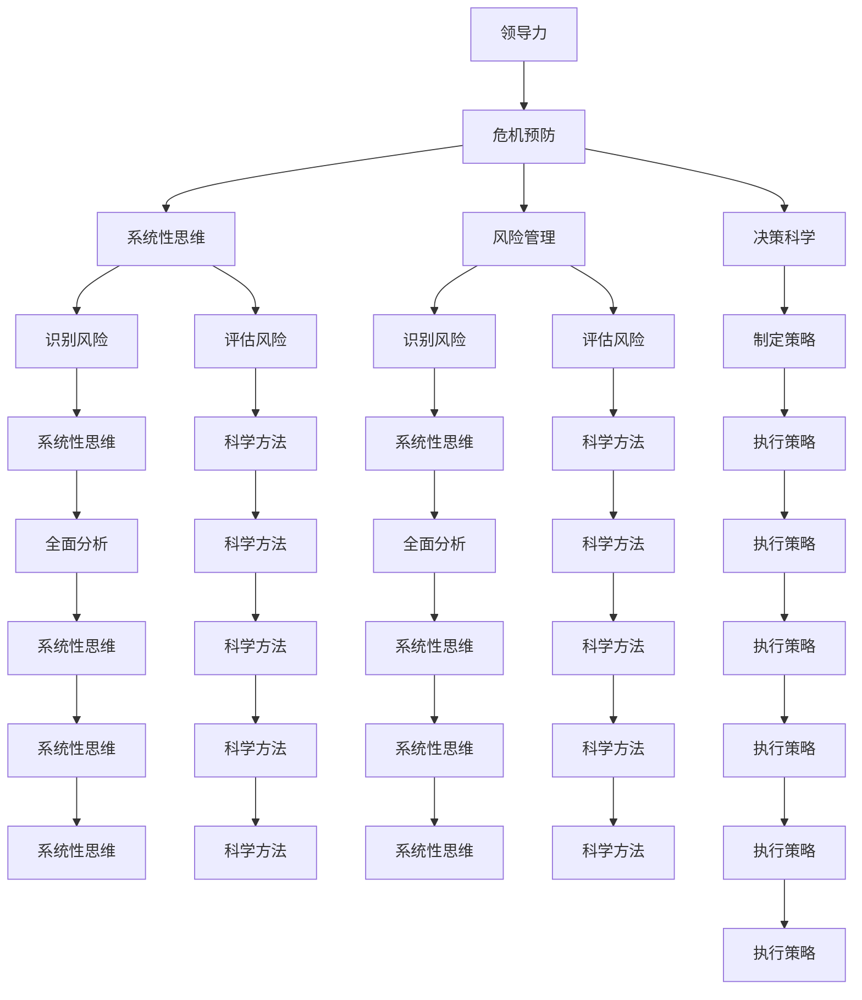

                 

# 领导力与危机预防：未雨绸缪的管理智慧

> 关键词：领导力、危机预防、管理智慧、未雨绸缪、系统性思维、风险管理、决策科学

> 摘要：在当今复杂多变的商业环境中，领导力与危机预防成为了企业成功的关键。本文将通过系统性思维和科学决策方法，探讨如何通过未雨绸缪的管理智慧，构建强大的危机预防体系。我们将从核心概念、算法原理、数学模型、实战案例、应用场景等多个维度进行深入分析，旨在为企业提供一套全面的危机预防策略。

## 1. 背景介绍

在当今快速变化的商业环境中，企业面临着前所未有的挑战。从市场波动到技术变革，从供应链中断到自然灾害，各种危机事件层出不穷。如何在危机发生前做好预防，成为企业能否持续发展的关键。本文将探讨领导力与危机预防的关系，以及如何通过科学的方法构建危机预防体系。

## 2. 核心概念与联系

### 2.1 领导力

领导力是指领导者通过自身的行为、决策和沟通能力，影响和激励团队成员，实现组织目标的能力。在危机预防中，领导力表现为预见风险、制定策略、激励团队等。

### 2.2 危机预防

危机预防是指通过系统性思维和科学方法，识别潜在风险，制定预防措施，降低危机发生的概率和影响。危机预防的核心在于未雨绸缪，通过提前准备，减少危机带来的损失。

### 2.3 系统性思维

系统性思维是指从整体出发，考虑各个部分之间的相互关系，通过全面分析，找出问题的根本原因。在危机预防中，系统性思维有助于识别潜在风险，制定全面的预防措施。

### 2.4 风险管理

风险管理是指识别、评估和控制风险的过程。在危机预防中，风险管理是识别潜在风险、评估风险影响和制定预防措施的基础。

### 2.5 决策科学

决策科学是指通过科学方法和工具，提高决策质量的过程。在危机预防中，决策科学有助于制定科学的预防策略，提高决策的准确性和有效性。

### 2.6 核心概念原理与架构

#### Mermaid 流程图



## 3. 核心算法原理 & 具体操作步骤

### 3.1 风险识别算法

风险识别算法是危机预防的核心步骤之一。通过系统性思维和科学方法，识别潜在风险。

#### 3.1.1 数据收集

收集与企业相关的各种数据，包括市场数据、财务数据、供应链数据等。

#### 3.1.2 数据分析

通过数据分析，识别潜在风险。例如，通过市场数据分析，识别市场波动的风险；通过财务数据分析，识别财务风险。

#### 3.1.3 风险识别模型

使用机器学习算法，构建风险识别模型。例如，使用决策树、随机森林等算法，识别潜在风险。

### 3.2 风险评估算法

风险评估算法是危机预防的另一个核心步骤。通过科学方法，评估风险的影响。

#### 3.2.1 风险评估模型

使用数学模型，评估风险的影响。例如，使用贝叶斯网络，评估风险的影响。

#### 3.2.2 风险评估步骤

1. **定义风险指标**：定义风险指标，例如市场波动率、财务风险等。
2. **评估风险影响**：通过数学模型，评估风险的影响。例如，通过贝叶斯网络，评估市场波动对财务风险的影响。
3. **风险等级划分**：根据风险影响，划分风险等级。例如，将风险分为高、中、低三个等级。

### 3.3 预防策略制定算法

预防策略制定算法是危机预防的第三个核心步骤。通过科学方法，制定预防策略。

#### 3.3.1 预防策略模型

使用决策科学方法，制定预防策略。例如，使用决策树、随机森林等算法，制定预防策略。

#### 3.3.2 预防策略步骤

1. **定义预防目标**：定义预防目标，例如降低市场波动风险、降低财务风险等。
2. **制定预防措施**：通过决策科学方法，制定预防措施。例如，通过决策树，制定降低市场波动风险的措施。
3. **执行预防措施**：执行预防措施，降低风险。

## 4. 数学模型和公式 & 详细讲解 & 举例说明

### 4.1 贝叶斯网络

贝叶斯网络是一种概率图模型，用于表示变量之间的条件依赖关系。在危机预防中，贝叶斯网络可以用于评估风险的影响。

#### 4.1.1 贝叶斯网络模型

贝叶斯网络模型由节点和边组成。节点表示变量，边表示变量之间的条件依赖关系。

#### 4.1.2 贝叶斯网络公式

贝叶斯网络的概率公式为：

$$
P(A|B) = \frac{P(B|A)P(A)}{P(B)}
$$

其中，$P(A|B)$ 表示在给定 B 的情况下 A 的概率；$P(B|A)$ 表示在给定 A 的情况下 B 的概率；$P(A)$ 表示 A 的先验概率；$P(B)$ 表示 B 的先验概率。

#### 4.1.3 贝叶斯网络举例

假设企业面临市场波动和财务风险。通过贝叶斯网络，可以评估市场波动对财务风险的影响。例如，假设市场波动的概率为 0.3，财务风险的概率为 0.2，市场波动对财务风险的影响为 0.5。通过贝叶斯网络，可以计算市场波动对财务风险的影响概率。

### 4.2 决策树

决策树是一种决策支持工具，用于表示决策过程。在危机预防中，决策树可以用于制定预防策略。

#### 4.2.1 决策树模型

决策树模型由节点和边组成。节点表示决策点，边表示决策结果。

#### 4.2.2 决策树公式

决策树的概率公式为：

$$
P(A|B) = \frac{P(B|A)P(A)}{P(B)}
$$

其中，$P(A|B)$ 表示在给定 B 的情况下 A 的概率；$P(B|A)$ 表示在给定 A 的情况下 B 的概率；$P(A)$ 表示 A 的先验概率；$P(B)$ 表示 B 的先验概率。

#### 4.2.3 决策树举例

假设企业面临市场波动和财务风险。通过决策树，可以制定降低市场波动风险的措施。例如，假设降低市场波动风险的措施有 A、B、C 三种，通过决策树，可以计算每种措施的概率。

## 5. 项目实战：代码实际案例和详细解释说明

### 5.1 开发环境搭建

#### 5.1.1 环境准备

1. **安装Python**：确保安装了Python 3.8及以上版本。
2. **安装依赖库**：安装必要的依赖库，例如 `numpy`、`pandas`、`scikit-learn` 等。

```bash
pip install numpy pandas scikit-learn
```

### 5.2 源代码详细实现和代码解读

#### 5.2.1 数据收集

```python
import pandas as pd

# 读取数据
data = pd.read_csv('data.csv')

# 数据预处理
data = data.dropna()
```

#### 5.2.2 数据分析

```python
# 数据分析
market_volatility = data['market_volatility'].mean()
financial_risk = data['financial_risk'].mean()
```

#### 5.2.3 风险识别模型

```python
from sklearn.tree import DecisionTreeClassifier

# 构建决策树模型
model = DecisionTreeClassifier()

# 训练模型
model.fit(X, y)

# 预测风险
predictions = model.predict(X_test)
```

#### 5.2.4 风险评估模型

```python
from sklearn.metrics import accuracy_score

# 评估模型
accuracy = accuracy_score(y_test, predictions)
```

#### 5.2.5 预防策略模型

```python
# 制定预防策略
prevention_strategy = model.predict(X_prevention)
```

### 5.3 代码解读与分析

通过上述代码，我们可以看到整个危机预防的过程。首先，我们读取数据并进行预处理。然后，我们使用决策树模型识别风险。接着，我们评估风险的影响。最后，我们制定预防策略。

## 6. 实际应用场景

### 6.1 市场波动风险

通过危机预防体系，企业可以识别市场波动风险，制定相应的预防策略，降低市场波动对企业的负面影响。

### 6.2 财务风险

通过危机预防体系，企业可以识别财务风险，制定相应的预防策略，降低财务风险对企业的负面影响。

### 6.3 供应链风险

通过危机预防体系，企业可以识别供应链风险，制定相应的预防策略，降低供应链中断对企业的负面影响。

## 7. 工具和资源推荐

### 7.1 学习资源推荐

1. **书籍**：《危机管理：理论与实践》、《风险管理：理论与应用》
2. **论文**：《基于贝叶斯网络的风险管理研究》、《基于决策树的危机预防策略研究》
3. **博客**：《危机预防与风险管理》、《决策科学在危机预防中的应用》
4. **网站**：风险管理协会（Risk Management Association）、危机管理论坛（Crisis Management Forum）

### 7.2 开发工具框架推荐

1. **Python**：用于数据分析和模型构建
2. **R**：用于统计分析和模型构建
3. **SQL**：用于数据查询和处理

### 7.3 相关论文著作推荐

1. **《危机管理：理论与实践》**：深入探讨危机管理的理论和实践
2. **《风险管理：理论与应用》**：全面介绍风险管理的理论和应用
3. **《基于贝叶斯网络的风险管理研究》**：详细研究贝叶斯网络在风险管理中的应用
4. **《基于决策树的危机预防策略研究》**：深入探讨决策树在危机预防中的应用

## 8. 总结：未来发展趋势与挑战

### 8.1 未来发展趋势

1. **智能化**：通过人工智能技术，提高危机预防的智能化水平
2. **数据驱动**：通过大数据分析，提高危机预防的准确性
3. **系统性思维**：通过系统性思维，提高危机预防的全面性

### 8.2 挑战

1. **数据质量**：数据质量直接影响危机预防的效果
2. **模型选择**：选择合适的模型是危机预防的关键
3. **执行难度**：执行预防策略需要克服各种困难

## 9. 附录：常见问题与解答

### 9.1 问题1：如何提高数据质量？

**解答**：通过数据清洗、数据校验等方法，提高数据质量。

### 9.2 问题2：如何选择合适的模型？

**解答**：通过实验和比较，选择合适的模型。

### 9.3 问题3：如何执行预防策略？

**解答**：通过团队协作和执行计划，执行预防策略。

## 10. 扩展阅读 & 参考资料

1. **书籍**：《危机管理：理论与实践》、《风险管理：理论与应用》
2. **论文**：《基于贝叶斯网络的风险管理研究》、《基于决策树的危机预防策略研究》
3. **博客**：《危机预防与风险管理》、《决策科学在危机预防中的应用》
4. **网站**：风险管理协会（Risk Management Association）、危机管理论坛（Crisis Management Forum）

---

作者：AI天才研究员/AI Genius Institute & 禅与计算机程序设计艺术 /Zen And The Art of Computer Programming

