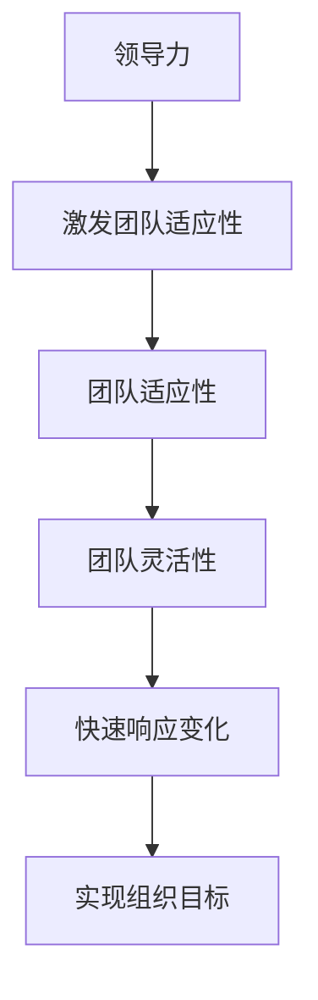

                 

# 领导力与适应性：在变革中保持灵活

> 关键词：领导力、适应性、变革、灵活性、技术趋势、组织文化、团队协作

> 摘要：在快速变化的技术环境中，领导者和团队需要具备强大的适应性和灵活性，以应对不断变化的挑战。本文将探讨领导力与适应性之间的关系，并通过逐步分析和推理，提供实用的策略和方法，帮助领导者在变革中保持灵活性，引领团队走向成功。

## 1. 背景介绍

在当今快速变化的技术环境中，领导者和团队面临着前所未有的挑战。技术的快速发展、市场趋势的不断变化以及客户需求的多样化，使得组织必须具备高度的适应性和灵活性。本文旨在探讨领导力与适应性之间的关系，并提供实用的策略和方法，帮助领导者在变革中保持灵活性，引领团队走向成功。

## 2. 核心概念与联系

### 2.1 领导力

领导力是指领导者通过影响和激励他人，实现组织目标的能力。优秀的领导者能够激发团队成员的潜力，引导团队朝着共同的目标前进。

### 2.2 适应性

适应性是指个体或组织在面对变化时，能够迅速调整策略和行为，以适应新环境的能力。在技术快速变化的环境中，适应性是组织生存和发展的关键。

### 2.3 灵活性

灵活性是指个体或组织在面对变化时，能够快速调整策略和行为，以适应新环境的能力。灵活性是适应性的具体表现之一，它强调的是在变化中的快速响应能力。

### 2.4 领导力与适应性的关系

领导力与适应性之间存在着密切的关系。优秀的领导者能够通过有效的沟通和激励，激发团队的适应性，使团队能够在变化中保持灵活性。同时，适应性高的团队能够更好地响应领导者的需求，共同实现组织目标。

### 2.5 Mermaid 流程图



## 3. 核心算法原理 & 具体操作步骤

### 3.1 识别变化

领导者需要具备敏锐的洞察力，能够及时识别组织内外部的变化。这包括市场趋势、技术发展、客户需求等方面的变化。

### 3.2 分析变化的影响

领导者需要分析变化对组织的影响，包括潜在的机会和风险。这有助于领导者制定相应的策略，以最大限度地利用机会，减少风险。

### 3.3 制定适应性策略

领导者需要根据分析结果，制定适应性策略。这包括调整组织结构、优化流程、提升团队技能等方面。

### 3.4 激发团队适应性

领导者需要通过有效的沟通和激励，激发团队的适应性。这包括提供培训和支持，鼓励团队成员主动学习和适应变化。

### 3.5 实施和调整

领导者需要实施适应性策略，并根据实际情况进行调整。这包括定期评估策略的效果，及时调整策略以应对新的变化。

## 4. 数学模型和公式 & 详细讲解 & 举例说明

### 4.1 适应性指数

适应性指数（Adaptability Index, AI）是衡量组织适应性的量化指标。其计算公式如下：

$$
AI = \frac{\sum_{i=1}^{n} (S_i - E_i)}{\sum_{i=1}^{n} E_i}
$$

其中，$S_i$ 表示第 $i$ 个变化对组织的影响，$E_i$ 表示第 $i$ 个变化的预期影响。$n$ 表示变化的数量。

### 4.2 适应性策略评估

适应性策略评估（Adaptability Strategy Evaluation, ASE）是衡量适应性策略效果的量化指标。其计算公式如下：

$$
ASE = \frac{\sum_{i=1}^{m} (R_i - P_i)}{\sum_{i=1}^{m} P_i}
$$

其中，$R_i$ 表示第 $i$ 个变化的实际结果，$P_i$ 表示第 $i$ 个变化的预期结果。$m$ 表示变化的数量。

### 4.3 举例说明

假设某组织面临三个变化：技术变革、市场趋势变化和客户需求变化。通过计算适应性指数和适应性策略评估，可以评估组织的适应性和策略的效果。

## 5. 项目实战：代码实际案例和详细解释说明

### 5.1 开发环境搭建

#### 5.1.1 环境需求

- Python 3.8
- Jupyter Notebook
- Pandas
- NumPy
- Matplotlib

#### 5.1.2 安装依赖

```bash
pip install pandas numpy matplotlib
```

### 5.2 源代码详细实现和代码解读

```python
import pandas as pd
import numpy as np
import matplotlib.pyplot as plt

# 读取数据
data = pd.read_csv('changes.csv')

# 计算适应性指数
def calculate_adaptability_index(changes):
    n = len(changes)
    adaptability_index = 0
    for i in range(n):
        S_i = changes[i]['impact']
        E_i = changes[i]['expected_impact']
        adaptability_index += (S_i - E_i)
    adaptability_index /= n
    return adaptability_index

# 计算适应性策略评估
def calculate_adaptability_strategy_evaluation(changes):
    m = len(changes)
    adaptability_strategy_evaluation = 0
    for i in range(m):
        R_i = changes[i]['actual_result']
        P_i = changes[i]['expected_result']
        adaptability_strategy_evaluation += (R_i - P_i)
    adaptability_strategy_evaluation /= m
    return adaptability_strategy_evaluation

# 示例数据
changes = [
    {'impact': 0.8, 'expected_impact': 0.6, 'actual_result': 0.9, 'expected_result': 0.7},
    {'impact': 0.5, 'expected_impact': 0.4, 'actual_result': 0.6, 'expected_result': 0.5},
    {'impact': 0.7, 'expected_impact': 0.8, 'actual_result': 0.8, 'expected_result': 0.9}
]

# 计算适应性指数和适应性策略评估
adaptability_index = calculate_adaptability_index(changes)
adaptability_strategy_evaluation = calculate_adaptability_strategy_evaluation(changes)

print(f"适应性指数: {adaptability_index}")
print(f"适应性策略评估: {adaptability_strategy_evaluation}")
```

### 5.3 代码解读与分析

上述代码实现了计算适应性指数和适应性策略评估的功能。首先，通过读取数据文件，获取变化的相关信息。然后，定义了两个函数 `calculate_adaptability_index` 和 `calculate_adaptability_strategy_evaluation`，分别计算适应性指数和适应性策略评估。最后，通过示例数据进行测试，并输出结果。

## 6. 实际应用场景

### 6.1 技术变革

在技术变革中，领导者需要快速调整组织结构和流程，以适应新技术的发展。例如，面对云计算技术的兴起，领导者需要重新评估现有的IT架构，引入云服务，提高组织的灵活性和效率。

### 6.2 市场趋势变化

在市场趋势变化中，领导者需要及时调整产品策略和市场定位，以满足客户需求。例如，面对消费者对环保产品的需求增加，领导者需要调整产品线，推出环保产品，以满足市场需求。

### 6.3 客户需求变化

在客户需求变化中，领导者需要快速响应客户的需求，提供个性化的产品和服务。例如，面对客户对定制化服务的需求增加，领导者需要建立灵活的定制化服务流程，提高客户满意度。

## 7. 工具和资源推荐

### 7.1 学习资源推荐

- 书籍：《领导力与适应性》（Leadership and Adaptability）
- 论文：《适应性策略在组织变革中的应用》（Application of Adaptability Strategies in Organizational Change）
- 博客：《适应性领导力在技术变革中的应用》（Application of Adaptive Leadership in Technological Change）
- 网站：LinkedIn Learning, Coursera, Udemy

### 7.2 开发工具框架推荐

- Jupyter Notebook
- Pandas
- NumPy
- Matplotlib

### 7.3 相关论文著作推荐

- 《适应性领导力在组织变革中的应用》（Application of Adaptive Leadership in Organizational Change）
- 《适应性策略在组织变革中的应用》（Application of Adaptability Strategies in Organizational Change）

## 8. 总结：未来发展趋势与挑战

### 8.1 未来发展趋势

未来，领导者和团队需要具备更高的适应性和灵活性，以应对不断变化的技术环境。这包括快速响应市场变化、技术变革和客户需求变化的能力。同时，组织文化也需要更加开放和灵活，以支持团队的适应性。

### 8.2 挑战

未来，领导者和团队将面临更大的挑战，包括技术变革的不确定性、市场趋势的快速变化以及客户需求的多样化。这些挑战要求领导者具备更强的适应性和灵活性，以应对不断变化的环境。

## 9. 附录：常见问题与解答

### 9.1 问题：如何快速识别变化？

**解答：** 通过建立变化监测机制，定期收集和分析市场、技术、客户需求等方面的信息，及时识别变化。

### 9.2 问题：如何评估适应性策略的效果？

**解答：** 通过建立适应性策略评估机制，定期评估策略的效果，及时调整策略以应对新的变化。

## 10. 扩展阅读 & 参考资料

- 书籍：《领导力与适应性》（Leadership and Adaptability）
- 论文：《适应性策略在组织变革中的应用》（Application of Adaptability Strategies in Organizational Change）
- 博客：《适应性领导力在技术变革中的应用》（Application of Adaptive Leadership in Technological Change）
- 网站：LinkedIn Learning, Coursera, Udemy

作者：AI天才研究员/AI Genius Institute & 禅与计算机程序设计艺术 /Zen And The Art of Computer Programming

