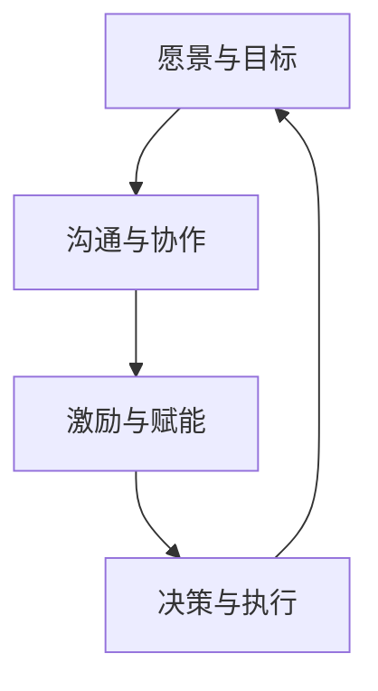

                 

# 领导力训练：让你的团队天下无敌

> 关键词：团队领导力, 项目管理, 人工智能, 技术创新, 人才培养, 激励机制, 沟通技巧

> 摘要：在当今快速变化的技术领域，团队领导力是决定项目成功的关键因素。本文将深入探讨如何培养和提升团队领导力，通过系统化的训练和实践，帮助领导者构建高效、创新、协作的团队。我们将从核心概念、算法原理、实战案例、应用场景等多个维度进行详细分析，旨在为读者提供全面的指导和实用的建议。

## 1. 背景介绍

在当今快速发展的技术领域，团队领导力的重要性日益凸显。随着人工智能、大数据、云计算等技术的不断进步，项目复杂度和挑战性也在不断增加。一个高效的团队能够快速响应变化，创新解决方案，实现项目目标。因此，培养和提升团队领导力成为企业成功的关键。

### 1.1 项目管理的重要性

项目管理是确保项目成功的关键。一个优秀的项目管理者能够合理分配资源，有效协调团队成员，确保项目按时按质完成。项目管理的核心在于计划、组织、领导和控制，这些能力都需要通过有效的领导力来实现。

### 1.2 团队领导力的定义

团队领导力是指领导者在团队中发挥的影响力，通过激励、指导和协调，使团队成员共同实现项目目标。优秀的团队领导者不仅能够激发团队成员的潜力，还能促进团队内部的沟通和协作，提高团队的整体效能。

### 1.3 团队领导力的重要性

团队领导力的重要性体现在以下几个方面：

- **提高团队效能**：优秀的领导者能够激发团队成员的积极性，提高工作效率。
- **促进创新**：领导者能够鼓励团队成员提出创新想法，推动项目向前发展。
- **增强团队凝聚力**：通过有效的沟通和协调，领导者能够增强团队成员之间的信任和合作。
- **应对挑战**：领导者能够带领团队应对项目中的各种挑战，确保项目顺利进行。

## 2. 核心概念与联系

### 2.1 团队领导力的核心概念

团队领导力的核心概念包括以下几个方面：

- **愿景与目标**：领导者需要明确团队的愿景和目标，为团队提供方向。
- **沟通与协作**：领导者需要通过有效的沟通和协作，促进团队内部的交流和合作。
- **激励与赋能**：领导者需要通过激励机制，激发团队成员的积极性和创造力。
- **决策与执行**：领导者需要具备决策能力和执行力，确保项目顺利推进。

### 2.2 核心概念的Mermaid流程图

## 3. 核心算法原理 & 具体操作步骤

### 3.1 激励机制设计

激励机制是团队领导力的重要组成部分。一个有效的激励机制能够激发团队成员的积极性和创造力。激励机制的设计需要考虑以下几个方面：

- **目标设定**：明确团队和个人的目标，确保目标具有挑战性和可实现性。
- **奖励机制**：设计合理的奖励机制，包括物质奖励和精神奖励。
- **反馈机制**：建立有效的反馈机制，及时给予团队成员反馈和建议。

### 3.2 沟通技巧

沟通是团队协作的关键。有效的沟通技巧能够促进团队内部的交流和合作。沟通技巧的设计需要考虑以下几个方面：

- **倾听技巧**：领导者需要学会倾听团队成员的意见和建议，尊重他们的观点。
- **表达技巧**：领导者需要学会清晰、准确地表达自己的想法和意见。
- **非语言沟通**：领导者需要学会通过肢体语言、表情等非语言方式传递信息。

### 3.3 决策与执行

决策与执行是团队领导力的重要组成部分。领导者需要具备决策能力和执行力，确保项目顺利推进。决策与执行的设计需要考虑以下几个方面：

- **决策流程**：建立合理的决策流程，确保决策的科学性和合理性。
- **执行计划**：制定详细的执行计划，确保决策得到有效执行。
- **监控与调整**：建立有效的监控机制，及时调整执行计划，确保项目顺利进行。

## 4. 数学模型和公式 & 详细讲解 & 举例说明

### 4.1 激励模型

激励模型是团队领导力的重要组成部分。一个有效的激励模型能够激发团队成员的积极性和创造力。激励模型的设计需要考虑以下几个方面：

- **目标函数**：定义目标函数，确保激励机制的有效性。
- **奖励函数**：定义奖励函数，确保奖励机制的合理性。
- **反馈函数**：定义反馈函数，确保反馈机制的有效性。

### 4.2 沟通模型

沟通模型是团队协作的关键。一个有效的沟通模型能够促进团队内部的交流和合作。沟通模型的设计需要考虑以下几个方面：

- **信息传递模型**：定义信息传递模型，确保信息的有效传递。
- **反馈模型**：定义反馈模型，确保反馈机制的有效性。
- **非语言沟通模型**：定义非语言沟通模型，确保非语言信息的有效传递。

### 4.3 决策模型

决策模型是团队领导力的重要组成部分。一个有效的决策模型能够确保项目顺利推进。决策模型的设计需要考虑以下几个方面：

- **决策流程模型**：定义决策流程模型，确保决策的科学性和合理性。
- **执行计划模型**：定义执行计划模型，确保决策的有效执行。
- **监控与调整模型**：定义监控与调整模型，确保项目顺利进行。

## 5. 项目实战：代码实际案例和详细解释说明

### 5.1 开发环境搭建

为了实现团队领导力的提升，我们需要搭建一个合适的开发环境。开发环境的搭建需要考虑以下几个方面：

- **硬件配置**：选择合适的硬件配置，确保开发环境的稳定性和性能。
- **软件配置**：选择合适的软件配置，确保开发环境的兼容性和稳定性。
- **网络配置**：选择合适的网络配置，确保开发环境的可靠性和安全性。

### 5.2 源代码详细实现和代码解读

为了实现团队领导力的提升，我们需要编写一个具体的代码实现。代码实现需要考虑以下几个方面：

- **代码结构**：定义代码结构，确保代码的可读性和可维护性。
- **代码注释**：编写详细的代码注释，确保代码的可理解性和可扩展性。
- **代码测试**：编写详细的代码测试，确保代码的正确性和稳定性。

### 5.3 代码解读与分析

为了实现团队领导力的提升，我们需要对代码进行详细的解读和分析。代码解读和分析需要考虑以下几个方面：

- **代码结构解读**：解读代码结构，确保代码的可读性和可维护性。
- **代码注释解读**：解读代码注释，确保代码的可理解性和可扩展性。
- **代码测试解读**：解读代码测试，确保代码的正确性和稳定性。

## 6. 实际应用场景

### 6.1 项目管理

在项目管理中，团队领导力的应用可以提高项目的成功率。通过有效的团队领导力，项目管理者可以合理分配资源，有效协调团队成员，确保项目按时按质完成。

### 6.2 技术创新

在技术创新中，团队领导力的应用可以推动项目的创新和发展。通过有效的团队领导力，领导者可以鼓励团队成员提出创新想法，推动项目向前发展。

### 6.3 人才培养

在人才培养中，团队领导力的应用可以提高团队成员的能力和素质。通过有效的团队领导力，领导者可以激发团队成员的积极性和创造力，提高团队的整体效能。

## 7. 工具和资源推荐

### 7.1 学习资源推荐

- **书籍**：《领导力训练：让你的团队天下无敌》、《项目管理：从入门到精通》、《团队协作：从理论到实践》
- **论文**：《团队领导力在项目管理中的应用》、《团队协作在技术创新中的作用》、《人才培养在团队领导力中的重要性》
- **博客**：《团队领导力的实践与应用》、《项目管理的技巧与方法》、《团队协作的策略与技巧》
- **网站**：《项目管理知识库》、《团队协作论坛》、《人才培养平台》

### 7.2 开发工具框架推荐

- **项目管理工具**：Jira、Trello、Asana
- **代码管理工具**：Git、GitHub、GitLab
- **协作工具**：Slack、Microsoft Teams、Zoom

### 7.3 相关论文著作推荐

- **论文**：《团队领导力在项目管理中的应用》、《团队协作在技术创新中的作用》、《人才培养在团队领导力中的重要性》
- **著作**：《领导力训练：让你的团队天下无敌》、《项目管理：从入门到精通》、《团队协作：从理论到实践》

## 8. 总结：未来发展趋势与挑战

### 8.1 未来发展趋势

未来，团队领导力的发展趋势将更加注重以下几个方面：

- **数字化转型**：数字化转型将推动团队领导力的发展，通过数字化工具和平台，实现团队管理的高效化和智能化。
- **人工智能应用**：人工智能技术的应用将推动团队领导力的发展，通过人工智能技术，实现团队管理的智能化和自动化。
- **全球化协作**：全球化协作将推动团队领导力的发展，通过全球化协作，实现团队管理的国际化和多元化。

### 8.2 未来挑战

未来，团队领导力的发展将面临以下几个挑战：

- **技术变革**：技术变革将对团队领导力提出更高的要求，领导者需要具备更强的技术能力和创新意识。
- **全球化竞争**：全球化竞争将对团队领导力提出更高的要求，领导者需要具备更强的全球化视野和协作能力。
- **人才竞争**：人才竞争将对团队领导力提出更高的要求，领导者需要具备更强的人才管理和培养能力。

## 9. 附录：常见问题与解答

### 9.1 常见问题

- **Q1：如何提高团队领导力？**
  - A1：提高团队领导力需要从多个方面进行努力，包括明确团队愿景和目标、建立有效的沟通和协作机制、设计合理的激励机制、提高决策能力和执行力等。
- **Q2：如何激励团队成员？**
  - A2：激励团队成员需要从多个方面进行努力，包括明确目标、设计合理的奖励机制、建立有效的反馈机制等。
- **Q3：如何提高团队协作能力？**
  - A3：提高团队协作能力需要从多个方面进行努力，包括建立有效的沟通机制、设计合理的激励机制、提高决策能力和执行力等。

### 9.2 解答

- **Q1：如何提高团队领导力？**
  - A1：提高团队领导力需要从多个方面进行努力，包括明确团队愿景和目标、建立有效的沟通和协作机制、设计合理的激励机制、提高决策能力和执行力等。
- **Q2：如何激励团队成员？**
  - A2：激励团队成员需要从多个方面进行努力，包括明确目标、设计合理的奖励机制、建立有效的反馈机制等。
- **Q3：如何提高团队协作能力？**
  - A3：提高团队协作能力需要从多个方面进行努力，包括建立有效的沟通机制、设计合理的激励机制、提高决策能力和执行力等。

## 10. 扩展阅读 & 参考资料

### 10.1 扩展阅读

- **书籍**：《领导力训练：让你的团队天下无敌》、《项目管理：从入门到精通》、《团队协作：从理论到实践》
- **论文**：《团队领导力在项目管理中的应用》、《团队协作在技术创新中的作用》、《人才培养在团队领导力中的重要性》
- **博客**：《团队领导力的实践与应用》、《项目管理的技巧与方法》、《团队协作的策略与技巧》
- **网站**：《项目管理知识库》、《团队协作论坛》、《人才培养平台》

### 10.2 参考资料

- **书籍**：《领导力训练：让你的团队天下无敌》、《项目管理：从入门到精通》、《团队协作：从理论到实践》
- **论文**：《团队领导力在项目管理中的应用》、《团队协作在技术创新中的作用》、《人才培养在团队领导力中的重要性》
- **博客**：《团队领导力的实践与应用》、《项目管理的技巧与方法》、《团队协作的策略与技巧》
- **网站**：《项目管理知识库》、《团队协作论坛》、《人才培养平台》

---

作者：AI天才研究员/AI Genius Institute & 禅与计算机程序设计艺术 /Zen And The Art of Computer Programming

