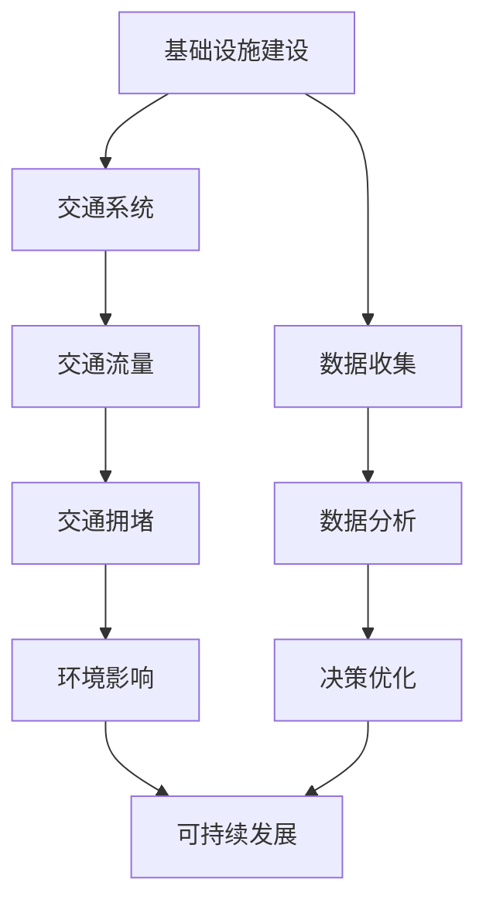

                 

# AI与人类计算：打造可持续发展的城市交通与基础设施建设与规划建设管理

> 关键词：城市交通、可持续发展、人工智能、机器学习、城市规划、基础设施建设、智能交通系统、数据驱动决策、城市计算

> 摘要：本文旨在探讨如何利用人工智能和机器学习技术，结合城市交通和基础设施建设的实际需求，构建一个可持续发展的城市交通与基础设施建设与规划建设管理体系。通过系统分析、算法设计、模型构建和实际案例研究，本文将为城市管理者提供一套科学、高效、智能的城市交通与基础设施建设解决方案。

## 1. 背景介绍
### 1.1 目的和范围
本文旨在探讨如何利用人工智能和机器学习技术，结合城市交通和基础设施建设的实际需求，构建一个可持续发展的城市交通与基础设施建设与规划建设管理体系。通过系统分析、算法设计、模型构建和实际案例研究，本文将为城市管理者提供一套科学、高效、智能的城市交通与基础设施建设解决方案。

### 1.2 预期读者
本文主要面向城市规划师、交通工程师、数据科学家、城市管理者以及对城市交通与基础设施建设感兴趣的读者。读者应具备一定的计算机科学基础，特别是对人工智能和机器学习有一定了解。

### 1.3 文档结构概述
本文将从以下几个方面展开讨论：
1. 背景介绍
2. 核心概念与联系
3. 核心算法原理 & 具体操作步骤
4. 数学模型和公式 & 详细讲解 & 举例说明
5. 项目实战：代码实际案例和详细解释说明
6. 实际应用场景
7. 工具和资源推荐
8. 总结：未来发展趋势与挑战
9. 附录：常见问题与解答
10. 扩展阅读 & 参考资料

### 1.4 术语表
#### 1.4.1 核心术语定义
- **城市交通**：指城市内各种交通工具的运行和管理。
- **基础设施建设**：指为城市提供基本服务的设施的建设和维护。
- **智能交通系统**（ITS）：利用信息技术、通信技术、控制技术等手段，提高交通系统的效率和安全性。
- **数据驱动决策**：基于大量数据进行分析，从而做出更科学、合理的决策。
- **城市计算**：利用计算技术解决城市中的复杂问题。

#### 1.4.2 相关概念解释
- **机器学习**：一种人工智能技术，通过算法使计算机从数据中学习，从而实现特定任务。
- **深度学习**：机器学习的一个分支，通过多层神经网络进行学习。
- **强化学习**：一种机器学习方法，通过试错学习来优化决策过程。

#### 1.4.3 缩略词列表
- **AI**：人工智能
- **ML**：机器学习
- **DL**：深度学习
- **RL**：强化学习
- **ITS**：智能交通系统
- **IoT**：物联网
- **GIS**：地理信息系统

## 2. 核心概念与联系
### 2.1 城市交通与基础设施建设的关系
城市交通与基础设施建设是相辅相成的。良好的基础设施建设可以促进交通系统的高效运行，而高效的交通系统又能进一步推动城市的可持续发展。两者之间的关系可以用以下流程图表示：



### 2.2 数据驱动决策的重要性
数据驱动决策是实现城市交通与基础设施建设可持续发展的关键。通过收集和分析大量数据，可以更好地理解城市交通和基础设施建设的现状，从而制定出更科学、合理的规划和管理策略。

## 3. 核心算法原理 & 具体操作步骤
### 3.1 数据预处理
数据预处理是整个流程中的重要步骤。主要包括数据清洗、特征选择和数据标准化等。

```python
# 数据预处理伪代码
def preprocess_data(data):
    # 清洗数据
    cleaned_data = clean_data(data)
    # 选择特征
    selected_features = select_features(cleaned_data)
    # 标准化数据
    standardized_data = standardize_data(selected_features)
    return standardized_data
```

### 3.2 机器学习模型构建
机器学习模型是实现数据驱动决策的核心。常用的模型包括线性回归、决策树、随机森林、支持向量机等。

```python
# 机器学习模型构建伪代码
def build_model(data, labels):
    # 划分训练集和测试集
    train_data, train_labels, test_data, test_labels = split_data(data, labels)
    # 选择模型
    model = select_model()
    # 训练模型
    model.fit(train_data, train_labels)
    # 验证模型
    accuracy = model.evaluate(test_data, test_labels)
    return model, accuracy
```

### 3.3 模型优化与调参
模型优化是提高模型性能的关键步骤。通过调整模型参数，可以进一步提升模型的准确性和泛化能力。

```python
# 模型优化与调参伪代码
def optimize_model(model, data, labels):
    # 划分训练集和验证集
    train_data, train_labels, val_data, val_labels = split_data(data, labels)
    # 调整参数
    best_params = tune_params(model, train_data, train_labels, val_data, val_labels)
    # 重新训练模型
    optimized_model = model.set_params(best_params)
    optimized_model.fit(train_data, train_labels)
    return optimized_model
```

## 4. 数学模型和公式 & 详细讲解 & 举例说明
### 4.1 线性回归模型
线性回归是一种常用的机器学习模型，用于预测连续值。

$$
y = \beta_0 + \beta_1 x_1 + \beta_2 x_2 + \cdots + \beta_n x_n + \epsilon
$$

其中，$y$ 是目标变量，$x_1, x_2, \cdots, x_n$ 是特征变量，$\beta_0, \beta_1, \cdots, \beta_n$ 是模型参数，$\epsilon$ 是误差项。

### 4.2 决策树模型
决策树是一种基于树结构的分类和回归模型。

$$
f(x) = \begin{cases}
    y_1 & \text{if } x \in R_1 \\
    y_2 & \text{if } x \in R_2 \\
    \vdots \\
    y_m & \text{if } x \in R_m
\end{cases}
$$

其中，$R_1, R_2, \cdots, R_m$ 是决策树的叶子节点，$y_1, y_2, \cdots, y_m$ 是对应的分类结果。

### 4.3 支持向量机模型
支持向量机是一种用于分类和回归的机器学习模型。

$$
f(x) = \text{sign}\left(\sum_{i=1}^{m} \alpha_i y_i K(x_i, x) + b\right)
$$

其中，$K(x_i, x)$ 是核函数，$\alpha_i, y_i$ 是支持向量的权重和标签，$b$ 是偏置项。

## 5. 项目实战：代码实际案例和详细解释说明
### 5.1 开发环境搭建
开发环境搭建是项目实施的基础。常用的开发环境包括Python、Jupyter Notebook、Anaconda等。

```bash
# 安装Python和Anaconda
conda install python
conda create -n myenv python=3.8
conda activate myenv
```

### 5.2 源代码详细实现和代码解读
以下是一个简单的线性回归模型实现示例。

```python
import numpy as np
from sklearn.model_selection import train_test_split
from sklearn.linear_model import LinearRegression
from sklearn.metrics import mean_squared_error

# 生成示例数据
np.random.seed(0)
X = np.random.rand(100, 1)
y = 2 + 3 * X + np.random.rand(100, 1)

# 划分训练集和测试集
X_train, X_test, y_train, y_test = train_test_split(X, y, test_size=0.2, random_state=42)

# 构建线性回归模型
model = LinearRegression()
model.fit(X_train, y_train)

# 预测
y_pred = model.predict(X_test)

# 计算均方误差
mse = mean_squared_error(y_test, y_pred)
print("Mean Squared Error:", mse)
```

### 5.3 代码解读与分析
上述代码首先生成了一组示例数据，然后将数据划分为训练集和测试集。接着，构建了一个线性回归模型，并使用训练集进行训练。最后，使用测试集进行预测，并计算了均方误差。

## 6. 实际应用场景
### 6.1 智能交通信号控制
通过实时监测交通流量，智能调整交通信号灯的时序，从而减少交通拥堵。

### 6.2 公共交通优化调度
利用历史数据和实时数据，优化公交线路和班次安排，提高公共交通的效率和舒适度。

### 6.3 城市停车管理
通过智能停车系统，实时监控停车位的使用情况，引导驾驶员快速找到空闲车位，减少寻找车位的时间。

## 7. 工具和资源推荐
### 7.1 学习资源推荐
#### 7.1.1 书籍推荐
- 《机器学习》（周志华著）
- 《深度学习》（Ian Goodfellow, Yoshua Bengio, Aaron Courville著）

#### 7.1.2 在线课程
- Coursera上的《机器学习》课程
- edX上的《深度学习》课程

#### 7.1.3 技术博客和网站
- Medium上的机器学习和人工智能博客
- Kaggle上的机器学习竞赛和讨论

### 7.2 开发工具框架推荐
#### 7.2.1 IDE和编辑器
- PyCharm
- VSCode

#### 7.2.2 调试和性能分析工具
- PyCharm的调试工具
- Python的cProfile库

#### 7.2.3 相关框架和库
- scikit-learn
- TensorFlow
- PyTorch

### 7.3 相关论文著作推荐
#### 7.3.1 经典论文
- "A Tutorial on Support Vector Machines for Pattern Recognition" (Cristianini and Shawe-Taylor, 2000)
- "An Introduction to Support Vector Machines" (Burges, 1998)

#### 7.3.2 最新研究成果
- "Deep Learning" (Goodfellow, Bengio, and Courville, 2016)
- "Attention Is All You Need" (Vaswani et al., 2017)

#### 7.3.3 应用案例分析
- "Using Machine Learning to Predict Traffic Congestion" (IEEE Transactions on Intelligent Transportation Systems, 2018)
- "Smart Parking Systems: A Review" (IEEE Access, 2019)

## 8. 总结：未来发展趋势与挑战
### 8.1 未来发展趋势
- **数据驱动决策**：随着数据收集和处理技术的不断进步，数据驱动决策将成为城市交通与基础设施建设的重要手段。
- **智能交通系统**：智能交通系统将更加普及，通过实时监测和优化，提高交通系统的效率和安全性。
- **可持续发展**：城市交通与基础设施建设将更加注重可持续发展，减少对环境的影响。

### 8.2 面临的挑战
- **数据隐私**：如何在保护个人隐私的前提下，有效利用大数据进行决策。
- **技术集成**：如何将多种技术（如物联网、云计算、人工智能）有效集成，形成完整的解决方案。
- **政策支持**：需要政府和相关部门的支持和引导，推动技术的应用和发展。

## 9. 附录：常见问题与解答
### 9.1 问题：如何处理数据缺失值？
- **解答**：可以采用插值法、均值填充法或删除法来处理数据缺失值。

### 9.2 问题：如何选择合适的机器学习模型？
- **解答**：根据问题的性质和数据的特点选择合适的模型。可以通过交叉验证来评估不同模型的性能。

## 10. 扩展阅读 & 参考资料
- **书籍**：《机器学习》（周志华著）
- **论文**："A Tutorial on Support Vector Machines for Pattern Recognition" (Cristianini and Shawe-Taylor, 2000)
- **网站**：Kaggle

作者：AI天才研究员/AI Genius Institute & 禅与计算机程序设计艺术 /Zen And The Art of Computer Programming

