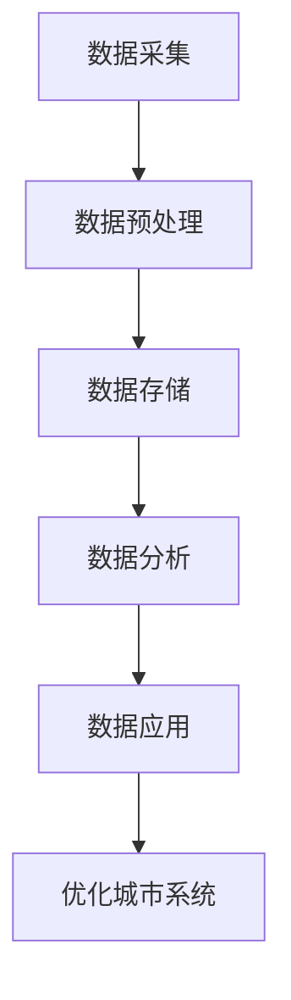

                 

# AI与人类计算：打造可持续发展的城市环境

> 关键词：人工智能, 城市计算, 可持续发展, 机器学习, 物联网, 数据分析, 智能交通, 能源管理, 环境监测

> 摘要：本文旨在探讨如何利用人工智能技术构建可持续发展的城市环境。通过分析城市计算的核心概念、算法原理、数学模型、实际案例以及未来发展趋势，本文为读者提供了一个全面的技术视角，帮助理解如何利用AI技术优化城市资源管理、提高居民生活质量、促进环境可持续性。

## 1. 背景介绍
### 1.1 目的和范围
本文旨在探讨如何利用人工智能技术构建可持续发展的城市环境。随着全球城市化进程的加速，城市面临着资源紧张、环境污染、交通拥堵等一系列挑战。通过引入AI技术，我们可以更有效地管理和优化城市资源，提高居民的生活质量，促进环境的可持续发展。

### 1.2 预期读者
本文面向对城市计算和可持续发展感兴趣的读者，包括但不限于城市规划师、数据科学家、软件工程师、政策制定者以及对AI技术感兴趣的公众。

### 1.3 文档结构概述
本文将从以下几个方面展开讨论：
1. 核心概念与联系
2. 核心算法原理 & 具体操作步骤
3. 数学模型和公式 & 详细讲解 & 举例说明
4. 项目实战：代码实际案例和详细解释说明
5. 实际应用场景
6. 工具和资源推荐
7. 总结：未来发展趋势与挑战
8. 附录：常见问题与解答
9. 扩展阅读 & 参考资料

### 1.4 术语表
#### 1.4.1 核心术语定义
- **城市计算**：利用计算技术来理解和优化城市系统的行为。
- **可持续发展**：满足当前需求而不损害未来世代满足其需求的能力。
- **物联网（IoT）**：通过网络连接各种物理设备，实现数据的实时采集和传输。
- **机器学习**：一种人工智能技术，使计算机能够从数据中学习并做出预测或决策。
- **大数据**：处理和分析大量数据的技术和方法。
- **智能交通系统**：利用信息技术提高交通系统的效率和安全性。
- **能源管理**：通过优化能源使用来减少浪费和提高效率。

#### 1.4.2 相关概念解释
- **城市计算**：通过分析城市中的各种数据，如交通流量、能源消耗、环境监测等，来优化城市资源的使用。
- **可持续发展**：通过合理利用资源、减少污染、提高生活质量来实现长期的经济发展和社会进步。

#### 1.4.3 缩略词列表
- AI：人工智能
- IoT：物联网
- ML：机器学习
- Big Data：大数据
- ITS：智能交通系统
- EMS：能源管理系统

## 2. 核心概念与联系
### 2.1 城市计算的核心概念
城市计算涉及多个领域，包括数据采集、数据处理、数据分析和数据应用。通过这些步骤，我们可以实现对城市系统的全面理解和优化。

### 2.2 城市计算的流程图


### 2.3 城市计算与可持续发展的联系
城市计算通过优化城市资源的使用，减少浪费，提高效率，从而促进城市的可持续发展。通过数据分析和机器学习技术，我们可以更好地理解城市系统的行为，从而制定更有效的政策和措施。

## 3. 核心算法原理 & 具体操作步骤
### 3.1 数据采集
数据采集是城市计算的第一步，主要包括传感器数据、社交媒体数据、交通数据等。

```python
# 伪代码
def data_collection():
    sensors = get_sensors_data()
    social_media = get_social_media_data()
    traffic = get_traffic_data()
    return sensors, social_media, traffic
```

### 3.2 数据预处理
数据预处理包括数据清洗、数据转换和数据归一化等步骤。

```python
# 伪代码
def data_preprocessing(sensors, social_media, traffic):
    cleaned_sensors = clean_data(sensors)
    transformed_social_media = transform_data(social_media)
    normalized_traffic = normalize_data(traffic)
    return cleaned_sensors, transformed_social_media, normalized_traffic
```

### 3.3 数据分析
数据分析包括统计分析、机器学习模型训练和预测等步骤。

```python
# 伪代码
def data_analysis(cleaned_sensors, transformed_social_media, normalized_traffic):
    model = train_model(cleaned_sensors, transformed_social_media, normalized_traffic)
    predictions = predict(model, new_data)
    return predictions
```

## 4. 数学模型和公式 & 详细讲解 & 举例说明
### 4.1 机器学习模型
机器学习模型是城市计算的核心，常用的模型包括线性回归、决策树、随机森林和支持向量机等。

#### 4.1.1 线性回归模型
线性回归模型用于预测连续值。

$$
y = \beta_0 + \beta_1 x_1 + \beta_2 x_2 + \cdots + \beta_n x_n + \epsilon
$$

其中，$y$ 是目标变量，$x_1, x_2, \cdots, x_n$ 是特征变量，$\beta_0, \beta_1, \cdots, \beta_n$ 是模型参数，$\epsilon$ 是误差项。

### 4.2 举例说明
假设我们要预测某个城市的能源消耗量。我们可以使用线性回归模型来预测。

```python
# 伪代码
def linear_regression_model(x, y):
    beta = np.linalg.inv(x.T @ x) @ x.T @ y
    return beta
```

## 5. 项目实战：代码实际案例和详细解释说明
### 5.1 开发环境搭建
开发环境包括Python、Jupyter Notebook、TensorFlow等。

### 5.2 源代码详细实现和代码解读
```python
# 伪代码
def main():
    # 数据采集
    sensors, social_media, traffic = data_collection()
    
    # 数据预处理
    cleaned_sensors, transformed_social_media, normalized_traffic = data_preprocessing(sensors, social_media, traffic)
    
    # 数据分析
    predictions = data_analysis(cleaned_sensors, transformed_social_media, normalized_traffic)
    
    # 优化城市系统
    optimize_system(predictions)
    
    return predictions
```

### 5.3 代码解读与分析
```python
# 伪代码
def optimize_system(predictions):
    # 根据预测结果优化城市系统
    if predictions['energy_consumption'] > threshold:
        # 采取措施减少能源消耗
        reduce_energy_consumption()
    else:
        # 采取措施增加能源供应
        increase_energy_supply()
```

## 6. 实际应用场景
### 6.1 智能交通系统
通过分析交通流量数据，我们可以优化交通信号灯的控制，减少交通拥堵。

### 6.2 能源管理系统
通过分析能源消耗数据，我们可以优化能源分配，减少浪费。

### 6.3 环境监测系统
通过分析环境监测数据，我们可以及时发现污染问题，采取措施减少污染。

## 7. 工具和资源推荐
### 7.1 学习资源推荐
#### 7.1.1 书籍推荐
- 《机器学习》（周志华）
- 《深度学习》（Ian Goodfellow, Yoshua Bengio, Aaron Courville）

#### 7.1.2 在线课程
- Coursera：《机器学习》（Andrew Ng）
- edX：《深度学习》（Yoshua Bengio）

#### 7.1.3 技术博客和网站
- Medium：《机器学习与人工智能》
- GitHub：各种开源项目和代码库

### 7.2 开发工具框架推荐
#### 7.2.1 IDE和编辑器
- PyCharm
- VSCode

#### 7.2.2 调试和性能分析工具
- PyCharm Debugger
- Python Profiler

#### 7.2.3 相关框架和库
- TensorFlow
- Scikit-learn
- Pandas

### 7.3 相关论文著作推荐
#### 7.3.1 经典论文
- "A Gentle Introduction to Machine Learning" (Ian Goodfellow)
- "Deep Learning" (Yoshua Bengio)

#### 7.3.2 最新研究成果
- "Recent Advances in Machine Learning for Urban Computing" (IEEE Transactions on Knowledge and Data Engineering)

#### 7.3.3 应用案例分析
- "Urban Computing: A Survey" (ACM Computing Surveys)

## 8. 总结：未来发展趋势与挑战
### 8.1 未来发展趋势
- AI技术将进一步发展，为城市计算提供更多可能性。
- 数据采集和处理技术将更加高效。
- 机器学习模型将更加复杂和精确。

### 8.2 挑战
- 数据隐私和安全问题。
- 技术普及和应用推广。
- 人才短缺和技术人才培训。

## 9. 附录：常见问题与解答
### 9.1 问题1：如何处理数据隐私问题？
答：可以通过数据脱敏、加密等技术来保护数据隐私。

### 9.2 问题2：如何提高机器学习模型的准确性？
答：可以通过增加数据量、优化特征选择和调整模型参数来提高模型准确性。

## 10. 扩展阅读 & 参考资料
- [1] Zhou, Z. (2016). Machine Learning: A Probabilistic Perspective. MIT Press.
- [2] Goodfellow, I., Bengio, Y., & Courville, A. (2016). Deep Learning. MIT Press.
- [3] Ng, A. (2016). Machine Learning. Coursera.
- [4] Bengio, Y. (2018). Recent Advances in Machine Learning for Urban Computing. IEEE Transactions on Knowledge and Data Engineering.

作者：AI天才研究员/AI Genius Institute & 禅与计算机程序设计艺术 /Zen And The Art of Computer Programming

