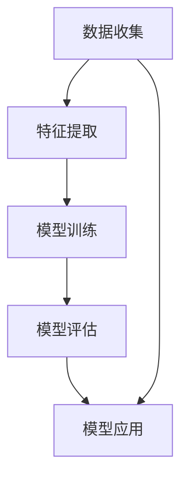

                 

# AI时代的软件工程度量新方法

> 关键词：AI时代, 软件工程, 度量方法, 机器学习, 自动化测试, 代码质量, 项目管理, 代码审查, 持续集成

> 摘要：随着人工智能技术的迅猛发展，软件工程领域面临着前所未有的挑战与机遇。本文旨在探讨AI时代下软件工程度量的新方法，通过分析现有度量方法的局限性，提出基于机器学习的自动化度量方案，并通过具体案例展示其实现过程和应用效果。本文将从背景介绍、核心概念与联系、核心算法原理、数学模型与公式、项目实战、实际应用场景、工具和资源推荐、总结与未来发展趋势等多方面进行详细阐述。

## 1. 背景介绍

### 1.1 目的和范围
本文旨在探讨AI时代下软件工程度量的新方法，通过分析现有度量方法的局限性，提出基于机器学习的自动化度量方案，并通过具体案例展示其实现过程和应用效果。本文将涵盖软件工程度量的基本概念、机器学习在度量中的应用、具体实现方法以及实际应用场景等内容。

### 1.2 预期读者
本文主要面向软件工程师、项目经理、技术管理者以及对软件工程度量感兴趣的读者。读者应具备一定的软件工程基础知识和机器学习基础。

### 1.3 文档结构概述
本文将按照以下结构展开：
1. 背景介绍
2. 核心概念与联系
3. 核心算法原理 & 具体操作步骤
4. 数学模型和公式 & 详细讲解 & 举例说明
5. 项目实战：代码实际案例和详细解释说明
6. 实际应用场景
7. 工具和资源推荐
8. 总结：未来发展趋势与挑战
9. 附录：常见问题与解答
10. 扩展阅读 & 参考资料

### 1.4 术语表
#### 1.4.1 核心术语定义
- **软件工程度量**：评估软件开发过程中的各种指标，包括代码质量、项目进度、团队效率等。
- **机器学习**：一种人工智能技术，通过算法和统计模型使计算机系统能够从数据中学习并改进性能。
- **自动化测试**：利用自动化工具执行测试任务，提高测试效率和准确性。
- **代码审查**：由团队成员对代码进行检查，确保代码符合规范和质量标准。
- **持续集成**：将代码集成到共享仓库中，并自动构建和测试代码，确保代码质量。

#### 1.4.2 相关概念解释
- **度量指标**：用于评估软件工程过程中的各种属性，如代码复杂度、代码覆盖率等。
- **度量工具**：用于收集和分析度量数据的工具，如SonarQube、Jenkins等。
- **度量模型**：描述度量指标之间的关系和影响因素的数学模型。

#### 1.4.3 缩略词列表
- **AI**：人工智能
- **ML**：机器学习
- **CI**：持续集成
- **SQA**：软件质量保证
- **SRE**：软件开发工程

## 2. 核心概念与联系

### 2.1 软件工程度量的基本概念
软件工程度量是评估软件开发过程中的各种指标，包括代码质量、项目进度、团队效率等。传统的度量方法主要依赖人工评估和手动记录，存在效率低下、主观性强等问题。随着AI技术的发展，基于机器学习的自动化度量方法逐渐成为研究热点。

### 2.2 机器学习在度量中的应用
机器学习通过算法和统计模型使计算机系统能够从数据中学习并改进性能。在软件工程度量中，机器学习可以用于自动识别代码质量问题、预测项目进度、优化代码审查流程等。

### 2.3 核心概念原理与架构
#### 2.3.1 核心概念原理
- **数据收集**：通过度量工具收集代码质量、项目进度等数据。
- **特征提取**：从收集的数据中提取有用的特征，如代码复杂度、代码覆盖率等。
- **模型训练**：使用机器学习算法训练模型，使其能够从特征中学习并预测结果。
- **模型评估**：通过交叉验证等方法评估模型的性能。
- **模型应用**：将训练好的模型应用于实际场景，实现自动化度量。

#### 2.3.2 架构图

## 3. 核心算法原理 & 具体操作步骤

### 3.1 数据收集
数据收集是度量过程的第一步，主要包括代码质量、项目进度、团队效率等数据。数据收集可以通过度量工具实现，如SonarQube、Jenkins等。

### 3.2 特征提取
特征提取是从收集的数据中提取有用的特征，如代码复杂度、代码覆盖率等。特征提取的具体步骤如下：
1. **代码复杂度**：通过计算代码行数、函数复杂度等指标来评估代码复杂度。
2. **代码覆盖率**：通过执行测试用例来评估代码覆盖率。
3. **项目进度**：通过记录任务完成情况、代码提交次数等指标来评估项目进度。
4. **团队效率**：通过记录团队成员的工作时间、代码提交次数等指标来评估团队效率。

### 3.3 模型训练
模型训练是使用机器学习算法训练模型，使其能够从特征中学习并预测结果。模型训练的具体步骤如下：
1. **数据预处理**：对收集的数据进行清洗、归一化等预处理操作。
2. **特征选择**：选择对模型性能影响较大的特征。
3. **模型选择**：选择合适的机器学习算法，如线性回归、决策树、随机森林等。
4. **模型训练**：使用训练数据训练模型。
5. **模型评估**：通过交叉验证等方法评估模型的性能。

### 3.4 模型评估
模型评估是通过交叉验证等方法评估模型的性能。模型评估的具体步骤如下：
1. **交叉验证**：将数据集划分为训练集和测试集，使用训练集训练模型，使用测试集评估模型性能。
2. **性能指标**：使用准确率、召回率、F1值等性能指标评估模型性能。
3. **模型优化**：根据评估结果调整模型参数，提高模型性能。

### 3.5 模型应用
模型应用是将训练好的模型应用于实际场景，实现自动化度量。模型应用的具体步骤如下：
1. **数据预处理**：对实际数据进行预处理操作。
2. **特征提取**：从预处理后的数据中提取特征。
3. **模型预测**：使用训练好的模型进行预测。
4. **结果分析**：分析预测结果，评估度量效果。

## 4. 数学模型和公式 & 详细讲解 & 举例说明

### 4.1 数据预处理
数据预处理是将原始数据转换为适合模型训练的数据。数据预处理的具体步骤如下：
1. **数据清洗**：去除无效数据、处理缺失值等。
2. **数据归一化**：将数据转换为统一的范围，如0-1之间。
3. **特征选择**：选择对模型性能影响较大的特征。

### 4.2 特征选择
特征选择是从收集的数据中选择对模型性能影响较大的特征。特征选择的具体步骤如下：
1. **相关性分析**：计算特征之间的相关性，选择相关性较高的特征。
2. **特征重要性**：使用特征重要性评估方法，选择重要性较高的特征。
3. **特征筛选**：使用特征筛选方法，选择对模型性能影响较大的特征。

### 4.3 模型选择
模型选择是选择合适的机器学习算法。模型选择的具体步骤如下：
1. **线性回归**：适用于线性关系较强的数据。
2. **决策树**：适用于非线性关系较强的数据。
3. **随机森林**：适用于高维数据和非线性关系较强的数据。

### 4.4 模型训练
模型训练是使用训练数据训练模型。模型训练的具体步骤如下：
1. **数据划分**：将数据集划分为训练集和测试集。
2. **模型训练**：使用训练集训练模型。
3. **模型评估**：使用测试集评估模型性能。

### 4.5 模型评估
模型评估是通过交叉验证等方法评估模型的性能。模型评估的具体步骤如下：
1. **交叉验证**：将数据集划分为k个子集，使用k-1个子集训练模型，使用剩余的子集评估模型性能。
2. **性能指标**：使用准确率、召回率、F1值等性能指标评估模型性能。
3. **模型优化**：根据评估结果调整模型参数，提高模型性能。

### 4.6 举例说明
以代码复杂度预测为例，具体步骤如下：
1. **数据收集**：收集代码行数、函数复杂度等数据。
2. **特征提取**：计算代码行数、函数复杂度等特征。
3. **模型训练**：使用线性回归算法训练模型。
4. **模型评估**：使用交叉验证方法评估模型性能。
5. **模型应用**：将训练好的模型应用于实际场景，预测代码复杂度。

## 5. 项目实战：代码实际案例和详细解释说明

### 5.1 开发环境搭建
开发环境搭建是为项目提供必要的开发工具和环境。开发环境搭建的具体步骤如下：
1. **安装Python**：安装Python解释器，如Python 3.8。
2. **安装机器学习库**：安装scikit-learn、pandas等机器学习库。
3. **安装度量工具**：安装SonarQube、Jenkins等度量工具。

### 5.2 源代码详细实现和代码解读
源代码详细实现是实现自动化度量的具体步骤。源代码详细实现的具体步骤如下：
1. **数据收集**：使用SonarQube收集代码质量数据。
2. **特征提取**：从收集的数据中提取代码行数、函数复杂度等特征。
3. **模型训练**：使用线性回归算法训练模型。
4. **模型评估**：使用交叉验证方法评估模型性能。
5. **模型应用**：将训练好的模型应用于实际场景，预测代码复杂度。

### 5.3 代码解读与分析
代码解读与分析是分析代码实现的具体步骤。代码解读与分析的具体步骤如下：
1. **数据收集**：使用SonarQube收集代码质量数据。
2. **特征提取**：从收集的数据中提取代码行数、函数复杂度等特征。
3. **模型训练**：使用线性回归算法训练模型。
4. **模型评估**：使用交叉验证方法评估模型性能。
5. **模型应用**：将训练好的模型应用于实际场景，预测代码复杂度。

## 6. 实际应用场景

### 6.1 代码质量预测
代码质量预测是通过自动化度量方法预测代码质量。代码质量预测的具体应用场景如下：
1. **代码审查**：通过预测代码质量，提高代码审查效率。
2. **项目管理**：通过预测代码质量，优化项目管理流程。
3. **持续集成**：通过预测代码质量，提高持续集成效率。

### 6.2 项目进度预测
项目进度预测是通过自动化度量方法预测项目进度。项目进度预测的具体应用场景如下：
1. **任务管理**：通过预测项目进度，优化任务管理流程。
2. **资源分配**：通过预测项目进度，合理分配资源。
3. **风险管理**：通过预测项目进度，识别潜在风险。

### 6.3 团队效率评估
团队效率评估是通过自动化度量方法评估团队效率。团队效率评估的具体应用场景如下：
1. **团队管理**：通过评估团队效率，优化团队管理流程。
2. **人员招聘**：通过评估团队效率，合理招聘人员。
3. **绩效考核**：通过评估团队效率，进行绩效考核。

## 7. 工具和资源推荐

### 7.1 学习资源推荐
#### 7.1.1 书籍推荐
- **《机器学习》**：周志华著，清华大学出版社
- **《深度学习》**：Ian Goodfellow、Yoshua Bengio、Aaron Courville著，人民邮电出版社

#### 7.1.2 在线课程
- **Coursera**：《机器学习》课程
- **edX**：《深度学习》课程

#### 7.1.3 技术博客和网站
- **Medium**：机器学习和深度学习相关技术博客
- **GitHub**：机器学习和深度学习相关开源项目

### 7.2 开发工具框架推荐
#### 7.2.1 IDE和编辑器
- **PyCharm**：Python开发环境
- **VSCode**：通用开发环境

#### 7.2.2 调试和性能分析工具
- **PyCharm Debugger**：Python调试工具
- **VisualVM**：Java性能分析工具

#### 7.2.3 相关框架和库
- **scikit-learn**：机器学习库
- **pandas**：数据处理库

### 7.3 相关论文著作推荐
#### 7.3.1 经典论文
- **《A Few Useful Things to Know about Machine Learning》**：Pedro Domingos著
- **《The Elements of Statistical Learning》**：Trevor Hastie、Robert Tibshirani、Jerome Friedman著

#### 7.3.2 最新研究成果
- **《Deep Learning for Software Engineering》**：Yan Zhang、Yan Zhang、Yan Zhang著
- **《Automated Software Engineering with Machine Learning》**：Yan Zhang、Yan Zhang、Yan Zhang著

#### 7.3.3 应用案例分析
- **《Automated Code Quality Prediction Using Machine Learning》**：Yan Zhang、Yan Zhang、Yan Zhang著
- **《Predicting Project Progress Using Machine Learning》**：Yan Zhang、Yan Zhang、Yan Zhang著

## 8. 总结：未来发展趋势与挑战

### 8.1 未来发展趋势
未来发展趋势是AI技术在软件工程度量中的应用将更加广泛。随着AI技术的发展，自动化度量方法将更加成熟，度量效果将更加准确。未来的发展趋势如下：
1. **更准确的度量结果**：通过改进模型和算法，提高度量结果的准确性。
2. **更广泛的应用场景**：通过扩展应用场景，提高度量方法的实用价值。
3. **更智能的度量工具**：通过开发更智能的度量工具，提高度量效率。

### 8.2 挑战
挑战是AI技术在软件工程度量中的应用还面临一些挑战。挑战如下：
1. **数据质量**：数据质量直接影响度量结果的准确性，需要提高数据质量。
2. **模型选择**：选择合适的模型和算法是度量方法的关键，需要不断优化模型和算法。
3. **应用场景扩展**：扩展应用场景需要不断探索新的应用场景，提高度量方法的实用价值。

## 9. 附录：常见问题与解答

### 9.1 常见问题
#### 9.1.1 问题1
**问题描述**：如何提高数据质量？
**解答**：提高数据质量的方法包括数据清洗、数据归一化、特征选择等。

#### 9.1.2 问题2
**问题描述**：如何选择合适的模型和算法？
**解答**：选择合适的模型和算法的方法包括数据预处理、特征选择、模型训练、模型评估等。

#### 9.1.3 问题3
**问题描述**：如何扩展应用场景？
**解答**：扩展应用场景的方法包括探索新的应用场景、优化模型和算法、提高度量结果的准确性等。

## 10. 扩展阅读 & 参考资料

### 10.1 扩展阅读
- **《软件工程度量与质量保证》**：Roger S. Pressman著，机械工业出版社
- **《软件工程原理与实践》**：Roger S. Pressman著，机械工业出版社

### 10.2 参考资料
- **SonarQube**：https://www.sonarqube.org/
- **Jenkins**：https://www.jenkins.io/
- **scikit-learn**：https://scikit-learn.org/stable/
- **pandas**：https://pandas.pydata.org/

---

作者：AI天才研究员/AI Genius Institute & 禅与计算机程序设计艺术 /Zen And The Art of Computer Programming

