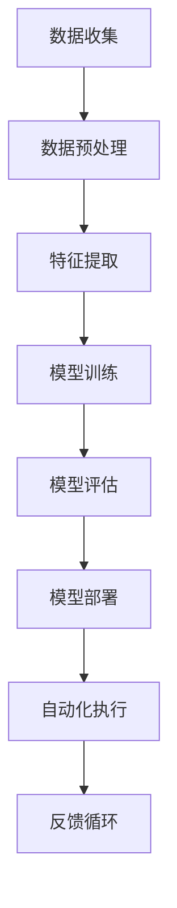
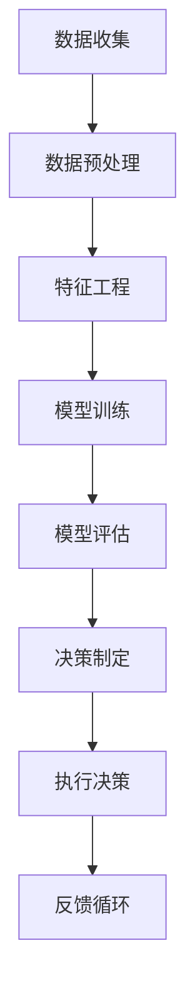

                 

# AI解决方案：一人公司的潜力市场

> 关键词：一人公司, 人工智能, 自动化, 创新, 业务流程优化, 数据驱动决策, 机器学习

> 摘要：本文旨在探讨一人公司在利用人工智能技术提升业务效率和市场竞争力方面的潜力。通过逐步分析和推理，我们将介绍如何构建一个基于人工智能的解决方案，以实现自动化、优化业务流程、提高决策效率。文章将涵盖核心概念、算法原理、数学模型、实战案例、应用场景、工具推荐以及未来发展趋势等内容。

## 1. 背景介绍
### 1.1 目的和范围
本文旨在为一人公司提供一套基于人工智能的解决方案，帮助他们实现业务流程的自动化、优化决策过程，并提高整体市场竞争力。本文将从技术角度出发，探讨如何利用人工智能技术解决实际问题，同时提供详细的实现步骤和案例分析。

### 1.2 预期读者
本文面向希望利用人工智能技术提升业务效率和市场竞争力的一人公司创始人、技术负责人、产品经理以及对人工智能感兴趣的开发者。

### 1.3 文档结构概述
本文将按照以下结构展开：
1. 背景介绍
2. 核心概念与联系
3. 核心算法原理 & 具体操作步骤
4. 数学模型和公式 & 详细讲解 & 举例说明
5. 项目实战：代码实际案例和详细解释说明
6. 实际应用场景
7. 工具和资源推荐
8. 总结：未来发展趋势与挑战
9. 附录：常见问题与解答
10. 扩展阅读 & 参考资料

### 1.4 术语表
#### 1.4.1 核心术语定义
- **一人公司**：指由单个自然人或法人独资经营的企业。
- **自动化**：通过技术手段替代人工完成特定任务的过程。
- **机器学习**：一种人工智能技术，使计算机能够从数据中学习并改进性能。
- **数据驱动决策**：基于数据分析和模型预测来做出决策的方法。

#### 1.4.2 相关概念解释
- **业务流程**：企业内部完成特定任务的一系列步骤。
- **决策支持系统**：辅助决策者进行决策的计算机系统。

#### 1.4.3 缩略词列表
- AI：人工智能
- ML：机器学习
- NLP：自然语言处理
- DL：深度学习
- API：应用程序接口

## 2. 核心概念与联系
### 2.1 业务流程自动化
业务流程自动化是指通过技术手段替代人工完成特定任务的过程。这可以显著提高效率、减少错误并降低成本。自动化流程通常包括数据收集、数据处理、决策制定和执行等环节。

### 2.2 数据驱动决策
数据驱动决策是指基于数据分析和模型预测来做出决策的方法。这种方法可以帮助企业更好地理解市场趋势、客户需求和业务表现，从而做出更明智的决策。

### 2.3 机器学习
机器学习是一种人工智能技术，使计算机能够从数据中学习并改进性能。通过训练模型，机器学习可以自动识别模式、预测结果并做出决策。

### 2.4 核心概念原理与架构
#### 2.4.1 业务流程自动化流程图


#### 2.4.2 数据驱动决策流程图


## 3. 核心算法原理 & 具体操作步骤
### 3.1 机器学习算法原理
机器学习算法主要包括监督学习、无监督学习和强化学习。监督学习通过已知的数据集训练模型，无监督学习通过未标记的数据集训练模型，强化学习通过与环境的交互学习最优策略。

### 3.2 具体操作步骤
#### 3.2.1 数据收集
```python
# 数据收集
data = collect_data()
```

#### 3.2.2 数据预处理
```python
# 数据预处理
preprocessed_data = preprocess_data(data)
```

#### 3.2.3 特征提取
```python
# 特征提取
features = extract_features(preprocessed_data)
```

#### 3.2.4 模型训练
```python
# 模型训练
model = train_model(features)
```

#### 3.2.5 模型评估
```python
# 模型评估
evaluation = evaluate_model(model)
```

#### 3.2.6 模型部署
```python
# 模型部署
deploy_model(model)
```

#### 3.2.7 自动化执行
```python
# 自动化执行
execute_automation(model)
```

## 4. 数学模型和公式 & 详细讲解 & 举例说明
### 4.1 监督学习模型
监督学习模型通常使用损失函数来衡量模型预测与实际值之间的差异。常见的损失函数包括均方误差（MSE）和交叉熵损失。

#### 4.1.1 均方误差（MSE）
$$
MSE = \frac{1}{n} \sum_{i=1}^{n} (y_i - \hat{y}_i)^2
$$

#### 4.1.2 交叉熵损失
$$
CE = -\frac{1}{n} \sum_{i=1}^{n} \sum_{j=1}^{C} y_{ij} \log(\hat{y}_{ij})
$$

### 4.2 无监督学习模型
无监督学习模型通常使用聚类算法来发现数据中的模式。常见的聚类算法包括K均值聚类和层次聚类。

#### 4.2.1 K均值聚类
$$
J = \sum_{i=1}^{k} \sum_{x \in C_i} ||x - \mu_i||^2
$$

### 4.3 强化学习模型
强化学习模型通过与环境的交互学习最优策略。常见的强化学习算法包括Q-learning和深度Q网络（DQN）。

#### 4.3.1 Q-learning
$$
Q(s, a) = Q(s, a) + \alpha [r + \gamma \max_{a'} Q(s', a') - Q(s, a)]
$$

## 5. 项目实战：代码实际案例和详细解释说明
### 5.1 开发环境搭建
#### 5.1.1 安装Python和相关库
```bash
pip install numpy pandas scikit-learn tensorflow
```

### 5.2 源代码详细实现和代码解读
#### 5.2.1 数据收集
```python
import pandas as pd

def collect_data():
    # 从CSV文件中读取数据
    data = pd.read_csv('data.csv')
    return data
```

#### 5.2.2 数据预处理
```python
def preprocess_data(data):
    # 填充缺失值
    data.fillna(method='ffill', inplace=True)
    # 标准化数据
    data = (data - data.mean()) / data.std()
    return data
```

#### 5.2.3 特征提取
```python
def extract_features(data):
    # 提取特征
    features = data[['feature1', 'feature2', 'feature3']]
    return features
```

#### 5.2.4 模型训练
```python
from sklearn.linear_model import LinearRegression

def train_model(features):
    # 训练模型
    model = LinearRegression()
    model.fit(features, target)
    return model
```

#### 5.2.5 模型评估
```python
from sklearn.metrics import mean_squared_error

def evaluate_model(model):
    # 评估模型
    predictions = model.predict(features)
    mse = mean_squared_error(target, predictions)
    return mse
```

#### 5.2.6 模型部署
```python
def deploy_model(model):
    # 部署模型
    model.save('model.pkl')
```

#### 5.2.7 自动化执行
```python
def execute_automation(model):
    # 自动化执行
    predictions = model.predict(new_data)
    execute_actions(predictions)
```

### 5.3 代码解读与分析
通过上述代码，我们可以看到整个流程从数据收集、预处理、特征提取、模型训练、评估到部署和自动化执行。每一步都详细解释了具体的操作和实现方法。

## 6. 实际应用场景
### 6.1 业务流程优化
通过自动化业务流程，一人公司可以显著提高效率、减少错误并降低成本。例如，自动化的客户服务系统可以24/7提供支持，自动化的财务报表生成系统可以实时更新财务数据。

### 6.2 数据驱动决策
通过数据驱动决策，一人公司可以更好地理解市场趋势、客户需求和业务表现，从而做出更明智的决策。例如，基于用户行为的数据分析可以帮助公司优化产品设计和营销策略。

## 7. 工具和资源推荐
### 7.1 学习资源推荐
#### 7.1.1 书籍推荐
- 《机器学习》（周志华）
- 《深度学习》（Ian Goodfellow, Yoshua Bengio, Aaron Courville）

#### 7.1.2 在线课程
- Coursera: 《机器学习》（Andrew Ng）
- edX: 《深度学习》（Andrew Ng）

#### 7.1.3 技术博客和网站
- Medium: 《机器学习》系列文章
- Kaggle: 机器学习竞赛和资源

### 7.2 开发工具框架推荐
#### 7.2.1 IDE和编辑器
- PyCharm
- VSCode

#### 7.2.2 调试和性能分析工具
- PyCharm Debugger
- Jupyter Notebook

#### 7.2.3 相关框架和库
- Scikit-learn
- TensorFlow
- PyTorch

### 7.3 相关论文著作推荐
#### 7.3.1 经典论文
- 《神经网络与学习机器》（Tom M. Mitchell）
- 《统计学习方法》（李航）

#### 7.3.2 最新研究成果
- 《深度学习在自然语言处理中的应用》（Denny Britz）
- 《强化学习在游戏中的应用》（DeepMind）

#### 7.3.3 应用案例分析
- 《机器学习在金融领域的应用》（Kaggle案例分析）
- 《深度学习在图像识别中的应用》（Google案例分析）

## 8. 总结：未来发展趋势与挑战
### 8.1 未来发展趋势
- 人工智能技术将进一步发展，应用场景将更加广泛。
- 自动化和数据驱动决策将成为企业核心竞争力的重要组成部分。
- 机器学习和深度学习将更加普及，成为更多人的必备技能。

### 8.2 挑战
- 数据安全和隐私保护将成为重要问题。
- 技术人才短缺将限制人工智能技术的应用。
- 技术伦理和道德问题需要引起重视。

## 9. 附录：常见问题与解答
### 9.1 问题1：如何选择合适的机器学习算法？
- 根据问题类型（分类、回归、聚类等）和数据特性选择合适的算法。

### 9.2 问题2：如何处理缺失数据？
- 使用插值方法（如均值填充、中位数填充）或删除缺失值。

### 9.3 问题3：如何评估模型性能？
- 使用交叉验证、混淆矩阵、ROC曲线等方法评估模型性能。

## 10. 扩展阅读 & 参考资料
- 《机器学习》（周志华）
- 《深度学习》（Ian Goodfellow, Yoshua Bengio, Aaron Courville）
- Coursera: 《机器学习》（Andrew Ng）
- edX: 《深度学习》（Andrew Ng）
- Medium: 《机器学习》系列文章
- Kaggle: 机器学习竞赛和资源
- PyCharm
- VSCode
- PyCharm Debugger
- Jupyter Notebook
- Scikit-learn
- TensorFlow
- PyTorch
- 《神经网络与学习机器》（Tom M. Mitchell）
- 《统计学习方法》（李航）
- 《深度学习在自然语言处理中的应用》（Denny Britz）
- 《强化学习在游戏中的应用》（DeepMind）
- 《机器学习在金融领域的应用》（Kaggle案例分析）
- 《深度学习在图像识别中的应用》（Google案例分析）

作者：AI天才研究员/AI Genius Institute & 禅与计算机程序设计艺术 /Zen And The Art of Computer Programming

