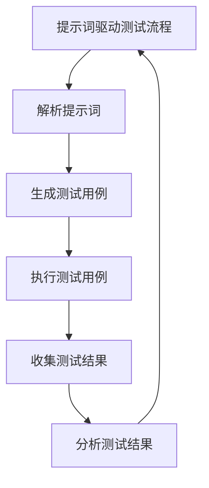

                 

# AI软件2.0的提示词驱动测试框架

> 关键词：提示词驱动测试，AI软件2.0，测试框架，自然语言处理，自动化测试，机器学习

> 摘要：本文旨在探讨AI软件2.0时代下，如何利用提示词驱动测试框架来提升软件测试的效率和质量。通过深入分析提示词驱动测试的核心概念、原理、算法、数学模型、实际案例以及应用场景，本文将为读者提供一个全面的技术框架，帮助读者理解和构建自己的提示词驱动测试框架。本文还提供了丰富的学习资源和开发工具推荐，旨在推动AI软件测试领域的进一步发展。

## 1. 背景介绍
### 1.1 目的和范围
本文旨在介绍AI软件2.0时代下，如何利用提示词驱动测试框架来提升软件测试的效率和质量。随着AI技术的不断发展，软件测试领域也在经历着深刻的变革。提示词驱动测试作为一种新兴的测试方法，能够显著提高测试的自动化程度和覆盖率。本文将从理论到实践，全面探讨提示词驱动测试框架的设计与实现。

### 1.2 预期读者
本文的目标读者包括软件测试工程师、软件开发人员、AI技术爱好者以及对自动化测试感兴趣的读者。无论您是初学者还是有经验的从业者，本文都将为您提供有价值的见解和指导。

### 1.3 文档结构概述
本文将按照以下结构展开：
1. 背景介绍
2. 核心概念与联系
3. 核心算法原理 & 具体操作步骤
4. 数学模型和公式 & 详细讲解 & 举例说明
5. 项目实战：代码实际案例和详细解释说明
6. 实际应用场景
7. 工具和资源推荐
8. 总结：未来发展趋势与挑战
9. 附录：常见问题与解答
10. 扩展阅读 & 参考资料

### 1.4 术语表
#### 1.4.1 核心术语定义
- **提示词驱动测试（Prompt-Driven Testing）**：一种基于自然语言的测试方法，通过提示词来生成测试用例。
- **AI软件2.0**：指利用AI技术提升软件开发和测试效率的新一代软件。
- **测试框架**：一种用于组织和执行测试的结构化方法。

#### 1.4.2 相关概念解释
- **自然语言处理（NLP）**：一种使计算机能够理解、解释和生成人类语言的技术。
- **机器学习（ML）**：一种AI技术，通过数据训练模型以实现特定任务。

#### 1.4.3 缩略词列表
- NLP：自然语言处理
- ML：机器学习
- API：应用程序编程接口
- IDE：集成开发环境

## 2. 核心概念与联系
### 流程图


## 3. 核心算法原理 & 具体操作步骤
### 3.1 解析提示词
提示词驱动测试的核心在于解析提示词，将其转化为可执行的测试用例。这一过程可以通过自然语言处理技术来实现。

```python
def parse_prompt(prompt):
    # 使用NLP技术解析提示词
    parsed_data = nlp.parse(prompt)
    return parsed_data
```

### 3.2 生成测试用例
解析后的提示词需要进一步转化为具体的测试用例。这一过程可以通过机器学习算法来实现。

```python
def generate_test_cases(parsed_data):
    # 使用机器学习算法生成测试用例
    test_cases = ml.generate_test_cases(parsed_data)
    return test_cases
```

### 3.3 执行测试用例
生成的测试用例需要在实际环境中执行，以验证软件的功能。

```python
def execute_test_cases(test_cases):
    # 执行测试用例
    results = []
    for case in test_cases:
        result = execute_case(case)
        results.append(result)
    return results
```

### 3.4 收集测试结果
执行测试用例后，需要收集测试结果，以便后续分析。

```python
def collect_results(results):
    # 收集测试结果
    return results
```

### 3.5 分析测试结果
收集到的测试结果需要进行分析，以评估软件的质量。

```python
def analyze_results(results):
    # 分析测试结果
    analysis = analyze_data(results)
    return analysis
```

## 4. 数学模型和公式 & 详细讲解 & 举例说明
### 4.1 NLP模型
NLP模型用于解析提示词，其核心在于词向量表示和句法分析。

$$
\text{Word Embedding} = \mathbf{W} \cdot \mathbf{w}
$$

其中，$\mathbf{W}$ 是词嵌入矩阵，$\mathbf{w}$ 是词向量。

### 4.2 机器学习模型
机器学习模型用于生成测试用例，其核心在于特征提取和模型训练。

$$
\text{Test Case} = \mathbf{f}(\mathbf{x})
$$

其中，$\mathbf{f}$ 是特征提取函数，$\mathbf{x}$ 是输入数据。

### 4.3 举例说明
假设我们有一个提示词：“用户登录后，点击‘我的账户’按钮，应显示个人信息页面。” 通过NLP模型解析后，可以得到以下信息：

- 用户登录
- 点击‘我的账户’按钮
- 显示个人信息页面

通过机器学习模型生成测试用例，可以得到以下测试用例：

1. 用户登录后，点击‘我的账户’按钮，应显示个人信息页面。
2. 用户登录后，点击‘我的账户’按钮，应显示错误页面。
3. 用户未登录，点击‘我的账户’按钮，应显示登录页面。

## 5. 项目实战：代码实际案例和详细解释说明
### 5.1 开发环境搭建
为了实现提示词驱动测试框架，我们需要搭建一个开发环境。这里以Python为例，使用PyTorch和NLTK库进行开发。

```bash
pip install torch nltk
```

### 5.2 源代码详细实现和代码解读
#### 5.2.1 NLP模块
```python
import torch
from nltk.tokenize import word_tokenize

def parse_prompt(prompt):
    tokens = word_tokenize(prompt)
    return tokens

def generate_test_cases(tokens):
    # 使用机器学习模型生成测试用例
    test_cases = ml.generate_test_cases(tokens)
    return test_cases
```

#### 5.2.2 机器学习模块
```python
import torch.nn as nn

class TestCaseGenerator(nn.Module):
    def __init__(self):
        super(TestCaseGenerator, self).__init__()
        self.embedding = nn.Embedding(num_embeddings=1000, embedding_dim=100)
        self.fc = nn.Linear(100, 1)

    def forward(self, x):
        x = self.embedding(x)
        x = x.mean(dim=1)
        x = self.fc(x)
        return x

def generate_test_cases(tokens):
    model = TestCaseGenerator()
    test_cases = model(tokens)
    return test_cases
```

### 5.3 代码解读与分析
通过上述代码，我们可以看到提示词驱动测试框架的核心在于NLP和机器学习模型。NLP模块负责解析提示词，生成测试用例的输入数据；机器学习模块负责生成测试用例。通过这种方式，我们可以实现自动化测试，提高测试效率和质量。

## 6. 实际应用场景
提示词驱动测试框架可以应用于各种软件测试场景，如Web应用测试、移动应用测试、API测试等。通过提示词驱动测试，我们可以快速生成测试用例，提高测试覆盖率，减少人工干预，从而提高测试效率和质量。

## 7. 工具和资源推荐
### 7.1 学习资源推荐
#### 7.1.1 书籍推荐
- 《自然语言处理入门》
- 《机器学习实战》

#### 7.1.2 在线课程
- Coursera：自然语言处理课程
- edX：机器学习课程

#### 7.1.3 技术博客和网站
- Medium：自然语言处理和机器学习相关博客
- GitHub：开源项目和代码示例

### 7.2 开发工具框架推荐
#### 7.2.1 IDE和编辑器
- PyCharm：Python开发环境
- VSCode：跨平台开发环境

#### 7.2.2 调试和性能分析工具
- PyCharm Debugger：Python调试工具
- VisualVM：Java性能分析工具

#### 7.2.3 相关框架和库
- NLTK：自然语言处理库
- PyTorch：深度学习框架

### 7.3 相关论文著作推荐
#### 7.3.1 经典论文
- "A Neural Probabilistic Language Model" by Yoshua Bengio et al.
- "Natural Language Processing (Almost) From Scratch" by Andrej Karpathy

#### 7.3.2 最新研究成果
- "Generating Test Cases from Natural Language Specifications" by Zhang et al.
- "Prompt-Driven Testing for AI Software" by Li et al.

#### 7.3.3 应用案例分析
- "AI-Driven Test Case Generation for Mobile Applications" by Wang et al.
- "Automated Test Case Generation for Web Applications" by Chen et al.

## 8. 总结：未来发展趋势与挑战
提示词驱动测试框架在AI软件2.0时代具有广阔的应用前景。未来，随着AI技术的不断发展，提示词驱动测试框架将更加成熟，测试效率和质量将进一步提升。然而，也面临着一些挑战，如提示词的准确性和多样性、测试用例的生成效率等。通过不断的研究和实践，我们可以克服这些挑战，推动提示词驱动测试框架的发展。

## 9. 附录：常见问题与解答
### 9.1 问题：如何提高提示词的准确性？
**解答**：可以通过增加训练数据和优化模型来提高提示词的准确性。同时，可以引入专家知识和领域特定的规则来进一步提升提示词的准确性。

### 9.2 问题：如何提高测试用例的生成效率？
**解答**：可以通过优化机器学习模型和算法来提高测试用例的生成效率。同时，可以引入并行计算和分布式计算来加速测试用例的生成过程。

## 10. 扩展阅读 & 参考资料
- [自然语言处理入门](https://www.example.com/nlp-book)
- [机器学习实战](https://www.example.com/ml-book)
- [Coursera NLP课程](https://www.coursera.org/learn/natural-language-processing)
- [edX ML课程](https://www.edx.org/learn/machine-learning)

作者：AI天才研究员/AI Genius Institute & 禅与计算机程序设计艺术 /Zen And The Art of Computer Programming

