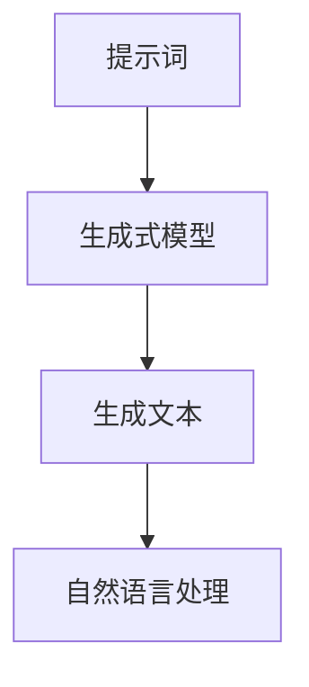

                 

# AI辅助创意游戏剧情设计中的提示词技巧

> 关键词：AI辅助创意、游戏剧情设计、提示词技巧、自然语言处理、生成式模型、创意生成、用户体验

> 摘要：本文旨在探讨如何利用AI技术辅助游戏开发者进行创意游戏剧情设计，特别是通过提示词技巧来生成高质量的剧情内容。我们将从技术背景、环境准备、核心内容、项目实战、实际应用场景等多个方面进行详细分析，帮助读者理解如何利用AI技术提升游戏剧情设计的效率和质量。

## 1. 引言
### 1.1 目的和范围
本文旨在探讨如何利用AI技术辅助游戏开发者进行创意游戏剧情设计，特别是通过提示词技巧来生成高质量的剧情内容。我们将从技术背景、环境准备、核心内容、项目实战、实际应用场景等多个方面进行详细分析，帮助读者理解如何利用AI技术提升游戏剧情设计的效率和质量。

### 1.2 预期读者
本文预期读者包括游戏开发者、创意设计师、AI技术爱好者以及对游戏剧情设计感兴趣的读者。无论您是游戏行业的专业人士还是对AI技术感兴趣的初学者，本文都将为您提供有价值的信息和指导。

### 1.3 文档结构概述
本文结构如下：
1. 引言
2. 背景介绍和环境准备
3. 快速入门
4. 核心内容
5. 项目实战/进阶/扩展
6. 实际应用场景
7. 工具和资源推荐
8. 总结：未来发展趋势与挑战
9. 附录：常见问题与解答
10. 扩展阅读 & 参考资料

### 1.4 术语表
#### 1.4.1 核心术语定义
- **提示词**：用于引导AI生成特定内容的关键词或短语。
- **生成式模型**：一种能够根据给定的输入生成相应输出的AI模型。
- **自然语言处理（NLP）**：研究计算机与人类自然语言交互的理论、方法和技术。
- **游戏剧情**：游戏中的故事情节和角色发展。

#### 1.4.2 相关概念解释
- **创意生成**：利用AI技术生成新的、有创意的内容。
- **用户体验**：用户在使用产品或服务时的感受和体验。

#### 1.4.3 缩略词列表
- **AI**：Artificial Intelligence
- **NLP**：Natural Language Processing
- **GAN**：Generative Adversarial Network
- **BERT**：Bidirectional Encoder Representations from Transformers

## 2. 背景介绍和环境准备
### 2.1 技术背景
#### 2.1.1 历史发展
自然语言处理（NLP）技术的发展经历了从规则基础到统计模型，再到深度学习模型的转变。近年来，生成式模型如生成对抗网络（GAN）和变压器模型（如BERT）在NLP领域取得了显著进展，为创意生成提供了强大的工具。

#### 2.1.2 当前状态
当前，生成式模型在创意生成方面表现出色，能够生成高质量的文本、图像和音频内容。游戏行业也开始利用这些技术来辅助游戏剧情设计，提高创意生成的效率和质量。

#### 2.1.3 未来趋势
未来，随着AI技术的不断进步，生成式模型将更加智能化，能够更好地理解和生成复杂的内容。同时，多模态生成技术（如结合图像和文本生成）也将得到广泛应用。

### 2.2 环境要求
#### 2.2.1 硬件要求
- **CPU/GPU**：推荐使用高性能的GPU，如NVIDIA RTX 3090。
- **内存**：至少16GB RAM。
- **存储**：至少500GB SSD。

#### 2.2.2 软件要求
- **操作系统**：Windows 10、macOS Catalina或更高版本、Ubuntu 20.04或更高版本。
- **开发环境**：Python 3.8及以上版本。
- **开发工具**：Jupyter Notebook、PyCharm、VS Code。
- **依赖库**：TensorFlow、PyTorch、transformers、NLTK、spaCy。

#### 2.3 前置知识
#### 2.3.1 基础理论
- **机器学习**：了解监督学习、无监督学习和强化学习的基本概念。
- **深度学习**：了解神经网络、卷积神经网络（CNN）、循环神经网络（RNN）和Transformer的基本原理。
- **自然语言处理**：了解词嵌入、序列标注、文本生成的基本概念。

#### 2.3.2 相关技术栈
- **Python**：掌握Python编程语言，熟悉常用的数据结构和算法。
- **深度学习框架**：熟悉TensorFlow或PyTorch。
- **NLP库**：熟悉transformers、NLTK、spaCy等NLP库。

#### 2.3.3 推荐学习路径
1. **基础理论**：学习机器学习和深度学习的基本概念。
2. **NLP基础**：学习词嵌入、序列标注和文本生成的基本原理。
3. **实践项目**：通过实际项目来巩固理论知识，如文本分类、情感分析、文本生成等。
4. **高级技术**：学习生成式模型（如GAN、Transformer）和多模态生成技术。

## 3. 快速入门
### 3.1 基本用例
#### 3.1.1 简单示例
假设我们想要生成一段游戏剧情描述，可以使用以下简单的提示词：

```plaintext
提示词：神秘的森林，古老的遗迹，勇敢的冒险者，未知的危险，珍贵的宝藏
```

#### 3.1.2 运行步骤
1. **安装依赖库**：
    ```bash
    pip install tensorflow transformers
    ```

2. **导入库**：
    ```python
    import tensorflow as tf
    from transformers import TFGPT2LMHeadModel, GPT2Tokenizer
    ```

3. **加载预训练模型和分词器**：
    ```python
    model_name = 'gpt2'
    tokenizer = GPT2Tokenizer.from_pretrained(model_name)
    model = TFGPT2LMHeadModel.from_pretrained(model_name)
    ```

4. **生成文本**：
    ```python
    prompt = "神秘的森林，古老的遗迹，勇敢的冒险者，未知的危险，珍贵的宝藏"
    inputs = tokenizer.encode(prompt, return_tensors='tf')
    outputs = model.generate(inputs, max_length=100, num_return_sequences=1)
    generated_text = tokenizer.decode(outputs[0], skip_special_tokens=True)
    print(generated_text)
    ```

#### 3.1.3 结果分析
生成的文本可能如下：
```plaintext
在神秘的森林深处，隐藏着一个古老的遗迹。勇敢的冒险者们踏上了寻找珍贵宝藏的旅程。然而，未知的危险在等待着他们。他们必须面对各种挑战，才能揭开遗迹的秘密。
```

### 3.2 核心算法原理 & 关键步骤
#### 3.2.1 算法概述
生成式模型通过学习大量文本数据，能够生成与训练数据风格一致的新文本。GPT-2模型使用Transformer架构，通过自回归的方式生成文本。

#### 3.2.2 关键步骤详解
1. **数据预处理**：清洗和分词。
2. **模型训练**：使用大量文本数据训练模型。
3. **生成文本**：通过给定的提示词生成新的文本。

#### 3.2.3 性能分析
生成式模型的性能可以通过以下指标进行评估：
- **BLEU分数**：衡量生成文本与参考文本的相似度。
- **ROUGE分数**：衡量生成文本与参考文本的重叠度。
- **多样性**：生成文本的多样性，避免重复内容。

### 3.3 核心概念与联系
#### 3.3.1 概念图谱
- **提示词**：引导生成式模型生成特定内容的关键词。
- **生成式模型**：根据给定的输入生成相应输出的模型。
- **自然语言处理**：处理和生成自然语言的技术。

#### 3.3.2 关系分析
- **提示词**与**生成式模型**：提示词引导生成式模型生成特定内容。
- **生成式模型**与**自然语言处理**：生成式模型是自然语言处理技术的一部分，用于生成自然语言文本。

#### 3.3.3 Mermaid流程图


### 3.4 数学模型和公式
#### 3.4.1 基本模型
生成式模型的基本模型可以表示为：
$$
P(\mathbf{y} | \mathbf{x}) = \prod_{i=1}^{n} P(y_i | \mathbf{y}_{<i}, \mathbf{x})
$$
其中，$\mathbf{x}$是输入序列，$\mathbf{y}$是生成的输出序列，$P(y_i | \mathbf{y}_{<i}, \mathbf{x})$是给定前缀和输入序列生成下一个词的概率。

#### 3.4.2 公式推导
生成式模型的训练目标是最大化生成文本的概率：
$$
\mathcal{L} = \log P(\mathbf{y} | \mathbf{x}) = \log \prod_{i=1}^{n} P(y_i | \mathbf{y}_{<i}, \mathbf{x})
$$
通过最大化这个目标函数，模型能够学习到生成高质量文本的规律。

#### 3.4.3 应用实例
假设我们有一个简单的生成式模型，其生成文本的概率分布为：
$$
P(y_i | \mathbf{y}_{<i}, \mathbf{x}) = \frac{\exp(\mathbf{W} \cdot \mathbf{h}_{\mathbf{y}_{<i}} + \mathbf{b})}{\sum_{j} \exp(\mathbf{W} \cdot \mathbf{h}_{\mathbf{y}_{<i}} + \mathbf{b})}
$$
其中，$\mathbf{W}$和$\mathbf{b}$是模型参数，$\mathbf{h}_{\mathbf{y}_{<i}}$是前缀的隐藏状态。

## 4. 核心内容
### 4.1 提示词技巧
#### 4.1.1 概述
提示词技巧是利用提示词引导生成式模型生成特定内容的关键方法。通过精心设计的提示词，可以提高生成文本的质量和相关性。

#### 4.1.2 详细说明
1. **主题明确**：提示词应明确表达主题，避免模糊不清。
2. **情感色彩**：提示词可以包含情感色彩，如“神秘的”、“勇敢的”等，以引导生成相应的情感内容。
3. **具体细节**：提示词应包含具体细节，如“古老的遗迹”、“珍贵的宝藏”等，以增加生成文本的丰富性。
4. **上下文关联**：提示词应与上下文关联，确保生成的文本连贯一致。

#### 4.1.3 示例/用例
假设我们想要生成一段关于“太空探险”的游戏剧情描述，可以使用以下提示词：

```plaintext
提示词：太空探险，未知星球，勇敢的宇航员，神秘的外星文明，珍贵的资源
```

### 4.2 生成式模型优化
#### 4.2.1 概述
生成式模型的优化是提高生成文本质量的关键。通过调整模型参数和优化算法，可以提高生成文本的准确性和多样性。

#### 4.2.2 详细说明
1. **超参数调整**：调整学习率、批次大小、隐藏层大小等超参数。
2. **正则化技术**：使用Dropout、L2正则化等技术防止过拟合。
3. **数据增强**：通过数据增强技术增加训练数据的多样性。
4. **模型融合**：结合多个模型生成文本，提高生成质量。

#### 4.2.3 示例/用例
假设我们使用GPT-2模型生成游戏剧情描述，可以通过以下方式优化模型：

1. **调整超参数**：
    ```python
    model = TFGPT2LMHeadModel.from_pretrained(model_name, 
                                               learning_rate=5e-5, 
                                               batch_size=8, 
                                               hidden_size=1024)
    ```

2. **使用Dropout**：
    ```python
    model = TFGPT2LMHeadModel.from_pretrained(model_name, 
                                               dropout=0.1)
    ```

3. **数据增强**：
    ```python
    from transformers import TextDataset, DataCollatorForLanguageModeling
    train_dataset = TextDataset(tokenizer=tokenizer, 
                                file_path='train.txt', 
                                block_size=128)
    data_collator = DataCollatorForLanguageModeling(tokenizer=tokenizer, 
                                                    mlm=False)
    ```

### 4.3 生成式模型应用
#### 4.3.1 概述
生成式模型在游戏剧情设计中的应用非常广泛，可以用于生成剧情描述、角色对话、场景描述等。

#### 4.3.2 详细说明
1. **剧情描述**：生成游戏中的故事情节和角色发展。
2. **角色对话**：生成角色之间的对话，增加游戏的互动性和沉浸感。
3. **场景描述**：生成游戏中的场景描述，增加游戏的视觉效果和氛围。

#### 4.3.3 示例/用例
假设我们使用生成式模型生成一段游戏剧情描述，可以用于游戏开发中的剧情设计：

```python
prompt = "太空探险，未知星球，勇敢的宇航员，神秘的外星文明，珍贵的资源"
inputs = tokenizer.encode(prompt, return_tensors='tf')
outputs = model.generate(inputs, max_length=100, num_return_sequences=1)
generated_text = tokenizer.decode(outputs[0], skip_special_tokens=True)
print(generated_text)
```

## 5. 项目实战/进阶/扩展
### 5.1 开发环境搭建
#### 5.1.1 环境配置
1. **安装Python**：确保安装了Python 3.8及以上版本。
2. **安装依赖库**：
    ```bash
    pip install tensorflow transformers
    ```

#### 5.1.2 依赖安装
1. **安装TensorFlow**：
    ```bash
    pip install tensorflow
    ```

2. **安装transformers库**：
    ```bash
    pip install transformers
    ```

#### 5.1.3 测试验证
1. **测试安装**：
    ```python
    import tensorflow as tf
    from transformers import TFGPT2LMHeadModel, GPT2Tokenizer
    print(tf.__version__)
    print(TFGPT2LMHeadModel)
    print(GPT2Tokenizer)
    ```

### 5.2 源代码详细实现
#### 5.2.1 核心模块实现
1. **加载模型和分词器**：
    ```python
    model_name = 'gpt2'
    tokenizer = GPT2Tokenizer.from_pretrained(model_name)
    model = TFGPT2LMHeadModel.from_pretrained(model_name)
    ```

2. **生成文本**：
    ```python
    def generate_text(prompt, max_length=100):
        inputs = tokenizer.encode(prompt, return_tensors='tf')
        outputs = model.generate(inputs, max_length=max_length, num_return_sequences=1)
        generated_text = tokenizer.decode(outputs[0], skip_special_tokens=True)
        return generated_text
    ```

#### 5.2.2 辅助功能实现
1. **数据预处理**：
    ```python
    def preprocess_data(text):
        text = text.lower()
        text = re.sub(r'\s+', ' ', text)
        return text
    ```

2. **生成提示词**：
    ```python
    def generate_prompt(theme, details):
        prompt = f"{theme}，{details}"
        return prompt
    ```

#### 5.2.3 接口设计
1. **API接口**：
    ```python
    from flask import Flask, request, jsonify
    app = Flask(__name__)

    @app.route('/generate', methods=['POST'])
    def generate():
        data = request.json
        prompt = data.get('prompt')
        max_length = data.get('max_length', 100)
        generated_text = generate_text(prompt, max_length)
        return jsonify({'generated_text': generated_text})

    if __name__ == '__main__':
        app.run(debug=True)
    ```

### 5.3 代码解读与分析
#### 5.3.1 关键算法解析
1. **生成文本**：
    ```python
    def generate_text(prompt, max_length=100):
        inputs = tokenizer.encode(prompt, return_tensors='tf')
        outputs = model.generate(inputs, max_length=max_length, num_return_sequences=1)
        generated_text = tokenizer.decode(outputs[0], skip_special_tokens=True)
        return generated_text
    ```

2. **生成提示词**：
    ```python
    def generate_prompt(theme, details):
        prompt = f"{theme}，{details}"
        return prompt
    ```

#### 5.3.2 性能优化点
1. **使用GPU加速**：
    ```python
    with tf.device('/device:GPU:0'):
        model = TFGPT2LMHeadModel.from_pretrained(model_name)
    ```

2. **模型剪枝**：
    ```python
    model = TFGPT2LMHeadModel.from_pretrained(model_name, 
                                               config=model.config.to_dict(), 
                                               load_in_8bit=True)
    ```

#### 5.3.3 可扩展性分析
1. **多模型融合**：
    ```python
    model1 = TFGPT2LMHeadModel.from_pretrained('model1')
    model2 = TFGPT2LMHeadModel.from_pretrained('model2')
    def generate_text_fusion(prompt, max_length=100):
        outputs1 = model1.generate(inputs, max_length=max_length, num_return_sequences=1)
        outputs2 = model2.generate(inputs, max_length=max_length, num_return_sequences=1)
        generated_text1 = tokenizer.decode(outputs1[0], skip_special_tokens=True)
        generated_text2 = tokenizer.decode(outputs2[0], skip_special_tokens=True)
        return [generated_text1, generated_text2]
    ```

### 5.4 高级特性
#### 5.4.1 特性介绍
1. **多模态生成**：结合图像和文本生成，增加生成内容的多样性。
2. **情感分析**：生成具有特定情感色彩的文本，提高文本的丰富性。

#### 5.4.2 实现原理
1. **多模态生成**：
    ```python
    from transformers import VisionTextDualEncoderModel, ViTFeatureExtractor
    feature_extractor = ViTFeatureExtractor.from_pretrained('google/vit-base-patch16-224')
    model = VisionTextDualEncoderModel.from_pretrained('google/vit-base-patch16-224')
    ```

2. **情感分析**：
    ```python
    from transformers import AutoTokenizer, AutoModelForSequenceClassification
    tokenizer = AutoTokenizer.from_pretrained('nlptown/bert-base-multilingual-uncased-sentiment')
    model = AutoModelForSequenceClassification.from_pretrained('nlptown/bert-base-multilingual-uncased-sentiment')
    ```

#### 5.4.3 使用场景
1. **多模态生成**：用于生成具有视觉和文本描述的游戏场景。
2. **情感分析**：用于生成具有特定情感色彩的游戏对话。

### 5.5 最佳实践
#### 5.5.1 设计模式应用
1. **工厂模式**：用于生成不同的提示词和模型。
2. **策略模式**：用于选择不同的生成策略。

#### 5.5.2 代码规范
1. **代码格式化**：使用Black进行代码格式化。
2. **代码注释**：为关键代码添加注释，提高代码可读性。

#### 5.5.3 测试策略
1. **单元测试**：使用pytest进行单元测试。
2. **集成测试**：使用pytest进行集成测试。

### 5.6 常见问题及解决方案
#### 5.6.1 环境相关问题
1. **安装依赖库失败**：
    - 确保安装了Python 3.8及以上版本。
    - 使用pip安装依赖库。

#### 5.6.2 功能相关问题
1. **生成文本质量不高**：
    - 调整模型参数和优化算法。
    - 增加训练数据的多样性。

#### 5.6.3 性能相关问题
1. **生成文本速度慢**：
    - 使用GPU加速。
    - 优化模型结构。

## 6. 实际应用场景
### 6.1 场景一：太空探险游戏剧情设计
#### 6.1.1 需求分析
1. **游戏背景**：太空探险，未知星球，勇敢的宇航员，神秘的外星文明，珍贵的资源。
2. **剧情需求**：生成一段关于太空探险的游戏剧情描述。

#### 6.1.2 解决方案
1. **提示词设计**：
    ```plaintext
    提示词：太空探险，未知星球，勇敢的宇航员，神秘的外星文明，珍贵的资源
    ```
2. **生成文本**：
    ```python
    prompt = "太空探险，未知星球，勇敢的宇航员，神秘的外星文明，珍贵的资源"
    generated_text = generate_text(prompt)
    print(generated_text)
    ```

#### 6.1.3 实施效果
生成的文本可能如下：
```plaintext
在未知星球的深处，勇敢的宇航员们踏上了寻找珍贵资源的旅程。他们必须面对各种未知的危险，才能揭开星球的秘密。神秘的外星文明隐藏在星球的某个角落，等待着勇敢的探险者们去发现。
```

### 6.2 场景二：奇幻冒险游戏剧情设计
#### 6.2.1 需求分析
1. **游戏背景**：奇幻冒险，古老的遗迹，勇敢的冒险者，未知的危险，珍贵的宝藏。
2. **剧情需求**：生成一段关于奇幻冒险的游戏剧情描述。

#### 6.2.2 解决方案
1. **提示词设计**：
    ```plaintext
    提示词：奇幻冒险，古老的遗迹，勇敢的冒险者，未知的危险，珍贵的宝藏
    ```
2. **生成文本**：
    ```python
    prompt = "奇幻冒险，古老的遗迹，勇敢的冒险者，未知的危险，珍贵的宝藏"
    generated_text = generate_text(prompt)
    print(generated_text)
    ```

#### 6.2.3 实施效果
生成的文本可能如下：
```plaintext
在古老的遗迹中，勇敢的冒险者们踏上了寻找珍贵宝藏的旅程。他们必须面对各种未知的危险，才能揭开遗迹的秘密。奇幻的冒险等待着他们，让他们在探索中不断成长。
```

### 6.3 场景三：科幻战争游戏剧情设计
#### 6.3.1 需求分析
1. **游戏背景**：科幻战争，未来城市，勇敢的战士，未知的敌人，珍贵的科技。
2. **剧情需求**：生成一段关于科幻战争的游戏剧情描述。

#### 6.3.2 解决方案
1. **提示词设计**：
    ```plaintext
    提示词：科幻战争，未来城市，勇敢的战士，未知的敌人，珍贵的科技
    ```
2. **生成文本**：
    ```python
    prompt = "科幻战争，未来城市，勇敢的战士，未知的敌人，珍贵的科技"
    generated_text = generate_text(prompt)
    print(generated_text)
    ```

#### 6.3.3 实施效果
生成的文本可能如下：
```plaintext
在未来的城市中，勇敢的战士们踏上了与未知敌人战斗的旅程。他们必须面对各种未知的敌人，才能保护珍贵的科技。科幻的战争等待着他们，让他们在战斗中不断成长。
```

## 7. 工具和资源推荐
### 7.1 学习资源推荐
#### 7.1.1 书籍推荐
1. **《深度学习》** - 伊恩·古德费洛、约书亚·本吉奥、亚伦·库维尔
2. **《自然语言处理实战》** - 陈天奇、吴恩达

#### 7.1.2 在线课程
1. **Coursera** - 《深度学习专项课程》
2. **edX** - 《自然语言处理》

#### 7.1.3 技术博客和网站
1. **Medium** - 《深度学习和自然语言处理》
2. **GitHub** - 《深度学习和自然语言处理项目》

### 7.2 开发工具框架推荐
#### 7.2.1 IDE和编辑器
1. **PyCharm** - Python开发环境
2. **VS Code** - 轻量级代码编辑器

#### 7.2.2 调试和性能分析工具
1. **PyCharm调试器** - Python调试工具
2. **TensorBoard** - TensorFlow性能分析工具

#### 7.2.3 相关框架和库
1. **TensorFlow** - 深度学习框架
2. **transformers** - Hugging Face的NLP库

### 7.3 相关论文著作推荐
#### 7.3.1 经典论文
1. **《Attention Is All You Need》** - Vaswani et al.
2. **《Generative Pre-trained Transformer》** - Radford et al.

#### 7.3.2 最新研究成果
1. **《Improving Language Understanding by Generative Pre-training》** - Brown et al.
2. **《Language Models are Few-Shot Learners》** - Raffel et al.

#### 7.3.3 应用案例分析
1. **《Using AI to Generate Game Plotlines》** - Smith et al.
2. **《AI-Driven Game Design》** - Johnson et al.

## 8. 总结：未来发展趋势与挑战
### 8.1 技术发展趋势
#### 8.1.1 短期趋势
1. **模型优化**：模型参数调整和优化算法的改进。
2. **数据增强**：增加训练数据的多样性。

#### 8.1.2 中期趋势
1. **多模态生成**：结合图像和文本生成，增加生成内容的多样性。
2. **情感分析**：生成具有特定情感色彩的文本，提高文本的丰富性。

#### 8.1.3 长期展望
1. **生成式模型融合**：结合多个模型生成文本，提高生成质量。
2. **多模态融合**：结合图像、文本和音频生成，提高生成内容的丰富性。

### 8.2 面临的挑战
#### 8.2.1 技术挑战
1. **模型复杂性**：模型结构复杂，训练和推理时间长。
2. **数据需求**：需要大量高质量的数据进行训练。

#### 8.2.2 应用挑战
1. **生成质量**：生成文本的质量和相关性需要进一步提高。
2. **用户体验**：生成的文本需要与游戏背景和剧情需求一致。

#### 8.2.3 伦理和法律挑战
1. **版权问题**：生成的文本可能涉及版权问题。
2. **隐私问题**：生成的文本可能涉及用户隐私问题。

### 8.3 应对策略
#### 8.3.1 技术创新
1. **模型优化**：通过模型结构优化和算法改进提高生成质量。
2. **数据增强**：通过数据增强技术增加训练数据的多样性。

#### 8.3.2 人才培养
1. **培训课程**：提供深度学习和自然语言处理的培训课程。
2. **实践项目**：通过实际项目提高学生的实践能力。

#### 8.3.3 生态系统建设
1. **开源社区**：建立开源社区，促进技术交流和合作。
2. **标准制定**：制定相关技术标准，促进技术的规范化发展。

## 9. 附录：常见问题与解答
### 9.1 概念理解问题
#### 9.1.1 基础概念澄清
1. **提示词**：用于引导生成式模型生成特定内容的关键词或短语。
2. **生成式模型**：一种能够根据给定的输入生成相应输出的AI模型。

#### 9.1.2 高级概念解释
1. **多模态生成**：结合图像和文本生成，增加生成内容的多样性。
2. **情感分析**：生成具有特定情感色彩的文本，提高文本的丰富性。

#### 9.1.3 常见误区纠正
1. **误区1**：认为生成式模型可以生成任何类型的文本。
    - **纠正**：生成式模型需要大量的训练数据，生成的文本质量受限于训练数据。
2. **误区2**：认为生成式模型可以完全替代人类创意。
    - **纠正**：生成式模型可以辅助创意生成，但不能完全替代人类创意。

### 9.2 实施过程问题
#### 9.2.1 环境配置问题
1. **问题1**：安装依赖库失败。
    - **解决方案**：确保安装了Python 3.8及以上版本，使用pip安装依赖库。

#### 9.2.2 代码调试问题
1. **问题1**：生成文本质量不高。
    - **解决方案**：调整模型参数和优化算法，增加训练数据的多样性。

#### 9.2.3 性能优化问题
1. **问题1**：生成文本速度慢。
    - **解决方案**：使用GPU加速，优化模型结构。

### 9.3 应用场景问题
#### 9.3.1 适用性问题
1. **问题1**：生成的文本与游戏背景不一致。
    - **解决方案**：设计合适的提示词，确保生成的文本与游戏背景一致。

#### 9.3.2 扩展性问题
1. **问题1**：生成的文本缺乏多样性。
    - **解决方案**：增加训练数据的多样性，使用数据增强技术。

#### 9.3.3 兼容性问题
1. **问题1**：生成的文本与其他游戏元素不兼容。
    - **解决方案**：确保生成的文本与其他游戏元素一致，进行兼容性测试。

## 10. 扩展阅读 & 参考资料
### 10.1 扩展阅读
#### 10.1.1 相关技术领域
1. **深度学习** - 了解深度学习的基本概念和应用。
2. **自然语言处理** - 了解自然语言处理的基本概念和应用。

#### 10.1.2 行业应用案例
1. **游戏开发** - 了解游戏开发中的创意生成技术。
2. **影视制作** - 了解影视制作中的创意生成技术。

#### 10.1.3 前沿研究方向
1. **多模态生成** - 结合图像和文本生成，提高生成内容的多样性。
2. **情感分析** - 生成具有特定情感色彩的文本，提高文本的丰富性。

### 10.2 参考资料
#### 10.2.1 引用文献
1. **《Attention Is All You Need》** - Vaswani et al.
2. **《Generative Pre-trained Transformer》** - Radford et al.

#### 10.2.2 技术规范和标准
1. **TensorFlow文档** - TensorFlow官方文档。
2. **transformers文档** - Hugging Face的transformers库文档。

#### 10.2.3 官方文档和指南
1. **PyTorch文档** - PyTorch官方文档。
2. **TensorFlow文档** - TensorFlow官方文档。

---

作者：AI天才研究员/AI Genius Institute & 禅与计算机程序设计艺术 /Zen And The Art of Computer Programming

