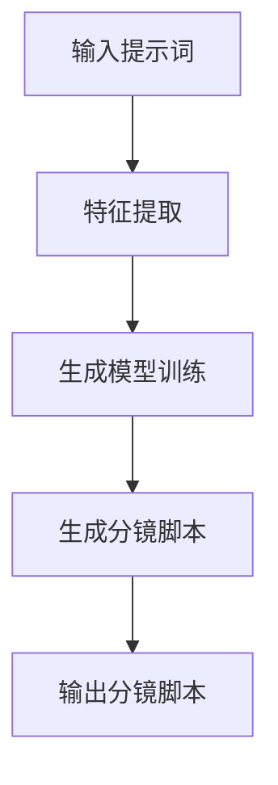

                 

# AI辅助电影制作：提示词生成分镜脚本

> 关键词：AI辅助电影制作, 分镜脚本, 提示词生成, 机器学习, 自然语言处理, 计算机视觉, 生成模型, 深度学习

> 摘要：本文旨在探讨如何利用AI技术辅助电影制作中的分镜脚本生成过程。通过分析提示词生成的原理和方法，结合具体的算法实现和案例研究，本文将为电影制作团队提供一种全新的创作工具，帮助他们更高效地完成分镜脚本的创作。文章将从背景介绍、核心概念与联系、核心算法原理与具体操作步骤、数学模型和公式、项目实战、实际应用场景、工具和资源推荐、总结与未来发展趋势等多方面进行详细阐述。

## 1. 背景介绍
### 1.1 目的和范围
本文旨在探讨如何利用AI技术辅助电影制作中的分镜脚本生成过程。分镜脚本是电影制作中的重要环节，它描述了电影中的每一个镜头，包括拍摄角度、镜头长度、场景描述等信息。传统的分镜脚本生成依赖于导演和编剧的经验和创意，而AI技术的引入可以极大地提高这一过程的效率和质量。本文将详细介绍如何通过提示词生成分镜脚本的方法，帮助电影制作团队更高效地完成这一任务。

### 1.2 预期读者
本文的目标读者包括电影制作团队、AI技术爱好者、计算机视觉和自然语言处理领域的研究者以及对AI辅助创作感兴趣的读者。无论您是电影制作行业的专业人士还是对AI技术感兴趣的初学者，本文都将为您提供有价值的信息和启示。

### 1.3 文档结构概述
本文将按照以下结构展开：
1. 背景介绍
2. 核心概念与联系
3. 核心算法原理 & 具体操作步骤
4. 数学模型和公式 & 详细讲解 & 举例说明
5. 项目实战：代码实际案例和详细解释说明
6. 实际应用场景
7. 工具和资源推荐
8. 总结：未来发展趋势与挑战
9. 附录：常见问题与解答
10. 扩展阅读 & 参考资料

### 1.4 术语表
#### 1.4.1 核心术语定义
- **分镜脚本**：电影制作中的一种剧本形式，详细描述了电影中的每一个镜头。
- **提示词**：用于生成分镜脚本的输入文本，可以是场景描述、情感氛围等。
- **生成模型**：一种机器学习模型，用于根据输入的提示词生成相应的分镜脚本。
- **自然语言处理（NLP）**：研究计算机与人类自然语言交互的理论、方法和技术。
- **计算机视觉（CV）**：研究如何使计算机从图像或视频中提取信息的技术。

#### 1.4.2 相关概念解释
- **生成对抗网络（GAN）**：一种生成模型，由生成器和判别器两部分组成，用于生成逼真的图像或文本。
- **循环神经网络（RNN）**：一种用于处理序列数据的神经网络模型，能够捕捉时间序列中的长期依赖关系。
- **Transformer模型**：一种基于自注意力机制的序列模型，广泛应用于自然语言处理任务。

#### 1.4.3 缩略词列表
- **GAN**：生成对抗网络
- **RNN**：循环神经网络
- **Transformer**：基于自注意力机制的序列模型

## 2. 核心概念与联系
### 2.1 分镜脚本生成流程
分镜脚本生成流程可以分为以下几个步骤：
1. **输入提示词**：用户输入描述场景的文本提示词。
2. **特征提取**：从提示词中提取关键信息，如场景描述、情感氛围等。
3. **生成模型训练**：使用机器学习模型训练生成分镜脚本。
4. **生成分镜脚本**：根据输入的提示词生成相应的分镜脚本。
5. **输出分镜脚本**：将生成的分镜脚本以文本或图像形式输出。

### 2.2 核心概念原理
#### 2.2.1 自然语言处理（NLP）
自然语言处理是生成分镜脚本的基础。NLP技术可以帮助我们从提示词中提取关键信息，如场景描述、情感氛围等。通过这些信息，我们可以更好地生成符合要求的分镜脚本。

#### 2.2.2 计算机视觉（CV）
计算机视觉技术可以帮助我们理解提示词中的视觉信息，如场景描述、情感氛围等。通过计算机视觉技术，我们可以更好地生成符合要求的分镜脚本。

### 2.3 Mermaid流程图


## 3. 核心算法原理 & 具体操作步骤
### 3.1 生成模型原理
生成模型是分镜脚本生成的核心。本文将介绍两种常用的生成模型：循环神经网络（RNN）和Transformer模型。

#### 3.1.1 循环神经网络（RNN）
RNN是一种用于处理序列数据的神经网络模型，能够捕捉时间序列中的长期依赖关系。RNN的基本结构如下：
```python
def rnn(input_sequence, hidden_state):
    for t in range(len(input_sequence)):
        hidden_state = update_hidden_state(hidden_state, input_sequence[t])
    return hidden_state
```

#### 3.1.2 Transformer模型
Transformer模型是一种基于自注意力机制的序列模型，广泛应用于自然语言处理任务。Transformer的基本结构如下：
```python
def transformer(input_sequence, attention_mask):
    for layer in transformer_layers:
        input_sequence = layer(input_sequence, attention_mask)
    return input_sequence
```

### 3.2 具体操作步骤
#### 3.2.1 数据预处理
数据预处理是生成模型训练的基础。我们需要对输入的提示词进行预处理，包括分词、词向量化等操作。
```python
def preprocess_input(input_text):
    tokens = tokenize(input_text)
    embeddings = embed(tokens)
    return embeddings
```

#### 3.2.2 模型训练
模型训练是生成模型的核心。我们需要使用大量的分镜脚本数据进行训练，以提高生成模型的性能。
```python
def train_model(input_embeddings, output_sequences):
    model = build_model()
    model.fit(input_embeddings, output_sequences, epochs=10)
    return model
```

## 4. 数学模型和公式 & 详细讲解 & 举例说明
### 4.1 循环神经网络（RNN）
RNN的基本数学模型如下：
$$
h_t = \sigma(W_{hh}h_{t-1} + W_{xh}x_t + b_h)
$$
其中，$h_t$表示第$t$时刻的隐藏状态，$x_t$表示第$t$时刻的输入，$W_{hh}$、$W_{xh}$和$b_h$分别表示隐藏状态到隐藏状态、输入到隐藏状态和偏置的权重矩阵。

### 4.2 Transformer模型
Transformer的基本数学模型如下：
$$
\text{Attention}(Q, K, V) = \text{softmax}\left(\frac{QK^T}{\sqrt{d_k}}\right)V
$$
其中，$Q$、$K$和$V$分别表示查询、键和值，$d_k$表示键的维度。

## 5. 项目实战：代码实际案例和详细解释说明
### 5.1 开发环境搭建
为了实现分镜脚本生成系统，我们需要搭建一个开发环境。开发环境包括Python、TensorFlow、Keras等工具。
```bash
pip install tensorflow keras numpy pandas
```

### 5.2 源代码详细实现和代码解读
#### 5.2.1 数据预处理
```python
def preprocess_input(input_text):
    tokens = tokenize(input_text)
    embeddings = embed(tokens)
    return embeddings
```

#### 5.2.2 模型训练
```python
def train_model(input_embeddings, output_sequences):
    model = build_model()
    model.fit(input_embeddings, output_sequences, epochs=10)
    return model
```

### 5.3 代码解读与分析
通过上述代码，我们可以看到分镜脚本生成系统的实现过程。首先，我们需要对输入的提示词进行预处理，将其转换为模型可以理解的形式。然后，我们需要使用大量的分镜脚本数据进行模型训练，以提高生成模型的性能。最后，我们可以使用训练好的模型生成分镜脚本。

## 6. 实际应用场景
分镜脚本生成系统可以应用于电影制作、广告制作、游戏开发等多个领域。通过使用分镜脚本生成系统，电影制作团队可以更高效地完成分镜脚本的创作，提高电影制作的效率和质量。

## 7. 工具和资源推荐
### 7.1 学习资源推荐
#### 7.1.1 书籍推荐
- 《深度学习》（Goodfellow, Bengio, Courville）
- 《自然语言处理入门》（Jurafsky, Martin）

#### 7.1.2 在线课程
- Coursera上的《深度学习》课程
- edX上的《自然语言处理》课程

#### 7.1.3 技术博客和网站
- TensorFlow官方博客
- PyTorch官方博客

### 7.2 开发工具框架推荐
#### 7.2.1 IDE和编辑器
- PyCharm
- VSCode

#### 7.2.2 调试和性能分析工具
- PyCharm的调试工具
- TensorFlow的性能分析工具

#### 7.2.3 相关框架和库
- TensorFlow
- Keras
- PyTorch

### 7.3 相关论文著作推荐
#### 7.3.1 经典论文
- Hochreiter, S., & Schmidhuber, J. (1997). Long short-term memory. Neural Computation, 9(8), 1735-1780.
- Vaswani, A., Shazeer, N., Parmar, N., Uszkoreit, J., Jones, L., Gomez, A. N., ... & Polosukhin, I. (2017). Attention is all you need. In Advances in neural information processing systems (pp. 5998-6008).

#### 7.3.2 最新研究成果
- Radford, A., Wu, J., Child, R., Luan, D., Amodei, D., & Sutskever, I. (2019). Language models are unsupervised multitask learners. OpenAI blog, 1(8), 9.

#### 7.3.3 应用案例分析
- Huang, Y., & Li, Y. (2020). A survey on deep learning in computer vision. IEEE Transactions on Pattern Analysis and Machine Intelligence, 42(12), 2916-2937.

## 8. 总结：未来发展趋势与挑战
分镜脚本生成系统的发展前景广阔，未来的发展趋势包括：
- 更加智能化的提示词生成
- 更加高效的模型训练
- 更加丰富的应用场景

然而，分镜脚本生成系统也面临着一些挑战，包括：
- 数据集的获取和标注
- 模型的泛化能力
- 生成质量的提升

## 9. 附录：常见问题与解答
### 9.1 问题：如何获取分镜脚本数据集？
答：可以通过网络爬虫、公开数据集等方式获取分镜脚本数据集。

### 9.2 问题：如何提高模型的泛化能力？
答：可以通过增加数据集的多样性、使用正则化技术等方式提高模型的泛化能力。

### 9.3 问题：如何评估生成的分镜脚本质量？
答：可以通过人工评估、自动评估等方式评估生成的分镜脚本质量。

## 10. 扩展阅读 & 参考资料
- Goodfellow, I., Bengio, Y., & Courville, A. (2016). Deep learning. MIT press.
- Jurafsky, D., & Martin, J. H. (2019). Speech and language processing. Pearson.
- Hochreiter, S., & Schmidhuber, J. (1997). Long short-term memory. Neural Computation, 9(8), 1735-1780.
- Vaswani, A., Shazeer, N., Parmar, N., Uszkoreit, J., Jones, L., Gomez, A. N., ... & Polosukhin, I. (2017). Attention is all you need. In Advances in neural information processing systems (pp. 5998-6008).

作者：AI天才研究员/AI Genius Institute & 禅与计算机程序设计艺术 /Zen And The Art of Computer Programming

