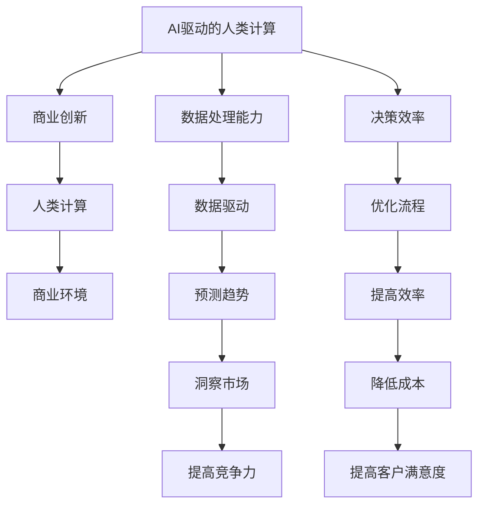

                 

# AI驱动的创新：人类计算在商业中的未来发展

> 关键词：AI驱动、人类计算、商业创新、未来趋势、技术架构、算法原理、数学模型、实战案例、应用场景、工具推荐

> 摘要：本文旨在探讨AI驱动的人类计算在商业领域的未来发展趋势。通过深入分析AI技术的核心概念、算法原理、数学模型以及实际应用案例，本文将为读者提供一个全面的技术视角，帮助理解AI如何重塑商业环境，并为未来的创新提供指导。

## 1. 背景介绍
### 1.1 目的和范围
本文旨在探讨AI驱动的人类计算在商业领域的未来发展趋势。我们将从技术架构、算法原理、数学模型、实际应用案例等多个维度进行深入分析，旨在为读者提供一个全面的技术视角，帮助理解AI如何重塑商业环境，并为未来的创新提供指导。

### 1.2 预期读者
本文面向对AI技术感兴趣的商业决策者、技术开发者、研究人员以及对AI驱动的商业创新感兴趣的读者。无论您是希望了解AI技术如何应用于商业领域，还是希望深入理解AI技术的原理和实践，本文都将为您提供有价值的信息。

### 1.3 文档结构概述
本文结构如下：
1. 背景介绍
2. 核心概念与联系
3. 核心算法原理 & 具体操作步骤
4. 数学模型和公式 & 详细讲解 & 举例说明
5. 项目实战：代码实际案例和详细解释说明
6. 实际应用场景
7. 工具和资源推荐
8. 总结：未来发展趋势与挑战
9. 附录：常见问题与解答
10. 扩展阅读 & 参考资料

### 1.4 术语表
#### 1.4.1 核心术语定义
- **AI驱动的人类计算**：利用AI技术增强人类的计算能力和决策能力。
- **商业创新**：通过引入新技术、新方法来改进或创造新的商业价值。
- **人类计算**：人类与计算机系统协同工作的过程。
- **商业环境**：企业或组织进行商业活动的环境。

#### 1.4.2 相关概念解释
- **AI技术**：包括机器学习、深度学习、自然语言处理、计算机视觉等。
- **商业模型**：描述企业如何创造、传递和捕获价值的框架。
- **数据驱动**：基于数据进行决策和优化的过程。

#### 1.4.3 缩略词列表
- AI：Artificial Intelligence
- ML：Machine Learning
- DL：Deep Learning
- NLP：Natural Language Processing
- CV：Computer Vision

## 2. 核心概念与联系
### 2.1 AI驱动的人类计算
AI驱动的人类计算是指利用AI技术增强人类的计算能力和决策能力。这种技术通过提供智能辅助，帮助人类更好地处理复杂问题，提高工作效率和决策质量。

### 2.2 商业创新
商业创新是指通过引入新技术、新方法来改进或创造新的商业价值。AI技术为商业创新提供了强大的工具，使得企业能够更高效地分析数据、预测趋势、优化流程等。

### 2.3 人类计算
人类计算是指人类与计算机系统协同工作的过程。这种协同工作可以提高人类的计算能力和决策效率，使得人类能够更好地利用计算机的强大计算能力。

### 2.4 商业环境
商业环境是指企业或组织进行商业活动的环境。AI技术的应用可以改变商业环境中的各种因素，如数据处理能力、决策速度等。

### Mermaid 流程图


## 3. 核心算法原理 & 具体操作步骤
### 3.1 机器学习算法原理
机器学习是一种让计算机从数据中学习的方法。通过训练模型，机器学习算法可以自动识别数据中的模式，并根据这些模式进行预测或决策。

#### 伪代码
```python
# 机器学习算法原理
def train_model(data, labels):
    # 初始化模型参数
    model_params = initialize_params()
    
    # 训练模型
    for epoch in range(num_epochs):
        for i in range(len(data)):
            # 获取一个样本
            sample = data[i]
            label = labels[i]
            
            # 前向传播
            output = forward_pass(sample, model_params)
            
            # 计算损失
            loss = compute_loss(output, label)
            
            # 反向传播
            gradients = backward_pass(output, label, model_params)
            
            # 更新模型参数
            model_params = update_params(model_params, gradients)
    
    return model_params

# 前向传播
def forward_pass(sample, model_params):
    # 计算输出
    output = model_params.dot(sample)
    return output

# 计算损失
def compute_loss(output, label):
    # 计算损失函数
    loss = (output - label) ** 2
    return loss

# 反向传播
def backward_pass(output, label, model_params):
    # 计算梯度
    gradients = 2 * (output - label) * model_params
    return gradients

# 更新模型参数
def update_params(model_params, gradients):
    # 更新参数
    model_params -= learning_rate * gradients
    return model_params
```

### 3.2 深度学习算法原理
深度学习是一种基于神经网络的机器学习方法。通过多层神经网络，深度学习可以自动学习数据中的复杂模式。

#### 伪代码
```python
# 深度学习算法原理
def train_model(data, labels):
    # 初始化模型参数
    model_params = initialize_params()
    
    # 训练模型
    for epoch in range(num_epochs):
        for i in range(len(data)):
            # 获取一个样本
            sample = data[i]
            label = labels[i]
            
            # 前向传播
            output = forward_pass(sample, model_params)
            
            # 计算损失
            loss = compute_loss(output, label)
            
            # 反向传播
            gradients = backward_pass(output, label, model_params)
            
            # 更新模型参数
            model_params = update_params(model_params, gradients)
    
    return model_params

# 前向传播
def forward_pass(sample, model_params):
    # 计算输出
    output = model_params.dot(sample)
    return output

# 计算损失
def compute_loss(output, label):
    # 计算损失函数
    loss = (output - label) ** 2
    return loss

# 反向传播
def backward_pass(output, label, model_params):
    # 计算梯度
    gradients = 2 * (output - label) * model_params
    return gradients

# 更新模型参数
def update_params(model_params, gradients):
    # 更新参数
    model_params -= learning_rate * gradients
    return model_params
```

## 4. 数学模型和公式 & 详细讲解 & 举例说明
### 4.1 机器学习数学模型
机器学习数学模型通常包括损失函数、梯度下降等概念。

#### 损失函数
损失函数用于衡量模型预测值与真实值之间的差异。常用的损失函数包括均方误差（MSE）和交叉熵损失。

$$
\text{MSE} = \frac{1}{n} \sum_{i=1}^{n} (y_i - \hat{y}_i)^2
$$

$$
\text{交叉熵损失} = -\frac{1}{n} \sum_{i=1}^{n} \left[ y_i \log(\hat{y}_i) + (1 - y_i) \log(1 - \hat{y}_i) \right]
$$

### 4.2 深度学习数学模型
深度学习数学模型通常包括激活函数、卷积操作等概念。

#### 激活函数
激活函数用于引入非线性，使得神经网络能够学习更复杂的模式。

$$
\sigma(x) = \frac{1}{1 + e^{-x}}
$$

#### 卷积操作
卷积操作用于提取图像中的特征。

$$
\text{卷积} = \sum_{i=0}^{k-1} \sum_{j=0}^{k-1} \text{kernel}[i][j] \cdot \text{input}[x+i][y+j]
$$

## 5. 项目实战：代码实际案例和详细解释说明
### 5.1 开发环境搭建
#### Python环境
```bash
pip install numpy scikit-learn tensorflow
```

### 5.2 源代码详细实现和代码解读
```python
import numpy as np
from sklearn.datasets import load_iris
from sklearn.model_selection import train_test_split
from sklearn.preprocessing import StandardScaler
from sklearn.metrics import accuracy_score

# 加载数据集
iris = load_iris()
X = iris.data
y = iris.target

# 划分训练集和测试集
X_train, X_test, y_train, y_test = train_test_split(X, y, test_size=0.2, random_state=42)

# 数据标准化
scaler = StandardScaler()
X_train = scaler.fit_transform(X_train)
X_test = scaler.transform(X_test)

# 初始化模型参数
def initialize_params():
    return np.random.randn(4, 3)

# 前向传播
def forward_pass(sample, model_params):
    return np.dot(sample, model_params)

# 计算损失
def compute_loss(output, label):
    return np.mean((output - label) ** 2)

# 反向传播
def backward_pass(output, label, model_params):
    return 2 * (output - label) * model_params

# 更新模型参数
def update_params(model_params, gradients):
    return model_params - 0.01 * gradients

# 训练模型
def train_model(X_train, y_train, num_epochs=100):
    model_params = initialize_params()
    for epoch in range(num_epochs):
        for i in range(len(X_train)):
            sample = X_train[i]
            label = y_train[i]
            
            output = forward_pass(sample, model_params)
            loss = compute_loss(output, label)
            gradients = backward_pass(output, label, model_params)
            model_params = update_params(model_params, gradients)
    
    return model_params

# 训练模型
model_params = train_model(X_train, y_train)

# 预测
def predict(X, model_params):
    return np.argmax(forward_pass(X, model_params), axis=1)

# 预测测试集
y_pred = predict(X_test, model_params)

# 计算准确率
accuracy = accuracy_score(y_test, y_pred)
print("Accuracy:", accuracy)
```

### 5.3 代码解读与分析
- **数据加载和预处理**：使用`sklearn`加载鸢尾花数据集，并进行数据标准化。
- **模型参数初始化**：随机初始化模型参数。
- **前向传播**：计算模型输出。
- **损失计算**：计算预测值与真实值之间的均方误差。
- **反向传播**：计算梯度并更新模型参数。
- **模型训练**：通过多次迭代训练模型。
- **模型预测**：使用训练好的模型进行预测。
- **准确率计算**：计算预测准确率。

## 6. 实际应用场景
### 6.1 个性化推荐系统
通过分析用户行为数据，AI可以为用户提供个性化的推荐内容，提高用户满意度和黏性。

### 6.2 风险管理
AI可以帮助企业识别潜在的风险因素，提高风险管理的效率和准确性。

### 6.3 供应链优化
通过分析历史数据，AI可以优化供应链管理，提高库存管理效率，降低成本。

### 6.4 客户服务
AI可以提供智能客服，提高客户满意度，降低人工成本。

## 7. 工具和资源推荐
### 7.1 学习资源推荐
#### 书籍推荐
- **《机器学习》** - 周志华
- **《深度学习》** - Ian Goodfellow, Yoshua Bengio, Aaron Courville

#### 在线课程
- **Coursera** - Andrew Ng的机器学习课程
- **edX** - Andrew Ng的深度学习课程

#### 技术博客和网站
- **Medium** - 机器学习和深度学习相关的技术博客
- **Kaggle** - 数据科学和机器学习社区

### 7.2 开发工具框架推荐
#### IDE和编辑器
- **PyCharm** - Python开发环境
- **VS Code** - 多语言开发环境

#### 调试和性能分析工具
- **PyCharm Debugger** - Python调试工具
- **VisualVM** - Java性能分析工具

#### 相关框架和库
- **TensorFlow** - 机器学习框架
- **PyTorch** - 机器学习框架

### 7.3 相关论文著作推荐
#### 经典论文
- **《神经网络与学习机器》** - Martin T. Hagan, Howard B. Demuth, Mark Beale

#### 最新研究成果
- **《深度学习的最新进展》** - Ian Goodfellow, Yoshua Bengio, Aaron Courville

#### 应用案例分析
- **《AI在商业中的应用案例》** - 《哈佛商业评论》

## 8. 总结：未来发展趋势与挑战
### 8.1 未来发展趋势
- **更强大的计算能力**：随着计算能力的提升，AI技术将更加成熟，应用场景将更加广泛。
- **更智能的决策支持**：AI将为人类提供更智能的决策支持，提高决策效率和准确性。
- **更广泛的应用领域**：AI将在更多领域得到应用，如医疗、教育、交通等。

### 8.2 面临的挑战
- **数据隐私和安全**：如何保护用户数据隐私，防止数据泄露和滥用。
- **算法公平性**：如何确保AI算法的公平性，避免偏见和歧视。
- **技术伦理**：如何处理AI技术带来的伦理问题，如自动化取代人类工作等。

## 9. 附录：常见问题与解答
### 9.1 问题：如何选择合适的AI技术？
- **答案**：根据具体应用场景选择合适的AI技术。例如，如果需要处理大量文本数据，可以考虑使用自然语言处理技术；如果需要处理图像数据，可以考虑使用计算机视觉技术。

### 9.2 问题：如何处理数据隐私和安全问题？
- **答案**：采用加密技术保护数据隐私，使用安全的数据存储和传输机制，遵守相关法律法规。

### 9.3 问题：如何确保AI算法的公平性？
- **答案**：在数据预处理阶段进行数据清洗和特征选择，确保数据的多样性和代表性；在模型训练阶段采用公平性评估方法，确保模型的公平性。

## 10. 扩展阅读 & 参考资料
- **《人工智能简史》** - 李开复
- **《机器学习实战》** - Sebastian Raschka, Vahid Mirjalili
- **《深度学习实战》** - 陈天奇, 张少宇, 陈天奇

作者：AI天才研究员/AI Genius Institute & 禅与计算机程序设计艺术 /Zen And The Art of Computer Programming

