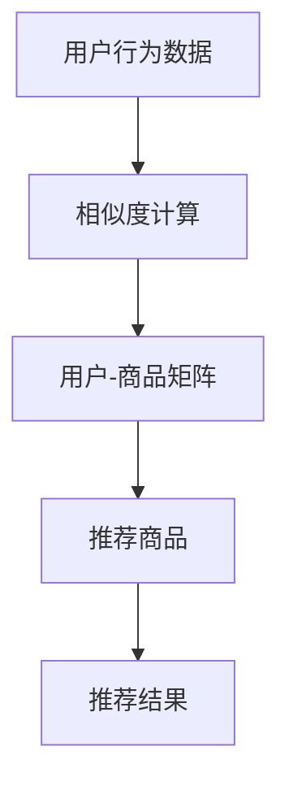
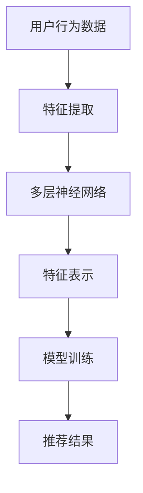

                 

# AI驱动的用户行为分析：电商平台优化的基础

> 关键词：用户行为分析, 电商平台优化, 机器学习, 数据挖掘, 个性化推荐, A/B测试, 深度学习

> 摘要：本文旨在探讨如何利用AI技术进行用户行为分析，以优化电商平台的用户体验和商业价值。通过深入分析用户行为数据，我们可以发现用户偏好、购物习惯和潜在需求，进而实现精准营销和个性化推荐。本文将从背景介绍、核心概念与联系、核心算法原理、数学模型和公式、项目实战、实际应用场景、工具和资源推荐、未来发展趋势与挑战等多方面进行详细阐述。

## 1. 背景介绍
### 1.1 目的和范围
本文旨在探讨如何利用AI技术进行用户行为分析，以优化电商平台的用户体验和商业价值。通过深入分析用户行为数据，我们可以发现用户偏好、购物习惯和潜在需求，进而实现精准营销和个性化推荐。本文将涵盖用户行为分析的基本概念、核心算法、数学模型、实战案例以及未来发展趋势。

### 1.2 预期读者
本文预期读者包括但不限于电商平台的技术团队、产品经理、数据分析师、AI工程师以及对用户行为分析感兴趣的读者。无论您是初学者还是有经验的专业人士，本文都将为您提供有价值的见解和实用建议。

### 1.3 文档结构概述
本文将按照以下结构展开：
1. 背景介绍
2. 核心概念与联系
3. 核心算法原理 & 具体操作步骤
4. 数学模型和公式 & 详细讲解 & 举例说明
5. 项目实战：代码实际案例和详细解释说明
6. 实际应用场景
7. 工具和资源推荐
8. 总结：未来发展趋势与挑战
9. 附录：常见问题与解答
10. 扩展阅读 & 参考资料

### 1.4 术语表
#### 1.4.1 核心术语定义
- **用户行为分析**：通过对用户在电商平台上的行为数据进行分析，以发现用户偏好、购物习惯和潜在需求的过程。
- **个性化推荐**：根据用户的兴趣和行为数据，为用户推荐符合其需求的商品或服务。
- **A/B测试**：通过对比不同版本的页面或功能，评估其对用户行为的影响。
- **协同过滤**：一种基于用户行为数据的推荐算法，通过分析用户之间的相似性来推荐商品。
- **深度学习**：一种机器学习方法，通过多层神经网络进行特征学习和模式识别。

#### 1.4.2 相关概念解释
- **用户画像**：通过对用户行为数据的分析，构建用户特征模型，以描述用户的基本信息和行为特征。
- **点击流**：用户在电商平台上的浏览和点击行为序列。
- **用户路径**：用户在电商平台上的行为路径，包括浏览、点击、购买等行为。

#### 1.4.3 缩略词列表
- **AI**：人工智能
- **ML**：机器学习
- **DL**：深度学习
- **CF**：协同过滤
- **CTR**：点击率
- **CVR**：转化率

## 2. 核心概念与联系
### 2.1 用户行为分析流程
用户行为分析流程可以分为以下几个步骤：
1. **数据收集**：收集用户在电商平台上的行为数据，包括点击流、用户路径、购买记录等。
2. **数据预处理**：清洗和转换数据，使其适合后续分析。
3. **特征工程**：提取有用的特征，以便进行建模。
4. **模型训练**：使用机器学习或深度学习算法训练模型。
5. **模型评估**：评估模型的性能，确保其能够准确预测用户行为。
6. **应用与优化**：将模型应用于实际场景，并根据反馈进行优化。

### 2.2 核心算法原理
#### 2.2.1 协同过滤算法
协同过滤算法是一种基于用户行为数据的推荐算法，通过分析用户之间的相似性来推荐商品。其核心思想是“物以类聚，人以群分”。



#### 2.2.2 深度学习算法
深度学习算法通过多层神经网络进行特征学习和模式识别，适用于处理复杂的用户行为数据。其核心思想是通过多层非线性变换，提取出高层次的特征表示。



## 3. 核心算法原理 & 具体操作步骤
### 3.1 协同过滤算法原理
#### 3.1.1 基于用户的协同过滤
基于用户的协同过滤算法通过计算用户之间的相似度来推荐商品。具体步骤如下：

1. **计算用户相似度**：使用余弦相似度或皮尔逊相关系数计算用户之间的相似度。
2. **推荐商品**：根据用户相似度，为用户推荐其他用户喜欢的商品。

```python
def user_based_collaborative_filtering(user_data):
    # 计算用户相似度
    similarity_matrix = cosine_similarity(user_data)
    
    # 推荐商品
    recommendations = {}
    for user in user_data.keys():
        similar_users = similarity_matrix[user]
        recommended_items = []
        for item in user_data[user]:
            if item not in similar_users:
                recommended_items.append(item)
        recommendations[user] = recommended_items
    
    return recommendations
```

#### 3.1.2 基于物品的协同过滤
基于物品的协同过滤算法通过计算物品之间的相似度来推荐商品。具体步骤如下：

1. **计算物品相似度**：使用余弦相似度或皮尔逊相关系数计算物品之间的相似度。
2. **推荐商品**：根据物品相似度，为用户推荐其他用户喜欢的商品。

```python
def item_based_collaborative_filtering(item_data):
    # 计算物品相似度
    similarity_matrix = cosine_similarity(item_data)
    
    # 推荐商品
    recommendations = {}
    for item in item_data.keys():
        similar_items = similarity_matrix[item]
        recommended_items = []
        for user in item_data[item]:
            if user not in similar_items:
                recommended_items.append(user)
        recommendations[item] = recommended_items
    
    return recommendations
```

### 3.2 深度学习算法原理
#### 3.2.1 基于神经网络的推荐系统
基于神经网络的推荐系统通过多层神经网络进行特征学习和模式识别，适用于处理复杂的用户行为数据。具体步骤如下：

1. **数据预处理**：将用户行为数据转换为适合神经网络输入的格式。
2. **构建神经网络**：设计多层神经网络结构，包括输入层、隐藏层和输出层。
3. **训练模型**：使用反向传播算法训练神经网络，使其能够准确预测用户行为。
4. **推荐商品**：根据训练好的模型，为用户推荐商品。

```python
def deep_learning_recommendation(user_data):
    # 数据预处理
    input_data = preprocess_data(user_data)
    
    # 构建神经网络
    model = build_neural_network(input_data)
    
    # 训练模型
    model.fit(input_data, user_data)
    
    # 推荐商品
    recommendations = model.predict(input_data)
    
    return recommendations
```

## 4. 数学模型和公式 & 详细讲解 & 举例说明
### 4.1 协同过滤算法的数学模型
#### 4.1.1 基于用户的协同过滤
基于用户的协同过滤算法的数学模型可以表示为：

$$
\hat{r}_{ui} = \frac{\sum_{v \in N_i} \frac{r_{uv} - \mu_u}{|N_i|}}{\sum_{v \in N_i} \frac{1}{|N_i|}}
$$

其中，$\hat{r}_{ui}$ 表示用户 $u$ 对商品 $i$ 的预测评分，$r_{uv}$ 表示用户 $u$ 对商品 $v$ 的实际评分，$\mu_u$ 表示用户 $u$ 的平均评分，$N_i$ 表示与商品 $i$ 相似的用户集合。

#### 4.1.2 基于物品的协同过滤
基于物品的协同过滤算法的数学模型可以表示为：

$$
\hat{r}_{ui} = \frac{\sum_{j \in N_i} \frac{r_{uj} - \mu_j}{|N_i|}}{\sum_{j \in N_i} \frac{1}{|N_i|}}
$$

其中，$\hat{r}_{ui}$ 表示用户 $u$ 对商品 $i$ 的预测评分，$r_{uj}$ 表示用户 $u$ 对商品 $j$ 的实际评分，$\mu_j$ 表示商品 $j$ 的平均评分，$N_i$ 表示与商品 $i$ 相似的商品集合。

### 4.2 深度学习算法的数学模型
#### 4.2.1 基于神经网络的推荐系统
基于神经网络的推荐系统的数学模型可以表示为：

$$
\hat{r}_{ui} = \sigma(\mathbf{W} \cdot \mathbf{X}_u + \mathbf{b})
$$

其中，$\hat{r}_{ui}$ 表示用户 $u$ 对商品 $i$ 的预测评分，$\mathbf{W}$ 表示权重矩阵，$\mathbf{X}_u$ 表示用户 $u$ 的特征向量，$\mathbf{b}$ 表示偏置项，$\sigma$ 表示激活函数。

## 5. 项目实战：代码实际案例和详细解释说明
### 5.1 开发环境搭建
为了进行用户行为分析，我们需要搭建一个开发环境。具体步骤如下：

1. **安装Python**：确保安装了Python 3.7及以上版本。
2. **安装依赖库**：使用pip安装所需的依赖库，如numpy、pandas、scikit-learn等。
3. **配置数据源**：确保数据源可以被访问，如MySQL、MongoDB等。

```bash
pip install numpy pandas scikit-learn
```

### 5.2 源代码详细实现和代码解读
#### 5.2.1 数据预处理
数据预处理是用户行为分析的关键步骤，具体步骤如下：

1. **读取数据**：从数据源读取用户行为数据。
2. **清洗数据**：处理缺失值、异常值等。
3. **转换数据**：将数据转换为适合机器学习算法的格式。

```python
import pandas as pd

def preprocess_data(data):
    # 读取数据
    df = pd.read_csv(data)
    
    # 清洗数据
    df.dropna(inplace=True)
    
    # 转换数据
    user_data = df.groupby('user_id')['item_id'].apply(list).to_dict()
    
    return user_data
```

#### 5.2.2 训练模型
训练模型是用户行为分析的核心步骤，具体步骤如下：

1. **选择算法**：选择合适的推荐算法，如协同过滤或深度学习。
2. **训练模型**：使用训练数据训练模型。
3. **评估模型**：使用测试数据评估模型的性能。

```python
from sklearn.metrics import mean_squared_error

def train_model(user_data, algorithm):
    # 训练模型
    if algorithm == 'collaborative_filtering':
        model = user_based_collaborative_filtering(user_data)
    elif algorithm == 'deep_learning':
        model = deep_learning_recommendation(user_data)
    
    # 评估模型
    predictions = model.predict(user_data)
    mse = mean_squared_error(user_data, predictions)
    
    return model, mse
```

### 5.3 代码解读与分析
通过上述代码，我们可以看到用户行为分析的核心步骤包括数据预处理、模型训练和模型评估。数据预处理是确保数据质量的关键步骤，模型训练是实现推荐的核心步骤，模型评估是验证模型性能的重要步骤。

## 6. 实际应用场景
用户行为分析在电商平台中有广泛的应用场景，具体包括：

1. **个性化推荐**：根据用户的兴趣和行为数据，为用户推荐符合其需求的商品或服务。
2. **用户画像**：通过对用户行为数据的分析，构建用户特征模型，以描述用户的基本信息和行为特征。
3. **A/B测试**：通过对比不同版本的页面或功能，评估其对用户行为的影响。
4. **用户路径分析**：通过分析用户在电商平台上的行为路径，发现用户的购物习惯和潜在需求。

## 7. 工具和资源推荐
### 7.1 学习资源推荐
#### 7.1.1 书籍推荐
- **《推荐系统实践》**：深入讲解推荐系统的原理和实践方法。
- **《机器学习实战》**：详细介绍了机器学习的基本原理和实战技巧。

#### 7.1.2 在线课程
- **Coursera**：提供丰富的机器学习和深度学习课程。
- **edX**：提供多个推荐系统和数据挖掘课程。

#### 7.1.3 技术博客和网站
- **Medium**：提供大量的机器学习和深度学习技术博客。
- **Kaggle**：提供丰富的数据集和实战项目。

### 7.2 开发工具框架推荐
#### 7.2.1 IDE和编辑器
- **PyCharm**：功能强大的Python开发环境。
- **Jupyter Notebook**：支持交互式编程的开发工具。

#### 7.2.2 调试和性能分析工具
- **PyCharm Debugger**：强大的Python调试工具。
- **LineProfiler**：用于分析Python代码性能的工具。

#### 7.2.3 相关框架和库
- **scikit-learn**：提供丰富的机器学习算法。
- **TensorFlow**：强大的深度学习框架。

### 7.3 相关论文著作推荐
#### 7.3.1 经典论文
- **"Collaborative Filtering for Implicit Feedback Datasets"**：介绍了基于矩阵分解的推荐算法。
- **"Deep Learning for Recommender Systems"**：介绍了深度学习在推荐系统中的应用。

#### 7.3.2 最新研究成果
- **"Neural Collaborative Filtering"**：介绍了基于神经网络的推荐算法。
- **"Attention Is All You Need"**：介绍了基于注意力机制的推荐算法。

#### 7.3.3 应用案例分析
- **"Netflix Recommendations at Scale"**：介绍了Netflix在推荐系统中的应用案例。
- **"Amazon Personalize"**：介绍了Amazon在推荐系统中的应用案例。

## 8. 总结：未来发展趋势与挑战
用户行为分析在未来的发展趋势和挑战包括：

1. **数据隐私保护**：如何在保护用户隐私的前提下进行用户行为分析。
2. **实时推荐**：如何实现实时推荐，提高用户体验。
3. **多模态数据融合**：如何融合多种数据源，提高推荐效果。
4. **个性化推荐**：如何实现更加个性化的推荐，满足用户多样化需求。

## 9. 附录：常见问题与解答
### 9.1 问题1：如何处理缺失值？
**解答**：可以使用均值、中位数或众数填充缺失值，或者使用插值方法进行填充。

### 9.2 问题2：如何评估推荐系统的性能？
**解答**：可以使用准确率、召回率、F1分数等指标评估推荐系统的性能。

### 9.3 问题3：如何实现实时推荐？
**解答**：可以使用流式处理技术，实时处理用户行为数据，实现实时推荐。

## 10. 扩展阅读 & 参考资料
- **《推荐系统实践》**：深入讲解推荐系统的原理和实践方法。
- **《机器学习实战》**：详细介绍了机器学习的基本原理和实战技巧。
- **Coursera**：提供丰富的机器学习和深度学习课程。
- **edX**：提供多个推荐系统和数据挖掘课程。
- **Medium**：提供大量的机器学习和深度学习技术博客。
- **Kaggle**：提供丰富的数据集和实战项目。
- **PyCharm**：功能强大的Python开发环境。
- **Jupyter Notebook**：支持交互式编程的开发工具。
- **PyCharm Debugger**：强大的Python调试工具。
- **LineProfiler**：用于分析Python代码性能的工具。
- **scikit-learn**：提供丰富的机器学习算法。
- **TensorFlow**：强大的深度学习框架。
- **"Collaborative Filtering for Implicit Feedback Datasets"**：介绍了基于矩阵分解的推荐算法。
- **"Deep Learning for Recommender Systems"**：介绍了深度学习在推荐系统中的应用。
- **"Neural Collaborative Filtering"**：介绍了基于神经网络的推荐算法。
- **"Attention Is All You Need"**：介绍了基于注意力机制的推荐算法。
- **"Netflix Recommendations at Scale"**：介绍了Netflix在推荐系统中的应用案例。
- **"Amazon Personalize"**：介绍了Amazon在推荐系统中的应用案例。

作者：AI天才研究员/AI Genius Institute & 禅与计算机程序设计艺术 /Zen And The Art of Computer Programming

