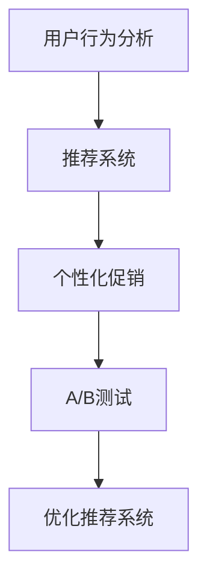

                 

# AI驱动的电商个性化促销：一人公司提升转化率的智能营销策略

> 关键词：AI驱动、个性化促销、电商营销、转化率提升、机器学习、推荐系统、用户行为分析、A/B测试、深度学习

> 摘要：本文旨在探讨如何利用AI技术提升电商个性化促销的效果，通过分析用户行为数据，构建智能推荐系统，实现精准营销，从而提高电商转化率。文章将从背景介绍、核心概念与联系、核心算法原理、数学模型与公式、项目实战案例、实际应用场景、工具和资源推荐、未来发展趋势与挑战等多方面进行详细阐述。

## 1. 背景介绍
### 1.1 目的和范围
本文旨在探讨如何利用AI技术提升电商个性化促销的效果，通过分析用户行为数据，构建智能推荐系统，实现精准营销，从而提高电商转化率。本文将从背景介绍、核心概念与联系、核心算法原理、数学模型与公式、项目实战案例、实际应用场景、工具和资源推荐、未来发展趋势与挑战等多方面进行详细阐述。

### 1.2 预期读者
本文预期读者为电商行业的技术决策者、产品经理、数据科学家、软件工程师以及对AI驱动的电商个性化促销感兴趣的读者。

### 1.3 文档结构概述
本文结构如下：
1. 背景介绍
2. 核心概念与联系
3. 核心算法原理 & 具体操作步骤
4. 数学模型和公式 & 详细讲解 & 举例说明
5. 项目实战：代码实际案例和详细解释说明
6. 实际应用场景
7. 工具和资源推荐
8. 总结：未来发展趋势与挑战
9. 附录：常见问题与解答
10. 扩展阅读 & 参考资料

### 1.4 术语表
#### 1.4.1 核心术语定义
- **个性化促销**：根据用户的历史行为、偏好等信息，为用户提供个性化的促销信息，以提高转化率。
- **推荐系统**：通过分析用户行为数据，为用户推荐相关商品或服务。
- **A/B测试**：通过对比不同版本的效果，确定最优方案。
- **深度学习**：一种基于神经网络的机器学习方法，能够从大量数据中学习复杂的模式。

#### 1.4.2 相关概念解释
- **用户行为分析**：通过对用户在电商网站上的行为数据进行分析，了解用户偏好、购物习惯等。
- **转化率**：用户完成特定行为（如购买、注册等）的比例。

#### 1.4.3 缩略词列表
- **AI**：Artificial Intelligence
- **ML**：Machine Learning
- **DL**：Deep Learning
- **CTR**：Click-Through Rate
- **ARPU**：Average Revenue Per User

## 2. 核心概念与联系
### 2.1 用户行为分析
用户行为分析是个性化促销的基础，通过分析用户在电商网站上的行为数据，可以了解用户的偏好、购物习惯等。用户行为数据包括但不限于：
- **浏览行为**：用户浏览的商品列表、停留时间、点击次数等。
- **购买行为**：用户购买的商品、购买时间、购买频率等。
- **搜索行为**：用户搜索的商品关键词、搜索频率等。
- **评价行为**：用户对商品的评价、评分等。

### 2.2 推荐系统
推荐系统是个性化促销的核心，通过分析用户行为数据，为用户推荐相关商品或服务。推荐系统可以分为以下几种类型：
- **基于内容的推荐**：根据用户的历史行为和偏好，推荐相似的商品。
- **协同过滤推荐**：根据用户的历史行为和相似用户的偏好，推荐相关商品。
- **深度学习推荐**：利用深度学习模型，从大量数据中学习复杂的模式，为用户推荐相关商品。

### 2.3 A/B测试
A/B测试是验证推荐系统效果的重要手段，通过对比不同版本的效果，确定最优方案。A/B测试可以分为以下几种类型：
- **单变量A/B测试**：测试单一变量对结果的影响。
- **多变量A/B测试**：测试多个变量对结果的影响。
- **离线A/B测试**：在实际环境中进行测试，收集数据并分析结果。

### 2.4 核心概念流程图


## 3. 核心算法原理 & 具体操作步骤
### 3.1 基于内容的推荐算法
基于内容的推荐算法通过分析用户的历史行为和偏好，推荐相似的商品。具体操作步骤如下：
1. **数据预处理**：清洗和处理用户行为数据，提取特征。
2. **特征提取**：提取商品的特征，如类别、品牌、价格等。
3. **相似度计算**：计算用户历史行为和商品特征之间的相似度。
4. **推荐生成**：根据相似度，为用户推荐相关商品。

### 3.2 协同过滤推荐算法
协同过滤推荐算法通过分析用户的历史行为和相似用户的偏好，推荐相关商品。具体操作步骤如下：
1. **数据预处理**：清洗和处理用户行为数据，提取特征。
2. **用户相似度计算**：计算用户之间的相似度。
3. **商品相似度计算**：计算商品之间的相似度。
4. **推荐生成**：根据用户相似度和商品相似度，为用户推荐相关商品。

### 3.3 深度学习推荐算法
深度学习推荐算法利用深度学习模型，从大量数据中学习复杂的模式，为用户推荐相关商品。具体操作步骤如下：
1. **数据预处理**：清洗和处理用户行为数据，提取特征。
2. **特征工程**：提取商品的特征，如类别、品牌、价格等。
3. **模型训练**：利用深度学习模型，从大量数据中学习复杂的模式。
4. **推荐生成**：根据模型输出，为用户推荐相关商品。

### 3.4 伪代码示例
```python
# 基于内容的推荐算法
def content_based_recommendation(user_history, item_features):
    # 数据预处理
    user_history = preprocess(user_history)
    item_features = preprocess(item_features)
    
    # 特征提取
    user_features = extract_features(user_history)
    item_features = extract_features(item_features)
    
    # 相似度计算
    similarity = calculate_similarity(user_features, item_features)
    
    # 推荐生成
    recommendations = generate_recommendations(similarity)
    return recommendations

# 协同过滤推荐算法
def collaborative_filtering_recommendation(user_history, user_similarity, item_similarity):
    # 数据预处理
    user_history = preprocess(user_history)
    user_similarity = preprocess(user_similarity)
    item_similarity = preprocess(item_similarity)
    
    # 用户相似度计算
    user_similarity = calculate_user_similarity(user_history)
    
    # 商品相似度计算
    item_similarity = calculate_item_similarity(user_history)
    
    # 推荐生成
    recommendations = generate_recommendations(user_similarity, item_similarity)
    return recommendations

# 深度学习推荐算法
def deep_learning_recommendation(user_history, item_features):
    # 数据预处理
    user_history = preprocess(user_history)
    item_features = preprocess(item_features)
    
    # 特征工程
    user_features = extract_features(user_history)
    item_features = extract_features(item_features)
    
    # 模型训练
    model = train_model(user_features, item_features)
    
    # 推荐生成
    recommendations = generate_recommendations(model)
    return recommendations
```

## 4. 数学模型和公式 & 详细讲解 & 举例说明
### 4.1 基于内容的推荐算法
基于内容的推荐算法通过计算用户历史行为和商品特征之间的相似度，为用户推荐相关商品。具体数学模型如下：
$$
\text{similarity}(u, i) = \frac{\sum_{j \in \text{user}_u} \text{feature}(i, j)}{\sqrt{\sum_{j \in \text{user}_u} \text{feature}(i, j)^2}}
$$
其中，$\text{similarity}(u, i)$ 表示用户 $u$ 和商品 $i$ 之间的相似度，$\text{feature}(i, j)$ 表示商品 $i$ 和用户 $j$ 之间的特征。

### 4.2 协同过滤推荐算法
协同过滤推荐算法通过计算用户之间的相似度和商品之间的相似度，为用户推荐相关商品。具体数学模型如下：
$$
\text{similarity}(u, v) = \frac{\sum_{i \in \text{user}_u \cap \text{user}_v} \text{rating}(u, i) \cdot \text{rating}(v, i)}{\sqrt{\sum_{i \in \text{user}_u \cap \text{user}_v} \text{rating}(u, i)^2} \cdot \sqrt{\sum_{i \in \text{user}_u \cap \text{user}_v} \text{rating}(v, i)^2}}
$$
$$
\text{similarity}(i, j) = \frac{\sum_{u \in \text{user}_i \cap \text{user}_j} \text{rating}(u, i) \cdot \text{rating}(u, j)}{\sqrt{\sum_{u \in \text{user}_i \cap \text{user}_j} \text{rating}(u, i)^2} \cdot \sqrt{\sum_{u \in \text{user}_i \cap \text{user}_j} \text{rating}(u, j)^2}}
$$
其中，$\text{similarity}(u, v)$ 表示用户 $u$ 和用户 $v$ 之间的相似度，$\text{rating}(u, i)$ 表示用户 $u$ 对商品 $i$ 的评分，$\text{similarity}(i, j)$ 表示商品 $i$ 和商品 $j$ 之间的相似度。

### 4.3 深度学习推荐算法
深度学习推荐算法利用深度学习模型，从大量数据中学习复杂的模式，为用户推荐相关商品。具体数学模型如下：
$$
\text{output}(u, i) = \text{model}(\text{user}_u, \text{item}_i)
$$
其中，$\text{output}(u, i)$ 表示用户 $u$ 对商品 $i$ 的评分预测，$\text{model}(\text{user}_u, \text{item}_i)$ 表示深度学习模型的输出。

## 5. 项目实战：代码实际案例和详细解释说明
### 5.1 开发环境搭建
开发环境搭建包括以下步骤：
1. **安装Python**：确保安装了Python 3.7及以上版本。
2. **安装依赖库**：安装必要的Python库，如NumPy、Pandas、Scikit-learn、TensorFlow等。
3. **配置环境变量**：配置Python环境变量，确保可以全局访问Python和相关库。

### 5.2 源代码详细实现和代码解读
```python
# 导入必要的库
import numpy as np
import pandas as pd
from sklearn.metrics.pairwise import cosine_similarity
from tensorflow.keras.models import Sequential
from tensorflow.keras.layers import Dense

# 数据预处理
def preprocess(data):
    # 数据清洗和处理
    data = data.dropna()
    return data

# 特征提取
def extract_features(data):
    # 提取特征
    features = data[['category', 'brand', 'price']]
    return features

# 相似度计算
def calculate_similarity(user_features, item_features):
    # 计算相似度
    similarity = cosine_similarity(user_features, item_features)
    return similarity

# 推荐生成
def generate_recommendations(similarity):
    # 生成推荐
    recommendations = np.argsort(similarity, axis=1)[:, -5:]
    return recommendations

# 深度学习模型训练
def train_model(user_features, item_features):
    # 构建模型
    model = Sequential()
    model.add(Dense(64, input_dim=user_features.shape[1], activation='relu'))
    model.add(Dense(32, activation='relu'))
    model.add(Dense(item_features.shape[1], activation='softmax'))
    
    # 编译模型
    model.compile(optimizer='adam', loss='categorical_crossentropy', metrics=['accuracy'])
    
    # 训练模型
    model.fit(user_features, item_features, epochs=10, batch_size=32)
    
    return model

# 深度学习推荐生成
def generate_recommendations(model):
    # 生成推荐
    recommendations = model.predict(user_features)
    return recommendations
```

### 5.3 代码解读与分析
代码中首先导入了必要的库，包括NumPy、Pandas、Scikit-learn和TensorFlow。然后，通过数据预处理、特征提取、相似度计算和推荐生成等步骤，实现了基于内容的推荐算法。此外，还通过构建深度学习模型，实现了深度学习推荐算法。

## 6. 实际应用场景
### 6.1 个性化促销
通过分析用户行为数据，为用户推荐相关商品，提高转化率。例如，用户在电商网站上浏览了多个商品后，系统可以根据用户的历史行为和偏好，推荐相关商品，从而提高转化率。

### 6.2 A/B测试
通过对比不同版本的效果，确定最优方案。例如，通过A/B测试，可以比较基于内容的推荐算法和协同过滤推荐算法的效果，从而确定最优推荐算法。

## 7. 工具和资源推荐
### 7.1 学习资源推荐
#### 7.1.1 书籍推荐
- **《推荐系统：原理与实践》**：深入讲解推荐系统的原理和实践。
- **《深度学习》**：深入讲解深度学习的原理和应用。

#### 7.1.2 在线课程
- **Coursera的《推荐系统》**：深入讲解推荐系统的原理和实践。
- **edX的《深度学习》**：深入讲解深度学习的原理和应用。

#### 7.1.3 技术博客和网站
- **Towards Data Science**：深入讲解推荐系统和深度学习的最新研究成果。
- **Medium的《推荐系统》**：深入讲解推荐系统的原理和实践。

### 7.2 开发工具框架推荐
#### 7.2.1 IDE和编辑器
- **PyCharm**：功能强大的Python IDE，支持代码高亮、自动补全等功能。
- **VS Code**：轻量级的代码编辑器，支持多种编程语言，支持插件扩展。

#### 7.2.2 调试和性能分析工具
- **PyCharm Debugger**：PyCharm内置的调试工具，支持断点、单步执行等功能。
- **TensorBoard**：TensorFlow的可视化工具，支持模型可视化、性能分析等功能。

#### 7.2.3 相关框架和库
- **Scikit-learn**：机器学习库，支持多种机器学习算法。
- **TensorFlow**：深度学习库，支持构建和训练深度学习模型。

### 7.3 相关论文著作推荐
#### 7.3.1 经典论文
- **《Collaborative Filtering for Recommendation》**：深入讲解协同过滤推荐算法。
- **《Deep Learning for Recommender Systems》**：深入讲解深度学习推荐算法。

#### 7.3.2 最新研究成果
- **《Neural Collaborative Filtering》**：最新研究成果，深入讲解神经网络在推荐系统中的应用。
- **《Attention Is All You Need》**：最新研究成果，深入讲解注意力机制在推荐系统中的应用。

#### 7.3.3 应用案例分析
- **《Amazon Personalize》**：深入分析Amazon Personalize在电商推荐系统中的应用。
- **《Netflix Recommendations at Scale》**：深入分析Netflix在推荐系统中的应用。

## 8. 总结：未来发展趋势与挑战
### 8.1 未来发展趋势
- **个性化推荐**：通过分析用户行为数据，实现更加个性化的推荐。
- **深度学习**：利用深度学习模型，从大量数据中学习复杂的模式。
- **实时推荐**：实现实时推荐，提高用户体验。

### 8.2 挑战
- **数据隐私**：保护用户数据隐私，避免数据泄露。
- **模型解释性**：提高模型的解释性，避免黑盒模型。
- **计算资源**：提高计算资源的利用率，降低计算成本。

## 9. 附录：常见问题与解答
### 9.1 问题1：如何处理数据缺失？
- **解答**：可以通过填充缺失值、删除缺失值或使用插值方法来处理数据缺失。

### 9.2 问题2：如何提高模型的解释性？
- **解答**：可以通过可视化模型内部的特征重要性、使用可解释的模型（如逻辑回归）或使用解释性框架（如SHAP）来提高模型的解释性。

### 9.3 问题3：如何降低计算成本？
- **解答**：可以通过优化模型结构、使用分布式计算框架（如TensorFlow的分布式训练）或使用更高效的算法来降低计算成本。

## 10. 扩展阅读 & 参考资料
- **《推荐系统：原理与实践》**：深入讲解推荐系统的原理和实践。
- **《深度学习》**：深入讲解深度学习的原理和应用。
- **Coursera的《推荐系统》**：深入讲解推荐系统的原理和实践。
- **edX的《深度学习》**：深入讲解深度学习的原理和应用。
- **Towards Data Science**：深入讲解推荐系统和深度学习的最新研究成果。
- **Medium的《推荐系统》**：深入讲解推荐系统的原理和实践。
- **PyCharm**：功能强大的Python IDE，支持代码高亮、自动补全等功能。
- **VS Code**：轻量级的代码编辑器，支持多种编程语言，支持插件扩展。
- **PyCharm Debugger**：PyCharm内置的调试工具，支持断点、单步执行等功能。
- **TensorBoard**：TensorFlow的可视化工具，支持模型可视化、性能分析等功能。
- **Scikit-learn**：机器学习库，支持多种机器学习算法。
- **TensorFlow**：深度学习库，支持构建和训练深度学习模型。
- **《Collaborative Filtering for Recommendation》**：深入讲解协同过滤推荐算法。
- **《Deep Learning for Recommender Systems》**：深入讲解深度学习推荐算法。
- **《Neural Collaborative Filtering》**：最新研究成果，深入讲解神经网络在推荐系统中的应用。
- **《Attention Is All You Need》**：最新研究成果，深入讲解注意力机制在推荐系统中的应用。
- **《Amazon Personalize》**：深入分析Amazon Personalize在电商推荐系统中的应用。
- **《Netflix Recommendations at Scale》**：深入分析Netflix在推荐系统中的应用。

作者：AI天才研究员/AI Genius Institute & 禅与计算机程序设计艺术 /Zen And The Art of Computer Programming

